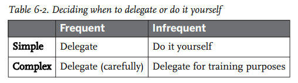
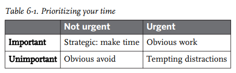

# Management Strategies

- Management strategies notes

## Index

- [Index](#index)
- [30/60/90-Day Plan](#306090-day-plan)
- [360-Based Performance Review](#360-based-performance-review)
- [DIY vs Delegation](#diy-vs-delegation)
- [Failing Structures](#failing-structures)
- [How to Say No](#how-to-say-no)
- [Skip-Level Meetings](#skip-level-meetings)
- [Time Management](#time-management)

## 30/60/90-Day Plan

- Laying out basic goals (getting up to speed w/ code, committing a bug fix, performing a release, etc) is valuable for new hires and those that just moved to your team
- If someone fails to meet expectations w/in this plan, they may be a mishire

## 360-Based Performance Review

- Includes feedback from an employee's manager, their teammates, anyone that reports to them, and relevant coworkers
- Great for self-review
- May go wrong when:
  - People aren't given the time to prioritize writing reviews
  - People focus on just the recent events
  - Reviews are written w/ biases as a base

## DIY vs Delegation

- When deciding what to delegate and what to do on your own, you can categorize tasks based on frequency and complexity
- 
  - When you're a manager, frequent tasks should be delegated
    - Your primarily role is management- careful delegation and associated support/guidance is in and of itself a role
- Complex and frequent tasks include:
  - Project planning
  - Systems design
  - Being the key person during an outage

## Failing Structures

> Your company started as a very simple system that contained a few people, and as more and more people and rules and infrastructure were added, it evolved into a complex system. I don’t think there’s a huge benefit in overdesigning your team structure or process when your team is small and functioning well. However, at some point you’ll start to experience failure, and failure is the best place to investigate and identify where your structure needs to change. In the creating a career ladder example, one person quitting because of a lack of a career path might not be enough to push you to create a career ladder, but you may reconsider when multiple people quit or fail to join. You’ll need to weigh the value the lack of structure brings the team against the cost of losing people you might otherwise want to employ.
>
> My advice to leaders is simple: when failures occur, examine all aspects of reality that are contributing to those failures. The patterns you see are opportunities to evolve your structure, either by creating more or different structure or removing it. Think about how often the failure happens and its cost, and use your best judgment about the changes that need to be made. Using failure to guide evolution lets you apply structure at the right level. If a failure is occurring in only one part of the system—say, on one team—you can try to address the structure on that team without necessarily changing the larger structure. What about examining success? Well, you can learn things from success, but it is often a poor teacher. Ironically, while luck plays a role in both failure and success, we often attribute failure to bad luck and success to our own actions. As Gall’s law says, a simple system that works can evolve into a complex system, but that doesn’t mean that applying the lessons from a successful complex system will let you replicate that success in other places. As humans, we tend to blame failure on bad luck until it’s impossible to ignore our own contributions to that failure. Therefore, we’re less likely to overstructure our teams based on lessons from failure. Success, on the other hand, tempts us with the silver bullet, that one weird trick that could make everything great. If you want to learn from success, make sure you can identify the actual improvement you’re seeking when applying those lessons more broadly, and that you understand the context required to repeat that success.
>
> The age of the company and size of the team plays into this issue. If you’re at a company that’s been around for a while and will be around for a while, using structure (adding or removing) to improve efficiency is very helpful, even if it costs something up front to implement. That’s part of the trick. Learning rarely comes for free. Analyzing situations and thinking about good takeaways takes time. If the value of your future time is less than the value of your current time, then you’re probably not going to worry too much about saving future time. Just because your company is big, old, and stable doesn’t mean you can have as much rigid, unchanging structure as you want. Technology changes often enable formerly risky moves to become safer than the slow-moving alternatives. Software release frequency is a good example of this. For a long time, releasing software frequently was difficult and expensive, largely because you were shipping that software to the user. In the modern SaaS world, bugs can be easily fixed, and the risk involved in shipping a bug is much lower than that of not expanding features quickly enough to keep up with competition. It’s this type of unconditional attachment to old structures that makes many people hesitant to adopt structure at all. But if you don’t adopt structure when you need it, things can also go wrong.
>
> When every new hire slows the team down for months because there is no onboarding process, that is a failure due to lack of structure. When people regularly leave the company because they have no path to advancement or career growth, that is a failure due to lack of structure. The third time you have a production outage because someone logged directly into the database and accidentally dropped a critical table, that is a failure due to lack of structure. I said earlier that I prefer to talk about learning and transparency rather than using the word structure, because really what we’re talking about here is identifying the causes of failures, especially frequent failures, and trying to figure out what we can change to solve for those failures. This is fundamentally about learning.

- Camille Fournier in _The Manager's Path_

## How to Say No

- Employees need to say "no" sometimes... techniques include:
- Yes, AND
  - Go ahead and mention the consequences of accepting an absurd request
- Create policies
  - If you're saying "no" to the same request over and over, there needs to be a policy established to clarify what someone needs to get past in order to have you say "yes"
- Help me say yes
  - Ask questions about the questionable elements to try and get yourself to say "yes"
- Appeal to budget
  - Show that there's no room for flexibility provided the budget
- Work as a team
  - Sometimes you need the whole team to together say "no"
- Don't delay the "no"
  - Delays just drag the process- even if you're wrong, it's better to say "no" if you're inclined to say so putting aside all uncertainties
  - Sometimes you'll be wrong, and the "no" might've been too early- apologize and revise accordingly

## Skip-Level Meetings

- Refers to a meeting w/ people who report to people who report to you
- Helps you get a grasp of the health and focus of teams
- These meetings can be quick 1-1 meetings
- Questions to ask include:
  - What do you like best/worst about the project you're working on?
  - Who on your team has been doing really well recently?
  - Do you have any feedback about your manager—what’s going well, what isn’t?
  - What changes do you think we could make to the product?
  - Are there any opportunities you think we might be missing?
  - How do you think the organization is doing overall? Anything we could be doing better/more/less?
  - Are there any areas of the business strategy you don’t understand?
  - What’s keeping you from doing your best work right now?
  - How happy (or not) are you working at the company?
  - What could we do to make working at the company more fun?
- ...Skip level meetings don't scale well, and degrade in effectiveness when you do it w/ a group due to lack of privacy, but in a group you can ask:
  - What can I, your manager’s manager, provide for you or your team? Anything I should be helping with?
  - Is this team working poorly with any other teams, from your perspective?
  - Are there any questions about the larger organization that I can answer?

## Time Management

- Time management is personal, where some people are organized w/ complex strategies using calendars and todo lists
- But even then, at the end of the day we all face the same lack of time and need to prioritize what to do
- We do this by categorizing tasks by "importance" and "urgency"
- 
  - Important & urgent
    - Major outages that need fixing
    - Performance reviews that are due
    - Job offers to candidates that have competing offers
  - Important & not urgent
    - Emails & chat messages- they just feel urgent, or at best are just slightly urgent (relative to what's really urgent)
    - Emails should be handled in a particular window during the day to avoid working on emails all day
  - Urgent & not important
    - Meetings- should be avoided when you're not needed
    - Planning for the future
