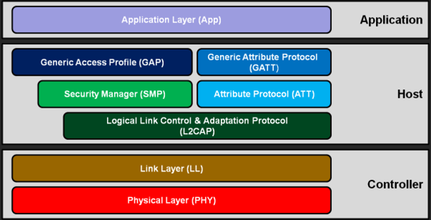

# Bluetooth

- Bluetooth notes

## Index

- [Index](#index)
- [Overview](#overview)
- [BLE](#ble)
- [Classic Bluetooth](#classic-bluetooth)

## Overview

- “Bluetooth” is a set of specs for short-range wireless applications
- There’s “classic bluetooth” and BLE
- Details here: https://developerhelp.microchip.com/xwiki/bin/view/applications/ble/introduction/
- Sometimes classified as a PAN ("personal area network") for its one to one communication

## BLE

- “Bluetooth Low Energy”
- Intended to support IoT (“internet of things”) applications
- In comparison to classic Bluetooth:
  - New physical interface layer
  - New “advertising mechanism” for easier discover/connection
  - ACL MAC
    - “asynchronous connection-less MAC”
    - Allows for low latency, fast transactions
    - Protocol for wireless communication where no persistent/synchronized connection is established
    - Devices transmit data only when there’s data to send (each packet managed independently)
- Good for devices that need to expose some state (small discrete data transfers)
- BLE protocol stack:
  - 
  - Every Bluetooth device has both a host and controller layer, and then an application layer (host/controller above doesn’t refer to master/slave configurations)
- Controller layer
  - Physical layer
    - The analog circuitry that translates RF signals in the air to electrical signals (the transducer portion)
    - BLE hops between 40 channels in comparison to classic bluetooth’s 79 channels
  - Link layer
    - Layer to advertise a device, scan for devices, and create/maintain connections
    - Bluetooth devices have a 48-bit (6byte) “bluetooth device address” for identification similar to MAC addresses
    - Discovery process
    - Bluetooth devices identify each other by having one device advertise, and another device scan for devices
    - Advertising
      - The “advertiser” sends packets for a scanner to find
      - Types of advertising possible include: general, directed, non-connectable, and discoverable
    - Scanning
      - There are two types of scanning that a device can do:
      - Passive scanning
        - Scanner just listens for packets sent, and advertiser never knows that packets were received
      - Active scanning
        - When the scanner (the “central device”) wants more information before connecting to the advertiser, it performs active scanning to request more data from the scanner after finding the listener
- Host layer
  - GAP
    - “general access profile”
    - This is the protocol that processes the data received at the controller layer
    - Includes processes to:
      - Discover/connect w/ other devices
      - Broadcast data
      - Establish secure connections
  - GATT
    - “generic attribute profile”
    - This protocol defines a bunch of high level services to categorize data received
    - Examples include:
      - Proximity profile
      - Heart rate profile
      - Etc
- Application
  - This is just the user application to use the data received accordingly

## Classic Bluetooth

- 2.4 GHz ISM (“industrial, scientific, and medical) band
  - Frequency hopping
    - The 2.4GHz band is shared by other devices like Wi-Fi, microwave ovens, cordless phones, etc, so there’s a need to swap around and use different frequencies to minimize interference
    - The actual range of frequencies for the 2.4GHz ISM band is 2.400GHz to 2.4835GHz
  - AFH
    - “adaptive frequency hopping”
    - A classic Bluetooth device switches frequencies 1600 times a second w/ the AFH scheme to avoid eavesdropping, interceptors, etc
  - Classic Bluetooth hops between 79 channels
- GPSK, 4PSK, 8PSK
  - “gaussian phase shift keying”, “quadrature phase shift keying”, “octal phase shift keying”
  - Encoding methods to increase rate of data transmission
  - By phase shifting a signal of some frequency in 4 different possible ways in the case of 4PSK (0deg, 90deg, 180deg, 270deg), a device can send 2 bits per symbol as opposed to just a bit w/ a 0/1
  - 8PSK is 3 bits per symbol, but it’s susceptible to more noise due to each possible phase being close to its neighbors
  - GPSK is just 1 bit per symbol, but the gaussian filter smoothens the symbols
- 1Mbps data transmission
- Up to 100mW, proportional to max of 100m in range max?
