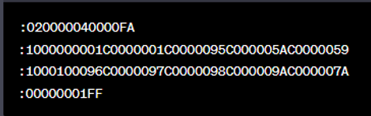

# Data Integrity

- Data integrity (error checking, data encoding, etc) notes

## Index

- [Index](#index)
- [Checksum vs CRC vs Hash](#checksum-vs-crc-vs-hash)
- [Error Detection Code](#error-detection-code)
- [Hamming Codes/Distance](#hamming-codesdistance)
- [Intel HEX Format](#intel-hex-format)
- [Kerckhoffs's Principle](#kerckhoffss-principle)
- [MD5: “Message Digest Algorithm”](#md5-message-digest-algorithm)
- [Parity Bit](#parity-bit)

## Checksum vs CRC vs Hash

- Checksum
  - A checksum is just a sum of all bytes
  - Helps verify accidental errors in data transmission or storage
  - Lightweight and fast, but there can easily be identical checksums and different data
- CRC
  - "cyclic redundancy check"
  - Advanced error detection algorithm where the message is treated as a large binary number that's divided by a polynomial to get the remainder (the CRC value)
  - Great for detecting complex/burst errors, but not for cryptographic security
  - Ethernet frames use CRC-32
- Hash
  - Function that maps some input data to a fixed-size value
  - Non-cryptographic hashes are used in hash tables (MurmurHash, FNV, etc)
  - Cryptographic hashes are used for verifying data integrity and authenticity (SHA-256, MD5, SHA-3)
  - Git commit IDs use SHA-1/256

## Error Detection Code

- Code that can flag that there are errors, but can't locate it or correct it

## Hamming Codes/Distance

- Hamming codes
  - Scheme using multiple parity bits to correct single bit errors and detect double-bit errors
- Hamming distance
  - Number of bit positions in which two binary strings can differ
  - Used as a measuring method for error correction/detection

## Intel HEX Format

- Text (ascii) based file format commonly used to represent binary data in human-readable form
- Used to transfer program code to program MCUs, EEPROM, etc
- Example:
  - 
- Consists of:
  - Start code:
    - “:” that indicates the start of a new data record
    - 1 char limit
  - Bye count:
    - Number of bytes (in hex) in data field
    - 2 char limit
  - Address:
    - Address where data will be written to in memory
    - 4 char limit
  - Record type:
    - Type of record (data record, end-of-file record, etc)
    - 2 char limit
    - Variations include:
      - 00- data record
        - Data to be loaded at specified address
      - 01- end of file record
        - End of hex file indication
      - 02- extended segment address record
        - Provides upper 16 bits for 20 bit segment base address (for 32-bit addressing)
      - 04- extended linear address record
        - Provides upper 16 bits for 32 bit linear base address
      - 05- start linear address record
        - Provides 32 bit entry address for the program
      - 06- start segment address record
        - Provides 16 bit entry point address for the program
      - 10- data record, contiguous
        - Just like 00, except used for specific extended formats
      - 11- start linear address record, contiguous
        - Just like 05, but for specific extended formats
      - 15- start segment address record, contiguous
        - Just like 06, but for specific extended formats
  - Data:
    - The data to be written to memory
    - (up to byte count as indicated)
  - Checksum:
    - Used to validate data
    - 2 char limit
- To follow the char number required for each field, leading 0s are added if less chars are needed and truncated/ignored if too many chars are provided flooding the line

## Kerckhoffs's Principle

- "A cryptosystem should remain secure even if everything about the system, except the secret key, is public knowledge"
- So publicizing the algorithm should be fair game- AES, RSA, ECC, SHA, etc
- Shannon's Maxim says "The enemy knows the system", restating Kerckhoff's principle

## MD5: “Message Digest Algorithm”

- Cryptographic tool to authenticate messages
- Generates a 128bit hash value unique to every message
- Would/can be used to have two routers communicate to each other via “PPP”
  - PPP- “Point to Point” protocol
  - Provides authentication, encryption, and data compression

## Parity Bit

- Aka, "horizontal parity"
- A additional bit to make the number of 1s in some collection of bits is even or odd
- ...So just an indicator for whether there was an odd or even number of 1s in a set of bits
- Can detect single-bit errors, but can't correct them
- LRC
  - "longitudinal redundancy check"
  - Computing a parity bit across columns of byte sequences
