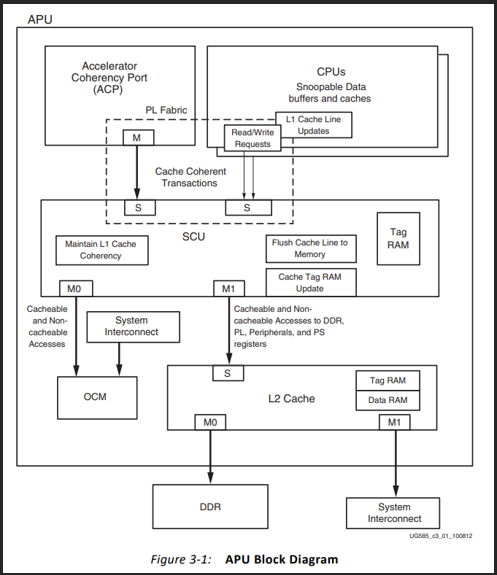
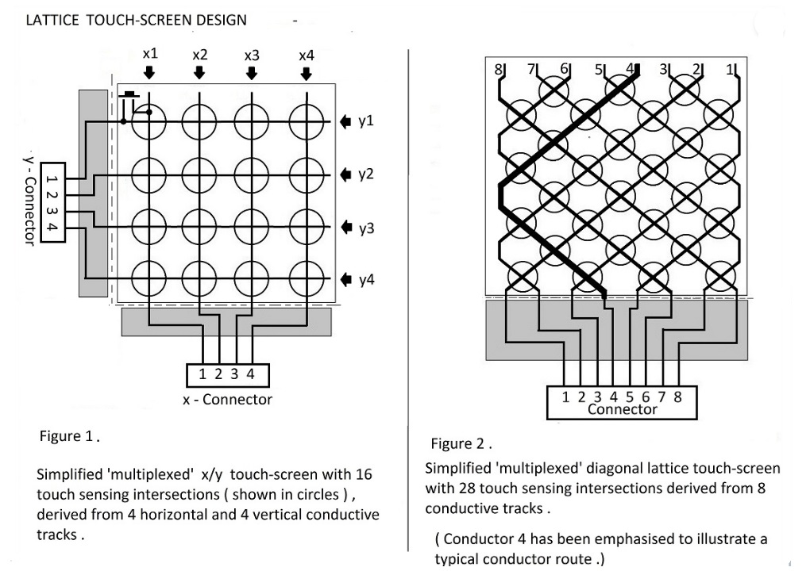
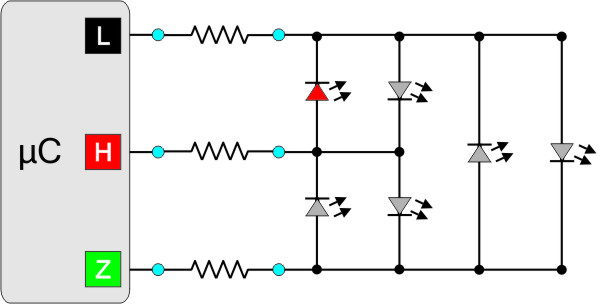
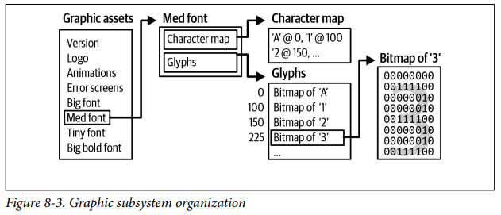
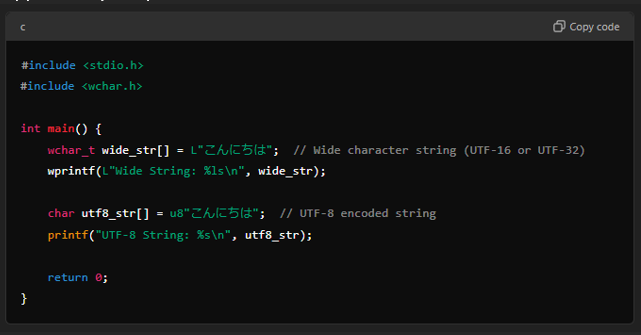

# Embedded Concepts

- Embedded concepts notes
- List of niche/application specific notes

## Index

- [Index](#index)
- [.exp Files](#exp-files)
- [.ini Files](#ini-files)
- [.tcl](#tcl)
- [ACPI](#acpi)
- [ADAS](#adas)
- [APB](#apb)
- [APU, RPU](#apu-rpu)
- [ATCA](#atca)
- [AVR Architecture](#avr-architecture)
- [BCD](#bcd)
- [BDM](#bdm)
- [Biased Notation](#biased-notation)
- [Charlieplexing](#charlieplexing)
- [Code Warrior](#code-warrior)
- [Coprocessor](#coprocessor)
- [CUDA](#cuda)
- [FIPS](#fips)
- [FMAN](#fman)
- [FRG](#frg)
- [FRO](#fro)
- [FSL](#fsl)
- [Glyph, Bitmaps, Assets](#glyph-bitmaps-assets)
- [GOPs, TOPs](#gops-tops)
- [Gray Code](#gray-code)
- [Haptics](#haptics)
- [IPI](#ipi)
- [MB Core](#mb-core)
- [MDIO](#mdio)
- [MIPI](#mipi)
- [OSVVM](#osvvm)
- [PLL, DDS, DFLL](#pll-dds-dfll)
- [PPC](#ppc)
- [Refresh and Tearing](#refresh-and-tearing)
- [RIT](#rit)
- [RLE](#rle)
- [SAR](#sar)
- [SECS, GEM, EDA](#secs-gem-eda)
- [SRT Division](#srt-division)
- [Unicode](#unicode)
- [Windows DMF/WDF/WDM](#windows-dmfwdfwdm)

## .exp Files

- “export” files
- Used when exporting data including symbols generated from project compilation, database dumps, etc

## .ini Files

- Used for configuration by Windows applications, Linux applications, and games

## .tcl

- “tool command language”
- High level programming language for rapid prototyping, automated testing, scripting, etc

## ACPI

- “advanced configuration power interface”
- A standard defining power states for different levels of power consumption for computer components
- States include:
  - S0 working state
    - Full power
  - S1 sleep mode
    - Standby mode- CPU powered off, but RAM / system state maintained
  - S2 deeper sleep mode
    - CPU turned off completely as opposed to S1
  - S3 suspend to RAM / sleep mode
    - Associated w/ “sleep mode” for most computers
    - Further power consumption reduction compared to S2
  - S4 hibernate mode
    - System state saved to disk (hibernate file) instead of RAM
    - Allows for complete shutdown w/ no power consumption, but requires reading from disk to wake up
  - S5 soft off
    - System is completely powered off
    - No state saved, no activity

## ADAS

- “advanced driver assistance systems”
- Technologies designed to assist drivers in operating vehicles safely and efficiently

## APB

- “advanced peripheral bus”
- Communication protocol used in SoC’s- especially ARM based architectures
- Usually used to connect slower peripherals that don’t require high bandwidth like AHB (“advanced high-performance bus”)

## APU, RPU

- “Application processing unit”, “real-time processing unit”
- Xilinx terms defined for their Zynq SoCs
- APU
  - 
  - Just a regular application (standalone) to be programmed on the processor
  - Can run an OS if needed
  - May be suspended when there aren’t any processes to run
  - Uses an entire core for the process
- RPU
  - Application specifically written to service real-time events
  - Multiple tasks can easily be allocated to this unit at the same time
  - Lol can run FreeRTOS, but can also run bare metal

## ATCA

- “advanced telecommunications computing architecture”
  - AdvancedTCA
- Specification for communications equipment that are “carrier grade”, also for aerospace and defense
- Effort by “PCI Industrial Computer Manufacturers Group”, aka PICMG

## AVR Architecture

- Low-end embedded systems, as opposed to ARM used in smartphones and almost all other embedded applications and x86 for PCs and servers
- In 1996, Norwegian Institute of Technology students Alf-Egil Bogen and Vegard Wollan designed 8-bit RISC CPU called AVR
  - Alf-Egil and Vegard's RISC processor
- Atmel then bought the design and started Atmel Norway

## BCD

- "binary coded decimal"
- This is useful for encoding true integers into bits- good for calculators bc floating point numbers aren't accurate
- 4 bits are used to represent a decimal digit 0-9, and 1010 - 1111 aren't used
- When you have two decimal digits in a byte, it's called "packed BCD"

## BDM

- "background debug mode"
- Older form of debugging primarily for NXP/Freescale MCUs before SWD and JTAG

## Biased Notation

- Notation where 0x00 is most negative, 0xFF is most positive, and 0x80 is 0
- So the raw value - bias is what the number represents

## Charlieplexing

- 
- 
- Method to maximize number of LEDs driven w/ IO pins
- By multiplexing and configuring LEDs in the right direction, you can have an IO array where every unique pair of pins and diode direction can drive 2 LEDs
- This means max N \* (N - 1) LEDs driven provided N pins

## Code Warrior

- Another IDE by NXP

## Coprocessor

- Processors dedicated to particular work alongside a general purpose CPU
- Floating-point processors (if no FPU integrated into CPU)
- GPU
- Cryptographic coprocessor
- DSPs
- AI/ML coprocessors

## CUDA

- "compute unified device architecture"
- Parallel computing platform and programming model made by NVIDIA for developers to use NVIDIA GPUs for general-purpose computing instead of just graphics
- Based on C/C++

## FIPS

- “federal information processing standard”
- Security requirements/standards by US NIST (“National Institute of Standards and Technology”) for cryptographic modules use in computer telecommunication systems
- Levels of security
  - Levels 1-4
  - Higher level means more security
- FIPS 140-3 is a FIPS standard

## FMAN

- “frame manager”
- Hardware block found in certain network processing SoCs (especially NXP processors) to handle ethernet frames, including reception, transmission, classification, and distribution at high speeds

## FRG

- “fractional rate generator”
- Specific to MCUXpresso ands NXP LPC5456xx MCU
- Fantastic, more random ass acronyms
  - Why can’t we speak in words
- It just divides whatever clock you want

## FRO

- “free running oscillator”
- Specific to MCUXpresso and NXP LPC546xx MCU
- No, you’re not going to find this anywhere it’s only in the datasheet for the specific part
  - It’s just an oscillator that runs at 12MHz

## FSL

- “freescale”
- Freescale is a company that’s now merged into NXP
- Motorola is the one that initiated Freescale

## Glyph, Bitmaps, Assets

- 
- Glyph
  - Specific shape, design, or symbol rendered on a screen or paper to represent a character from a writing system
  - ...A font is a set of glyphs
- Bitmap
  - A map of bits to display a glyph
- Asset
  - A collection of all bitmaps
  - Graphic assets are usually split into fonts and other graphics like images, etc

## GOPs, TOPs

- “giga/tera operations per second”
- Similar to FLOPs (“floating-point operations per second”)

## Gray Code

- Aka "reflected binary code"
- Numbering system where only one bit changes between consecutive values
- Allows for error minimization when changing states
- Hardware applications
  - Rotary encoders, ADC's, FPGA/digital design
- Software applications
  - Minimize "hamming distance" (distance between two strings or vectors)
  - Digital communication (QAM, PSK?)

## Haptics

- Feedback from buzzers/vibration devices for users when interfacing w/ devices

## IPI

- “inter-processor interrupt”
- Interrupt generated when one processor needs to interrupt another processor

## MB Core

- “MicroBlaze Core”
- Soft processor core developed by Xilinx used in its FPGA devices
  - “soft processors” are implemented via PL, while “hard processors” are implemented via silicon (physically fabricated into the die)
  - Implemented in PL means that it’s completely configurable including cache size, memory interfaces, peripherals, etc
- 32-bit RISC processor that’s customizable

## MDIO

- “management data input/output”
- Serial bus used for host (a MAC in an ethernet system) to communicate w/ PHY devices

## MIPI

- “mobile industry processor interface”
- Primarily for mobile and embedded devices (smartphones, tablets, wearables, automotive systems, etc)
- Common interfaces: MIPI DSI, CSI
  - “display serial interface”, “camera serial interface”
- Optimized for power efficiency compared to HDMI at the cost of lower resolution, speed, no audio

## OSVVM

- “open source VHDL verification methodology”
- VHDL-based verification framework
- Allows for random testing, functional coverage, and transaction-based modeling
- Allows for TDD-style development for PL work
- Very cool

## PLL, DDS, DFLL

- PLL
  - “phase-locked loop”
  - Feedback control system
  - Compares phase of an output clock w/ phase of reference clock signal to adjust output clock frequency
  - Can multiply and divide input frequency this way
  - Provides good frequency stability, but may require additional filtering to get rid of phase noise
  - For high frequency application
- DDS
  - "direct digital synthesis"
  - Digital method of generating a waveform w/ a phase accumulator, lookup table, or DAC
  - Has discrete-step artifacts (spurs, quantization noise, DAC nonlinearity, phase accumulation truncation)
- DFLL
  - “digital frequency-locked loop”
  - Digitally controlled PLL for frequency (not phase) locking
  - Digital circuit that implements “digital processing techniques” like averaging, filtering, etc to adjust some input clock frequency
  - Also a method of breaking down a clock source to have a higher frequency clock source
  - May not be as stable as PLL at high frequencies, but robust against noise in c
  - For low frequency applications

## PPC

- PowerPC, RISC architecture developed by AIM (apple, IBM, and Motorola)
- PowerPC lost to intel’s processors and died
- PPC used in Wii, Wii U, but now everything runs Intel/AMD processors

## Refresh and Tearing

- Refresh is redrawing data on the screen
- Tearing is when data changes part way through a refresh causing a corrupted image

## RIT

- “repetitive interrupt timer”
- No, not Rochester Institute of Technology
- MCUXpresso jargon again
- Timer that allows MCU to generate interrupts at specific timer intervals without using a standard timer
- Intended for repeating interrupts that aren’t related to operating systems interrupts

## RLE

- "run-length-encoding"
- Encoding an image by color and frequency if there are multiple pixels of the same color
- Helps compress the image sometimes without losing any resolution

## SAR

- In ADC context: “successive approximation register”
- ADC architecture used to convert analog signals to digital data for MCUs, MPUs, etc
- Uses binary search to find associated digital value for analog value- high accuracy
- Other ADC architectures include
  - Flash ADC (parallel ADC)
    - Uses resistor ladder and a bunch of comparators
    - Fast but requires a lot of components
  - Delta-Sigma ADC
    - Oversamples analog signal and filters to convert to digital value
    - High resolution
  - Pipeline ADC
    - Converts in parts over multiple stages
    - Fast and high resolution
  - Ramp ADC (counter type ADC)
    - Measures time taken to reach input voltage
    - Not too fast or precise
  - Wilkinson ADC
    - Capacitor and comparator network to determine digital value
    - Simple but not too fast
  - Interpolating ADC
    - Uses multiple converters operating at different resolutions
    - Fast and precise
  - Time-interleaved ADC
    - Uses multiple ADCs in parallel and interleaved (w/ offset w/o offset repetition?) to get fast conversion

## SECS, GEM, EDA

- “SEMI equipment communication standard” / “general equipment model”
  - Widely used standard for semiconductor equipment and factory control systems
  - SECS
    - Defines low level communication protocol between semiconductor equipment and host computers
    - SECS-I (SEMI E4) refers to RS-232, which is outdated…
    - HSMS (“high speed SECS message services E37”) refers to TCP/IP based communication
  - GEM
    - Defines standardized set of commands and data structures for monitoring, controlling, and automating semiconductor equipment
- “equipment data acquisition”
  - Modern, high-performance alternative to SECS/GEM that provides detailed and real-time data collection
  - Uses XML / SOAP-based (“simple object access protocol”) web services over ethernet instead of SECS/GEM message based protocols
    - SOAP refers to protocol for exchanging information between systems over a network
- Semiconductor industry standards for equipment communication and data collection in manufacturing automation

## SRT Division

- "Sweeney, Robertson, and Tocher division"
- A digit-recurrence algorithm for division to try and predict a few bits in the quotient to perform integer/floating point division a few bits at a time instead of just a single bit at a time

## Unicode

- Character encoding standard
- ASCII (“American standard code for information interchange”) is restricted to English, so we have Unicode for all other languages
  - ASCII is usually 7 bits, “extended ASCII” is a full 8 bits to include accented letters
- Unicode covers all characters from emojis to Kanji in 1-4 bytes
  - UTF-8, UTF-16, UTF-32 for 1, 2 or 4, 4 bytes respectively
  - UTF-8 is a superset of ASCII and overlaps w/ ASCII characters
- Supported by C if you’re on C11
- 
  - Could use wide character strings and Unicode literals from C11

## Windows DMF/WDF/WDM

- These are frameworks/models for developing device drivers
- WDM
  - “windows driver model”
  - Old framework for Windows drivers
  - Supports various windows versions, but higher complexity and manual management
- WDF
  - “windows driver frameworks”
  - A composed framework made of KMDF and UMDF (“kernel-mode driver framework” and “user-mode driver framework”)
  - Allows for simplified driver development
- DMF
  - “driver module framework”
  - Extends WDF
  - Provides reusable / modular components to further simplify driver development
