# Hardware Parts

- Miscellaneous hardware parts notes

## Index

- [Index](#index)
- [74 Series Name Codes](#74-series-name-codes)
- [Altera Cyclones](#altera-cyclones)
- [ASIC, ASSP](#asic-assp)
- [Bidirectional Zener Diode](#bidirectional-zener-diode)
- [BJT vs MOSFET](#bjt-vs-mosfet)
- [Buck/Boost Converters](#buckboost-converters)
- [Bulk Capacitors](#bulk-capacitors)
- [Capacitor Types](#capacitor-types)
- [CMOS Battery](#cmos-battery)
- [Common Mode Choke Transformers](#common-mode-choke-transformers)
- [Components to Avoid](#components-to-avoid)
- [Confusing Hardware Labels](#confusing-hardware-labels)
- [Digital Isolator](#digital-isolator)
- [Diode](#diode)
- [ESD Protection ICs](#esd-protection-ics)
- [Ethernet NIC](#ethernet-nic)
- [Ethernet PHY](#ethernet-phy)
- [Flyback Diodes](#flyback-diodes)
- [Fuses](#fuses)
- [GANFET](#ganfet)
- [GPIB IEEE Cable](#gpib-ieee-cable)
- [Hall Effect Sensors](#hall-effect-sensors)
- [High Side Current Monitor](#high-side-current-monitor)
- [High Voltage Surge Stopper](#high-voltage-surge-stopper)
- [I2C Hotswap, Buffer/Accelerator](#i2c-hotswap-bufferaccelerator)
- [IGBT](#igbt)
- [LED](#led)
- [Mezzanine Cards](#mezzanine-cards)
- [Microprocessor Supervisor](#microprocessor-supervisor)
- [Modem](#modem)
- [Nixie Tube](#nixie-tube)
- [Op Amps](#op-amps)
- [Opto-Isolator](#opto-isolator)
- [PIC](#pic)
- [PMSM](#pmsm)
- [Power strip vs surge protector](#power-strip-vs-surge-protector)
- [Pulse Transformer](#pulse-transformer)
- [QSFP Connector](#qsfp-connector)
- [Regulators w/ Integrated Inductors](#regulators-w-integrated-inductors)
- [Relays](#relays)
- [Security IC’s](#security-ics)
- [Shorting Jumper, Jumper Cap Shunt](#shorting-jumper-jumper-cap-shunt)
- [Small Male Headers- 1.27mm or 0.05in Pitch](#small-male-headers--127mm-or-005in-pitch)
- [Solenoid](#solenoid)
- [SPDT CMOS Switch](#spdt-cmos-switch)
- [SPLD, CPLD, FPGA](#spld-cpld-fpga)
- [Transformer](#transformer)
- [Transient Voltage Suppressors](#transient-voltage-suppressors)
- [Video Connections](#video-connections)
- [Voltage Level Shifters](#voltage-level-shifters)
- [Zero Ohm Resistors](#zero-ohm-resistors)
- [ZIF Connector](#zif-connector)

## 74 Series Name Codes

- Indicates logic family and speed:
- 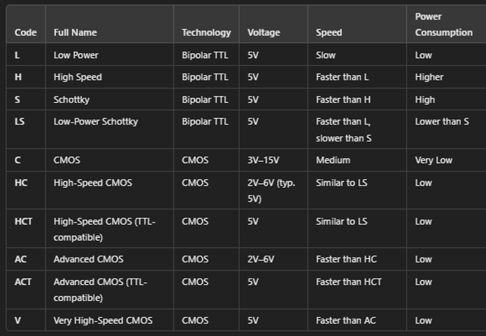

## Altera Cyclones

- FPGA’s developed by Altera (now acquired by Intel)

## ASIC, ASSP

- ASIC
  - “application-specific integrated circuit”
  - IC’s made for a specific purpose, in contrast to a generic processor, MCU, etc
  - Refers to digital processing ICs that are made for specific tasks like graphics processing or AI processing (doesn’t refer to all analog/digital ICs)
  - Ex: Apple A-series SoCs, Tesla FSD ICs, Bitcoin mining ASICs, etc
- ASSP
  - "application-specific standard product"
  - An IC made for a specific class of applications, but sold as a standard product
  - Ex: USB controller, Ethernet PHYs, Wi-Fi/Bluetooth ICs, etc

## Bidirectional Zener Diode

- 
- Aka “transil diode”, or TVS (“transient voltage suppression”, just like we see in ESD suppression ICs w/ a bunch of diodes in parallel)
- Zener diodes are bidirectional to begin with remember?
- It’s just that a “bidirectional zener” has a breakdown voltage threshold for each direction
- When voltage exceeds a threshold in one direction, diode enters breakdown region and conducts to reduce voltage back down (clamping the voltage)

## BJT vs MOSFET

- Transistors are non-linear devices (homogeneity/superposition don't apply)
- As per _Art of Electronics_, 95% of transistors are used as switches
- "P" and "N"
  - Both BJTs and FETs have n/p-type variants
  - N-type -> majority of charge carriers are electrons (mobile, fast, low resistance)
  - P-type -> majority of charge carriers are holes (slower, higher effective resistance)
- BJT
  - 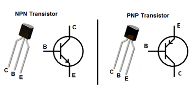
  - 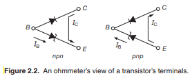
  - Chewy Bliss Eclairs
  - Collector, base, emitter
  - This is the Bell Labs invention that got the Nobel Prize in 1947
  - Great for low noise, and high accuracy
  - Driven by current on the base
  - NPN
    - “not pointing in”
    - Turned on at base via 1
    - Polarity
      - Collector needs to be more positive than the emitter
    - Junctions
      - Base-emitter and base-collector circuits behave like diodes
      - Small current applied to base controls a much larger current flowing between collector and emitter
      - Base-collector diode is reverse-biased (voltage is opposite easy current flow)
  - PNP
    - Turned on at base via 0
    - Reverse of NPN above
- MOSFET
  - 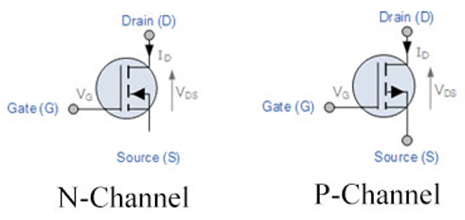
  - Dunkin Glazed Strawberries
  - Drain, gate, source
  - Great for low power, high impedance, high-current switching
  - For the most part a solid replacement for BJTs
  - Driven by voltage on the gate
    - That doesn't mean they don't dissipate heat- eventually Ron increases w/ temperature and you get thermal runaway
  - N-channel
    - Tend to be faster than p-channel
    - NAND gates have their series portion composed of N-channel MOSFETs
    - Fast 0 -> 1 transition time
    - Turned on at gate via 1
    - Opposite BJT- has arrow pointing from source to gate
  - P-channel
    - NOR gates have their series portion composed of P-channel MOSFETS
    - Fast 1 -> 0 transition time
    - Turned on at gate via 0
    - Opposite BJT- has arrow pointing out from gate to source

## Buck/Boost Converters

- **Overview**
  - Inductor stores energy when current increases, and releases energy as current decreases
  - Amount of energy stored/released is controlled by opening/closing a switch at some duty cycle
  - 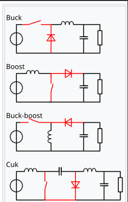
  - 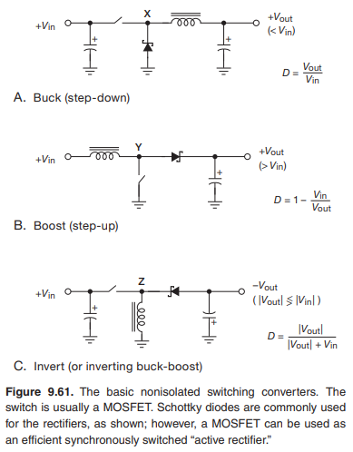
- **Switching vs linear regulator**
  - Use a switching regulator for:
    - Digital systems
    - Low-level analog system that's battery-powered
    - Any high-powered systems
  - Use a linear regulator for:
    - Low-level signals (less than 100uV)
- **Buck configuration**
  - Aka step-down configuration
  - By switching on/off at the right duty cycle and thanks to the inductor and cap smoothening change, an average voltage is observed across the load
  - `Vout = D * Vin`, D = duty cycle
  - Switch on:
    - Current flows through inductor, energy stored in inductor and capacitor
    - If the switch stays closed, Vin would be observed across the load
  - Switch off:
    - Inductor resists change in current and slowly dissipates energy to keep current flowing through the load and diode
    - Capacitor resists change in voltage and dissipates energy to slow down the change in voltage
- **Boost configuration**
  - Aka step-up configuration
  - `Vout = Vin / (1 - D)`, D = duty cycle
  - Switch on:
    - Inductor stores energy in magnetic field
    - If the switch stays closed, Vin would be observed across the load
  - Switch off:
    - Magnetic field collapses and energy is released from the inductor
    - Current flows through the diode and into the load and capacitor
    - There is more energy than the original supply thanks to the inductor
- **Buck-boost configuration**
  - Aka step-up/down, or inverting configuration
  - Inductor stores energy, and then delivers the energy in reverse polarity
  - This allows for either negative or scaled output
  - `Vout = -Vin * (D / (1 - D))`, D = duty cycle
    - 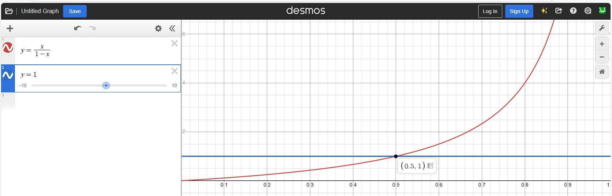
    - ^Below 50% duty cycle means scale down, above means scale up
  - Switch on:
    - Energy is stored in the inductor
  - Switch off:
    - Energy from inductor is released and dissipated to load
- **SEPIC configuration**
  - 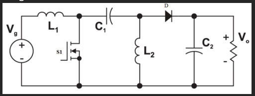
  - “single-ended primary inductor converter”
  - A type of buck-boost converter
  - Isolates input from output to provide better safety/noise performance
  - Good for battery-operated systems, low-ripple input
  - Demands two inductors and extra coupling capacitor
- **Cuk configuration**
  - Pronounced “chook” configuration
  - Uses capacitor as main energy storage device instead of inductor
  - Energy is dissipated from the capacitor between the inductors when switch is turned on
  - Inductors smoothen out flow of current throughout system
  - Switching fast prevents load from reaching supply voltage thanks to charging capacitor, switching slow allows charged capacitor to add additional energy to load
- **Flyback configuration**
  - 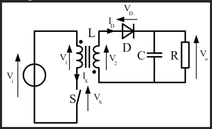
  - Using a transformer to convert DC voltage
  - Also provides isolation between input and output, and can generate multiple output voltages via more windings on the transformer
  - More complex, more hardware
- **Charge pump circuit**
  - 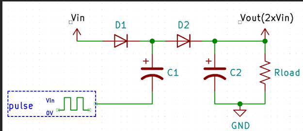
  - Aka, "flying-capacitor converters"
  - Both switching regulators and charge pumps are DC-DC converters, but charge pumps are inductorless
  - Switching regulator
    - Good for high current / voltage applications
    - Transfers energy via high speed switching
    - Requires inductor to modulate current through circuit to store energy in inductor
    - Can regulate to any output voltage desired
  - Charge pumps
    - Good for low power applications
    - Stores energy in capacitors
    - No inductor needed
    - Can only regulate to specific multiples or negated multiples of input voltage
    - Less efficient than switching regulators
    - Simple to implement compared to switching regulator circuit

## Bulk Capacitors

- Bulk caps can be integrated into a design based on how long we expect power to be out from a source, how much voltage we want to maintain, and the current that our system is drawing

## Capacitor Types

- Electrolytic
  - Big spray cans
  - Cheap, polarized, high capacitance caps
  - Often high ESR
- Ceramic
  - Grains of sand
  - Small, non-polarized, low capacitance caps
  - Low ESR/ESL
- Tantalum
  - Slightly upgraded spray cans
  - Expensive, polarized, stable, medium capacitance caps
  - Low ESR
- Polymer
  - (often) SMD, high capacitance, long lasting capacitors
  - Low ESR
  - “tantalum polymer” caps
    - These things are the best right now
    - Tantalum caps are stable and thin for using tantalum pentoxide as dielectric over aluminum oxide as dielectric
    - Tantalum polymer caps use conductive polymer as electrolyte (cathode) instead of the usual manganese dioxide, making it more reliable and efficient (low ESR, good for high frequency/current applications)
- Film
  - Ya good ol jelly beans- horrible
  - Low capacitance, low ESR/ESL, non-polarized, stable over time
- Line-rated caps
  - Aka, the X1, X2, etc rated caps
  - These are caps that are made to prevent arcing- made to be self-healing to recover from internal breakdown
  - X
    - X1, X2, X3
    - Rated for use where failure would not create a shock hazard
  - Y
    - Y1, Y2, Y3
    - Rated for use where failure would present a shock hazard
    - For bypassing AC lines to ground

## CMOS Battery

- That coin battery on a PC is called a "CMOS battery"
- It used to power:
  - RTC (and it still does)
  - CMOS RAM storing BIOS configuration
- Today it's used for:
  - RTC lol
    - Keeps the clock running when AC power is lost
  - Preserve BIOS/UEFI if standby power is lost
    - Modern UEFI uses non-volatile flash for firmware settings, but some boards have legacy configuration in low-power memory powered by the coin battery

## Common Mode Choke Transformers

- 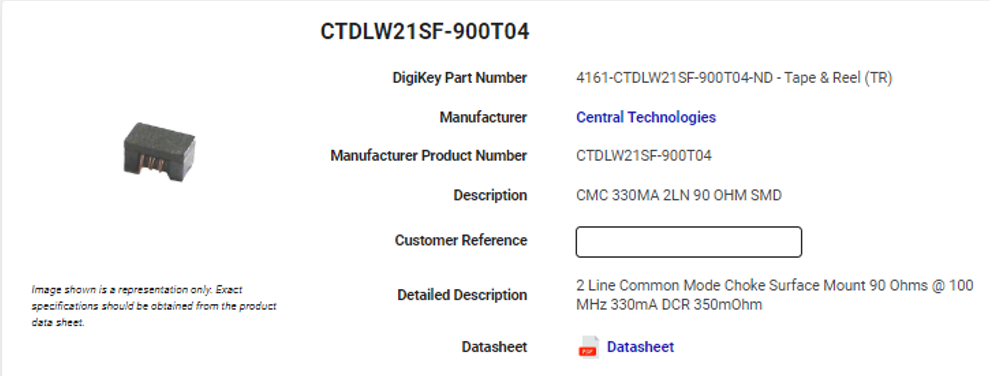
- 
- These transformers filter out unwanted common mode and EMI noise
- More complex than just two ferrite beads in parallel

## Components to Avoid

- 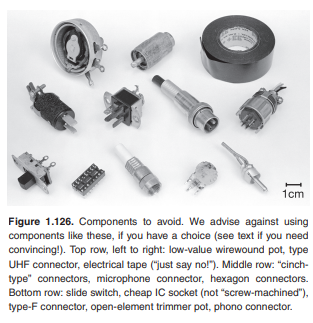
  - From _Art of Electronics_
- Wire wound potentiometers, electrical tape, hexagon connectors (they don't survive drops), slide switches, IC sockets that aren't screw-machined, etc

## Confusing Hardware Labels

- 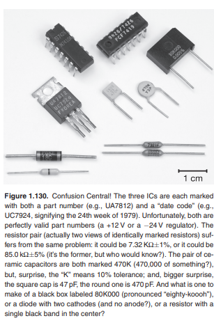
- Date/other misc information that can be interpreted as part numbers, resistor bands, etc
- ...Once parts get small enough they completely omit any indicators anyway, so ig it's to say PCB's should be clear w/ indicators

## Digital Isolator

- 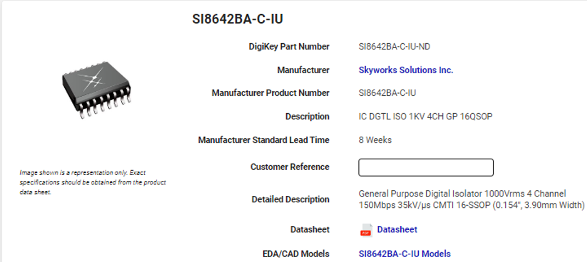
- 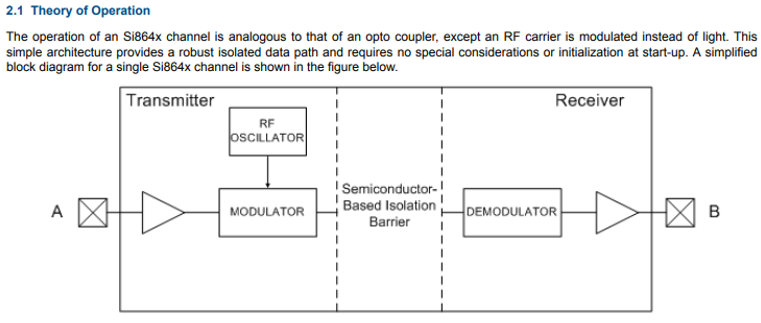
- Used to transmit digital signals over an isolation barrier while maintaining electrical isolation
- This particular IC uses RF coupling
- RF coupling
  - High frequency RF waves used to transmit data over isolation barrier
- Capacitive coupling
  - Digital signal modulates the electric field of capacitors to transmit information over an isolation barrier
- Magnetic coupling
  - Digital signal modulates the magnetic field of inductors to transmit information over an isolation barrier

## Diode

- Many different types of diodes
- 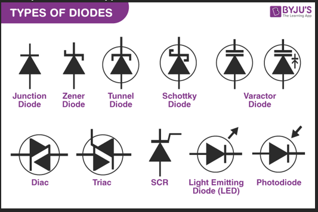

## ESD Protection ICs

- 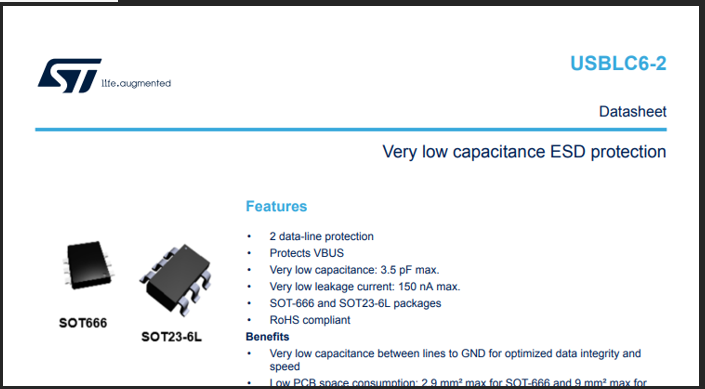
- These are good for protecting VBUS signals from ESD
- Applicable for high and low speed USB, ethernet, etc

## Ethernet NIC

- Ethernet “network interface card”
- Hardware that allows a computer to connect to a network over ethernet

## Ethernet PHY

- 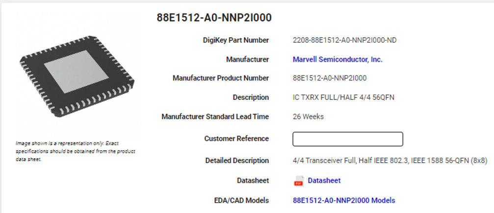
- 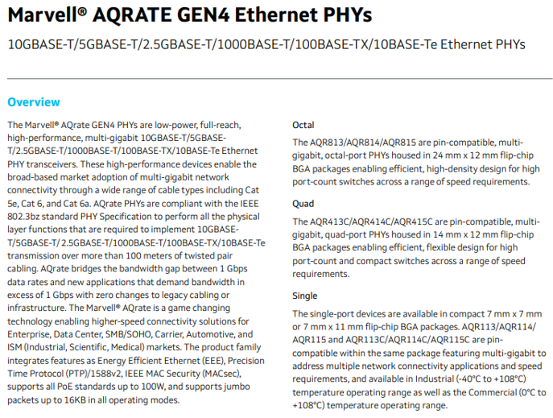
- Ethernet PHY IC’s exist for a processor to communicate over ethernet if it doesn’t have the interface/peripherals for it
- These PHY IC’s are referred to as “transceivers” (receiving and transmitting data as a middle IC)

## Flyback Diodes

- Needed to release the energy stored in a motor coil when the motor needs to stop after operation
- Needed even when there are diodes built into H-bridge IC’s (“body diodes”)

## Fuses

- SMD fuse packaging
  - Square endblock
    - 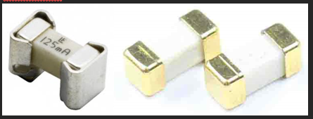
- Square blocks at the ends
  - Gull wing
    - 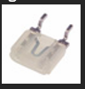
- Packaging where leads look like seagull wings
  - J lead
    - 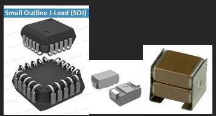
- The leads form a “J” shape as opposed to seagull wings
- Fuse response time
  - Response time is labeled “slow/medium/fast” blow
  - …

## GANFET

- 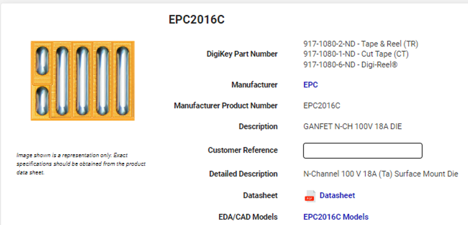
- Used to create high power input/output channels
- “gallium nitride field-effect transistor”
- Higher efficiency (conduction losses and switching speeds), lower on (Rds) resistance, higher breakdown voltage, better thermal performance, lower gate charge (charge required to turn on/off), and higher power density compared to regular MOSFET’s
- Usually in N-channel form since it’s faster
- Made for high voltage applications

## GPIB IEEE Cable

- “General Purpose Interface Bus”, aka IEEE-488 cable
- Standard cable made by HP (“Hewlett Packard”, aka “Keysight” now)
- 24 pin connector w/ D shaped metal shell
- Transfers up to 1mB/s lol
- Often used for measuring instruments, lab equipment, data acquisition, etc
- 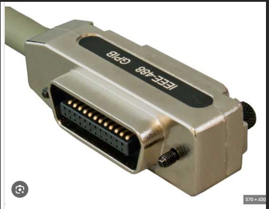

## Hall Effect Sensors

- Hall effect is where voltage is induced across a conductor when a magnetic field is applied perpendicular to the conductor
- When a conductor penetrates through a magnetic field plane, the Lorentz force (caused by the combination of magnetic and electric forces acting on the charges moving through the conductor) pushes the particles in the conductor to one side across the short side of the conductor, and causes a potential difference across the cross section of the conductor

## High Side Current Monitor

- 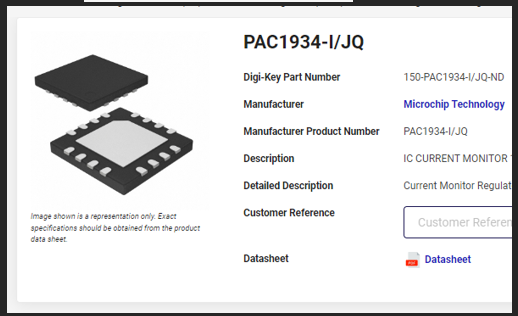
- Devices capable of monitoring current on a line using shunt resistors
  - NOT hall effect sensors
  - Shunt resistors are alternatives to getting a voltage proportional to the current flowing across a line
- The PAC1934 computes the current value as well using a current sense amplifier

## High Voltage Surge Stopper

- 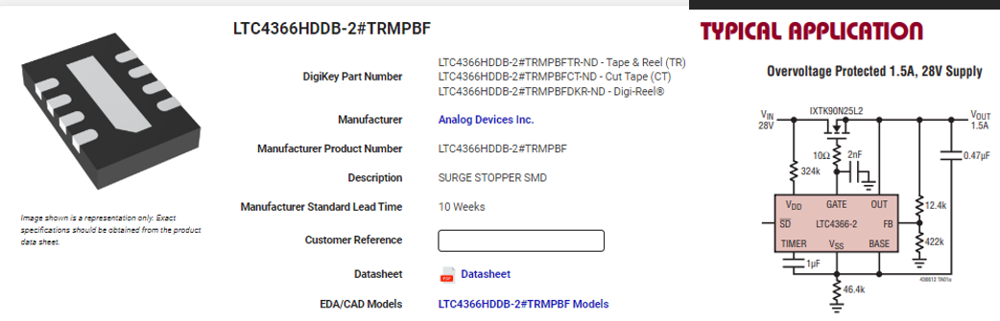
- Controls the gate of a fet to manage VIN

## I2C Hotswap, Buffer/Accelerator

- 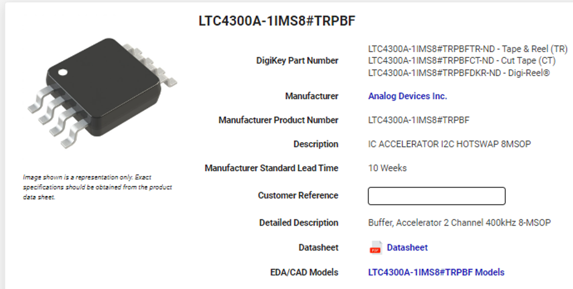
- Allows for hotswapping I2C and SMBus systems
- Improves signal integrity if communication speed is important

## IGBT

- “insulated gate bipolar transistor”
- Transistor that combines characteristics of BJT and MOSFET
- Similar to BJTs, an IGBT is current controlled (as opposed to MOSFETs that are voltage controlled)
- Similar to MOSFETs, an IGBT’s gate terminal is isolated from the drain and source terminals
- MOSFET’s are good for low voltage high switching speed applications, BJTs are good for high current low frequency applications
- IGBT is between BJT and MOSFET in terms of power and switching speed

## LED

- "light emitting diode"
- While we're at it, the family tree:
- 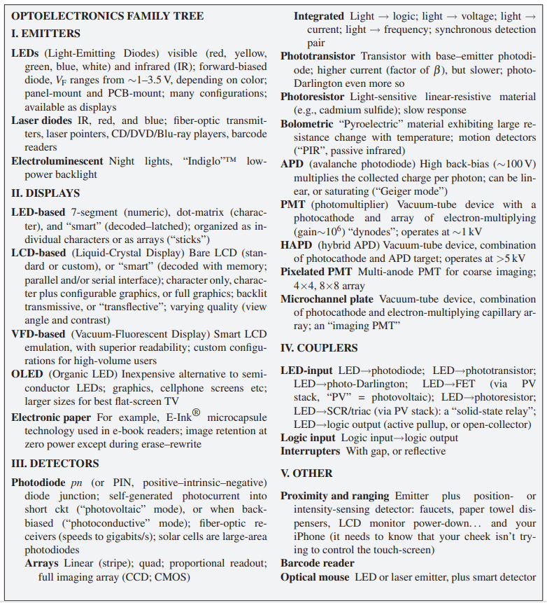
- 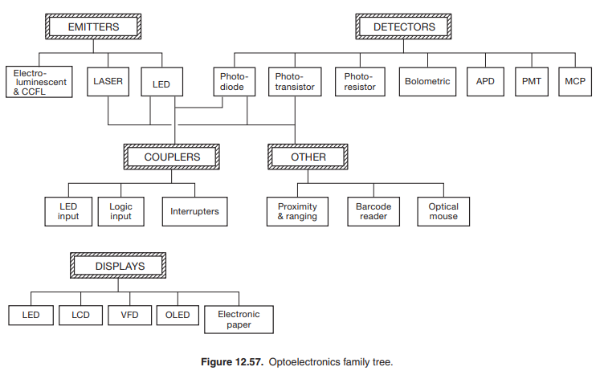

## Mezzanine Cards

- Aka Mezzanine modules, mezzanine boards
- PCBs designed to be plugged into other host boards (motherboard, base board) for added functionality
- PMC
  - “PCI mezzanine card”
  - Mezzanine card that has a PCI bus
  - Can provide various functions
- XMC
  - “Switched mezzanine card”
  - High speed PMC using serial communication
  - Good for I/O
- FMC
  - “FPGA mezzanine card”
  - Provides access to an FPGA
  - Xilinx did some stuff here
    - Https://www.vita.com/Resources/Marketing%20Alliances/FMC/Xilinx_wp315.pdf
- AMC
  - No, not the movie theater
  - “Advanced mezzanine card”
  - Used in aTCA systems for telecommunication purposes
- DIMM
  - “Dual inline memory module”
  - Provide additional memory- more RAM
  - Ex: RAM sticks
- Daughter cards
  - Generic mezzanine cards for various purposes
- Storage mezzanine
  - Provides additional storage (over SATA, NVMe interfaces, etc)
- Graphics mezzanine
  - Provide advanced graphics capabilities
  - Note: NOT graphics cards (graphics mezzanine cards are smaller)
- Communication mezzanine
  - Add various communication interfaces like ethernet, serial ports, wireless communication, etc
  - Ex: wifi cards
- Custom mezzanine
  - A custom mezzanine if a particular project demands one

## Microprocessor Supervisor

- 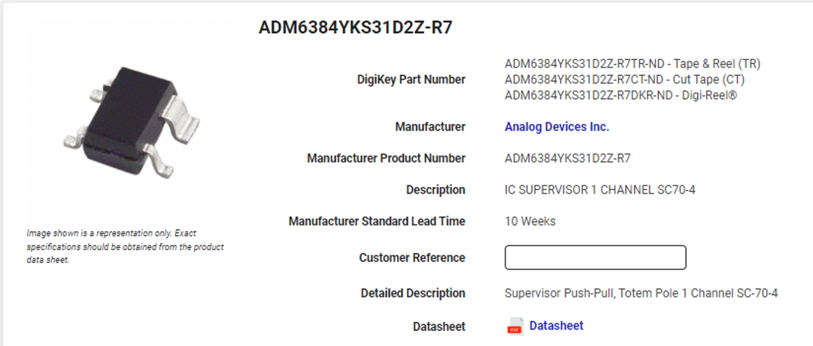
- Serves as a monitor for a power line
- Asserts a reset to go to microprocessor whenever power line is below some threshold

## Modem

- "modulator-demodulator"
- Devices that were used to encode and decode analog electrical signals to 0s and 1s
- Were a part of telephone systems (dial-up modems)

## Nixie Tube

- 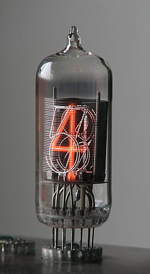
- Aka, "cold cathode display", or "code cathode display"
- Tubes w/ overlapping filaments in the shape of numbers- neon lamps

## Op Amps

- Basic operational amplifier configurations:
  - 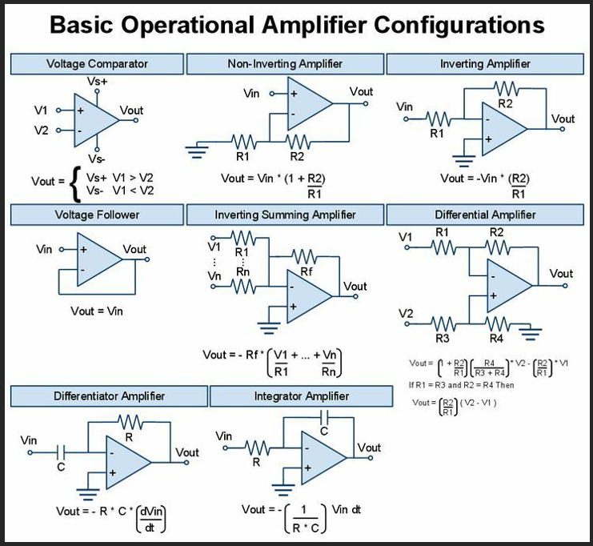
- Op-amp behavior
  - Outputs will attempt to do whatever is necessary to make the voltage difference between the inputs 0
  - Inputs draw no current

## Opto-Isolator

- Can be seen on 68PPC3 between PWR_ON and -12V-IN line
- Aka an opto-coupler, is a sort of switch that isolates two circuits but allows signal transmission from one circuit to the other via light
- Allows for
  - Electrical isolation to prevent high voltage or noise from one line relative to another
  - Noise immunity from EMI or voltage spikes
  - Voltage level shifting
    - Ex: allows a 5V mcu to communicate on a 3.3V line
- 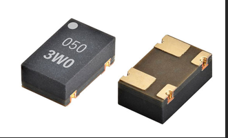
  - Https://www.digikey.com/en/products/detail/omron-electronics-inc-emc-div/G3VM-31WR-TR05/13916910

## PIC

- “peripheral interface controller” architecture by Microchip
- As in PIC MCU’s

## PMSM

- “permanent magnet synchronous motor”
- Motor that uses permanent magnets embedded in or attached to the rotor to create a magnetic field to spin the shaft

## Power strip vs surge protector

- Lol
- A power strip just breaks out an outlet into a bunch more outlets
- A surge protector is a power strip w/ voltage spike protection, etc

## Pulse Transformer

- 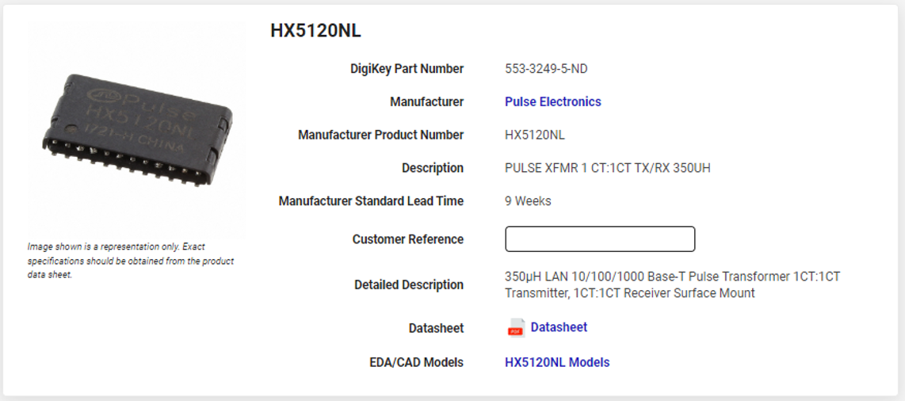
- These things are used for:
- Isolation
  - Isolation between two circuits while allowing transmission of pulse signals
  - Prevents ground loops
  - Reduces noise
  - Improves signal integrity
- Impedance matching
  - Match impedance between two circuits by changing impedance of coil 1 vs coil 2
  - Ensures efficient transfer of pulse signals without signal reflections or distortions
- Signal coupling
  - Allows for seamless “coupling”
    - Transfer of electrical signals from one electrical component to another
  - This is because coils aren’t directly connected together
- Signal transformation
  - Can change pulse width, rise/fall times while maintaining signal integrity
  - Can also change voltage level if coil ratio isn’t 1:1
- Gate drive
  - In power electronics context:
    - Used to provide signals to drive gates like MOSFETs/IGBT
    - Those gates can then power devices like motor drivers, etc
- Pulse transformer coupled logic
  - This alone is a logic family just like TTL and CMOS
  - Relies on pulse transformers between logic gates
  - Offers high-speed operation and reduced power consumption compared to other families
- Telecommunications
  - Used for interfacing w/ communication lines like:
    - T1/E1 lines
      - Digital telecommunications standards for transmitting voice/data signals over copper or fiber-optic cables
      - T1
        - 1.544 Mb/s, widely used in North America
      - E1
        - 2.048 Mb/s, used in Europe and other parts of the world
      - Uses TDM- “time-division multiplexing” to carry multiple data channels and voice channels
    - DSL lines
      - “digital subscriber line”- enables high-speed internet access over copper telephone lines
      - Uses “modulation” to divide channels into different frequency bands to transmit multiple channels at once (voice at low frequencies, data at high frequencies)
    - Ethernet connections
      - Some ethernet PHY (“physical layer”) interfaces support pulse transformers
      - Simplifies circuitry required for ethernet connection
      - Provides additional perks like improved signal integrity and noise immunity
  - Provides isolation and impedance matching for signal transmission over long distances

## QSFP Connector

- 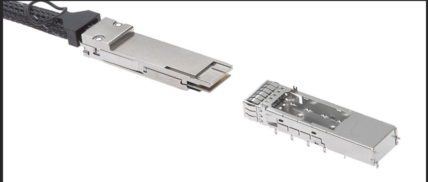
- “Quad small form-factor pluggable” connector
- Four lane high speed IO interface
- Mainly used for server, storage, switch, video, and communication systems
- Used for 10, 100, or 1000Gbps ethernet via IEEE802.3ak on the 68INT6 together w/ ET (ethernet) module
  - Holy moly 1000Gbps
  - Infinitesimally small gaming ping baby
- “KR”/”KX” ethernet
  - Refers to different physical ethernet standards
  - KR
    - Backplane ethernet physical interface standard
    - Used for high-speed communication between components on a PCB or w/in a chassis
    - Up to 10Gbps
    - Distance up to 1m
  - KX
    - Another backplane ethernet standard
    - Up to 1Gbps
    - Distance up to 1m
    - For short distances on PCB traces
- Base-T
  - Typical copper ethernet cables (Cat6, Cat7 twisted pairs) use this standard over KR and KX
  - Speed and distance varies w/ the cable, but the most balanced right now while maximizing specs is probably cat7
  - Cat7
    - 10Gbps
    - 100m max distance
  - Cat8
    - 40Gbps
    - 30m max distance

## Regulators w/ Integrated Inductors

- 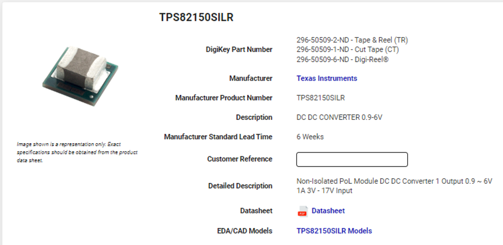
- There are regulators w/ integrated inductors
- These guys save PCB space and removes need for extra inductors

## Relays

- 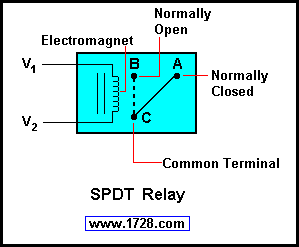
- Electromechanical switches that open/close when an electromagnet is energized
- Works by:
  - Feeding current to a low-voltage coil to generate magnetic field
  - Magnetic field moves an arm that opens/closes contacts
  - Contacts then connect/disconnect the high-powered circuit
- Types:
  - EMR
    - "electromechanical relays"
    - Moving contacts
  - SSR
    - "solid state relays"
    - No moving parts- just semiconductors
    - Fast, but expensive
  - Reed relays
    - Small relay w/ sealed reed contacts inside a glass tube
- 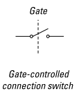
  - When a switch has a dashed line through it, the dashed line indicates a gate
  - The gate might be controlled w/ current or voltage
- NO, NC
  - "normally open" and "normally closed"

## Security IC’s

- 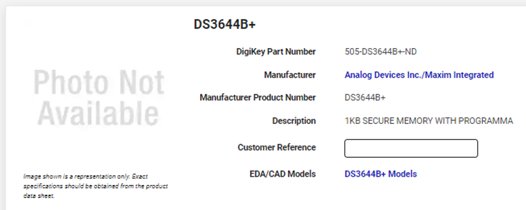
- There are MCU’s dedicated to security and tamper detection

## Shorting Jumper, Jumper Cap Shunt

- 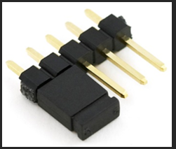
- These things are used to short two male header pins together
- Called “jumpers”, “shunts”, etc

## Small Male Headers- 1.27mm or 0.05in Pitch

- 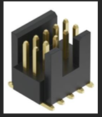
- These things are small and compact, good because JTAG connectors usually use female connectors of this pitch
- No need for adapter board to switch to 0.2in pitch connectors

## Solenoid

- 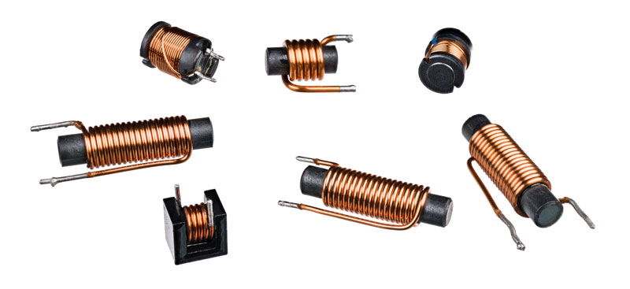
- A straight inductor that translates electrical energy to magnetic energy to generate mechanical motion
- Used in door locks, disk/tape ejectors, liquid/gas control valves

## SPDT CMOS Switch

- 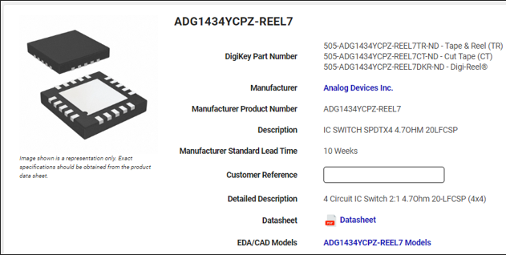
- There’s an IC for everything
- It’s an IC that acts like a SPDT switch, implemented w/ CMOS technology
- Very cool

## SPLD, CPLD, FPGA

- SPLD
  - A few dozen fixed logic gates
  - Usually AND/OR array
  - Relies on sum-of-product logic
- CPLD
  - Multiple macrocell blocks
  - AND/OR arrays and flip-flops
- FPGA
  - Uses LUTs (“look-up tables”) for logic implementation
  - Numerous programmable interconnects to route signals

## Transformer

- 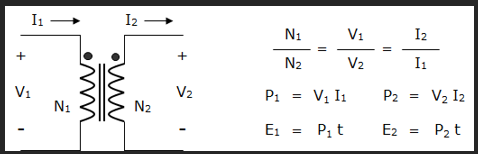
- The proportion of windings between the two coils on a transformer is the same as the proportion of voltage between the two transformer coils
- The proportion of windings between the two coils in a transformer is the reciprocal of the proportion of current between the two transformer coils

## Transient Voltage Suppressors

- 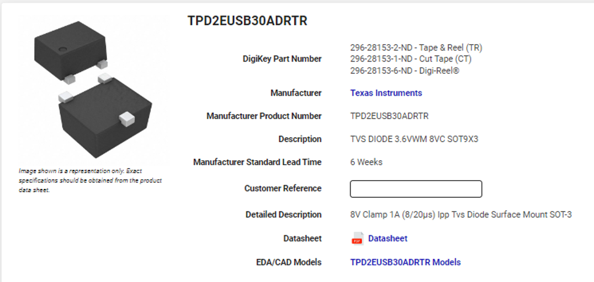
- 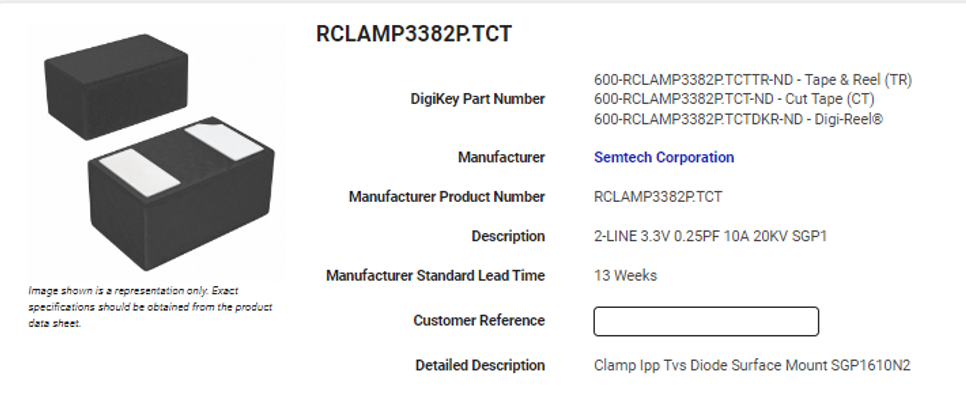
- 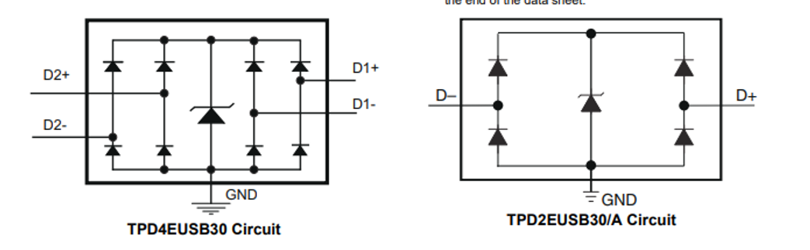
- 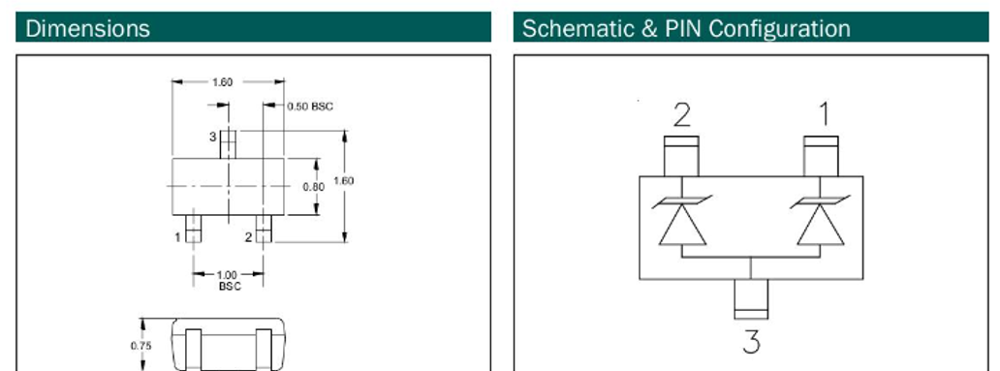
- Provides ESD protection for high speed signals like differential pair signals
- Used for USB, ethernet, etc
- Essentially just a bunch of diodes in parallel to suppress ESD
- When voltage crosses the threshold voltage, the excess voltage’ll be discharged through the ESD diodes down to ground

## Video Connections

- 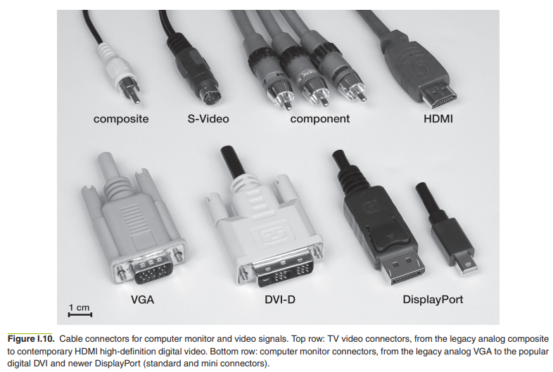
- There's a distinction between the "consumer market" and the "computer market" regarding video connections...
- Consumer market
  - Large-screen TVs, flat panels, etc
  - HDMI
    - “high definition multimedia interface”
  - Composite video
    - The red, yellow, and white cable on the Wii
  - Other older
    - Composite, and S-Video were cables too
- Computer market
  - LCD monitors, etc
  - Analog VGA
    - Legacy analog link
  - DVI
    - Nice locking screws
  - DisplayPort
    - Newest standard of the 3, and uses a USB-like latching mechanism

## Voltage Level Shifters

- Various ways to shift voltage levels:
- Voltage divider
  - Cost effective, for low-speed applications that are below few MHz for digital signals and below audio range (~20kHz) for analog signals
  - Good for sensor output
- Level shifting ICs
  - Can provide bi-directional level shifting
  - Available for both digital/analog for various configurations
- Bipolar transistor level shifting
  - You can use bipolar transistors to make a level-shifting circuit
  - Good for digital signals
- MOSFET level shifter
  - A MOSFET level shifter is good for both analog/digital
  - 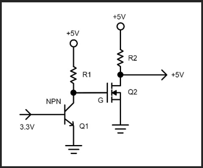
- Buffer/line driver IC
  - Can translate signals between different voltage levels
- Voltage translation IC
  - Shift logic levels between different voltage domains
- Opto-isolators
  - (above)
- Schottky diode OR gate
  - Can create logic OR gate w/ Schottky diodes to shift voltage level

## Zero Ohm Resistors

- Used for various reasons:
- PCB jumper
  - Avoids need for via
- Component placeholder
  - To be replaced w/ something else if there are optional components on the board or components that might change later
- Signal routing & bypassing
  - Helps manage signal integrity impedance matching while still allowing for debugging

## ZIF Connector

- 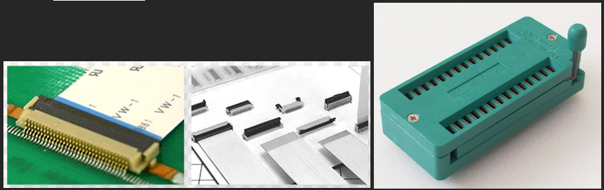
- “zero insertion force”
- Flat flexible cables that connect PCBs
- Fragile, thin cables for small space applications
- Great for items that don’t move, but require dynamic cabling (displays, static keyboards, touch panels, etc)
