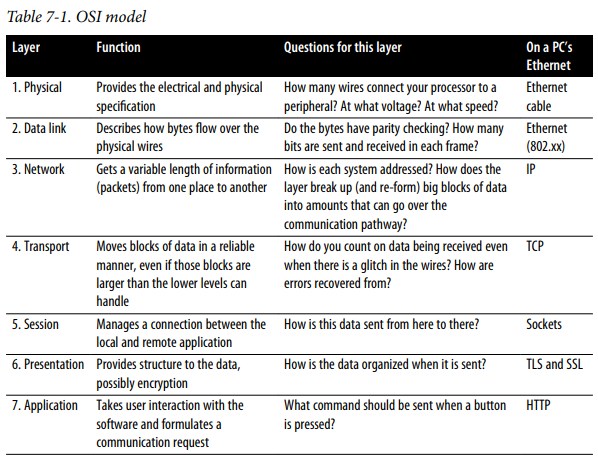
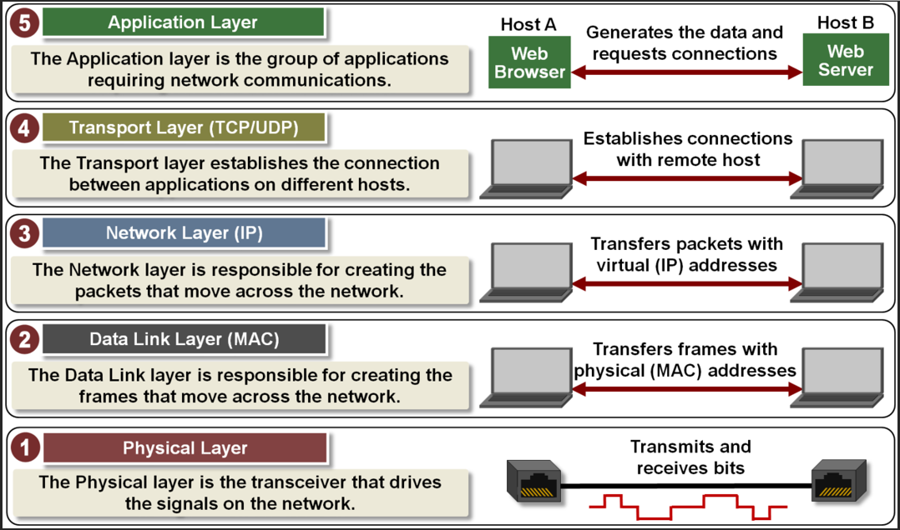
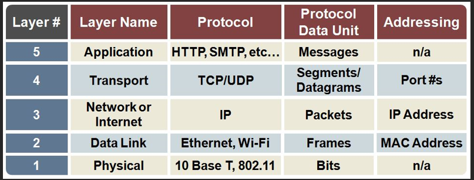
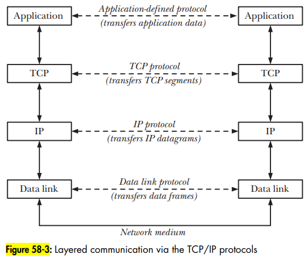
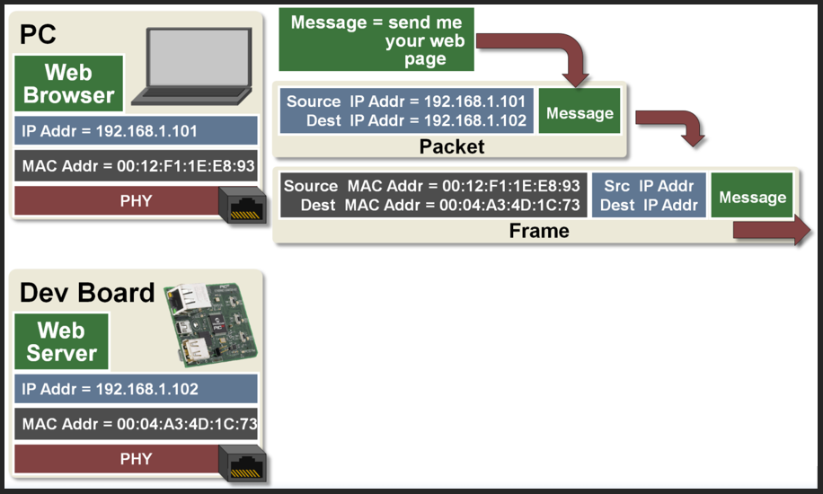
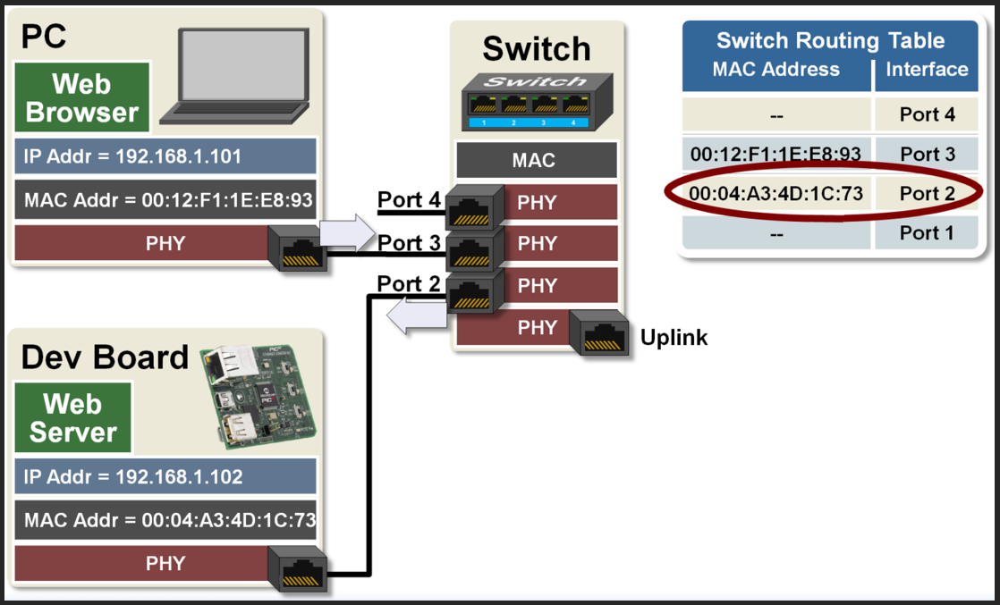
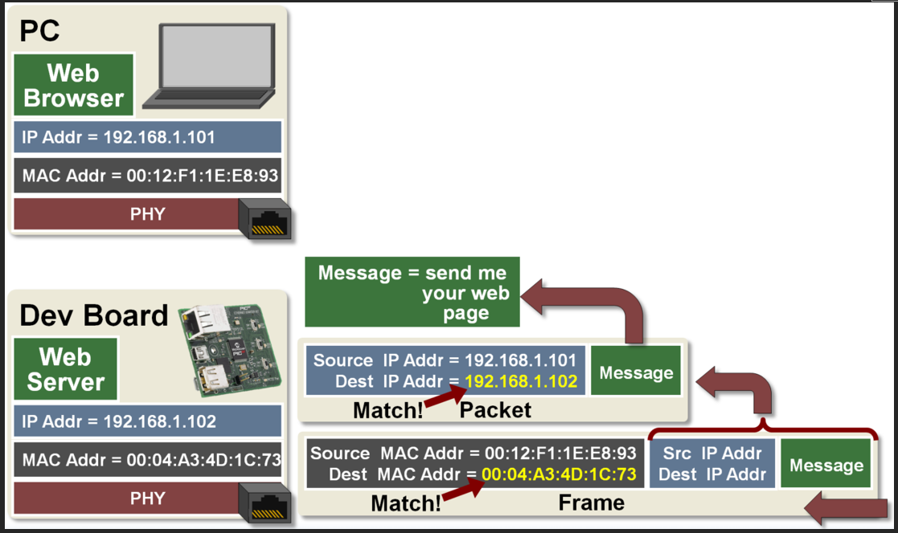
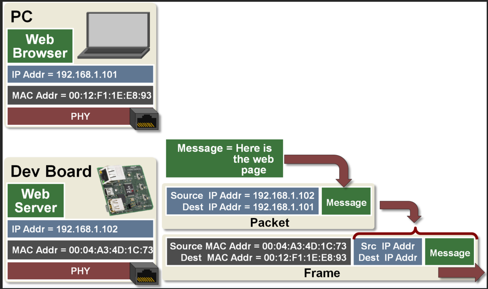
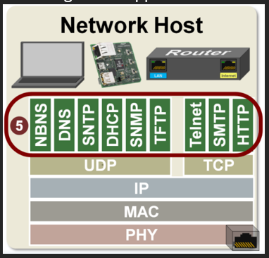

# Internet 5 Layer Model

- Internet 5 layer model notes

## Index

- [Index](#index)
- [Overview](#overview)
- [1: Physical Layer](#1-physical-layer)
- [2: Data Link Layer](#2-data-link-layer)
- [3: Network Layer](#3-network-layer)
- [4: Transport Layer](#4-transport-layer)
- [5: Application Layer](#5-application-layer)

## Overview

- A framework to understand/standardize the way different networking systems communicate
- Each layer abstracts a complexity in the stack to prevent a big mess between implementations of TCP/IP stack parts
- Aka, “OSI model” (“open system interconnection”)
  - 
  - Now w/ the new 5 layer model, the "presentation" and "session" layers are folded into the "application" layer
- From top to bottom going global to local:
- 
- 
- 
- 

## 1: Physical Layer

- Transceiver that sends/receives signals on network
  - “transducer” changes one form of energy to anther
  - “transceiver” refers to a transmitter receiver pair integrated together
- Sends/receives signals on physical wire/antenna
- Responsible for moving bits
- Example- PC requests a webpage hosted by a devboard
  - 
    - Webpage is requested by pc
  - 
    - A switch passes the frame (since all of this is local) to the devboard
  - 
    - Devboard receives the frame and decodes the message
  - 
    - Devboard sends the webpage

## 2: Data Link Layer

- Switches work here
  - Switches forward frames w/ MAC addresses w/in a local network
- MAC
  - (again, “media access controller”)
- Generates frames
  - Frames move across local networks
  - Uses MAC to generate frames
  - Adds header to packet (source/destination MAC addresses)
  - Ethernet/Wi-fi (“wireless fidelity) have different frame formats
- Every host has at least 1 MAC address
  - If a laptop has an ethernet port and wifi card, it should have two MAC addresses
    - Types of network interfaces include wifi, ethernet, Bluetooth, cellular interface (used to connect to cellular network), wireless sensor network interface, serial interface (RS-232, RS485), USB network interface, Fiber optic interface, firewire interface, NFC (“near field communication”) interface, infiniband interface, etc
- ARP
  - “address resolution protocol”
  - Connects an IP address to a fixed MAC address in a local area network
- MTU
  - "maximum transmission unit"
  - Upper limit on the size of a frame in the data-link layer

## 3: Network Layer

- Routers work here
  - Forwards packets w/ IP addresses
  - Routers can have switches integrated into them
- IP
  - “internet protocol”
- Generates packets
  - Packets move across global networks
  - Adds header to data received from transport layer (source/destination IP addresses)
  - Creates IP packets
- ICMP
  - “internet control message protocol”
  - Used for reporting errors and performing network diagnostics

## 4: Transport Layer

- TCP/UDP
  - TCP
    - “Transmission control protocol”
    - Slower but reliable transfers
    - Email, web browsing - so things that wouldn’t be coherent without its complete form
    - Telnet, SMTP, HTTP
      - “hyper text transfer protocol”
      - “simple mail transfer protocol”
      - Telnet
        - “teletype network”
        - Used for bi-directional text communication via terminal app
        - Used by Tera Term, Putty, etc
  - UDP
    - “User datagram protocol”
    - Fast but non-guaranteed transfers (“best effort”)
    - VOIP (voice over internet protocol), internet radio, other real-time services
    - NBUS, DNS (domain name service), SNTP, DHCP, SNMP, TFTP- things that don’t need as much stability in its form at all times
      - DHCP
        - “dynamic host configuration protocol”
        - Protocol to automatically assign IP configuration parameters to devices on a network to avoid manual configuration
        - DHCP servers are inside routers to assign IP addresses to hosts
      - SNMP
        - “simple network management protocol”
        - Used for network devices to send event messages to a manager
        - Can be unicast, multicast, and broadcast
- Delivers data to/from applications
- Assigns port numbers to process running in applications
  - “Port number” here is just a number assigned as opposed to “port numbers” on switches which refer to method of physical connection
  - HTTP, HTTPS have their own port numbers, DNS have their own port numbers, etc
- Establishes connection between applications on different hosts
  - Can be multicast, unicast, and/or broadcast
- Well-known / registered ports
  - Some port numbers are universal to specific applications (called "services")
  - Ex: ssh daemon uses port 22, HTTP uses port 80
  - These port numbers are assigned by IANA ("internet assigned number authority")
  - IANA also records "registered ports" for particular companies to call dibs on a port number
- Ephemeral port
  - When an application doesn't choose a particular port, it's called an "ephemeral port"

## 5: Application Layer

- Applications requiring network communications
- These high-level applications include:
- 
