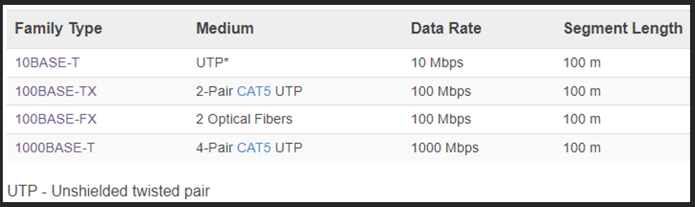
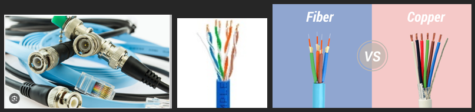

# Ethernet

- Ethernet notes

## Index

- [Index](#index)
- [Overview](#overview)
- [Ethernet Family Naming Scheme](#ethernet-family-naming-scheme)
- [Physical Media Types](#physical-media-types)
- [Speeds](#speeds)

## Overview

- Microchip link for ethernet:
  - Here: https://developerhelp.microchip.com/xwiki/bin/view/applications/ethernet/ethernet-overview/
- Data link and physical layer protocol defined by IEEE 802.3
  - Doesn’t interface w/ network layer
  - Reinforces path between local network hosts
- Can be configured for different speeds and physical modes of transfer
  - Max bit rate (MB/s), mode of transmission (broadband, baseband), physical transmission medium (coax, fiber, UTP)

## Ethernet Family Naming Scheme

- `<BitRate><Signaling>-<Medium><PCS Encoding><#Lanes>`
- Ex: 100Base-TX `<100><BASE>-<T><X><>`
- BitRate
  - Nominal usable speed for MAC layer
  - 10, 100, 1000 (no suffix = MB/s)
  - 10G (G = GB/s)
- Signaling type
  - Each signaling type is associated w/ a range of frequencies and a method of signal transfer/processing
  - Signaling types
    - BASE – baseband signaling (most common)
      - Signals are transmitted without modification
    - BROAD – broadband signaling
      - Not typically used for ethernet
      - Used where multiple channels handling different frequencies are needed
      - “broadband internet” uses various channels for different media like video, voice, etc
    - PASS – passband signaling
      - Not typically used for ethernet
      - Used for when a bandpass filter is needed to filter out noise in a signal
- Physical medium
  - T = twisted pair
  - C = copper/twinax
  - F = fiber (various wavelengths)
  - S = 850 nm short wavelength (multi-mode fiber)
  - L = 1300 nm long wavelength (mostly single-mode fiber)
- PCS encoding
  - Bit encoding schemes specific to transfer speed to reduce required transmission bandwidth
  - X = 8b/10b block encoding (Gigabit ethernet) or 4b/5b (Fast ethernet)
  - R = 64b/66b for large blocks (10G ethernet)
- #lanes
  - Number of signal carrying wires (or wire pairs) used per link (1, 2, 4, 10)
- Examples
  - 

## Physical Media Types

- Co-axial
  - Expensive cables you sometimes see for oscilloscopes
- Twisted pair
  - Most familiar- we saw and setup in IEEE lab
- Fiber-optic
  - Fast
- 

## Speeds

- 1Mbps – 100Gbps incrementing in factors of 10
