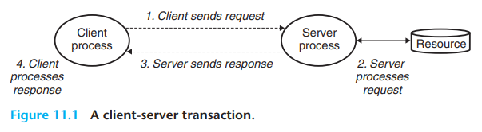
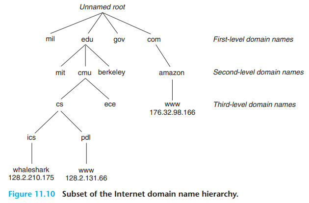

# TCP/IP

- TCP/IP notes

## Index

- [Index](#index)
- [Overview](#overview)
- [Client-Server Programming Model](#client-server-programming-model)
- [Cluster](#cluster)
- [DCHP](#dchp)
- [EOF](#eof)
- [FTP Server](#ftp-server)
- [Global IP Internet](#global-ip-internet)
- [HTTP, HTML, WWW](#http-html-www)
- [Internet](#internet)
- [Internet Domain Names](#internet-domain-names)
- [IP Addresses](#ip-addresses)
- [Local Network TCP/IP Communication](#local-network-tcpip-communication)
- [Network](#network)
- [Network/host discovery](#networkhost-discovery)
- [OpenSSL](#openssl)
- [Ping, Pong, Latency, Bandwidth, Throughput](#ping-pong-latency-bandwidth-throughput)
- [RDP](#rdp)
- [Routers](#routers)
- [Switches & MAC Addresses](#switches--mac-addresses)
- [TFTP](#tftp)
- [WAN](#wan)
- [Wi-Fi](#wi-fi)
- [WLAN](#wlan)

## Overview

- TCP/IP
  - "transmission control protocol / internet protocol"
  - It used to just refer to the main 2 protocols used to get the Internet to work, but now it refers to the whole Internet protocol stack
- Microchip guide here
  - [Wi-Fi® and Ethernet - Developer Help (microchipdeveloper.com)](https://microchipdeveloper.com/networking:start)

## Client-Server Programming Model

- Aka, "Client Server Model"
- When an application consists of a "server" process and one or more "client" processes
- What every network application is based on
- Server
  - What manages some resource, and provides a service for its clients by manipulating the resource
  - ...This is why this word can be abused and used for everything
  - Encapsulating services in servers is great bc:
    - It could be cheaper to provide one instance of a resource
    - Access coordination/security is easier when a resource is at a specified single location
    - Makes the resource a modular entity if the server/clients are in a heterogenous system
- Client
  - Entities that interface w/ servers to access shared resources
  - Web clients are called "browsers"
- 
- Clients and servers are processes, and NOT machines- "hosts" are machines
  - A single host can run many different servers and clients concurrently
- Client-server transactions are NOT database transactions (they could be a part of the client-server transaction if a database is a shared resource)

## Cluster

- A set of machines that's connected over LAN that acts like a big multiprocessor

## DCHP

- “dynamic host configuration protocol”
- Protocol to automatically assign IP addresses and other network configuration parameters (like DNS and gateway) to devices on a network
- Used by routers, switches, and servers to manage IP addresses

## EOF

- Usually refers to "end of file" character
- For a connection, it's a condition detected by the kernel
- Happens when one end of the connection attempts to read past the last byte in a stream closed by the other end

## FTP Server

- “file transfer protocol”
- Server software used to transfer files to/from a remote computer over network
- Requires a reliable TCP connection to deliver data correctly
- This allows us to store trace logs from chassis manager to our Windows PC over local PC network

## Global IP Internet

- As in, the most famous and successful implementation of an internet ("internetwork") that's existed since 1969
  - One of the most successful examples of government, university, and industry partnership
  - US government made a 30-year investment and commitment to researchers
    - ...After US was shook by the Soviet Union launching Sputnik (the first artificial satellite), ARPA ("Advanced Research Projects Agency") was created and eventually led to the creation of the Internet
- A worldwide collection of hosts w/ below properties:
  - The set of hosts is mapped to a set of 32-bit IP addresses
  - The set of IP addresses is mapped to a set of identifiers called "internet domain names"
  - A process on one internet host can communicate w/ a process on any other internet host over a "connection"
- Connection
  - Point-to-point connecting a pair of processes
  - Full-duplex- data can flow in both directions at the same time
  - A "socket" is an end point of a connection
    > Both Wells and Bush optimistically believed that it was essential to improve our access to knowledge and wisdom of the world. It's hard to argue with that. But equally obvious is that providing this access doesn't automatically propel civilization into a golden age. People tend now to be more overwhelmed than ever by the quantity of information available rather than feeling that they can manage it.
  - _Code: The Hidden Language of Computer Hardware and Software_

## HTTP, HTML, WWW

- "hypertext transfer protocol"
- "hypertext markup language"
- "world wide web"
  - Invented by Tim Berners-Lee in a Swiss physics lab
  - Started as a method for scientists to share information

## Internet

- "internetwork"
- Refers to a network of computer networks

## Internet Domain Names

- 
- A sequence of words separated by periods that map to IP addresses
  - A distributed worldwide database called the DNS ("domain name system") performs this mapping
  - A DNS consists of "host entries" that map domain names to IP addresses
- "subtrees" down the hierarchy of domain names are called "sub-domains"
- From the top down layers are called "first-level domain names", "second-level domain names", etc
- All internet hosts have a locally defined domain name `localhost`, which always maps to loopback address 127.0.0.1

## IP Addresses

- Devices that join networks request IP addresses and are assigned addresses
- Every device w/ an IP address is called an “IP host”
  - Every device on a network (local or globally connected via internet) are called “network hosts”
- Virtual addresses (not permanent or hard coded) assigned by router
- IPV4
  - 4x8bit segments (each 0-255), 4.3 billion addresses
  - Ex 192.168.1.101
  - Each of the 4 numbers is called an “octet” and is used to provide unique identification for all devices on a local network
  - Consists of a “network portion” and “host portion”
    - Subnet
      - A subnet is one of the networks that make up the internet
      - A local network can be expanded w/ a bunch of small “subnets” by specifying a “subnet mask”
      - A “subnet mask” determines the bytes that are used for the network portion vs the host portion
      - Ex: a subnet mask of 255.255.255.0 indicates that the most significant 3 bytes are used for the network portion, and that devices on the local network (hosts) can use the last byte to complete each of their local network addresses
      - Ex: a subnet mask of 255.255.0.0 gives 2 bytes for the network portion and 2 bytes for the host portion, providing 2^8 times more host addresses
    - Network portion
      - Represents the network
      - Ex 192.168.1
      - We see those first two numbers everywhere…
      - That’s because they’re numbers assigned by IETF (“internet engineering task force”)- the first two bytes follow private IP address spaces
      - Commonly seen numbers / address spaces include:
        - 192.168.0.0 – 192.168.255.255 (192.168.x.x range)
          - Commonly used in home networks, consumer routers, and small business networks.
        - 172.16.0.0 – 172.31.255.255 (172.16.x.x to 172.31.x.x range)
          - Used in medium-sized networks, typically in enterprise settings.
        - 10.0.0.0 – 10.255.255.255 (10.x.x.x range)
          - Often used in large corporate networks.
    - Host portion
      - Identifies the specific device (host) on the network
      - Ex 1 – 254 (0 reserved as the network address, and 255 reserved as the broadcast address)
    - Serverip vs gatewayip vs ipaddr
      - Environment variable names seen on u-boot
      - `serverip`
        - IP address of a server on a local network
        - IP address of the device that’s hosting a server for a client device (like a bootloader) to fetch files (like an OS image)
      - `gatewayip`
        - IP address of a gateway device (router) that’s connected to a network outside of the local network (the internet)
      - `ipaddr`
        - IP address of the device itself for when it’s on a local network
- IPV6
  - 8x16bit segments (each hex 0-FFFF)
  - Ex FE80:0000:0000:0000:75EA:CEFF:FE44:5101
- IP addresses default to 0.0.0.0, then device requests for new addresses
  - (not capable of sending to just requested device yet at start)
- Destination IP 255.255.255.255 = broadcast IP, so all devices connected to a particular network will get the message

## Local Network TCP/IP Communication

- Local network is NOT the internet
- Local network = switch, router, & connected devices not including devices that are connected via the router’s connection to other networks
- Local IP addresses are not global (lambda gijutsubu flashbacks)
- Local IP address need be translated to internet IP address
  - NAT- network address translation
- Internet host names (website names) must be translated to their IP addresses- done by DNS (domain name service)
- 802.11 is an IEEE LAN (“local area network”) standard

## Network

- A collection of interconnected machines or nodes that communicate w/ each other and shared resources
- The "topology" of a network defines how the machines/nodes are connected together
- Fully connected network
  - A network that connects processor memory nodes w/ a dedicated communication link between each node
  - Every processor has a bidirectional link to every other processor
- Multistage network
  - A network that provides a switch at each node
- Crossbar network
  - A network that allows any node to communicate w/ any other node in one pass through the network
- Ring network
  - When each node is connected to just two other nodes to collectively form a ring of nodes

## Network/host discovery

- Network hosts/devices are discovered and configured via “network discovery” or “host discovery” just as USB devices are discovered and configured via “enumeration”

## OpenSSL

- Toolkit to implement SSL (“secure socket layer”) and TLS (“transport layer security”) to secure communication over the internet
- Allows a user to secure communication w/ web servers and SSH connections

## Ping, Pong, Latency, Bandwidth, Throughput

- Ping
  - Refers to sending one or more packets to a network host
  - “what’s your ping” said all the time refers to the roundtrip time that it took to send and receive the packets (we make our language yeet)
  - Relates to ping-pong by how packets are sent back and forth, but originally derived from the sound a sonar system makes when emitting and receiving a signal
  - A “ping” is an ICMP request (“internet control message protocol”)
    - Network communication used to check state of a network
    - Primarily used to send error messages, but often used to test TCP/UDP connection too
- Pong
  - Slang for the response that a network host might provide in response to a ping
- Latency
  - This is (what would be the term used for as opposed to "ping") the time taken for one or more packets to reach a network host
- Bandwidth
  - Data rate possible by the number of packets that can be sent at once
- Throughput
  - Total amount of data transferred at once per some time
  - Takes real-world factors into account on top of bandwidth including things like network congestion, protocol overhead, etc

## RDP

- “remote desktop protocol”
- Allows users to remotely access and control a Windows computer’s graphical interface
- Protocol developed by Microsoft

## Routers

- Connect one network to another
- Create & control local networks
- Allows local IP/TCP traffic to move to/from internet
- Protects local network w/ firewalls

## Switches & MAC Addresses

- Switch
  - Enables multiple devices to connect to the same network
  - Every network connection has a PHY to drive/receive signals and interface data to/from devices & network
  - The popular ethernet connector is called the “RJ45 connector”
    - (“registered jack”)
  - Most routers have switches built into them
- MAC Address
  - “Media Access Controller”
  - Forwards & filters data based on host’s MAC address (not IP address)
  - MAC addresses are hardware-based addresses
  - Globally unique (must buy from IEEE)
  - Switch has no MAC address b/c it’s never a source or destination of data
  - Broadcast address for MAC address is also all 1

## TFTP

- “trivial file transfer protocol”
- Also used to transfer files to/from a remote computer over network
- Uses wireless simpler UDP (best effort protocol) instead
- No authentication required unlike FTP
- Often used to bootstrap (load) operating system, firmware updates, device configurations, etc wirelessly over a network
- “Tftpd64”
  - An app that can be used on a Windows OS to host a TFTP server for a device to access when it need to boot up an OS

## WAN

- "wide area network"
- A network extended over a large large (city, country, globally)
- Connects together LANs and MANs ("metropolitan area network")
- Includes the Internet (largest WAN), corporate networks connecting offices around countries, etc

## Wi-Fi

- Microchip link for Wi-Fi:
  - Https://developerhelp.microchip.com/xwiki/bin/view/applications/wifi/
- Wi-Fi is a protocol that replaces the ethernet protocol and cables for up to 30m of access
- Wi-Fi protocol, aka “IEEE 802.11”
  - Refers to suite of standards for implementing WLANs
- Wi-Fi fits into the Data Link layer and Physical layer in the 5 layer / OSI model
- Data rates can vary from 1~72.2 Mb/s per stream depending on the protocol and its configuration
- Operates at either 2.4 or 5GHz RF waves
  - …flashback to Raspberry Pis and getting them to connect to our phones at 2.4GHz
  - Right the Pi Zero Ws would only do 2.4GHz
- Wireless host stations (devices) associate w/ an AP (“access point”) before it sends/receives data via network layer
- Steps include:
  - Locate AP to associate w/ via passive/active scanning
  - Authenticate self to AP
  - Associate w/ AP

## WLAN

- “wireless local area network”
- Method for devices to communicate in a local area via RF waves
- Rough protocol overview
  - Devices connect to an “access point” (like a WiFi router) that serves as a central transmitter/receiver and broadcasts wireless signals to let devices connect within its local area
  - Devices communicate w/ a “packet-switched system” where each packet includes sender/receiver addresses and data payload
  - The access point forwards the data as needed provided the receiver address
