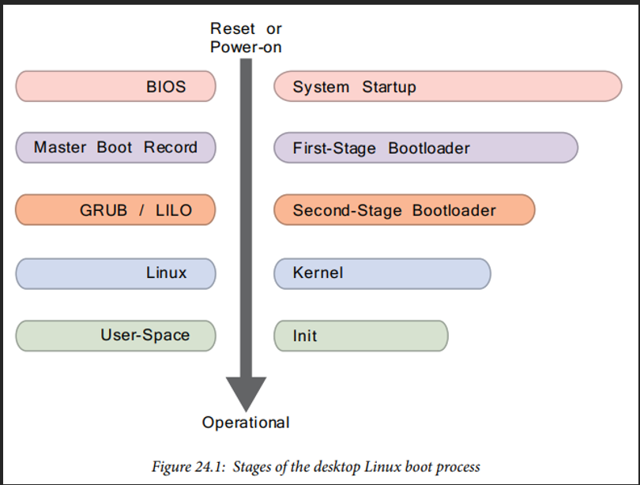
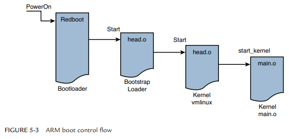
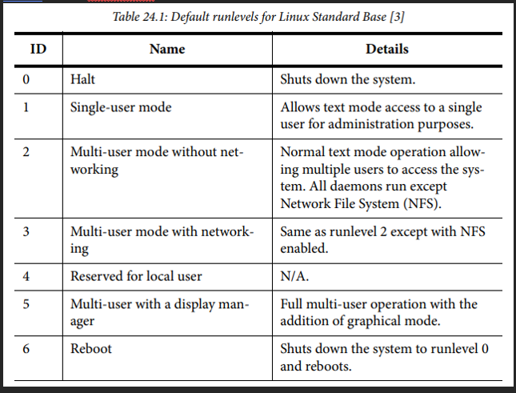

# Linux Boot Process

- Linux boot process notes

## Index

- [Index](#index)
- [Overview](#overview)
- [BIOS vs BootROM/Bootloader](#bios-vs-bootrombootloader)
- [Boot Messages](#boot-messages)
- [DTB](#dtb)
- [Example Processes](#example-processes)
- [RAM Initialization](#ram-initialization)
- [Shutdown](#shutdown)
- [Step 1: Hardware initialization & BootROM](#step-1-hardware-initialization--bootrom)
- [Step 2: FSBL](#step-2-fsbl)
- [Step 3: SSBL](#step-3-ssbl)
- [Step 4: Main bootloader](#step-4-main-bootloader)
- [Step 5: OS kernel initialization](#step-5-os-kernel-initialization)
- [Step 6: User-space initialization](#step-6-user-space-initialization)
- [U-Boot](#u-boot)

## Overview

- 
- At each stage, the next item is loaded to RAM from storage to bring up the OS as fast as possible
  - RAM is faster than SSDs, flash memory, hard drives, etc
  - RAM is optimal for random access as opposed to flash and other NVM optimal for sequential accesses
  - NVM has limits to writes
  - “virtual memory” is implemented by mapping virtual addresses to physical address (where the “physical memory” is RAM)- programs are loaded from some storage to virtual memory and executed

## BIOS vs BootROM/Bootloader

- Whether it's BIOS or BootROM w/ bootloader, if you're working w/ custom hardware you need custom software to bring up the board
- The processor will first execute code in a predetermined location- BIOS or BootROM
- BIOS
  - Desktop computers used to run BIOS until UEFI took over, but we all still call it BIOS
  - On flash memory on a motherboard
  - BIOS determines which devices offer bootable options
  - Includes POST (“power-on self test”) to verify and initialize hardware devices
- BootROM
  - Embedded systems usually have BootROM (optional) and a bootloader instead
  - Minimal firmware on ROM for SoCs, etc for hardware initialization
  - The BootROM then loads the bootloader from NVM to RAM
- Bootloader
  - Software that prepares a system to run main OS
  - Encapsulates FSBL, U-boot, SSBL, main bootloader if any
- Bootstrap loader
  - ...All these names sound too similar
  - Just another name for the SSBL
- Once a boot device is chosen, FSBL is loaded to RAM… and the rest is history
  - FSBL -> SSBL -> main bootloader -> kernel
- 

## Boot Messages

- `Uncompressing... done`
  - Shows that `misc.o` in SSBL did its job
- `Linux version 2.6.32-07500-g8bea867 (chris@brutus2) (gcc version 4.2.0 20070126 (prerelease) (MontaVista 4.2.0-3.0.0.0702771 2007-03-10)) #12 Wed Dec 16 23:07:01 EST 2009`
  - Includes kernel version, username/machine where kernel was compiled, toolchain info, "build number", and data/time the kernel was compiled
  - "build number" is an attempt to differentiate between builds- reset when `make mrproper` is executed

## DTB

- "device tree blob"
- Aka, "flat device tree", "device tree binary", "device tree"
- A database that represents the hardware components on a given board
- Generated from "device tree source" by a special "device tree compiler" that produces a binary in proper form for U-Boot and Linux to understand

## Example Processes

- Xilinx:
  - BootROM -> FSBL -> U-Boot -> Linux Kernel
- ARM-based systems:
  - BootROM -> FSBL -> SPL (“secondary program loader”; minimal U-Boot) -> Full U-Boot -> Kernel
- X86 systems:
  - BIOS/UEFI -> GRUB (SSBL & main bootloader) -> Kernel

## RAM Initialization

- There needs to be a temporary root file system mounted w/in the memory that the kernel is running on before it's able to talk to complex memory devices
- `initrd`
  - "initial RAM disk"
  - Older method of mounting an initial temporary file system as a RAM disk block device, before scripts under `init/` or `linuxrc/` switch Linux over to the real file system
- `initramfs`
  - "initial RAM filesystem"
  - Modern way of starting Linux on a temporary file system
  - A "cpio archive" ("copy in, copy out"- a file full of a bunch of files concatenated together) extracted into tmpfs
  - Sequence could be:
    - U-boot passees initramfs to kernel -> kernel unpacks initramfs into tempfs -> init/ executes in initramfs -> modules are loaded, real root is mounted, and switches to real root

## Shutdown

- Shutdown behaviors vary by project- must be user defined
- Shutdown script needs to terminate all user-space processes, w/ appropriate signals `SIGNTERM`, `SIGKILL`, etc

## Step 1: Hardware initialization & BootROM

- BootROM
  - Aka system firmware to start hardware, initial code that runs on start
  - Initialize hardware- CPU cores, clocks, memory controllers
  - Looks for FSBL in storage to run
- Any other minimal hardware initialization
- Loads FSBL to RAM

## Step 2: FSBL

- Primary/"first stage bootloader"
- A small bootloader for minimal hardware initialization
- Loads second stage bootloader to RAM
- Runs platform initialization
  - Configure DRAM (main memory), peripherals, etc
  - After configuring DRAM, FSBL may copy itself to the DRAM for faster execution
  - Platform/hardware specific setup- each SoC could have different needs at start
- Located in the MBR (“master boot record”- 512 byte sector of device)
  - Rest of MBR contains executable code and error messages

## Step 3: SSBL

- "second stage bootloader"
- Aka, "bootstrap loader"
- Glue between FSBL and kernel
- Consists of and encapsulates `misc.o`, `big_endian.o`, `head.o`, etc
- Responsible for comprehensive hardware initialization
  - Configures memory
  - Complex devices like networking interfaces (TFTP, NFS, etc), storage interfaces, display controllers, etc
- Loads main bootloader
- Loads DTB (“device tree blob”)
- Loads kernel (or main bootloader if applicable)
- Presents a list of possible boot options

## Step 4: Main bootloader

- (if separate from SSBL)
- Loads operating system kernel, device tree, and other components
- Example is GRUB on x86 architectures
  - Could let user decide which kernel to boot, or decide what modules to boot
- Finalizes kernel prep and transitions control to kernel

## Step 5: OS kernel initialization

- OS performs device initialization via device tree and platform specific drivers in the kernel context
- Interrupts enabled
- Filesystem “mounted”
  - Aka, storage device / partitions linked to OS’s namespace for users and programs to access files stored
- Kernel image is transferred to high memory after decompression
- Stack set up
- Page tables configured
- Memory paging enabled
  - Address translation is enabled to allow use of virtual memory space
- CPU / FPU type detected

## Step 6: User-space initialization

- Kernel launches user-space process (init, systemd, etc)
- Init
  - First user-space function to run
  - Looks for /etc/inittab file to determine whether it has an entry of type initdefault- detailing initial runlevel of the Linux system
  - There are 7 runlevels:
  - 
    - Starts background services

## U-Boot

- The "universal bootloader"
- Aka, Das U-Boot
- The most commonly used SSBL for embedded systems
- For desktop Linux, Lilo and GRUB are common
- U-Boot's various features can be enabled w/ a header file
- Became popular for the number of platforms supported
- Can load an image from a specified raw partition, or from a partition w/ a file system structure
  - `=> diskboot 0x400000 0:0`
    - This U-Boot command tells U-Boot to load a raw binary image from the disk subsystem to address 0x400000 on physical system memory
  - `bootm 0x400000`
    - U-Boot can then boot the kerne like this
- U-Boot header
  - Linux images need U-Boot headers at the top for U-Boot to be able to properly load and boot the image
  - U-Boot provides the `mkimage` tool to build the image header
