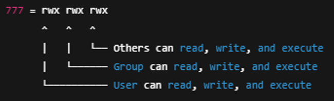
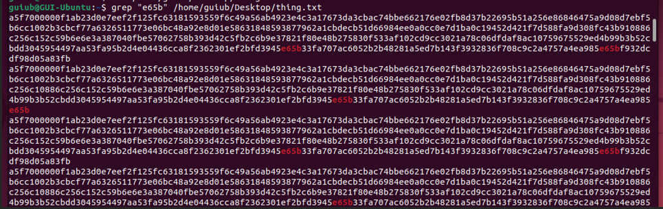

# Linux Commands

- Linux commands notes

## Index

- [Index](#index)
- [Overview](#overview)
- [File and Directory Management](#file-and-directory-management)
- [Info and Navigation](#info-and-navigation)
- [Network Commands](#network-commands)
- [Package Management](#package-management)
- [Permission Management](#permission-management)
- [Process and System Monitoring](#process-and-system-monitoring)
- [Search and Filters](#search-and-filters)
- [Useful Shortcuts](#useful-shortcuts)
- [Viewing and Editing Files](#viewing-and-editing-files)

## Overview

- On top of the arsenal of commands below, Linux is also prepared for you to write your own commands if needed

## File and Directory Management

- `touch [file]`
  - Creates new empty file
- `mkdir [directory]`
  - Creates new directory
- `rm [file]`
  - Delete file
  - Delete directory: rm -r [directory]
- `cp [source] [destination]`
  - Copy files / directories
- `mv [source] [destination]`
  - Move/rename files/directories

## Info and Navigation

- `ls`
  - Print directory contents
  - `-a` flag provides hidden files
  - `-l` flag provides permissions, ownership, file sizes
  - `-R` flag recursively goes through all directories
- `lsmod`
  - List kernel “modules” currently loaded into the Linux kernel
  - A module is a piece of software that extends the functionality of the Linux Kernel without rebooting
    - Device drivers, filesystem support, network protocols
- `insmod`
  - Load a kernel module to Linux kernel
  - Sed to test / manually load custom device drivers
- `tree`
  - Requires additional installation: sudo apt install tree
  - -a flag provides hidden files
- `pwd`
  - “print working directory”
  - Displays current working directory
- `cd [directory]`
  - Change directory
- `man [command]`
  - Displays manual for a command
- `whoami`
  - Displays current logged-in user

## Network Commands

- `ping [hostname]`
  - Test connectivity to a host
- `ifconfig / ip addr`
  - Display network interface configuration
- `scp [source] [destination]`
  - Securely copy files between systems
- `wget [URL]`
  - Download files from internet

## Package Management

- Debian-based (Ubuntu):
  - `apt update`
    - Update package list (the list of packages and URLs available for user to install)
  - `apt install [package]`
    - Install a new package
    - “apt” is the package manager for Debian/Ubuntu- it queries repositories online to fetch requested software if the requested package’s URL is available on the package list
  - `apt remove [package]`
    - Remove a package
- Red-hat based (Cent-OS):
  - `Yum install [package] or dnf install [package]`
    - Install a package

## Permission Management

- `chmod [permissions] [file]`
  - “change mode”
  - Change file permissions
  - Ex: `chmod 777 *`
    - 
      - Each digit represents permissions for user, group, and others
    - This 777 is in octal, where 7 in octal = 111 in binary
    - Each bit sets read/write/execute permission
- `chown [user]:[group] [file]`
  - Change file ownership

## Process and System Monitoring

- `top`
  - Display running processes and system resource usage
  - Linux equivalent of task manager
- `ps aux`
  - Display list of running processes for all users (not just particular shell/session)
  - Display processes for just the current user terminal session: ps
- `kill [PID]`
  - “process ID”
  - Terminates process via PID
  - Force terminate: kill -9 [PID]
  - Signal interrupt (requests the process to terminate) kill -2 [PID]
- `df -h`
  - Show disk space usage
- `free -h`
  - Display memory usage

## Search and Filters

- `find [directory] -name [filename]`
  - Search for a file
  - Ex: `find /home -name “*.txt”`
- `grep [pattern] [file]`
  - Search for a pattern in files
  - Grep “hello world” logfile.txt
  - 
    - Works well

## Useful Shortcuts

- `ctrl + c`
  - Terminate current command
- `ctrl + z`
  - Suspend current command
- `ctrl + d`
  - Log out of shell session
- `!!`
  - Re-run last command
- `History`
  - List all previous commands

## Viewing and Editing Files

- `cat [file]`
  - Display contents of file
- `less [file]`
  - Open file for scrolling/viewing
- `nano [file]`
  - Open file w/ Nano text editor
- `vim [file]`
  - Open file w/ vim text editor
