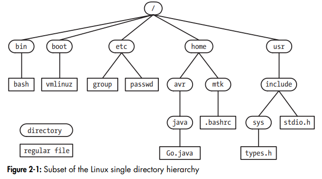
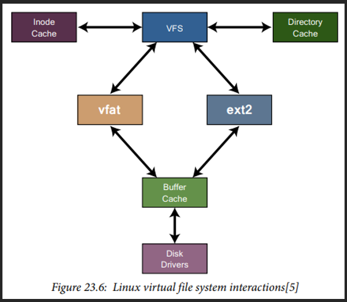
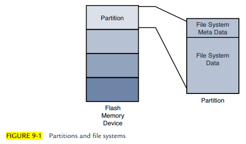

# Linux Directory

- Linux directory notes

## Index

- [Index](#index)
- [Directories List](#directories-list)
- [FHS](#fhs)
- [File Systems](#file-systems)
- [Kernel Directories](#kernel-directories)
- [Linux Kernel Source Tree](#linux-kernel-source-tree)
- [NFS](#nfs)
- [Partition](#partition)
- [Pseudo File System](#pseudo-file-system)

## Directories List

- 
- …there’s an obsession to understand Linux directory structure
- `/`
  - Root directory, aka "root file system"
  - Top level directory of filesystem
  - All other directories are mounted under the root directory
- `/bin`
  - Essential system binaries
  - Basic commands like `ls`, `cp`, etc
- `/dev`
  - "device nodes"- files that represent hardware devices
  - Hard drives, terminals, USB devices, etc
- `/etc`
  - Configuration files
  - System-wide configuration files and directories that control system settings and services
  - Passwd, hostname, network configurations, etc
  - Networking, user accounts, etc
- `/home`
  - User directories
  - Personal directories for all users except root
- `/lib`
  - Shared libraries
  - Libraries needed by system binaries in `/bin` and `/sbin`
  - Essential for program and command execution
- `/sbin`
  - System binaries
  - Essential system binaries like fsck or shutdown for superuser accounts
  - Usually used by root user for system maintenance
- `/tmp`
  - Temporary files
  - Storage for temporary files deleted after reboot, or periodically by system tools
  - System processes and users can write temporary data here
- `/usr`
  - User system resources
  - Contains user applications and files shared by all users
  - Divided into subsections like `/usr/bin`, `/usr/share`, `usr/lib`, etc
- `/var`
  - Variable files
  - Files expected to change often like `/var/log`, spool files, databases, caches, etc
  - System logs and temporary configuration files
- `/boot`
  - Bootloader files
  - Files necessary for system to boot
  - Linux Kernel (vmlinuz)
  - Bootloader config files like grub, lilo, etc
- `/media`
  - Removable media
  - Where removable devices are mounted
  - USB drives, CD-ROMs, DVDs
- `/mnt`
  - Temporary location for mounting filesystems
  - Used to be used when manually mounting filesystems or network shares, but `/media` is now used to do this
- `/opt`
  - Optional software packages
  - Third-party software and add-on application packages not part of Linux-distribution
- `/proc`
  - Process information
  - Virtual filesystem w/ information about running systems / processes
  - Includes CPU usage, memory stats, hardware information
  - Doesn’t contain real files- presents data dynamically
- `/root`
  - Home directory for root user as opposed to `/home` where other users have their personal directories
  - Usually used by system admins for configuration and system management tasks
- `/run`
  - Runtime variable data
  - Contains runtime data for processes and system services
  - PID files, temporary files, runtime system information, etc
- `/srv`
  - Service data
  - Contains data for services provided by system
  - Includes web server data if system is servicing a web server, etc
- `/sys`
  - System information
  - Virtual filesystem w/ information and configuration options about kernel, devices, and other system internals
  - Usually used for hardware and system management

## FHS

- "file system hierarchy standard"
- A minimum baseline standard for compatibility between Linux distributions and application programs
- Comes from UNIX

## File Systems

- As in, the method/data structure that's used by Linux to store/organize/access/manage files on storage devices
  - Encapsulates both the way files are physically stored and the way directories w/ file metadata are organized for user and application use
- Types:
  - `ext`, `ext2`, `xia`, `minix`, `proc`, `smb`, `ncp`, `iso9660`, `umsdos`, `msdos`, `vfat`, `sysvs`, `hpfs`, `affs`, `ufs`, `XFS`, `Btrfs`, `ZFS`, `JFFS2`
  - `ext3`
    - Came out 2001
    - General purpose Linux systems use this
  - `ext4`
    - Came out in 2008
    - Most abundant file system today
    - Faster, good journaling, SSD support
- The numerous file systems are collated in a hierarchical tree structure viewed by the system as a single entity
- File systems are mounted (associated w/ storage device in Linux) to this tree as they are added to the system
- Virtual file system
  - Aka, "virtual file switch"
  - 
  - Creates a unified interface between individual file systems and the rest of the kernel
  - Root level of the file system interface is responsible for tracking all currently-supported and mounted file systems
  - Buffer cache may be used to speed up file system access to physical devices by holding file systems
    - Inode’s (“index node”- data structure holding all information about a file system object, found in Unix file systems) are constantly read/written during mounted file system navigation, so the VFS keeps a cache of inodes to accelerate access
    - A directory cache is also used to store directory addresses/information to speed up repeated accesses to a particular directory location
      - LRU is used to remove directory entries from cache

## Kernel Directories

- The kernel has its own directory where applications to manage hardware live
- `/IPC`
  - “interprocess communication”
  - Where semaphores, mutexes, etc for the OS are defined
- `/fm`
  - “filesystem management”
  - Where management applications live
- `/drivers`
  - Where low level hardware drivers live (power management, hardware peripherals, etc)

## Linux Kernel Source Tree

- The directory structure containing all source code, headers, build scripts, and config files to build the Linux kernel (not directories w/in your Linux image)
- ...So just the top level directory where you're building Linux
- Could look like:

```
linux/
  - Arch/
  - Block/
  - Drivers/
  - Fs/
  - Include/
  - Init/
  - Kernel/
  - Mm/
  - Net/
  - Scripts/
  - Tools/
  - Makefile/
  - .config
```

- Just like Linux file systems, there's an obsession to understand this directory structure too
  - It's because there're a whole bunch of files that look the same:
  - > The head.o module in the bootstrap loader might be more appropriately called kernel_bootstrap_loader_head.o, although I doubt that the kernel developers would accept this patch! In fact, a recent Linux 2.6 source tree contains more than 25 source files named head.S and almost 70 named head\*.S This is another reason why you need to know your way around the kernel source tree.
    - _Embedded Linux Primer: A Practical Real-World Approach_

## NFS

- "network file system"
- Protocol to allow a computer to access files over a network as if they were on local storage
- Whether you're building device drivers or working on any other files that constantly change, using NFS saves time by avoiding recompiling the kernel
- Boot process where kernel and file system is fetched over ethernet could look like:
  - Configure U-Boot w/ kernel boot arguments so the kernel knows where the root file system is, console device, and IP configuration
    - `setevn bootargs '...'`
  - BootROM -> U-Boot initializes RAM, ethernet, peripherals -> U-Boot acquires network info over DHCP/BOOTP -> U-Boot fetches kernel and device tree over TFTP -> kernel runs and mounts NFS root -> user space starts

## Partition

- Memory is organized into partitions, where a file system can exist and be laid out
- When a partition is formatted w/ the right file system type, Linux can mount the corresponding file system from the partition
- Partitions have a "boot indicator flag" to indicate whether the partition is bootable
- 

## Pseudo File System

- Aka, "virtual file system"
- File system that doesn't map to actual data on disk, but exposes information about the kernel and running processes through files
- Ex:
  - "procfs"
    - Mounted at `proc/`
    - Holds process and kernel info
  - "sysfs"
    - Mounted at `sys/`
    - Kernel objects, devices, and drivers
  - "tmpfs"
    - Mounted at `tmp/`, `run/`
    - Temporary RAM-backed files
  - "devtmpfs"
    - Mounted at `dev/`
    - Device nodes- special files
  - "cgroupfs"
    - Mounted at `sys/fs/cgroup`
    - Control groups (resource limits)
  - "debugfs"
    - Mounted at `sys/kernel/debug`
    - Debug information for developers
  - "configfs"
    - Mounted at `sys/kernel/config`
    - User configurable kernel objects
  - "securityf"s
    - Mounted at `sys/kernel/security`
    - Security module interface
