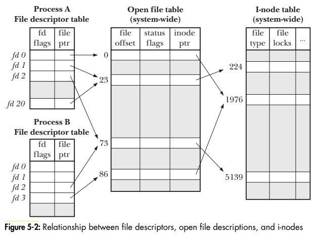

# Linux File

- Linux file notes

## Index

- [Index](#index)
- [Capabilities](#capabilities)
- [File Descriptor](#file-descriptor)
- [File Holes](#file-holes)
- [File System Parts](#file-system-parts)
- [Ownership and Permissions](#ownership-and-permissions)
- [Symbolic Link](#symbolic-link)
- [Timestamps](#timestamps)

## Capabilities

- Files have capabilities just like processes do to determine the capabilities given to a process that executes the file
- File permitted/effective/inheritable bits are used to determine the capabilities that a process has as it executes the file

## File Descriptor

- A non-negative integer returned from an `open()` call to a particular file
- Processes that are started by shells start w/ 3 open file descriptors:
  - Standard input
    - FD = 0
    - File that the process takes input from
  - Standard output
    - FD = 1
    - File that process outputs to
  - Standard error
    - FD = 2
    - File that process reports errors to
  - Anything past 2 are files opened by the user
- Process
  - Each file has a file descriptor, where the integers are translated to files via the "file descriptor table" of the process
- System-wide
  - The kernel manages "open file descriptions" for each file, each of which contain the file offset, access mode, status flag, and inode pointer representing the file
  - An "inode table" is a table w/ "inodes" that represent each file on disk, which contain:
    - File type and permissions
    - File size
    - Timestamps
    - Pointer to data blocks
    - Reference count
- 

## File Holes

- Sometimes data is written to a file past the EOF character
- The space between the EOF character and the new data is called a hole- holes prevent files from being filled w/ null characters
- Core dump files have a bunch of large holes

## File System Parts

- In Linux, a file system consists of:
- Boot block
  - First block in a file system
  - Contains information used to boot the OS
  - ...Only 1 boot block is needed to boot the OS, but almost all file systems have a boot block
- Superblock
  - Block after the boot block that has info including:
  - Size of i-node table
  - Size of logical blocks in the file system
  - Size of file system in logical blocks
- I-node table
  - Each file/directory has an entry in the i-node table
- Data blocks
  - Where actual file/directory data is stored

## Ownership and Permissions

- All files have an associated user ID and group ID that define the owner/group that they belong to
- Files have 3 bits indicating read/write/execute permissions to allow executions of programs
- Applies for directories too:
  - Read
    - Allows for listing of directory contents
  - Write
    - Allows directory contents to be changed (filename changes, file addition/removal)
  - Execute
    - Aka, "search" permission
    - Allows access to files w/in the directory

## Symbolic Link

- A type of file that points to another file/directory
  - So a file that serves as a pointer to another file
- ...UNIX's implementation of shortcuts in Windows
- Good for abstracting files, convenience, etc
- Ex: `/usr/ibn/python` -> `/usr/bin/python3.11`
- Hard link
  - The full path from the root directory
- Soft link
  - A relative path from where the symbolic link file sits
- Dangling link
  - A symbolic link that doesn't point to anything

## Timestamps

- File timestamps (last file access, last file modification, and last file status (i-node information) change) is recorded w/ respect to Epoch
