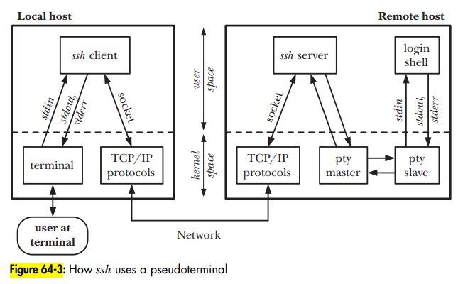
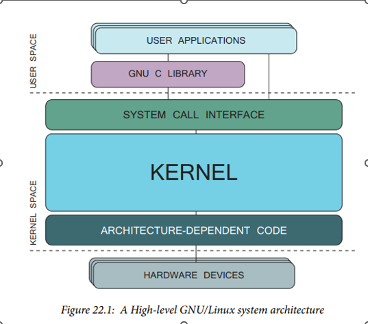
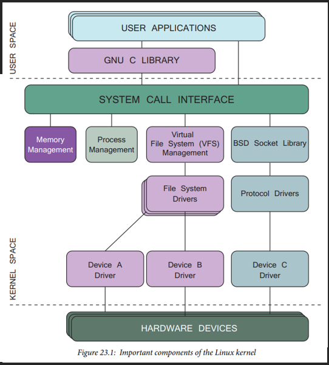
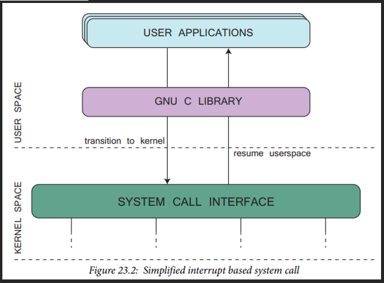

# Linux Fundamentals

- Linux fundamentals notes

## Index

- [Index](#index)
- [Overview](#overview)
- [`.config`](#config)
- [A Linux Distribution](#a-linux-distribution)
- [BSP](#bsp)
- [Build Systems](#build-systems)
- [BusyBox](#busybox)
- [Development Tools](#development-tools)
- [Helpful Utilities](#helpful-utilities)
- [Is Linux Free?](#is-linux-free)
- [Jiffies](#jiffies)
- [Optimization](#optimization)
- [Pseudoterminal](#pseudoterminal)
- [Real Time, Realtime, Process Time](#real-time-realtime-process-time)
- [System and Kernel Architecture](#system-and-kernel-architecture)
- [System Call Interface](#system-call-interface)
- [Use Cases](#use-cases)

## Overview

- Lord Linus Torvald (Finnish CS student at the time) announced Linux in 1991
- Richard Stallman developed GNU in 1983, and Linux’s kernel is built using GNU tools
- Both GNU and Linux were made in retaliation of abundant proprietary software in the 1980’s like UNIX OS developed in 1970’s in AT&T’s Bell Labs
- LSB
  - "linux standard base"
  - Effort to standardize core parts of linux to maintain portability
  - Like POSIX, but just for Linux
  - Includes
    - Filesystem hierarchy
    - Executable formats
    - Init scripts and package behavior
    - C/C++ runtime ABI compatibility
    - Command-line utilities and behavior
- Linux Foundation
  - A non-profit consortium supporting upstream Linux kernel and other open-source projects
  - "promote, protect, and advance Linux and collaborative open-source development"
- Linux has a monolithic structure
  - Kernel is compiled and linked as a statically linked executable
  - Modules can be dynamically linked to a running kernel as needed- that's how device drivers (loadable modules) work

## `.config`

- Configuration file used for building the Linux kernel
- Includes build-time options to choose what features, drivers, and modules are compiled into the kernel
- Lives in kernel source tree, and generated by `make` as you build other parts required before building the Linux kernel

## A Linux Distribution

- Each Linux distro consists of:
- Linux kernel
  - Core of the OS, handles hardware, drivers, scheduling, memory, etc
- User-space utilities
  - Basic GNU tools (coreutils, bash, find, sed, awk, etc)
  - Shells, editors, networking tools, compilers
- System libraries
  - Libc, libstdc++, OpenSSL, etc
- Init system / service manager
  - Systemd, SysVinit, OpenRC, runit, etc
  - Handles boot, services, process supervision
- Optional desktop environment
- Documentation and configuration defaults
  - `/etc` files, default paths, scripts, system policies

## BSP

- Lowest layer of Linux kernel stack is the architecture-dependent code
- BSP includes source files for particular architecture families and processors, common boot support files, DMA hardware interfaces, interrupt handling and other items relevant to a particular processor family

## Build Systems

- We're in the Docker/CMake meta, but could encounter:
- Buildroot
  - Automated embedded Linux build system or kernel, rootfs, and bootloader building

## BusyBox

- An all-in-one executable that provides Unix/Linux command line utilities in a single compact binary `/bin/busybox`
- "The Swiss army knife of embedded Linux"

## Development Tools

- W/ an ethernet port, RS-232 serial interface, and a JTAG connector, you're basically set for anything
- Aside from hardware, you'd need a bootloader to go w/ your Linux image, toolchain for your target, a file system w/ all the packages you need, device drivers for your hardware, development environment, and a Linux kernel source tree w/ associated build files
- > Webster's defines nonsense as "an idea that is absurd or contrary to good sense." It is the author's opinion that developing embedded Linux platforms on a non-Linux/UNIX host is nonsensical
  - _Embedded Linux Primer: A Practical Real-World Approach_

## Helpful Utilities

- `readelf`
  - Reads ELF file structure, including headers, sections, symbols, segments
- `addr2line`
  - Translates addresses (memory offsets, PC values, etc) back to source files names and line numbers
- `ldd`
  - Prints shared library dependencies of an ELF binary
- `nm`
  - Lists symbols (functions, variables, etc) defined or referenced in object files/binaries
- `prelink`
  - Optimizes ELF dynamic linking by precomputing symbol addresses so that shared libraries load faster

## Is Linux Free?

- It's free to install and analyze, but not free to productize
- "free as in freedom", but not "free as in beer."
  - ...If some beer company made their manufacturing and brewing process transparent and we were all allowed to brew the beers on our own and distribute/sell it, that'd be Linux
  - ...So yea it is free beer, but you're the only one responsible for any problems associated w/ your distributed beer, just as anything else you'd distribute and sell
  - There'd also be a viral vow to keep the beer free
- GNU GPL
  - "GNU general public license"
  - "when we speak of free software, we are referring to freedom, not price"
  - License includes:
    - User freedom to run the program
    - User freedom to study and modify the source code
    - User freedom to distribute the original source code and any modifications
    - Viral- same conditions apply to software w/ modifications

## Jiffies

- Refers to the unit of time measured thanks to the resolution of the system software clock

## Optimization

- By default, Linux kernels are compiled w/ `-O2` flag
- Inline functions are crucial to Linux
  - `-O1` is minimum for inline functions
  - ...This means that you can't turn off optimization for single stepping

## Pseudoterminal

- A pair of connected virtual devices (following old terms "master" and "slave") is called a pseudoterminal
- Provides an IPC channel allowing data to be transferred in both directions between two devices
- The slave behaves like a terminal, allowing connection between a terminal-oriented program to slave device and then another program connected to master device to drive the terminal-oriented program
- Used by `telnet` / `ssh`
- 

## Real Time, Realtime, Process Time

- "real time" w/ a space can refer to elapsed time from the "Epoch" (1/1/1970, around UNIX's birth)
  - The 32-bit year 2038 issue arises from this- need more bits
- "realtime", as in whether the kernel executes processes in a predictable and finite matter where deadline failures mean catastrophes, doesn't come up much because Linux isn't realtime
- "process time" refers to total CPU time consumed by a process

## System and Kernel Architecture

- 
- 

## System Call Interface

- 
- An interaction between an application in user space and required service provided by kernel
- SCI provides link between user and kernel space, where user-space apps can’t make prohibited system calls
- W/ interrupts, the process might look like:
  - System calls multiplexed through a single kernel entry point, identifiable by a register as specified and loaded from C library
  - Software interrupt triggered, and interrupt handler executes system_call function
  - Identifying register indexes the system_call_table to trigger the correct system call via SCI
  - Transitions back to user space after returning from system call to continue execution in C library

## Use Cases

- Servers & cloud infrastructure
  - Ubuntu, Debian, CentOS, RHEL, Amazon Linux, Google container Linux, Azure Linux, Fedora CoreOS
- Desktops & laptops
  - Ubuntu, Fedora Workstation, Linux Mint, Debian, Arch Linux
- Containers & DevOps
  - Alpine Linux, Debian, Ubuntu
- Mobile & consumer electronics
  - Android, postmarketOS, LineageOS, Tizen (Samsung), webOS (LG), Fire OS (Amazon), Wear OS (Google)
- Automotive & transportation
  - Automotive Grade Linux (AGL), Android Automotive, Yocto-based Linux, NVIDIA Drive OS, custom Yocto builds
- Embedded & IoT
  - Yocto, Ubuntu, Debian
- Networking & Telecom
  - OpenWrt, DD-WRT, Yocto, VyOS, Ubuntu
- Scientific computing & AI
  - CentOS, Rocky Linux, RHEL, SUSE, Cray Linux Environment, Ubuntu, Debian, Fedora, Arch
- Gaming & entertainment
  - SteamOS, Ubuntu, CentOS Stream
- Industrial, aerospace, & defense
  - Yocto, Wind River Linux, Debian, Ubuntu
