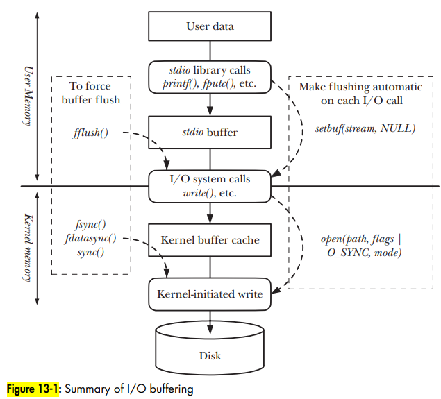

# Linux IO

- Linux IO notes

## Index

- [Index](#index)
- [`udev`](#udev)
- [Buffering I/O](#buffering-io)
- [Device Driver](#device-driver)
- [Device Special File](#device-special-file)
- [Installing and Loading](#installing-and-loading)
- [Kernel Object Format](#kernel-object-format)
- [MTD](#mtd)
- [Nonblocking I/O](#nonblocking-io)
- [Types](#types)
- [Utilities](#utilities)

## `udev`

- A "userspace device manager" that manages dynamic device events
- Manages device nodes in `dev/`
- Thanks to this, we can plug and play USB sticks
- Before udev, the `dev/` directory would be full of directories for all different possible devices

## Buffering I/O

- IO system calls and functions defined in the standard C library are buffer data for speed and efficiency
- The `stdio` library implements the buffering so applications don't have to worry about write sizes, etc
- 
- You can bypass the buffering and run `direct I/O` or `raw I/O` instead

## Device Driver

- Aka, "loadable modules"
- Black box providing a level of abstraction to establish a standardized set of calls to interface w/ various hardware devices
- Isolates user programs from critical kernel data structures and hardware devices
- “modules”
  - Can be added to kernel at runtime
  - Allows you to test driver behavior without rebooting the kernel every time
  - You could also statically compile device drivers w/ the kernel- w/o network drivers, you can't load an image from an NFS server
- Driver format
  - Linux drivers are written to adhere to the POSIX driver format (open, close, ioctl, etc)
- Real vs virtual devices
  - Some devices are actual hardware devices
  - Others are virtual devices that follow the same driver scheme

## Device Special File

- A "device special file" corresponds to a device on the system
- Devices and their associated device drivers are abstracted to files under the universality of I/O

## Installing and Loading

- Modules binaries should be copied to where they would be on a running Linux system
- The Linux build system can take care of this placement
- As for loading and unloading, it's as simple as:
  - `mdoprobe hello1`, `modprobe -r hello1`
  - ^runs open and close functions respectively

## Kernel Object Format

- Loadable modules are compiled to binary .ko ("kernel object") format
- When building the device driver, the source files have to be built against the kernel on which it'll execute
- The best way to do this is to build the module w/in the kernel's source tree

## MTD

- "memory technology device"
- A Linux subsystem that provides a uniform API for raw flash devices like NOR/NAND
- Incorporates and hides hardware realities like wear leveling, erases in large blocks, etc

## Nonblocking I/O

- Blocking I/O is the default, but you could also perform nonblocking I/O
- `O_NONBLOCK`
  - You can pass `O_NONBLOCK` flag when opening a file to have the `open()` function call return a status
  - After the open is successful, a non-blocking scheme is established so that all following IO operations are also non-blocking
- I/O multiplexing
  - When you have a process simultaneously check multiple file descriptors to check whether I/O is possible on any of them
- Signal-driven I/O
  - When the kernel is responsible for sending a signal to a process to notify that a read/write is possible on a particular file descriptor
- `epoll`
  - I/O multiplexing API for Linux

## Types

- Device driver types include:
- Character devices
  - Accessed by a stream of bytes, like a file
  - Driver responsible would perform open/close, read/write system calls
  - Includes serial ports, keyboards, etc
- Block devices
  - Devices capable of hosting a filesystem
  - Linux allows users to interface w/ block devices like character devices, but differ in that kernel itself manages data- the interface is different
  - Includes hard drives, USB flash drives, etc
- Network interfaces
  - Devices concerning transmission of packets of data through a network interface
  - Network drivers don’t know about the type of connection

## Utilities

- `modprobe`
  - Loads module and dependent modules in logical order
- `depmod`
  - To have `modprobe` load all dependencies in a logical way, a `.dep` dependency file has to be created first
- `rmmod`
  - Removes a module from a running kernel
- `modinfo`
  - Provides module info
