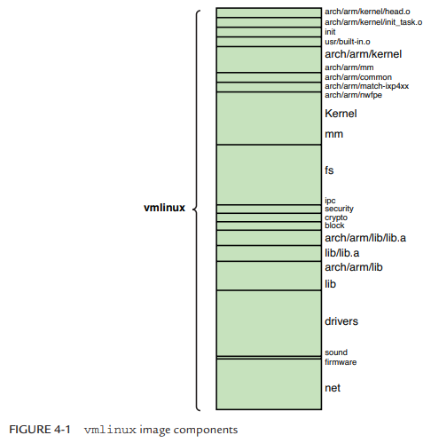
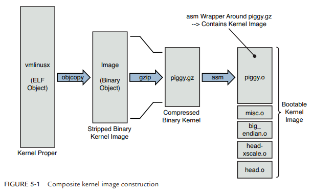
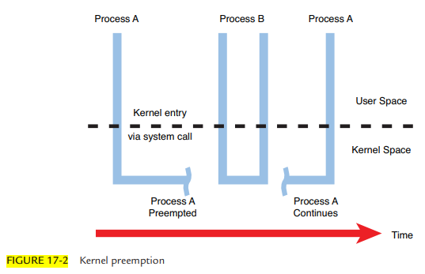

# Linux Kernel

- Linux kernel notes

## Index

- [Index](#index)
- [Binary Parts](#binary-parts)
- [Compression](#compression)
- [Entry Point](#entry-point)
- [Init Process](#init-process)
- [Kernel Panic vs Oops](#kernel-panic-vs-oops)
- [Kernel Subsystem](#kernel-subsystem)
- [O(1) Scheduler](#o1-scheduler)
- [Preemption](#preemption)

## Binary Parts

- 
  - System code, network code, and built-in drivers are the largest parts
  - Kernel code + architecture specific code put together is then the next largest part
  - Some parts include:
    - `.tmp_kallsyms2.o`
      - Kernel symbol table
    - `arch/arm/common/built-in.o`
      - Architecture specific generic code
    - `arch/arm/kernel/head.o`
      - Architecture specific kernel startup code
    - `arch/arm/kernel/init_task.o`
      - Initial thread and task structs required by kernel
    - `arch/arm/kernel/built-in.o`
      - Architecture specific kernel code
    - `arch/arm/lib/built-in.o`
      - Architecture specific helper routines
    - `arch/arm/lib/lib.a`
      - Architecture specific common facilities
    - `arch/arm/mach-ixp4xx/built-in.o`
      - Machine specific code, usually initialization
    - `arch/arm/mm/built-in.o`
      - Architecture specific memory management code
    - `arch/arm/nwfpe/built-in.o`
      - Architecture specific floating point emulation code
    - `block/built-in.o`
      - Kernel block layer core code
    - `crypto/built-in.o`
      - Cryptographic API
    - `drivers/built-in.o`
      - All built-in drivers, not including loadable modules
    - `firmware/built-in.o`
      - Driver firmware objects
    - `fs/built-in.o`
      - File system code
    - `init/built-in.o`
      - Main kernel initialization code
    - `ipc/built-in.o`
      - Interprocess communication code
    - `kernel/built-in.o`
      - Common components of kernel itself
    - `lib/lib.a`
      - Common kernel helper functions
    - `lib/built-in.o`
      - Common library functions
    - `mm/built-in.o`
      - Common components of memory management code
    - `net/built-in.o`
      - Linux networking
    - `security/built-in.o`
      - Linux security components
    - `sound/built-in.o`
      - Sound drivers
    - `usr/built-in.o`
      - Built-in initramfs image
    - ...the takeaway is that there's a whole bunch of stuff, both generic and hardware specific

## Compression

- `vmlinux` is "kernel proper"
  - Kernel proper means that it's core kernel code
    - Excludes bootloader code, optional modules, etc
  - It's the uncompressed, statically linked kernel image in ELF
  - When you build Linux w/ `Make` and don't specify a target, you get a `vmlinux` ELF file
  - Generated when you compile and link the kernel source code
- `Image`
  - `vmlinux` ELF file stripped of notes, comments, and debugging symbols
  - This file is then compressed to `bzImage`, `zImage`, etc
- `bzImage`
  - "big zImage" for x86 architecture
- `zImage`
  - Compressed kernel image for older x86 architecture
- `uImage`
  - U-Boot formatted image
  - Could be `vmlinux` or `zImage` w/ a U-boot header
- `vmlinuz`
  - `vmlinux` compressed in gzip, xz, or some other format for a bootloader to then load to RAM and boot
- `piggy.gz`, `piggy.o`
  - `piggy.gz` is the `Image` file compressed w/ `gzip`, and `piggy.o` is the `piggy.gz` in assembly to be linked w/ other modules that are for architecture/processor specific tasks
  - The piggy name comes from how the kernel image file is piggybacked into `misc.o`
- `misc.o`
  - Routines to initializes the processor and memory regions, decompress the kernel image `piggy.gz`, load the uncompressed image to the right place in system memory, and then pass control to the kernel
  - This is what generates the boot message `Uncompressing Linux... Done`
- Kernel image processing steps
  - 
  - To put this final image into perspective, the boot-up process looks like:
    - BootROM -> 1st stage bootloader -> 2nd stage bootloader loads `uImage` or `zImage` -> Kernel decompressed (misc.o) -> Kernel proper -> User space

## Entry Point

- `head.o` is the kernel entry point
- It's responsible for:
  - Checking for valid processor and architecture
  - Creating initial page table entries
  - Enabling processor MMU
  - Establishing error detection and reporting
  - Jumping to start of kernel proper- `start_kernel()` in `main.c`
- ...Debugging this if there happens to be a hardware errata or something is a major pain
- `main.c`
  - `head.o` passes control to `main.c`, which has the primary kernel startup code
  - Most kernel initialization happens in `start_kernel()`
    - `setup_arch(&command_line)`
      - Runs architecture/machine specific initialization
      - Identifies CPU and calls init functions like `setup_processor()`
    - After architecture setup, the command line is displayed

## Init Process

- The `init` process (created from the `init()` function call) is one of the first processes to spawn, and is the parent of all other Linux processes in the user space
- Has PID of 1
- `start_kernel()` also spawns an initialization process, but becomes idle after doing everything it needs to do

## Kernel Panic vs Oops

- Kernel Panic
  - Linux's system crash- happens in response to a fatal error that can't be recovered from
  - System stops or reboots
  - Occurs in response to:
    - Bug/invalid operation in the kernel (not user space)
    - Corruption in critical system data structures (page tables, process lists)
    - Misbehaving device driver (dereferencing invalid memory)
    - Hardware reports some unrecoverable error
    - Init process fails to start
    - Kernel explicitly calls `panic()` after detecting something fatal
  - Common causes
    - Bad drivers
    - Bad memory access
    - File system corruption
    - Hardware error
    - Misconfigured kernel
    - Security mechanism
- Kernel Oops
  - Error reported by Kernel when something goes wrong in the kernel itself
  - Recoverable unlike kernel panic
  - Logs the error and may kill the process that threw the error, but system can keep running

## Kernel Subsystem

- A "kernel subsystem" is a functional component in the kernel that manages a specific aspect of the OS's resources/behavior
- ...So it's just a way to refer to the OS's modular parts
- "subsystems" under their broad categories include:
  - Process & scheduling
    - Scheduler
    - Signals
  - Memory & storage
    - Memory management
    - Block layer
    - File system
  - Device management
    - Device drivers
    - Device model- `/sys`
  - IO & communication
    - Networking stack
    - TTY / serial / console
  - System services
    - Interrupt handling
    - Power management
    - Security / LSM
  - Architecture support
    - `arch/` and everything under it
  - Initialization
    - `init/` and everything under it

## O(1) Scheduler

- The time it takes for the scheduler to make a decision isn't a function of the number of processes running

## Preemption

- Linux kernel wasn't originally preemptible- if a process was requesting work from the kernel, then other processes can't until the process is either blocked or done w/ the kernel
- To make the kernel preemptible, all critical sections were guarded
- Low preemption latency is critical... major causes of delays are usually:
  - Interrupt context processing
  - Critical section processing where interrupts are disabled
- 
