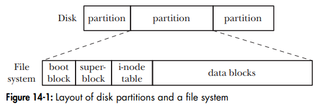
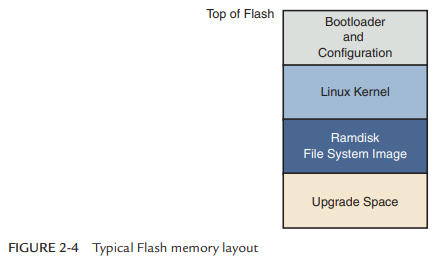

# Linux Memory

- Linux memory notes

## Index

- [Index](#index)
- [`alloca()`](#alloca)
- [Disk Partitions](#disk-partitions)
- [High and Low Memory](#high-and-low-memory)
- [Memory Mapping](#memory-mapping)
- [OOM Killer](#oom-killer)
- [Program Break](#program-break)
- [Typical Flash Layout](#typical-flash-layout)

## `alloca()`

- Allocates stack memory dynamically
- Possible because a function at any point in time is at the top of the stack frame
- Helps if you need large blocks of memory that's for temporary usage

## Disk Partitions

- Disks are divided into multiple partitions
- The kernel treats each partition as a separate device under the `/dev` directory
- Each partition usually contains either:
  - A file system holding regular files and directories
  - A data area accessed as a raw-mode device
  - A swap area used by kernel for memory management
- 

## High and Low Memory

- 32-bit Linux systems back in the day were only able to support 4GB memory- 3GB upper addresses for user space, and 1GB for kernel
- Linux kernel’s virtual addresses are divided into high/low memory to work w/ limited memory
- Low memory
  - Memory for which logical addresses exist in kernel space
- High memory
  - Memory for which logical addresses do not exist- lies beyond address range defined for kernel address space
  - Special page tables required to map high memory into kernel’s address space… expensive operations w/ limit to number of high-memory pages mapped at a time
  - Core of kernel is kept in low memory, and high memory is used just for some kernel tasks and process pages

## Memory Mapping

- As in, the `mmap()` call when a process requests some of its virtual memory be memory mapped
- "mapping" in Linux context means allocating RAM for a particular purpose
- Two types:
  - File mapping
    - Maps a region of a file into the calling process's virtual memory
  - Anonymous mapping
    - No file- just allocating RAM to something just like you'd allocate heap w/ `malloc()`
- Private vs shared
  - Sharing a memory mapped region w/ other processes is controlled by whether the region is private or shared

## OOM Killer

- If available virtual memory becomes exhausted, the kernel can attempt to free memory by killing processes
- The kernel code to make that process selection is called the "out-of-memory killer"
- Processes are more likely to be killed if
  - They are consuming a lot of virtual memory
  - It has many child processes w/ high priority
- Processes are less likely if
  - They're privileged
  - They're performing raw device access
  - They've been running for a long time or have consumed a lot of CPU time

## Program Break

- Refers to the current boundary between a process's heap and unallocated region in virtual memory
- The `brk()` and `sbrk()` function is used to allocate more heap space

## Typical Flash Layout

- 
