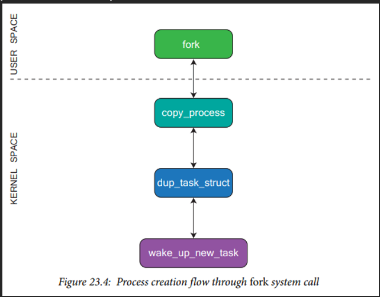
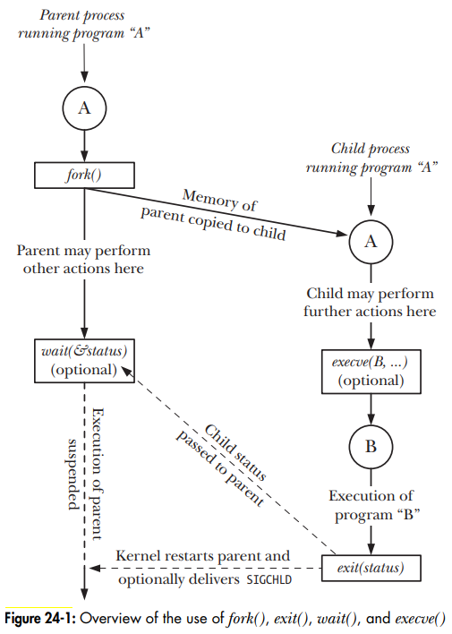
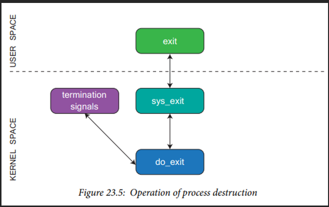
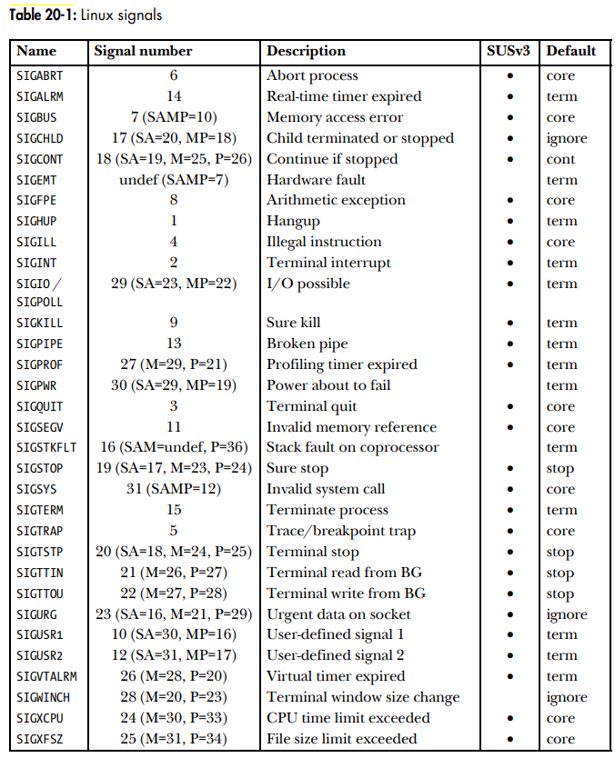

# Linux Process

- Linux process notes

## Index

- [Index](#index)
- [Overview](#overview)
- [`task_struct`](#taskstruct)
- [Capabilities](#capabilities)
- [Directory Attributes](#directory-attributes)
- [Fork](#fork)
- [Freeing Memory](#freeing-memory)
- [Key Functions](#key-functions)
- [PID](#pid)
- [Privileged Process](#privileged-process)
- [Process Termination](#process-termination)
- [Resource Limits](#resource-limits)
- [Scheduling and Priorities](#scheduling-and-priorities)
- [Signals List](#signals-list)
- [UID, GID](#uid-gid)

## Overview

- A “process” is a computer program in operation, allocated its own memory space, etc
- The Linux process scheduler manages various processes existing in the system based on their priority level- chooses process to run based on history and loading
- Processes are created in the user space either through
  - Execution of a program (entirely new process)
  - A program using the fork system call (creating a child process)

## `task_struct`

- Structure used to represent processes
- Contains data required to represent associated parent/child processes
- Includes:
  - Process state of execution
    - Running, sleeping, sleeping but not interruptible, stopped, etc
  - Flags
    - Process creation, exiting, memory allocation
  - Process priority
    - Lower value means higher process priority
    - Dynamic and based on several factors…
  - Process address space

## Capabilities

- Privileges of a superuser are divided into "capabilities", where each capability can be toggled on/off for each process
- Keeping permissions of individual processes narrow allows for the effects of potential breaches to be mitigated too
- Each process has 3 sets of capabilities:
  - Permitted
    - Capabilities that a process could employ
    - Can't be reacquired if a process decides to drop them
  - Effective
    - Capabilities used by the kernel to perform privilege checking
    - As long as a capability is under the "permitted" set, it can be enabled/disabled in the "effective" set
  - Inheritable
    - Capabilities that can be carried over to the permitted set in programs executed by the process
- A program can either be:
  - Capability-dumb
    - No awareness of what the program is capable of doing
  - Capability-aware
    - Is aware of capability framework, and does work to raise/drop capabilities

## Directory Attributes

- Each process has two directory-related attributes:
  - Root directory from which absolute paths are determined
  - Current directory from which relative paths are determined

## Fork

- The response to a fork system call looks like:
  - 
  - `copy_process`
    - Creates a new process as a copy of the parent
    - Asks Linux Security Model to ensure it has permission to create new tasks, and initializes task_struct
  - `dup_task_struct`
    - Allocates new task_struct for the process and copies process descriptors to this structure
  - `wake_up_new_task`
    - Initializes scheduler information and places created process in a run queue
- Child processes inherit the parent's environment list and resource limits

## Freeing Memory

- ...When a process terminates, all dynamically allocated memory is freed
- This assumption lets an API call less `free()`'s and get away w/ it, but it's better practice to explicitly call `free()`
  - Both for readability and for debugging tools to not catch unhandled `malloc()`'s as memory leaks

## Key Functions

- `fork()`
  - Allows one process (parent) to create a new child process
  - Child processes are duplicates of their parents
  - After calling `fork()`, it's undefined whether the child or parent has the CPU first
- `exit()`
  - Terminates the process- this is abnormal termination
  - If a process terminates expectedly, it's from a `_exit()` call
- `wait()`
  - Suspends execution of the process until a child has terminated, and returns its status after termination
- `execve()`
  - Loads a new program to process's memory discarding everything about the current process (text, stack, data, heap)
  - This is called "execing" a new program
- 

## PID

- Each process has a PID (“process identifier”)
  - Number used to uniquely identify each process in a system
  - Number is reused for new processes after process is terminated

## Privileged Process

- Process where effective user ID is 0- so the superuser
- Can bypass all kernel restrictions
- A shell started by the root user, a process created by a privileged process, or a process w/ a set-user-ID of 0 are privileged processes

## Process Termination

- 
- All termination methods call the kernel do_exit function- eradicates all references to the process from OS
- Exit_notify function provides notification before process state is altered to `PF_DEAD`
- Methods include
  - Normal process termination
  - Termination through transmission of special signal
  - Exit system call

## Resource Limits

- Processes have limits on resource usage (open files, memory, CPU time, etc)
- Soft limit
  - Limit of the amount of a particular resource the process can consume
- Hard limit
  - Ceiling limit that a soft limit can be adjusted to

## Scheduling and Priorities

- Processes are scheduled by the Linux kernel w/ round-robin time-sharing by default
- Each process gets a "time slice" or "quantum" of CPU time
- Processes also have a "nice value" attribute from -20 (high priority) to +19 (low priority) for if you need to give particular processes more time
  - Low priority processes are guaranteed not to starve, but will receive less CPU time

## Signals List

- 

## UID, GID

- Each user account has an associated UID (user ID) and GID (group ID)
- Each process has a set of UIDs and GIDs:
  - Real UID/GID
    - Identifies which user and group the process belongs to
  - Effective UID/GID
    - Used to determine the permissions granted for a process when running operations
    - Can be modified to be different from real UID/GID via system calls and running `set-user-ID`/`set-group-ID` programs
    - `set-user-ID`/`set-group-ID` programs should be eliminated whenever possible to close doors for buggy processes w/ root privileges causing issues
