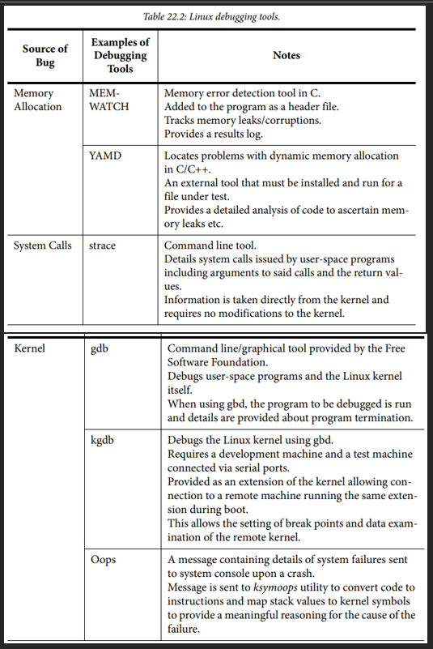

# Linux Troubleshooting

- Linux troubleshooting notes

## Index

- [Index](#index)
- [Overview](#overview)
- [`printk`](#printk)
- [`ps`](#ps)
- [`strace`, `ltrace`, `mtrace`](#strace-ltrace-mtrace)
- [Core Dump](#core-dump)
- [Hardware Specific Initialization](#hardware-specific-initialization)
- [Interrupt Off Timing](#interrupt-off-timing)
- [JTAG](#jtag)
- [KGDB](#kgdb)
- [Magic SysReq Key](#magic-sysreq-key)
- [Memory Allocation](#memory-allocation)
- [Multiple Processes/Threads](#multiple-processesthreads)
- [Soft Lockup Detection](#soft-lockup-detection)

## Overview

- 

## `printk`

- Kernel-space equivalent of `printf`
- Can be called from almost any context including ISRs
- The only problem is that you need a serial console, and that the prints are only shown late in the boot sequence
  - For a while before console device is initialized, all print strings are stored in a buffer to be flushed
  - If you don't see output, you can create a dump to view the `printk` buffer contents

## `ps`

- Displays running process information
- Includes CPU/memory usage and state
- Good for catching zombie processes, resource hogs, etc

## `strace`, `ltrace`, `mtrace`

- `strace`
  - Monitors all arguments to a particular system call and its corresponding return values directly from Kernel to identify which call is causing issues
  - For troubleshooting user space to kernel interactions
- `ltrace`
  - Monitors all library function calls like things in libc
  - For troubleshooting user space to standard library interactions
- `mtrace`, `muntrace`
  - Memory allocation tracing- intercepts `malloc()` and `free()`

## Core Dump

- Generated by the kernel when an application program generates a fault
- `SIGSEGV` (segmentation fault from illegal memory access by user process) is the most common causes of a core dump being generated

## Hardware Specific Initialization

- If you're adding hardware specific initialization code, have it run after the kernel's already booted
- Troubleshooting code before the kernel, stack, and memory are ready is a major pain

## Interrupt Off Timing

- As we know, disabling interrupts is horrible and sows the seeds to numerous issues
- You can enable the `IRQSOFF_TRACER` to measure the time that interrupts are off

## JTAG

- Hardware-level debugging interface that we know and love
- Allows full control of a processor regardless of OS
- ...For early kernel code where resources aren't initialized, or when the OS doesn't boot at all, JTAG is the way to go

## KGDB

- Extends GDB to kernel-space debugging to attach GDB to a running Linux kernel
- Usable over serial, ethernet, JTAG
- Can be used to single-step kernel, debug drivers, inspect kernel data structures, set breakpoints in kernel space
- ...can't be used for early kernel code due to how KGDB isn't initialized until low-level hardware initialization code is done running

## Magic SysReq Key

- Special key combination understood by kernel for emergency recovery / diagnostics even when the system is unresponsive
- Good for creating dumps, emergency debugging when kernel hangs, entering KGDB remotely
- ...In exchange, may cause data loss or system corruption if abused

## Memory Allocation

- `dmalloc`
  - Detects heap corruption, double frees, leaks, invalid accesses
  - A lot more intrusive than `mtrace`
- `mprobe()`, `mcheck()`
  - Heap consistency checking
  - `MALLOC_CHECK_` environment variable allows these functions to work
- MEMWATCH
  - Source-level wrapper for memory allocation debugging
- YAMD
  - “yet another malloc debugger”
  - Binary/runtime instrumentation
  - Not for embedded due to high intrusiveness

## Multiple Processes/Threads

- Multiple Processes
  - Processes could either have independent address spaces, or share a single address space
  - If you have independent processes, you need multiple debug sessions
  - GDB's behavior in response to a process creating a child process can be defined w/ a macro
- Multiple Threads
  - If an application uses pThread, GDB has some added debugging features

## Soft Lockup Detection

- `DETECT_SOFTLOCKUP` can be enabled to detect long periods of running in kernel mode without a context switch
- Good for finding high-latency paths and deadlocks
