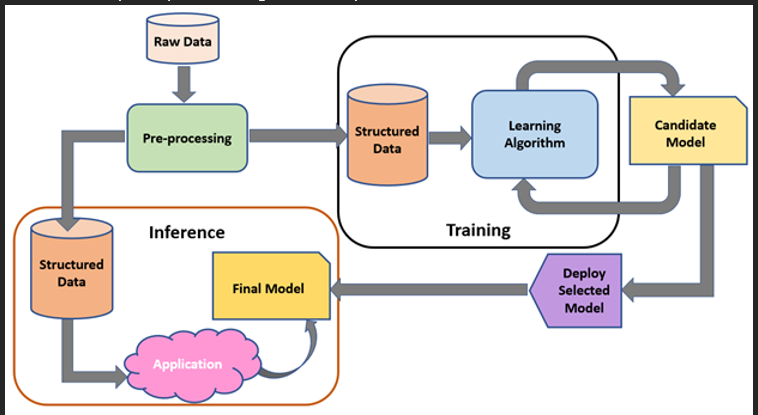
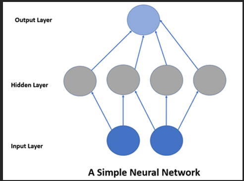

# Machine learning

- Machine learning notes

## Index

- [Index](#index)
- [Overview](#overview)
- [Embedded Application](#embedded-application)
- [Intelligent Edge](#intelligent-edge)
- [TinyML](#tinyml)

## Overview

- Microchip link here: https://developerhelp.microchip.com/xwiki/bin/view/applications/machine-learning/basic-machine-learning-workflow/
- 
- Workflow to establish an ML model for a project includes:
  - Identification
    - Identifying the problem, item to predict, data to collect, and classification of the problem to choose an ML model (classification, regression, ranking, etc)
  - Datasets
    - Further classify and prepare data needed
    - Data preparation could include selection, collection, and labeling
  - Model architecture
    - ML algorithm undergoes “training” to build a system model based on input data
    - “inferences”/predications are made when new data is fed to the system model created
  - Training
    - Process of feeding data through a model and making adjustments until predictions are accurate
    - Model can be a network of simulated neurons:
    - 
  - Model conversion
    - Google’s TensorFlow is a famous tool to run ML models
      - Models that are loaded and executed via the TensorFlow interpreter are meant to run on desktop computers and servers though…
    - TensorFlow Lite is a much smaller interpreter for embedded devices
      - Once a model is converted to TensorFlow Lite format and saved to memory, it can be loaded and executed
      - The converter is called “TensorFlow Lite Converter”
  - Run inference
    - Models can be executed via the TensorFlow Lite MCU C++ library to start making predications
    - Can take raw input from sensor data to transform the data to whatever form the model was trained on, to then pass to the final model to run an inference
    - Output contains predictions
  - Evaluate and troubleshoot
    - Training data that doesn’t represent real operations can cause bad predictions
    - To create an ideal system model:
      - Remove irrelevant issues as factors to be troubleshooted separately (bad sensors, unexpected noise, etc)
      - Collect data generated during inference w/ training data to compare to expected results
      - Retrain w/ more data and rerun inference

## Embedded Application

- Machine learning / AI on limited hardware using things like TinyML / intelligent edge AI is a thing
- Model compression & quantization
  - “Pruning” is removing redundant part of a network
  - “quantization” is reducing data precision
  - Both allow complex data precision to fit in limited hardware
- Small/efficient model architectures
  - Many architectures optimized for limited embedded systems:
  - MobileNet
    - Optimized for image processing
  - EfficientNet
    - Famous for high accuracy in image classification / reduced parameter sizes
  - Tiny YOLO
    - Also optimized for image processing
  - SqueezeNet
    - Provided “AlexNet-level” accuracy w/ limited parameters?
  - LTSM Networks and GRUs
    - “Long short-term memory” and “gated recurrent units”
    - Optimized for speech recognition, predictive maintenance, and anomaly detection
  - DeepAR and TCN
    - “temporal convolutional networks”
    - Optimized for time-series forecasting and real-time prediction
      - Ie predictive maintenance, energy monitoring, agriculture applications
  - Quantized and Pruned CNNs
    - Used when CNN are needed, but hardware is limited computation power
  - TinyML -optimized Frameworks
    - Used to deploy AI/ML on microcontrollers, including TensorFlow Lite and Edge Impulse
    - TensorFlow Lite
      - Extension to TensorFlow to get ML running on edge devices
      - Made by Google
      - Supported on Android, iOS, Raspberry Pi’s, MCUs
      - Toolkit to deploy TensorFlow on edge devices
    - Edge Impulse
      - Platform that also gets ML running on edge devices
      - Enables “embedded ML”, aka TinyML on edge devices
      - Full-stack platform w/ IDE to develop around TinyML

## Intelligent Edge

- Integration of AI, data processing, and analytics capabilities close to the source of data generation (at the edge of the network instead of at a central data center)
- Aka using cracked local hardware to avoid sending data to some giant processor over a network

## TinyML

- Deploying machine learning models on resource-constrained devices (MCU’s, edge devices, etc)
