# Serial Communication Protocols

- Serial communication protocol notes

## Index

- [Index](#index)
- [1-Wire](#1-wire)
- [CAN Controller](#can-controller)
- [FIFO Buffers](#fifo-buffers)
- [I2C](#i2c)
- [I2C vs SPI vs UART](#i2c-vs-spi-vs-uart)
- [Parallel to Serial](#parallel-to-serial)
- [PCI](#pci)
- [PPP](#ppp)
- [SerDes](#serdes)
- [SPI](#spi)
- [UART](#uart)
- [VM and Windows OS Connection](#vm-and-windows-os-connection)

## 1-Wire

- Made by Dallas Semiconductor (now Maxim Integrated, under Analog Devices)
- Uses a single data line + ground to transfer data between master and slave devices
- Power can come from separate line, or parasitic power from data line itself
- ~16kbps to 142kbps in overdrive mode (very slow compared to other serial communication methods)
- Applications
  - IButton
    - ESDL flashbacks
    - Access control, asset checking, time clocks, etc
  - Temperature sensors
  - Authentication & security
  - Small EEPROM / memory devices

## CAN Controller

- “controller area network” controller 🙃
  - Atm machine, chai tea
- Serial bus protocol used in automotive industry to have devices in a car communicate w one another
- ...Now it's used in industrial automation and control applications
  - Two-wire
  - Half-duplex
  - Varying speeds depending on twisted wire pair length:
    - 40m @ 1Mbps
    - 500m @ 125 kbps
- 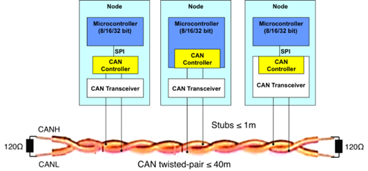
- Developed by Bosch and standardized in 1993
- Used for:
  - Passenger cars, building automation, trucks/buses, industrial machine control, lifts/escalators, trains, maritime electronic systems, aircraft/aerospace electronics

## FIFO Buffers

- FIFO buffers are implemented in hardware for various interfaces like
  - UART, USART, USB, SPI, I2C, DMA, ADC transfer
  - Hardware FIFOs increase transfer efficiency and ensure reliable communication
  - Allow for interrupt handling to let CPU handle the data just when data is available/empty

## I2C

- “inter-IC”, or “inter-integrated circuit”
- I2C invented by Phillips Semiconductors (now NXP Semiconductors)
- Uses SDA & CLK, also known as “two wire” interface
- Overview
  - Serial, 8-bit oriented, bidirectional transfers
  - Controller vs target
    - I2C uses “controller” and “target” in place of master/slave
    - A controller is capable of either writing or reading to/from the target
  - Two pins
    - SDA
      - “serial data line” - Serial DAta (line) I guess
    - SCL
      - “serial clock line”
    - Both pins are pulled up w/ pull-up resistors, and device pins should be open-collector or open-drain to let go of the pin to the resistors when not in use
    - Allows for “wired-AND” function
  - Addressing
    - Every device on the SDA bus has a unique address
    - Addresses could be 7-bit or 10-bit
    - The 8th bit in an address (both 7/10 bit formats) includes the read (1) & /write (0) bit indicating whether the transaction is for a read or write
    - 10-bit format not widely used, but good if more addresses needed
    - Reserved addresses:
    - 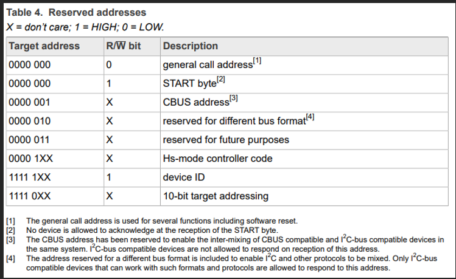
  - Collision detection and arbitration
    - If multiple devices forcefully try to assert the SDA line, then the first device to assert the bus wins the arbitration
  - Features by system and parts
    - 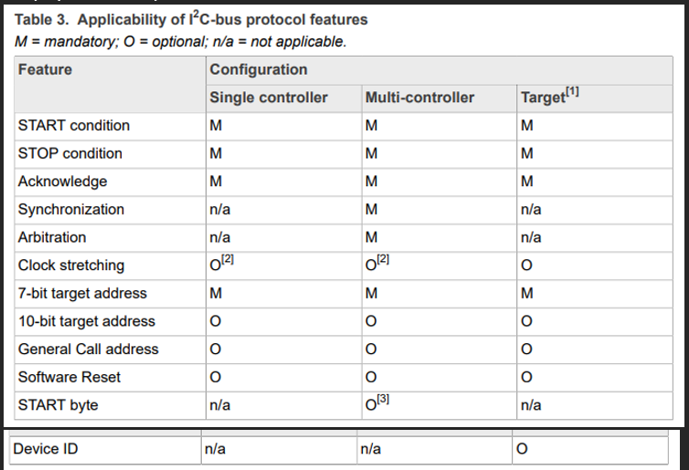
    - 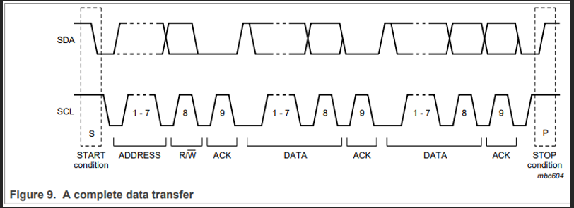
    - START/STOP
      - Transition on SDA indicates START/STOP
      - START = HIGH -> LOW
        - Same for “repeated start” when transmission needs to continue
      - STOP = LOW -> HIGH
    - Data
      - All bytes on SDA are followed by acknowledge bit
      - Data is transferred MSB first
      - MCU can hold CLK LOW to make it wait if it’s busy (servicing an interrupt or something)
    - ACK/NACK
      - Transmitter lets go of SDA after each byte to let receiver pull SDA LOW to confirm that the data was received
      - If receiver lets SDA stay HIGH after a byte, it’s called a NACK
      - MCU can try to start again or stop if a NACK is observed
    - Clock synchronization
      - All devices on the SCL bus can drive it, but all devices are synchronized by AND’ing the signals on the bus to get the longest LOW period and the shortest HIGH period
    - Arbitration
      - If multiple devices are trying to write on the SDA bus, each of the devices will wait to see a LOW when it should be seeing a HIGH - the first device to observe this turns off their output
    - Clock stretching
      - If a device needs to wait it can again hold the SCL low to make devices wait
    - General call address
      - Used to talk to all devices on SDA bus
      - Optional
    - Software reset
      - Using a general call and then a 0x06 indicates a software reset
      - Optional
    - Device ID
      - Optional 3-byte read-only word providing:
      - 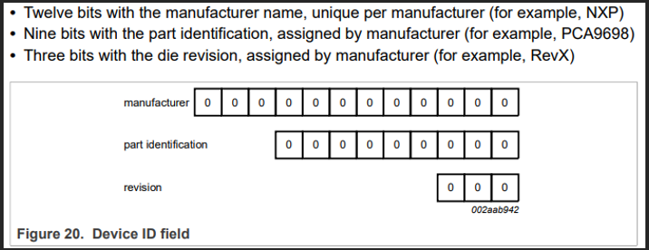
  - Provided the MCU is trying to talk to some other device, we need the device’s “slave address”
  - If reading from slave device, we then also need the offset in addition to slave address to know where we’re trying to read in the device
- I2C variants
  - For if they ever come up…
  - 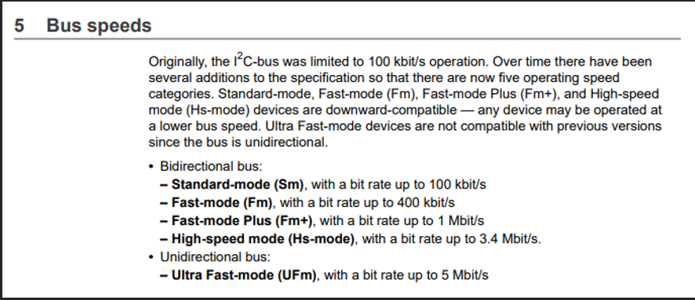
    - Various bus speeds here
  - FM, FM+
    - “fast mode”, “fast mode +”
    - Allows for faster rates at 400kb/s and 1Mb/s respectively
  - Hs
    - “high speed” mode
    - Up to 3.4Mb/s
  - UFm
    - “ultra-fast mode”
    - Up to 5Mb/s
  - SMBus
    - “system management bus”
    - Subset of I2C used for communication between that deal w/ IO between motherboard and sensor devices
    - Has strict electrical and timing specifications than regular I2C
    - Sound like it would be tied to VPX system management, but not
      - I2C is what’s used by system managers to interface w/ hardware like sensors, but a system doesn’t have to utilize SMBus
      - It could though…
    - PMBus
      - “power management bus”
      - Also based on I2C
      - Standard designed for power supply management in compute rand telecommunications systems
      - Used between power controllers, power supplies, and other power components
  - PEC
    - “packet error checking”
    - Optional extension to add checksum to every packet
  - I3C, or MIPI I3C
    - “improved inter-integrated circuit”
    - Supports multi-drop and in-band interrupts to offer higher performance

## I2C vs SPI vs UART

- I2C
  - SPI but w/ half-duplex in exchange for less wires
    - Well not really but hardware wise (and overview wise ignoring protocol details)
  - Supports multiple devices
  - Includes addressing/acknowledgement scheme
- SPI
  - Fast full-duplex communication
  - Supports multiple devices
  - Simple protocol w/ no acknowledgement
- UART
  - Low speed full-duplex point-to-point communication
  - Doesn’t support multiple devices
  - Even simpler than SPI

## Parallel to Serial

- Common parallel interfaces:
  - GPIO
    - In a sense a collection of GPIO pins is a parallel interface
  - SRAM, NOR flash, SDRAM / DDR2 - 4
    - Modern memory interfaces are still parallel
  - PATA
    - What came before SATA
  - Parallel printer port
    - What came before USB
- Serial beat parallel
  - Due to the physics of managing a bunch of wires in parallel, serial beat parallel in speed
  - Signal skewing from physical wire diffs, crosstalk/EMI, and distributing a clean clock at high speeds across many pins all pull down parallel interfaces below serial
  - Memory is still interfaced in parallel
    - To interface w/ memory in parallel while maintaining speed, memory devices are kept close to whatever is interfacing w/ it

## PCI

- “Peripheral component interconnect”
- Connects peripheral (IO) devices to computers
- Classic PCI
  - Started as a parallel bus
  - Introduced 1992
  - Shared bus w/ multiple devices connected
- PCI-X
  - “PCI eXtended”
  - Introduced 1998
  - Still parallel bus
  - Standard for PCI’s that enhance PCI for higher bandwidth often demanded by servers and workstations
- PCIe
  - PCI Express
  - Main standard for expansion cards for PCs
  - 2003 - today
  - Redesigned to be serial point-to-point links, where each "lane" has two differential pairs
  - Each device has its own dedicated link to the root complex
- CPCI
  - “compact PCI”
  - Same as PCI, but uses “Euro 3U/6U format w/ 2mm connectors”
  - It’s adapted for rugged applications
  - Introduced in 1990s by PICMG to bring desktop PCI technology into rugged, embedded, telecom/industrial systems
  - Classic parallel PCI signaling
- VPX
  - Standardized by VITA in mid-2000s
  - Evolved from VMEbus systems, another popular bus for defense/aerospace applications
  - Ruggedized serial fabric (often PCIe) successor to parallel VME
  - So often supports PCIe, w/ integrated support (serial fabric) for Ethernet, Serial RapidIO, InfiniBand, etc
  - Adds mechanical form factor standard, backplane topology standards, cooling methods, etc

## PPP

- “point-to-point” protocol
- Used in Layer 2 (data link layer) so it’s for passing around messages formatted in frames between network hosts on a local network
- A device is named a “PPP server” for “PPP clients” to connect to so the two devices can send/receive messages to each other
- PPP on Linux
- MAN page
  - Https://linux.die.net/man/8/pppd
- PPP daemon
  - A program that works w/ Linux kernel PPP driver to establish & maintain a PPP link w/ another system
  - Check installation:
    - `dpkg -l | grep ppp`
  - Install ppp daemon:
    - `sudo apt-get install ppp`
  - Configure PPP:
    - `sudo nano /etc/ppp/peers/myppp`
      - (this’ll open an editor to the PPP file)
    - Edit the file that pops up for configuration:
    - 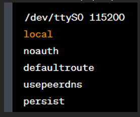
    - Sample configurations:
      - `sudo pppd /dev/ttyS4 115200 192.168.3.2:192.168.3.1 nocrtscts nodetach local debug silent noaccomp nopcomp nobsdcomp noipv6 noccp novj noauth name server remotename client connect 'chat -v -f /etc/ppp/win.chat' lcp-echo-interval 0`
  - Create secrets file
    - Stores login credentials
    - `sudo nano /etc/ppp/pap-secrets`
    - Format:
  - 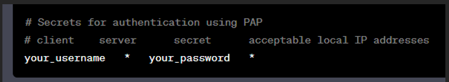
  - Establish connection
    - `sudo pppd call myppp`
  - You can terminate the connection w/ ctrl + c to stop ppp
  - Check for processes associated w/ PPP and respective PID
    - `ps -ef | grep pppd`

## SerDes

- “serializer/deserializer”
- System for devices/components to communicate w/ one another serially
- High-speed serial links
- Reduced pin count, but can transmit at multi-giga/tera bit per second
- Equalization
  - Used to compensate signal loss/distortion over long and high frequency links
- Used everywhere for ICs (MCUs, FPGAs, memory devices, networking ICs), PCIe, SATA, USB, HDMI, etc
- Used as a wrapper to convert parallel serial interfaces into a fast serial interface- uses less pins at the cost of communication speed

## SPI

- “serial peripheral interface”
- ...An older term is SSI, or "synchronous serial interface"
- Invented by Motorola
  - Freescale Semiconductors was originally a part of Motorola, but then NXP acquired it
- SPI lacks a well-defined standard (unlike I2C), so you hear about manual SPI implementations via bit-banging a lot
- Overview
  - Synchronous serial peripheral interface (works w/ a clock signal)
  - 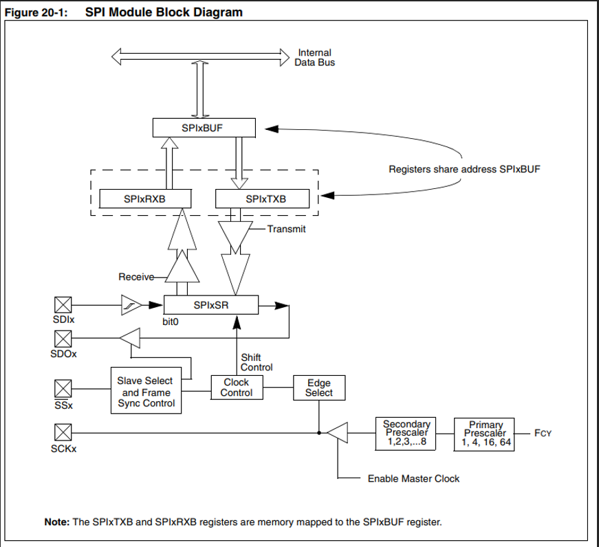
  - Consists of 3 memory mapped SFR’s (“special function registers”)
    - SPIxBUF
      - Register where send/receive data is stored
      - Shared by SPIxTXB and SPIxRXB (both are unidirectional 16 bit registers)
  - Double buffering allows for continuous transmit/receive
    - SPIxCON
      - Control register that configures interface for different modes
    - SPIxSTAT
      - Interface status register
  - 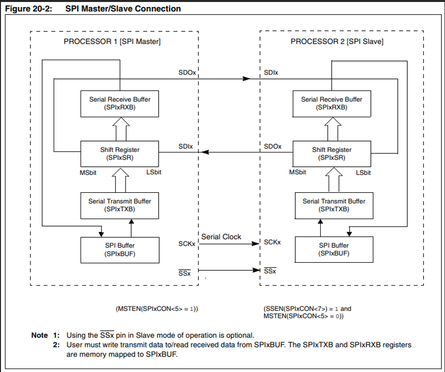
  - Four signal pins:
    - 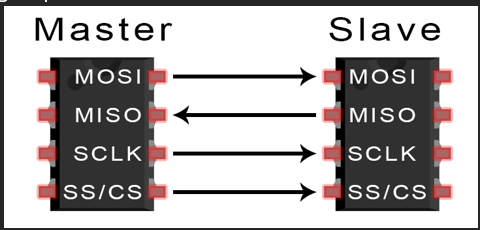
    - MISO MOSI confusion
      - “master in slave out”, “master out slave in”
      - This naming convention exists to clarify how pins are connected together
      - Removes ambiguity of whether input of one should go to output of other
      - When using SDI/SDO convention, SDI should hook to other device’s SDO
    - SDIx
      - “serial data input”
    - SDOx
      - “serial data output”
    - CS, or /SSx
      - “chip select”, “slave select”
      - Active low to select slave
      - Can operate w/o slave select if desired
    - CLK, or SCKx
      - Clock, “serial clock”
  - Operation modes
    - 8-bit/16-bit data transmission/reception mode
      - A clock pulse required per bit transmitted/received
    - Master/slave mode
      - Master mode
        - Clock signal is generated only when master is transmitting data
      - Slave mode
        - Data is transmitted/received only when there’s a clock input
        - The CS/SS pin allows for “slave select synchronization” - if this feature is enabled then slave transmit/receive will only be possible when the CS/SS pin is low
    - 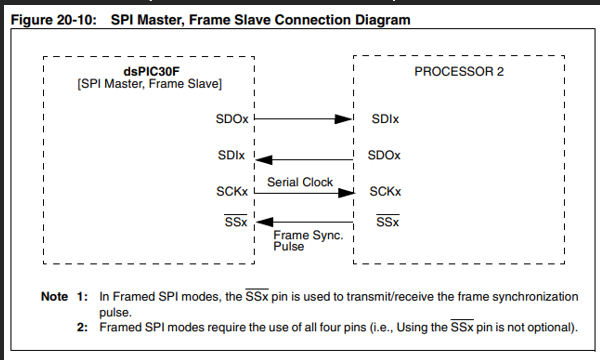
    - Framed SPI mode
      - This is where an additional frame signal is used to indicate where data starts and ends to avoid reading garbage
      - If CS/SS isn’t used, sometimes it’s used as a frame signal instead
- Other SPI variants
  - QSPI
    - “Quad Serial Peripheral Interface”
    - SPI designed specifically for flashing chips
    - Useful for when there is a lot of memory to flash
    - Can be used to store code externally and operate on it as fast as internal memory
    - Often used w/ ADCs
    - Uses data queues w/ pointers that allow data transfer without a CPU
    - Uses four lines (IO0, IO1, IO2, IO3)
    - 4 bits per cycle as name implies
  - DSPI
    - “dual SPI”
    - 2 bits per clock cycle
  - MSPI
    - “multi IO SPI”
    - Supports multiple IO lines for faster transfer
    - Often used w/ NOR flash
  - SPIFI
    - “serial peripheral interface flash interface”
    - Designed specifically for interfacing flash memory devices
    - Allows MCUs to boot off of their flash memory
  - HyperBus
    - Combines SPI and LPC (low-pin-count) parallel interface for faster transfer and simple interface
    - Used in memory and storage devices like NOR flash
  - Serial Quad Interface
    - Uses four data lines similar to QSPI
    - Used for memory and storage applications

## UART

- “universal asynchronous receiver transmitter”
- Invented as a part of RS-232 standard
- Full duplex 8/9 bit transmission
- Even/odd/no parity options
- 1/2 stop bits
- Overview
  - 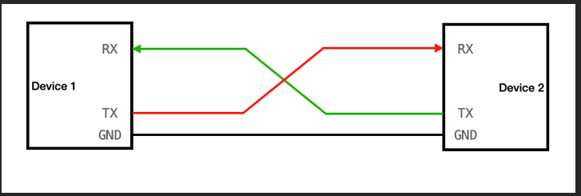
  - Two pins + two optional pins
    - RX
      - Receive signal
    - TX
      - Transmit signal
    - /CTS
      - “Clear to send” signal for handshaking
    - /RTS
      - “request to send” signal for handshaking
  - Transmit/receive
    - Format for receive/transmit is:
      - 1 start bit
      - 5/6/7/8 data bits
      - 1 optional parity bit
      - Transmit- 1/1.5/2 stop bits
      - Receive- 1 stop bit
  - Baud rate
    - 115200 bps used widely across various devices
    - 1.8432MHz clock divides nicely down to 115200bps
    - Many serial to USB adapters support 115200bps
- Serial COM
  - COM (for “communication”) ports are ports on computers available for devices to communicate w/ other devices either serially or parallel
  - Can be physical or emulated
    - A virtual serial COM port is emulated via software if a serial COM port isn’t physically available
    - …we emulated a COM port using the LPC54628
  - Adapter can adapt to USB to UART to send serial data from USB to serial port like DE-9
    - Popular “DB-9”’s actual formal designation is “DE-9”
    - Also used for VGA, RS232, etc
      - VGA- “video graphics array”
      - RS- “recommended standard”
  - 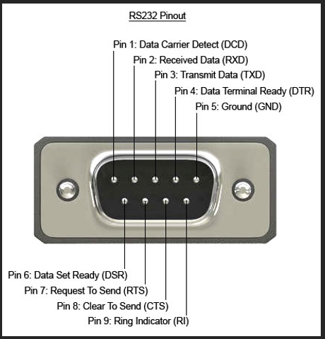
  - Looking into the “data carrier detect” and associated info
    - DTE (“data terminal equipment”) refers to the serial COM port on a PC, and DCE (“data communication equipment”) refers to a modem or some other communication device
    - The serial COM port has a carrier detect pin (DCD pin in the picture above) used to indicate whether there’s a communication device connected
  - DE-9 Pinout explained
    - DCD
      - “data carrier detect”
      - Indicates that a data carrier signal is present- usually used to detect a modem on a connection
    - RXD
      - “receive data”
      - Where data’s received for serial communication
    - TXD
      - “transfer data”
      - Where data is transmitted for serial communication
    - DTR
      - “data terminal ready”
      - Indicates that a data set (usually a modem) is ready to establish a connection
    - GND
      - “ground’
      - Provides ground reference for circuit
    - DSR
      - “data send ready”
      - Indicates that a data set (usually a modem) is ready to establish a connection
    - RTS
      - “request to send”
      - Used to request permission to send data\
      - Used for “hardware flow control”
    - CTS
      - “clear to send”
      - Used to grant/deny permission to send data
      - Used in “hardware flow control”
    - RI
      - “ring indicator”
      - Indicates a ringing signal is being received
  - Hardware flow control
    - This is when RTS and CTS lines are used to send/receive data
    - RTS = HIGH indicates ready to send data, CTS = HIGH indicates ready to receive, sender starts transmitting and receiver receives data
    - When hardware flow control isn’t used, XON/XOFF is used (software flow control)
  - Software flow control
    - XON/XOFF signals, resume and pause respectively, can be used within a data stream to indicate when to start or stop transmitting data
  - Null modems vs gender changers
    - 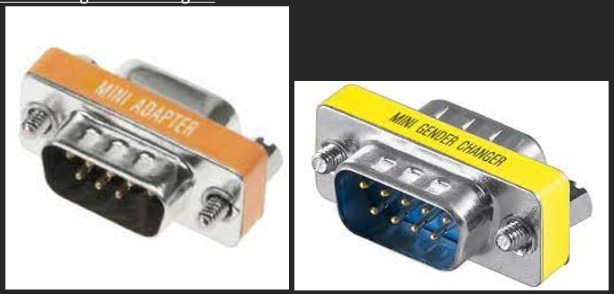
    - Null modem
      - Null modem cables allow for serial communication w/o a modem
        - Serial communication over RS232 was made primarily for people to use modems
      - Null modem cables swap the transmit and receive lines
      - When serial ports on devices have the pinout of a “straight-through” cable, there’s a need to swap the null modem pinout (rx and tx swapped) to the regular pinout
        - Thus null modem cables need null modem adapters
    - Gender changer
      - Gender changers just change the type of connection, no pinout change
      - Allows for cables w/ same genders to connect

## VM and Windows OS Connection

- Connect two COM ports together physically on the PC using cables w/ DE-9 connector ends
- Follow these steps exactly on Windows host OS:
  - Https://os.mbed.com/users/nixnax/code/PPP-Blinky/wiki/Configuring-Windows-Dial-Up-Networking
  - All except for the end where it talks about something device specific
- Install pppd on the Ubuntu VM
- Create a win.chat file and plug it into the ppp folder on the VM as below:
  - 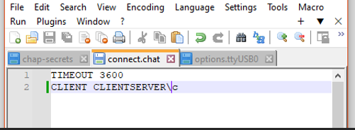
- Use below command on VM
  - Only change the IP address for the client side (the second IP address) according to the IP address you plugged in when configuring PPP on Windows side
  - `sudo pppd /dev/ttyS1 115200 192.168.3.2:172.10.10.1 nocrtscts nodetach local debug silent noaccomp nopcomp nobsdcomp noipv6 noccp novj noauth name server remotename client connect 'chat -v -f /etc/ppp/win.chat' lcp-echo-interval 0`
