# SoCs & AMD

- SoC and AMD notes

## Index

- [Index](#index)
- [AMD](#amd)
- [AMD’s Embedded Design Guide to UltraScale MPSoC Notes](#amds-embedded-design-guide-to-ultrascale-mpsoc-notes)
- [Relevant File Extensions](#relevant-file-extensions)
- [SDSoC](#sdsoc)
- [SoC](#soc)
- [Vivado](#vivado)
- [Xilinx DocNav Document Notes](#xilinx-docnav-document-notes)
- [Zynq Book Notes](#zynq-book-notes)
- [Zynq UltraScale+ MPSoC](#zynq-ultrascale-mpsoc)

## AMD

- “advanced microdevices”
- Semiconductor company that develops computer processors
- Xilinx
  - To clarify, Xilinx was acquired by AMD, but it was a semiconductor company that primarily supplied PLDs
- Link for AMD SoCs here
  - Https://www.xilinx.com/products/silicon-devices/soc.html
- Makes various SoCs for aerospace and defense
  - Zynq 7000 SoCs
  - Zynq Ultrascale+ MPSoCs
    - MP- “multi-processing”
    - RF- “radio frequency” ofc
  - Zynq Ultrascale+ RFSoCs
- Zynq SoCs allow for easy reconfiguration via software w/o reconfiguring hardware architecture
- Cheaper and power efficient
- Both MPSoC and RFSoC are equipped for multi-processor, but RFSoC is for RF applications

## AMD’s Embedded Design Guide to UltraScale MPSoC Notes

- Good ol C is used even on these high end processors
- Can be configured using Petalinux to have a bootloader
  - Bootloader
    - Or boot manager, bootstrap loader
    - Program that loads an OS on startup
    - You can configure an FSBL (“first stage boot loader”) for the processor
    - Primary/first stage bootloader
      - A small bootloader for minimal hardware initialization
      - Loads second stage bootloader
    - Second stage bootloader
      - Responsible for comprehensive hardware initialization
      - Configures memory
      - Loads main bootloader
    - Main bootloader
      - Loads operating system kernel, device tree, and other components
- Linker scripts can be modified to configure memory attributes for an application
- The Xilinx SDK is used to debug the processor
- Includes instructions to run sample projects

## Relevant File Extensions

- .mem
  - Memory initialization file
  - Defines contents of memory like ROM, RAM, BRAM (block RAM)
- .tcl
  - “tool command language scripts”
  - Automates tasks in Vivado or Vitis by doing:
    - Project creation
    - IP generation
    - Bitstream exports
    - SDK project setup
  - Commonly used for automating FPGA builds
- .lcf
  - “linker script files for SDK”
  - Defines memory layout for linking C/C++ applications
  - Custom Xilinx SDK format for linking embedded firmware for MicroBlaze or Zynq processors
- .d
  - Dependency files
  - Tracks header dependencies for source files
- .args
  - Compiler/linker argument files
  - Stores long lists of arguments passed to compiler/assembler/linker
- .idlx
  - “intermediate description language extension”
  - Metadata files generated by the SDK/IDE to support hardware/software interface management
  - Often associated w/ BSPs and driver configuration for peripherals in a Xilinx system
  - Can be used to auto-generate C drivers, or map IP blocks to driver code to generate appropriate headers

## SDSoC

- “software development SoC”
- An SoC compatible w/ AMD’s software development environment to develop software for Zynq SoCs and MPSoCs
  - Guides to using the environment here:
    - [SDSoC Development Environment Demo (xilinx.com)](https://www.xilinx.com/video/software/sdsoc-development-environment-demo.html) (video)
      - Hot damn c code can be moved to FPGA at the click of a button
      - Dang this guy sounds so done reading off the script on the screen
      - Real-time image processing application
    - [SDSoC Development Environment (xilinx.com)](https://www.xilinx.com/products/design-tools/legacy-tools/sdsoc.html) (webpage)

## SoC

- “System-on-Chip”
- Semiconductor device that integrates programmable logic w/ hard processor cores on a single chip
  - Ie, ARMv7 processors w/ FPGAs
  - (Doesn’t have to have programmable logic like an FPGA to be an SoC though)
- Integrated circuit design that combines many functional elements on a single chip: CPU, memory, I/O, GPU, etc

## Vivado

- Design suite for HDLs and writing code to program PLDs
- Is used to program Zynq SoCs too

## Xilinx DocNav Document Notes

- UG828: Zynq 7000 SoC Software Developers Guide

  - Bare-metal device driver architecture
    - 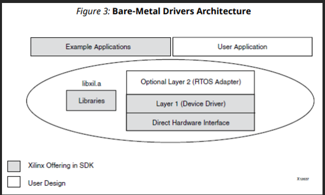
    - Layer 2: RTOS adapter
      - Converts layer 1 device driver to interface that matches requirements of driver model for an RTOS
      - May need unique adapters for each RTOS
    - Layer 1: device driver
      - Abstract device driver interface
    - Direct hardware interface
      - Implemented w/ macros and manifest constants…
      - Also allows you to create small applications or a custom device driver

- UG585: Zynq 7000 SoC Technical Reference Manual

  - Lol
  - MIO (“multiplexed IO”)- IO peripherals available through PS
  - EMIO (“extended multiplexed IO”)- IO peripherals available through PL
  - DevC (“device configuration interface”)
    - Includes 3 logic modules to initialize and configure the PL under PS software control, manage device security, and access XADC
    - Includes a set of control/status registers for the 3 main functional modules
  - Boot process:
    - 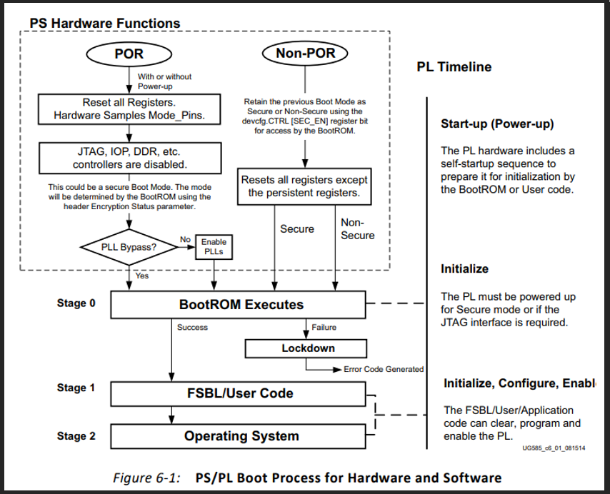
  - BootROM header parameters
    - 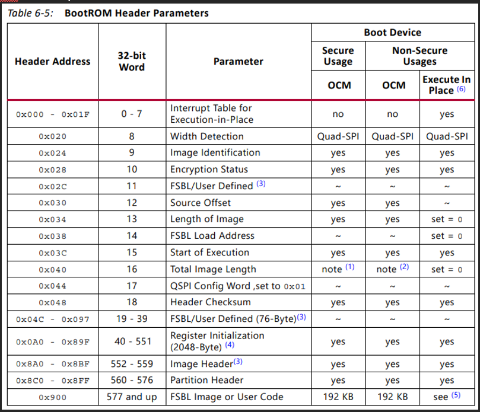
  - TrustZone
    - Hardware-based security technology used to separate execution environments into “secure world” and “normal world” to enable trusted execution for sensitive components

- UG940: Vivado Tutorial Embedded Design

  - Vitis
    - “unified software platform” to develop software and troubleshoot PL together
    - Capable of logic analysis of software and PL design

- UG1137: Zynq Ultrascale MPSoC Software Delopment

  - Lock-step operation
    - Fault-tolerance technique where two+ processors (or cores) execute the same instructions simultaneously to ensure that outputs are the same
    - One is the primary, the other is the checker
    - Ie, the R5 cores in the A53 Ultrascale SoCs can run in lockstep mode, or independently
  - Split operation
    - Twin-CPU configuration
    - Aka performance mode
  - A53 overview
    - 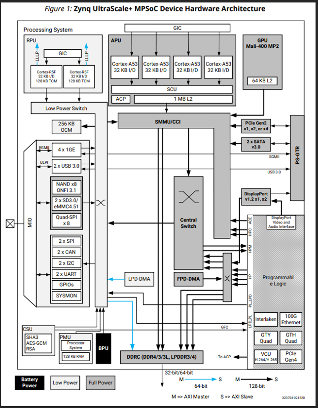
    - APU
      - 1.5GHz, dual or quad core ARM A53
    - RPU
      - 600MHz, dual core ARM R5F
  - PMU
    - “platform management unit”
    - Includes the architecture to:
      - Initialize system prior to boot
      - Manage power
      - Execute software test library
      - Handle system errors
  - Interrupts
    - System interrupts communicate status, events, requests, and errors w/in the heterogeneous processing system
    - PMU and CSU have their own local interrupt controllers
    - RPU and APU each have a GIC, where GIC’s manage software-generated interrupts, CPU’s private peripheral interrupts, and shared peripheral interrupts
    - 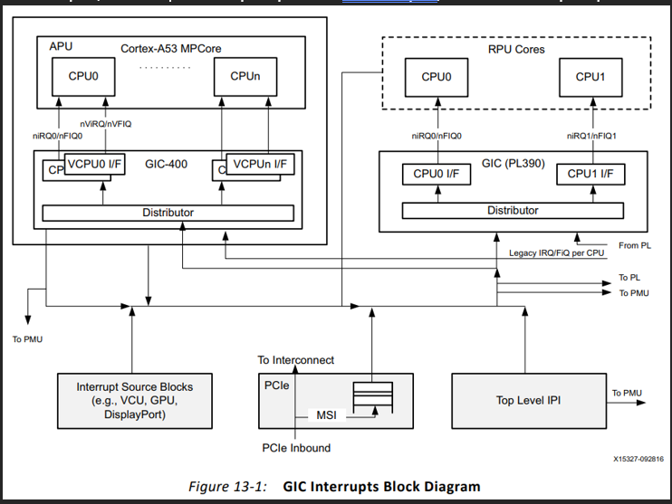
    - IPI
      - “inter-processor interrupt”
      - There are IPI channels associated w/ processor targets to allow other processors to send it messages and receive responses
      - Applies for: APU MPCore, RPU core 0, RPU core 1, processor(s) in PL, and PMU
        - 4 channels to target PMU
        - 7 channels to target RPU core 0, RPU core 1, APU MPCore, 4 processors in PL, 4 channels in PMU (on top of the 4 it exclusively has)
      - There’s an interrupt structure and message buffers to exchange short 32B messages between 8 IPI agents (PMU, RPU, APU, and PL processors)
      - There are 7 sets of assignable message buffers, 1 set of buffers dedicated to PMU, where each set has 8 request and 8 response buffers
  - Boot and configuration
    - Boot-up process is managed by PMU and CSU
    - 3 functional stages:
      - Pre-configuration stage
        - The PMU executes PMU ROM code to set up the system
        - PMU handles all reset and wake-up processes
      - Configuration stage
        - BootROM (part of CSU ROM code) interprets boot header to configure the system and load PS’s FSBL code to on-chip RAM (OCM) in either secure or non-secure mode
        - The boot header defines the security mode, processor to execute FSBL, etc
      - Post-configuration stage
        - CSU ROM code enters this stage after FSBL execution starts
        - The CSU ROM code is responsible for system tamper responses
        - Provides ongoing hardware support to authenticate files, configure PL via PCAP, store and manage secure keys, and decrypt files
    - Boot header
      - 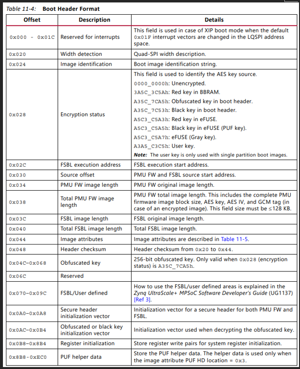
  - RPU
    - 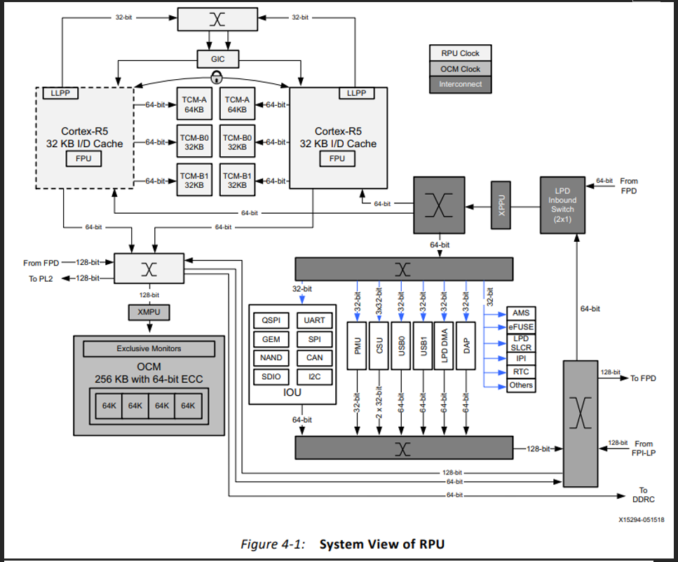
    - 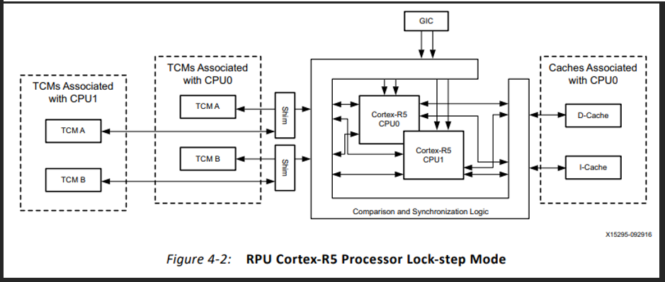
    - Interrupt latency is kept low by interrupting and restarting load-store multiple instructions by having dedicated tightly coupled memory ports that allow for deterministic accesses to local RAM
    - TCM
      - 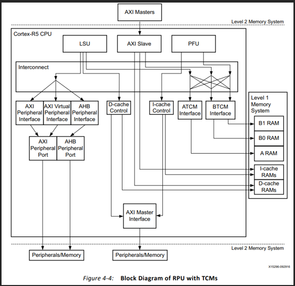
      - Each R5 core has a 128KB TCM memory bank (two 64-bit wide 64KB memory banks on ATCM and BTCM ports)
      - BTCM is divided into two 32KB ranks connected to BTCM-0 and BTCM-1
      - ATCM typically holds interrupt/execution code accessed at high speed, w/o delay from cache misses
      - BTCM typically holds blocks of data for intense processing like audio or video processing
  - OCM
    - 256KB of OCM RAM
    - 4 independent 64KB banks

- UG1085: Zynq Ultrascale Technical Reference Manual
  - ...

## Zynq Book Notes

- “Zynq” is based off the element Zn and how it can be mixed w/ other elements to form compounds for various purposes
- SoC’s used to refer to ASICs- there are ASIC based SoC’s, but they’re less flexible
- Zynq’s include the ARM A9 dual core processor for PS (“processing system”) and FPGA for PL by definition
- AXI
  - “Advanced eXtensible Interface”- protocol used to interface between PL and PS
- IP
  - Programmable logic blocks are imported from third party sources and from Xilinx libraries
- HLS
  - “high level synthesis”
  - Xilinx put together a method to abstract development w/ RTL’s
  - You can generate PL blocks w/ C/C++ and block diagrams, but it won’t be as efficient as directly writing in HDL
- MicroBlaze softcore processors can be instantiated in the PL fabric
- Software layers
  - Software applications
  - Operating system
  - BSP
  - Hardware base system
- Debugging
  - XMD (“Xilinx Microprocessor Debugger”)
    - Used to download, debug, and verify programs
    - Serves as GDB server for GDB and SDK when debugging bare-metal apps
    - SDK interacts w/ GDB server running on the target when debugging Linux apps
  - System Debugger- TCF?
- Off-loading processing to hardware
  - If the hard processor is busy, work can be offloaded to PL for parallel processing
- Zynq PS:
  - 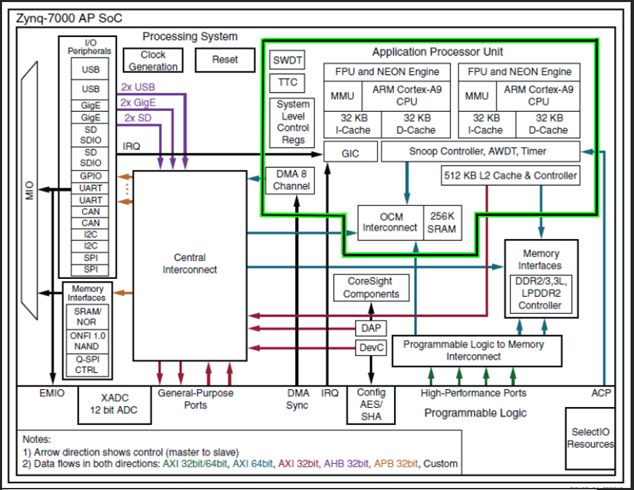
  - 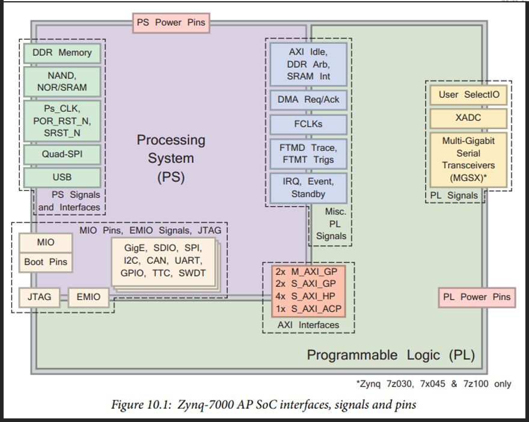
    - AXI
      - AXI used between PS and PL
      - AXI was invented as a protocol for ARM AMBA (“advance microcontroller bus architecture”) family of microcontroller buses- it’s an open standard on-chip interconnect specification to connect and manage many controllers and peripherals in a multi-master design
      - AHB (“advanced high-performance bus”) is for high-speed peripherals
        - SDRAM, DMA, USB, ethernet, CPU memory access, etc
      - APB (“advanced peripheral bus”) is for low-speed peripherals
        - GPIO, UART, timers, I2C, SPI, etc
  - Application processing unit
    - 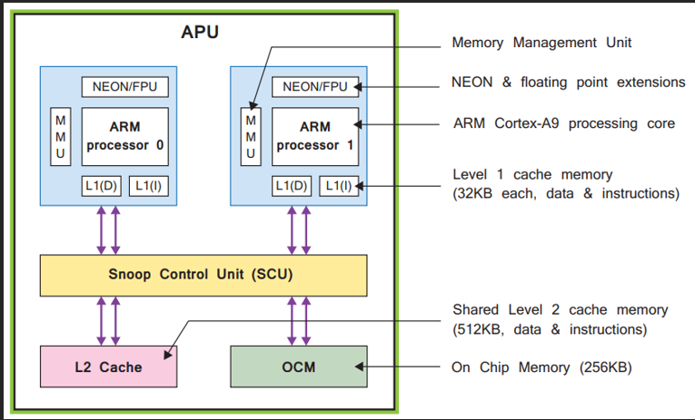
    - Guts of PS- dual core ARM A9 processor
    - SCU (“snoop control unit”) serves as a bridge between ARM cores and L2 cache, and also manages transactions between PS and PL
    - NEON is a media processing unit
- Provides SIMD for acceleration of things like DSP
- Zynq PL:
  - 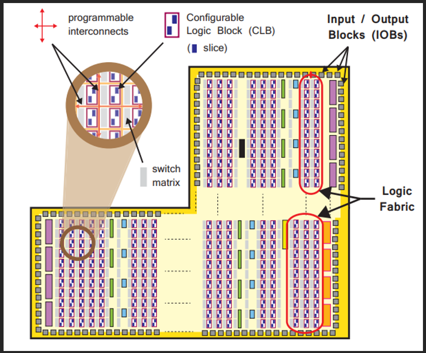
    - CLB
      - “configurable logic block”
      - Small, regular groupings of logic elements laid out as 2D array on PL
    - Slice
      - Sub unit within CLB, containing resources for implementing combinational and sequential logic circuits
    - Lookup table
      - Flexible resource to implement:
        - Logic function of up to 6 inputs
        - Small ROM
        - Small RAM
        - Shift register
    - Switch matrix
      - Sits next to each CLB, and connects
        - Elements w/in a CLB
        - CLB to other resources in PL
    - Carry logic
      - A chain of routes and multiplexers to link slices in a vertical column
    - IOBs
      - “Input / output blocks”
      - Provide interfacing between PL resources and physical device pads
  - Block RAMs
    - Included for dense memory requirements
    - Works out since FPGA cells are literally RAM cells lol
  - DSP48E1s
    - Included for high-speed arithmetic
  - Hard IP blocks
    - Communication interfaces like PCIe, Serial RapidIO, SCSI, SATA are hard baked into PL w/ silicon- called “GTX transceivers”
    - ADC block
    - Clock block
    - Programming/debugging block
- Interrupts
  - 
  - 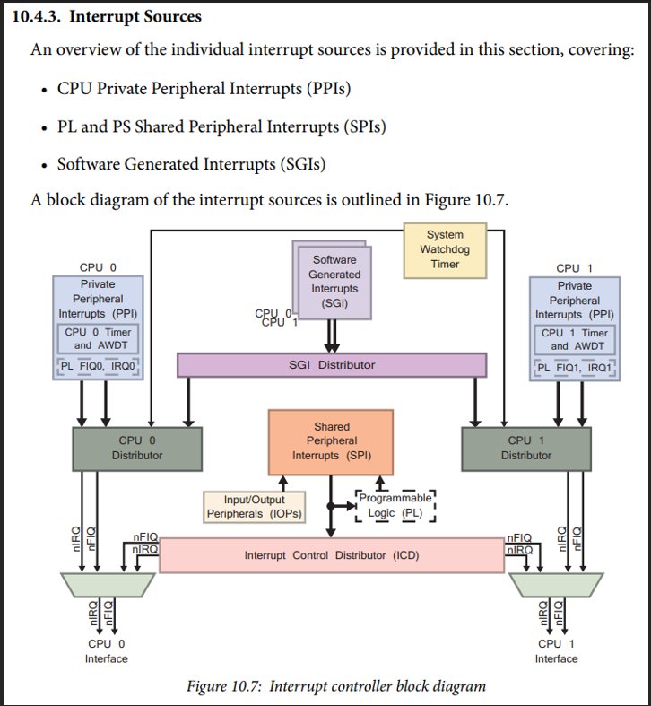
  - Interrupts on the Zynq work w/ respect to the GIC (“general interrupt controller”)
  - Types include
    - PPI (“private peripheral interrupt”)
    - SPI (“shared peripheral interrupt”)
    - SGI (“software generated interrupt”)
- OS’s on Zynq
  - Motivations to include an embedded OS on Zynq
    - Reduces application development learning curve for developers that develop for and target for desktop
    - Abiding by POSIX allows for portability
    - OS’s come w/ various interfaces (device drivers, graphical user interface drivers, etc)
- Linux boot process on Zynq
  - 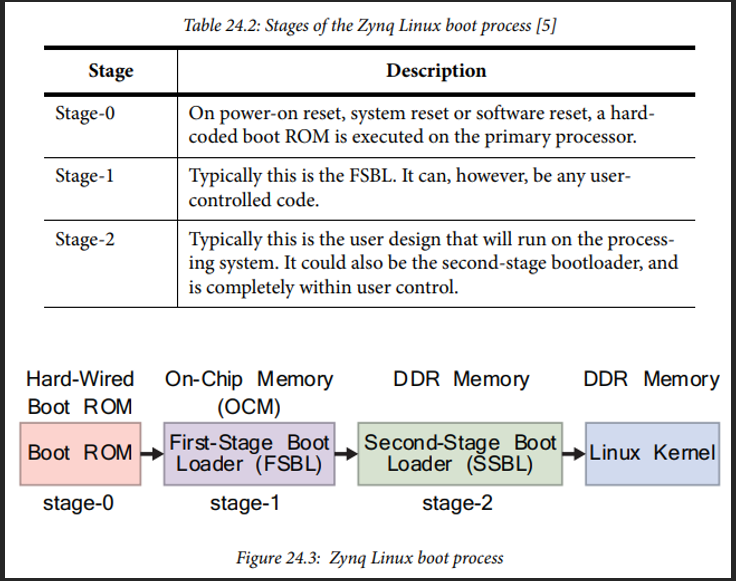
  - Differs from a desktop boot process of Linux
  - Stage-0: BootROM
    - 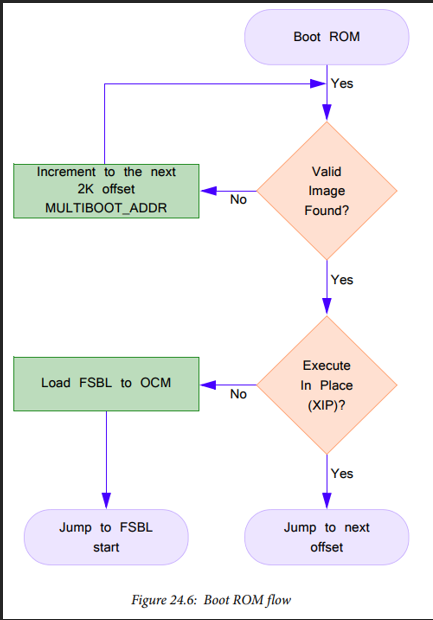
    - Used to determine boot mode
    - Boot mode defines how the FSBL will be loaded- reads hard-wired pins
    - Methods include:
      - JTAG
      - NAND flash
      - NOR flash
      - QSPI flash
      - SD card
    - JTAG requires slave boot mode, where host PC acts as a secure master to load a boot image to OCM
    - NAND/NOR/QSPI flash and SD card booting is used in master boot mode
    - BootROM then reads the “boot header” after boot mode is determined
- Boot header provides configuration parameters
  - Stage 1: FSBL
    - 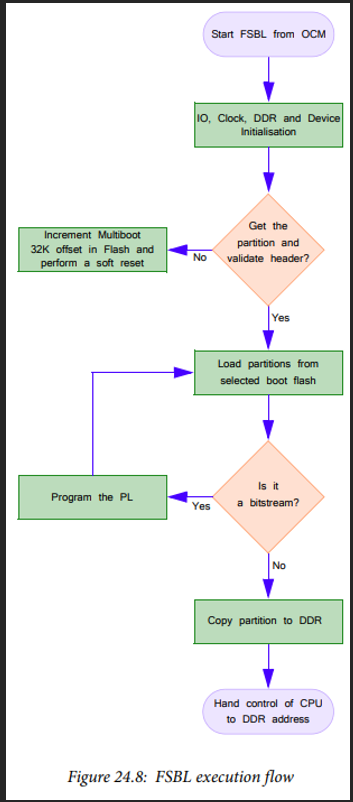
    - Can be booted directly from flash sources if either NOR or QSPI flash is chosen, and the XIP (“eXecute-in-place”) function is called w/ non-secure boot
    - Various encryption methods are used to boot in secure mode if desired
    - FSBL is authenticated and loaded to on-chip memory from selected interface -> control of CPU is handed to FSBL
    - Contains instructions for CPU to configure PS w/ read/writes, and PL w/ DevC
    - Disables cache/MMU, and invalidates instruction cache for U-boot that assumes they’re all disabled on start
    - FSBL image also includes the BootROM header
      - BIF (“boot image format”):
        - BootROM header
        - FSBL image
        - Partition image(s)
        - Unused space if applicable
- 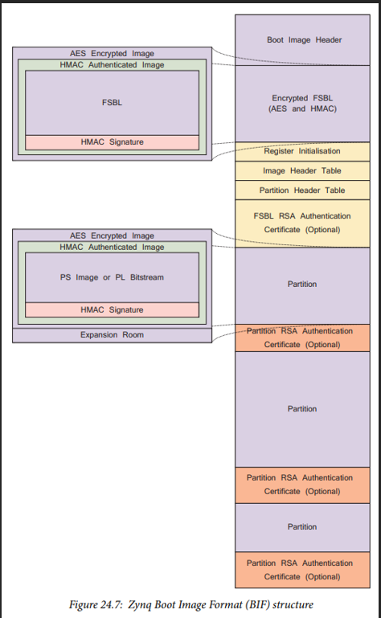
  - Bootgen tool
    - FSBL is combined w/ PL bitstream via the Bootgen program
    - Tool provided in Xilinx SDK
    - Assembles boot images by prefixing header block to a list of partitions (ELF files, FPGA bit streams, etc)- each partition can be encrypted
  - Stage 2: SSBL
    - Usually U-boot
    - MCU’s and MPU’s can directly run off of local flash memory, but OS’s are stored in large memory devices, so it’s not recommended
    - U-boot needs to load the OS to main RAM memory
  - Files required to boot Linux on Zynq
    - 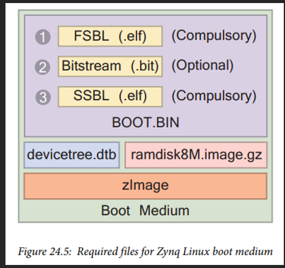
    - BOOT.BIN
      - Zynq boot image file
      - Combination of two files + optional files:
        - FSBL & SSBL .elf files
        - Optional bitstream file (.bit)- used to configure PL
    - ZImage
      - Contains compressed Linux kernel
      - Decompresses itself upon being loaded into memory by SSBL
    - Devicetree.dtb
      - Information of hardware that Linux is to be booted on
      - Defined via a human-readable .dts (“device tree source file”) text file
      - Combined into binary form by compiler to form a “device tree blob”, which can be understood by U-boot
    - Ramdisk8M.image.gz
      - RAM disk image allows for a portion of RAM to be used as if it were a disk drive
      - Creates temporary disk drive in RAM which Linux system can use as a file system to mount to the root directory
- Secure boot
  - Boot method is restricted to a single source- it’s driven by the processor
  - Ensures that there’s no way to load malicious software after PL has been configured, and no way to load malicious images to the PL after the processor’s initialized
  - Supports encryption of FSBL, U-Boot, PL bitstream, and user software
- Development
  - Vivado IDE
    - Used to create hardware system part of SoC design
    - Includes a simulator to simulate hardware components within a system
  - SDK
    - Eclipse based software design suite

## Zynq UltraScale+ MPSoC

- 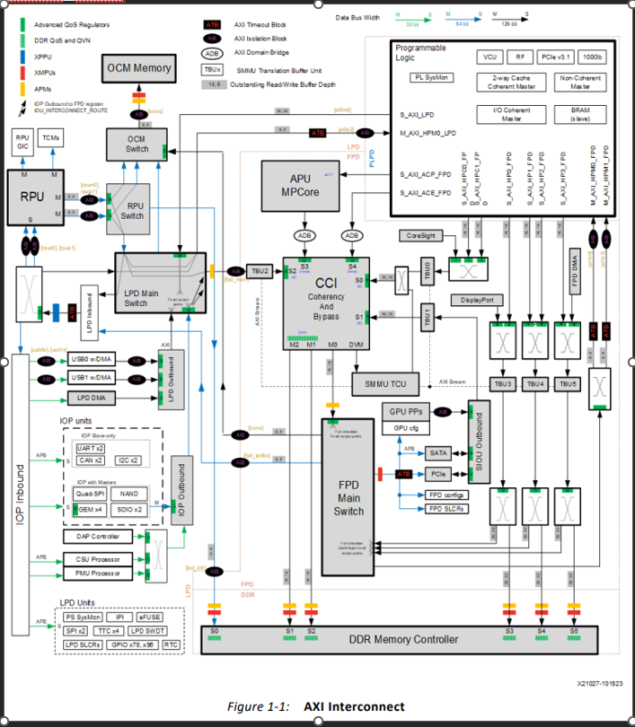
- 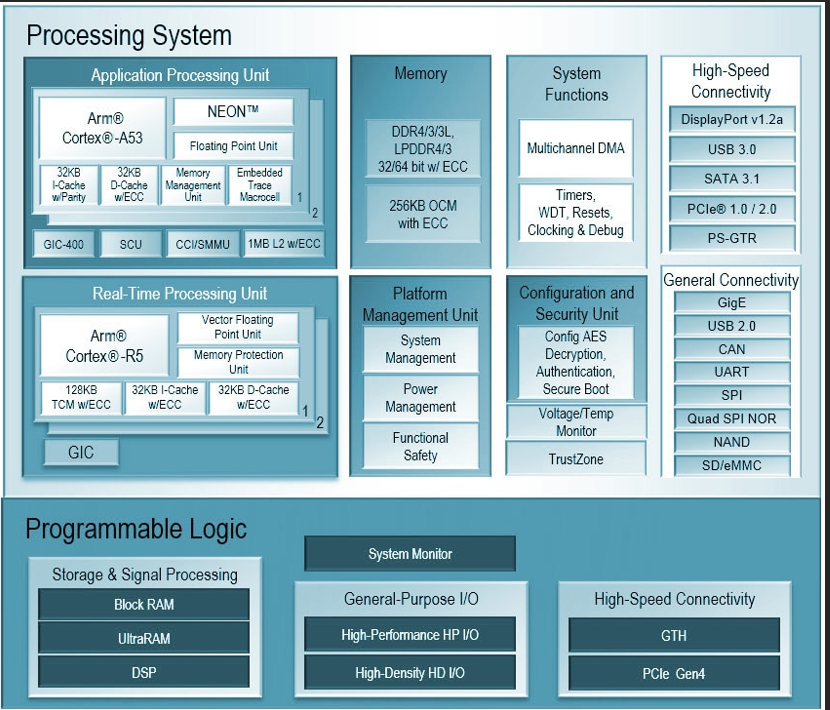
  - AMD Zynq Ultrascale+ CG looks like this
  - Dual Arm Cortex-A53 (Arm v8 architecture)
  - Dual Arm Cortex-R5F
  - 16nm FinFET + programmable logic
- AMD’s overview page
  - [Zynq UltraScale+ MPSoC Design Overview (xilinx.com)](https://www.xilinx.com/support/documentation-navigation/design-hubs/dh0070-zynq-mpsoc-design-overview-hub.html)
- There’s a defense grade SoC and an SoC for everything else
- Guide to embedded design using UltraScale MPSoC:
  - [Zynq UltraScale+ MPSoC: Embedded Design Tutorial (UG1209) (xilinx.com)](https://www.xilinx.com/content/dam/xilinx/support/documents/sw_manuals/xilinx2018_2/ug1209-embedded-design-tutorial.pdf)
- Generic MPSoC
  - [Zynq UltraScale+ MPSoC (xilinx.com)](https://www.xilinx.com/products/silicon-devices/soc/zynq-ultrascale-mpsoc.html#productTable)
- Defense grade MPSoC
  - [Defense-Grade Zynq UltraScale+ MPSoCs (xilinx.com)](https://www.xilinx.com/products/silicon-devices/soc/xq-zynq-ultrascale-mpsoc.html)
    - Overview page for all defense SoCs
  - [aerospace-defense-product-brief.pdf (xilinx.com)](https://www.xilinx.com/content/dam/xilinx/publications/product-briefs/aerospace-defense-product-brief.pdf)
    - Summary of various specs for defense SoCs
    - Describes quad-core APU and dual-core RPU
  - [Zynq UltraScale+ MPSoC Embedded Design Methodology Guide (UG1228) (xilinx.com)](https://www.xilinx.com/content/dam/xilinx/support/documents/sw_manuals/ug1228-ultrafast-embedded-design-methodology-guide.pdf)
    - Embedded design guide w/ Zynq SoCs
    - Includes “heterogenous computing concepts”
      - Two main layers of processing
      - First layer
        - APU (application processing unit)
        - RPU (real-time processing unit)
        - PL (programmable logic)
        - GPU (graphics processing unit)
      - Second layer
        - Dual/quad cortex-A53 cores w/in APU
        - Dual cortex-R5F cores w/in RPU
        - PL-optimized applications and/or MicroBlaze™ processor instances within the PL
        - Graphics processing pipelines in the GPU
      - The components in the first layer are “asymmetrical”, in that a software developer would have to tailor the workload (whatever task that needs to be done) to each specific component
      - Each component has different capabilities/constraints, don’t share OS, and workload can’t be moved seamlessly between blocks
    - Workload acceleration using PL
      - Software can be moved over to the FPGA (the programmable logic)
      - Various specs are improved when tasks are allocated to the PL
        - Digital signal processing, graph processing, monte carlo simulation (random number generation), machine vision, bioinformatics, atmospheric modeling
    - Boot process software
      - Components involved w/ boot
        - PMU
          - “Platform management unit”
          - Has ROM to execute pre-boot tasks
        - CSU
          - “configuration security unit”
          - Responsible for secure boot, tamper monitoring, secure key storage and management, cryptographic hardware acceleration
          - Crypto block contains AES-GCM, DMA, SHA-3, RSA 👒, and PCAP interfaces
        - APU
        - RPU
        - PL
      - Software and binary elements used by above components
        - PMU firmware,
        - CSU BootROM
        - First stage boot loader (fsbl)
        - U-boot
          - Aka “Das U-Boot”
          - “Universal BOOTloader”
          - Primary boot loader used to package instructions to boot a device’s OS
          - Used for 68k, ARM, Blackfin, MicroBlaze (Zynq SoCs use this), MIPS, Nios, SuperH, PPC (Wii’s use this), RISC-V, x86
          - Microblaze
      - CPU configurable for 32/64-bit RISC microprocessors (like Zynq SoCs)
      - Configurable for microcontroller, real-time processor, and application processor settings
        - ARM trusted firmware
        - PL Bitstream
    - Xen Hypervisor
      - A bare metal hypervisor (a program used to manage and run multiple virtual machines on a computer) that allows Zynq SoCs to run multiple OS’s on the same computing platform
      - These OS’s are called “domains” or “virtual machines”
    - Power domains
      - Full power domain
      - Low power domain
      - Battery powered domain
- Video demos
  - MPSoCs for some video codec application:
  - [Region of Interest (ROI) based encoding demo: System & Hardware Architecture (xilinx.com)](https://www.xilinx.com/video/application/region-of-interest-roi-based-encoding-demo-system-hardware-architecture.html)
  - [Region of Interest (ROI) based encoding demo: Software Architecture (xilinx.com)](https://www.xilinx.com/video/application/region-of-interest-roi-based-encoding-demo-software-architecture.html)
  - [Maximizing broadcast bandwidth: Region of Interest based encoding (xilinx.com)](https://www.xilinx.com/video/application/maximizing-broadcast-bandwidth-region-of-interest-based-encoding.html)
- ARM Cortex-R5F processors
  - 
  - These Ultrascale+ SoCs include two R5F processors for real-time processing
  - There are dedicated caches, MPU, etc for the R5F processors, and together the unit is called the RPU
  - I vs D cache
    - I for instruction
    - D for data
  - TCM
    - “tightly-coupled memory”- it’s fast memory for predictable instruction executions and predictable data load/store timings
    - TCM ports provide low-latency and deterministic access to local RAM
- Other Jargon
  - DPU
    - “data-processing unit”
    - Holds program-visible processor states like general-purpose registers and system registers
  - DCU
    - “data-cache unit”
    - Includes L1 cache, load/store pipelines to interface w/ DPU, system controller that performs cache and TLB maintenance directly on I/D cache, and an interface to receive requests from SCU (“snoop control unit”)
  - SMMU
    - “system memory management unit”
  - BBRAM
    - “battery-backed RAM”
  - SYSMON
    - “system monitor”
  - GEM
    - “gigabit Ethernet controller”?
