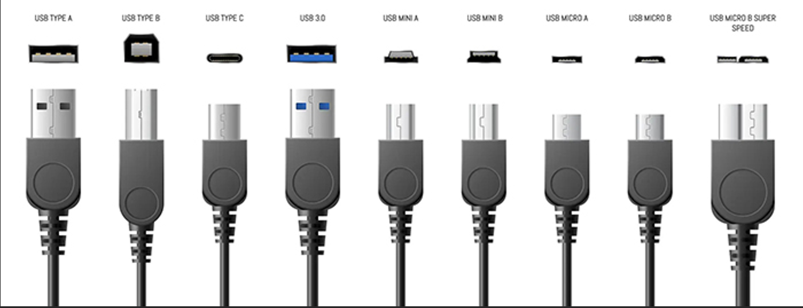
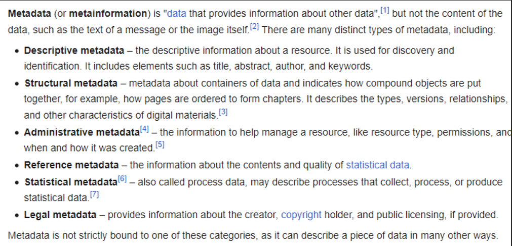

# USB (Universal Serial Bus)

- USB Notes

## Index

- [Index](#index)
- [Overview](#overview)
- [ACM](#acm)
- [Charging w/ USB](#charging-w-usb)
- [Form factors](#form-factors)
- [Metadata](#metadata)
- [USB Devices](#usb-devices)
- [USB Host](#usb-host)
- [USB Protocol](#usb-protocol)

## Overview

- Different USB standards allow for different transfer speeds
  - USB 1.1 (Full-Speed USB)- 12Mb/s
  - USB 2.0 (High-speed USB)- 480 Mb/s
  - USB 3+ (super-speed USB)- 5Gb/s +
- Designed to replace various peripherals
- Plug-and-play (automatic configuration upon connecting)
- USB is unidirectional (aka “Half duplex”), where the “USB host” communicates w/ “USB devices”
- Data is transmitted w/ “differential signaling” on a twisted pair of D- and D+ lines
  - Differential signaling is data transmitted over two complementary signals
  - Both send the same information, but this allows for transfer w/ lower voltages, improved noise immunity, and higher data rates
  - “twisted pair” just means the two lines are coiled together to minimize electromagnetic interference
- Provides 5V from host and GND for reference

## ACM

- “Abstract control model”
- An USB CDC ACM is a class in the USB host component used for attaching communication devices for ARM

## Charging w/ USB

- USB-IF (“USB implementers forum”) provides a standard for charging devices w/ USB called the “battery charging specification”
- BC 1.2 defines below
  - SDP
    - “standard downstream port”
    - Just VBUS connection, shorts D+ / D- down to ground w/ resistors
    - Provides 100mA at first, and goes up to 500mA / 900 mA for USB 2.0 and 3.x respectively
  - DCP
    - “dedicated charging ports”
    - Provides up to 1.5A w/ no data
    - Shorts D+ and D- together w/ a resistor
  - CDP
    - “charging downstream port”
    - Provides up to 1.5A regardless of power limits enforced by USB host during USB enumeration
    - D+ / D- lines are used and monitored

## Form factors

- 

## Metadata

- Metadata is data about other data
- 
- QoS
  - “Quality of service”
  - Measurement of overall performance of a service

## USB Devices

- Serializes/deserializes communication w/ host
- Provides Host w/ speed requirements
- Provides CRC if needed
- Provides memory for “endpoints”
- Provides host w/ communication requirements during enumeration
- Provides communication APIs for devices application programmers

## USB Host

- Sends communication requests and controls all communication
- Detects attachment/removal of devices
- Uses CRC (“cyclic redundancy check”) for error checking
- KHCI and EHCI
  - KHCI
    - “kinetis host controller interface”
    - USB host interface made for NXP MCUs in the Kinetis MCU family
    - Allows USB device to act as a USB host device
    - Interface for full-speed and low-speed (12Mb/s and 1.5Mb/s)
  - EHCI
    - “enhanced host controller interface”
    - USB host interface made for PCs and other systems
    - Also allows USB device to act as a host device
    - Interface for high-speed (480Mb/s) and full/low speed devices

## USB Protocol

- Link by Microchip here
  - [How USB Communicates - Developer Help (microchipdeveloper.com)](https://microchipdeveloper.com/usb:how-it-works)
- Communication timing is maintained via “frames”
- Frame interval is determined via USB speed
- USB host’s job is to read/write to a set of memory locations on USB device called “endpoints”
  - “Endpoints” come in pairs, where every endpoint has an IN/OUT pair
    - OUT = coming out of HOST
    - IN = data coming out of DEVICE (to be loaded into host)
- To write to device host writes to OUT endpoint
  - Device then detects info and copies the message
- To read from device, device writes to IN endpoint
  - Host then performs read to read from endpoint
- Endpoint 0 is reserved for control and configuration
  - EP0IN has USB device information
  - EP1OUT allows host to configure the device
  - There can be up to 32 endpoints
- USB transfer types
  - USB types link by Eaton
    - [USB: Port Types and Speeds Compared | Eaton](https://tripplite.eaton.com/products/usb-connectivity-types-standards)
  - Latency (transaction interval time)
  - Bandwidth (# of packets & length of packets per transaction)
  - Error checking (CRC provided or required?)
  - Control & configuration (space in frame required to enumerate new devices)
  - Length/frequency of transactions determined via “transfer types” being used for an endpoint
  - Possible types include
    - Interrupt
      - Short packets w/ CRC
      - High flexibility, limited bandwidth
      - Mice, keyboards, medical devices
    - Bulk
      - Short packets w/ CRC
      - Not scheduled in fixed intervals like interrupt/isochronous, will run when there’s space in frame
      - High reliability w/ high bandwidth potential
      - Bandwidth varies w/ # of interrupt endpoints enumerated and activity of enumerated isochronous endpoints
    - Isochronous (means “happening at the same time”)
      - Longer packets w/o CRC
      - High bandwidth, CRC must be provided vis software if required due to no CRC hardware implemented
      - Audio/video, serial port emulation
- USB Transaction
  - Every transaction initiated by host can have 3 packets
    - Token: host describes transaction type
      - OUT, IN, SETUP, SOF
    - Data: payload sent by either host or device for OUT and IN transactions respectively (optional packet)
      - DATA0, DATA1
      - “payload” could also refer to the carrying capacity of a transmission data unit over just the data being transmitted
    - Handshake: status of request
      - ACK, NACK, STALL (retry request)
- USB Peripherals
  - USB device descriptors are read by host on enumeration, and includes
    - Version of USB supported, who made device, power consumption, # of endpoints, transfer method, etc
- USB Device Classes
  - Device classes link by Microchip here
    - USB Device Classes - Developer Help (microchipdeveloper.com)
  - “USB class code” defines USB “base class”, “subclass”, and “protocol”
    - “Base class” defines what the device is generally used for
      - 02h -> CDC (“communications device class”)
        - Can be used for serial COM port emulation via USB
      - 03h -> HID (“human interface device”)
        - Used for keyboards, mice, game controllers, etc
      - 0Ah -> CDC data (only used for interface devices)
      - 0FFh -> “Vendor Specific” class
        - Used for developer specific applications like making an MCU talk to a C# Windows application
        - Vendor Specific class descriptors here
          - AN00136:-USB-Vendor-Specific-Device(2_1_2rc1).pdf (xmos.ai)
  - More here
    - [USB Device Classes - Developer Help (microchipdeveloper.com)](https://microchipdeveloper.com/usb:device-classes)
  - USB Descriptors
    - Information on USB descriptors here: [USB in a NutShell - Chapter 5 - USB Descriptors (beyondlogic.org)](https://www.beyondlogic.org/usbnutshell/usb5.shtml)
- USB enumeration
  - Where the USB host detects a device to ensure device endpoint are serviced by host
