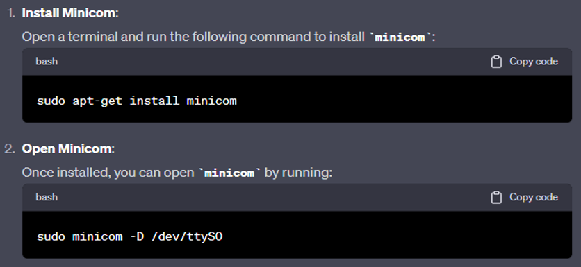
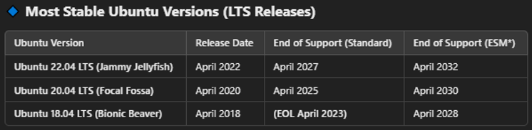

# Virtual Machines

- Virtual machine notes

## Index

- [Index](#index)
- [Docker Container](#docker-container)
- [Networking and SSH Into VM](#networking-and-ssh-into-vm)
- [Serial Ports](#serial-ports)
- [Sharing files](#sharing-files)
- [Ubuntu](#ubuntu)
- [Vagrant](#vagrant)
- [Virtual Box](#virtual-box)
- [VMware](#vmware)

## Docker Container

- A "container" is a form of lightweight virtualization where processes running under the same kernel are isolated in separate environments to appear as two different machines
- A docker container is a containerization platform
  - Allows for all dependencies of an application (libraries, environment, and other dependencies) to be isolated into a portable unit

## Networking and SSH Into VM

- Local Loopback interface
  - Aka 127.0.0.1 IPv4 interface
  - Interface used to have a computer communicate w/ itself over network protocol stack
  - Often used to test network services on a machine
  - Allows Host PC to communicate w/ VMs
- SSH
  - SSH protocol can be used to remotely access VMs
- BIOS Virtualization enable
  - There’s a setting in BIOS to support virtualization
- Hypervisor
  - Software layer enables VM creation/management to allow multiple OS’s to run a single physical machine
  - Hypervisors can run on
    - Some physical hardware
      - This hypervisor that interfaces w/ physical hardware is what needed to be enabled via BIOS settings
      - Hypervisor interfaces w/ BIOS to manage VMs
    - Some preexisting OS
      - VirtualBox, VMware

## Serial Ports

- VirtualBox documentation on serial ports:
  - Https://docs.oracle.com/en/virtualization/virtualbox/7.0/user/BasicConcepts.html#serialports
- Setserial program
  - Program you can install on Ubuntu via Ubuntu terminal to interface with COM ports and view serial port info
  - Setserial MAN page:
    - Https://manpages.ubuntu.com/manpages/trusty/man8/setserial.8.html#:~:text=setserial%20is%20a%20program%20designed,Attention%20Key%2C%20and%20so%20on.
  - Ubuntu installation command:
    - `sudo apt install setserial`
- Useful commands
  - (general commands):
    - `grep -i ‘tty’ /var/log/dmesg`
      - Displays all serial ports that are active/available
    - `grep ls -lhS /dev/`
      - Displays literally everything in dev directory including serial ports
  - (setserial commands):
    - Helpful link:
      - Https://www.thegeekdiary.com/setserial-command-examples-in-linux/
    - `sudo setserial -a /dev/ttyxxx`
      - After confirming what name the serial port is assigned (tty-something) you can confirm the details about the port w/ this command
    - 
    - You can confirm w/ Ubuntu settings as well
- Minicom
  - Serial emulator that can be used over command line on Ubuntu to communicate serially just like Tera Term
  - MAN page here:
    - Https://linux.die.net/man/1/minicom
  - Installation here:
    - 
  - You can test a serial connection between a VM and Windows host OS if there’s a physical cable going between two serial ports on a PC
    - Make sure to call the minicom command above using the right port name
    - Open Tera Term and select the COM port used to communicate w/ the COM port used by the VM
    - Start typing on either terminal emulator, and it should be received on the other terminal emulator

## Sharing files

- You can share files between host OS and an Ubuntu VM using a shared folder:
  - Details here: https://gist.github.com/estorgio/1d679f962e8209f8a9232f7593683265
  - Follow all instructions on this github post to make shared folder between host OS and VM permanent

## Ubuntu

- An OS distribution that runs Linux as its core (its kernel)
- Debian distribution of Linux
- Ubuntu ISO
  - “International Organization for Standardization”
    - So “the ISO”
    - As in ISO C, ISO xxx for various certifications, etc
  - Disk image file containing complete installation packages for Ubuntu OS
  - An Ubuntu ISO can be installed on a VM or any PC to get Ubuntu running on a machine
  - After installing the ISO all you need to do is use VirtualBox and further customize the image before letting the VirtualBox handle the image
- Types of Ubuntu distros
  - LTS
    - “long-term support” releases
    - Supported for 5 years
    - Ideal for production
    - 
  - Regular releases
    - Supported for 9 months
    - Less stable

## Vagrant

- Tool to manage VMs
- Interfaces w/ virtualization tools like Virtual Box and VMware to easily install and interface w/ VMs as needed (configuring VMs, installing VMs, duplicating VMs, etc)
- Allows users to create and configure bare bones VMs to serve as development environments
  - Helpful in creating VMs that have just what’s needed for development
- Packer
  - Tool to generate machine images for various platforms
  - Can generate VMs using a config file to generate machine images for requested platforms like Virtual Box and VMware
- Bento
  - Project that includes Packer templates to generate VM images
  - Templates are used to create base images for various OS’s (Ubuntu, CentOS, etc) to serve as development environments
- Vagrant, Packer, Bento flow:
  - Packer uses templates provided by Bento to generate VM images for a specified platform (Virtual Box, etc)
  - Vagrant can manage and customize the VM image made using Packer
  - That’s it

## Virtual Box

- Virtual Box is a virtualization tool that allows machines to run VMs (“virtual machine”)
- Provides a platform to manage the VMs installed (to some extent)
- Can be used to manage VMs you have installed running Ubuntu

## VMware

- Another virtualization tool like Virtual Box
