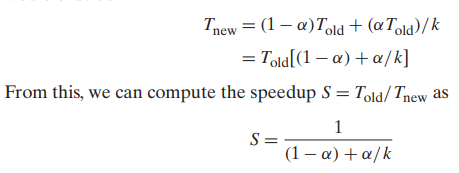

# Fundamentals

- DevOps related fundamental notes
- Primarily from _The DevOps Handbook_

## Index

- [Index](#index)
- [Amdahl's Law](#amdahls-law)
- [Automated Test Categories](#automated-test-categories)
- [Benchmark](#benchmark)
- [Ceremonies](#ceremonies)
- [CI/CD](#cicd)
- [Code Promotion Without Manual Steps or Handoffs](#code-promotion-without-manual-steps-or-handoffs)
- [Composition vs Decomposition](#composition-vs-decomposition)
- [Conway’s Law](#conways-law)
- [Deployment vs Release](#deployment-vs-release)
- [DevOps Definition](#devops-definition)
- [Downward Spiral- 3 Stages](#downward-spiral--3-stages)
- [Finding Bugs](#finding-bugs)
- [Generalist vs Specialist](#generalist-vs-specialist)
- [Greenfield vs Brownfield](#greenfield-vs-brownfield)
- [Hypothesis Driven Development](#hypothesis-driven-development)
- [Iteration Retrospective](#iteration-retrospective)
- [Iterative vs Waterfall Development](#iterative-vs-waterfall-development)
- [Law of Parsimony](#law-of-parsimony)
- [Lead Time vs Processing Time](#lead-time-vs-processing-time)
- [Manufacturing/Technology Value Stream](#manufacturingtechnology-value-stream)
- [Monolith vs Microservice](#monolith-vs-microservice)
- [Myths of Industrial Safety](#myths-of-industrial-safety)
- [Parkinson's Law](#parkinsons-law)
- [Percent C/A](#percent-ca)
- [Planning](#planning)
- [Release Patterns](#release-patterns)
- [Requirements Analysis](#requirements-analysis)
- [RUP](#rup)
- [Scrum Methodology](#scrum-methodology)
- [Security](#security)
- [System Engineering](#system-engineering)
- [Telemetry](#telemetry)
- [Three Ways](#three-ways)
- [Top-Down vs Bottom-Up Design](#top-down-vs-bottom-up-design)
- [Toyota Kata](#toyota-kata)
- [Vaporware](#vaporware)
- [WIP](#wip)
- [Workload](#workload)

## Amdahl's Law

- 
- An equation describing the effectiveness of improving one part of a system
- Alpha = time taken out of T-old
- K = factor in which performance is improved

## Automated Test Categories

- Unit tests
  - Tests for isolated method/class/function to ensure code behavior
- Acceptance tests
  - Tests an application as a whole
  - Proving that a system works as the customer requested it to
- Integration tests
  - Tests to ensure that application correctly interacts w/ other production applications and services
  - Integration tests should be minimized, to find issues during unit testing and acceptance testing

## Benchmark

- A program chosen to compare computer performances (simple sorting, doing arithmetic, etc)

## Ceremonies

- Any "session" where engineers get together to discuss what should happen, due to a lack of general engineering enforcement (whether it's technical decision making, handing off from one team to another, etc)
- Minimize them
- Heavy documents and control points in a project should be alleviated
- Ceremonies make it harder to make changes, and works against competent engineers

## CI/CD

- “continuous integration/continuous deployment (or delivery)”
- CI
  - Continuously integrating changes from multiple users into a shared repository
  - Every integration checked via automated build system to detect errors quickly and early
- CD
  - Automatically updating production/release codebase after every new integration that passes all production pipeline stages
  - “Continuous delivery” is when the final deployment step requires some manual approval
- CI/CD pipelines
  - A pipeline for software development is a path of building, testing, and deploying software- automating this process minimizes human error and establishes a uniform process to verify software before it’s released

## Code Promotion Without Manual Steps or Handoffs

- Build
  - Deployment pipeline must create packages from version control that can be deployed to any environment, including production
- Test
  - Anyone should be able to run one or all automated test suites on their workstation or on test systems
- Deploy
  - Anybody should be able to deploy generated packages to any environment where they have access, executed by running scripts that are also checked into version control

## Composition vs Decomposition

- ..."Composition" in the OOP context means object attributes in objects, but in a development context:
- Composition
  - Creating a project from scratch
  - Generating fresh system diagrams
- Decomposition
  - Reverse engineering an existing system to understand its internals
  - Breaking a large project down into pieces to focus on small chunks at a time

## Conway’s Law

- > Any organization that designs a system will produce a design whose structure is a copy of the organization's communication structure
  - Melvin Conway, 1967
- There needs to be proper organization at the highest team management level for an organization to generate proper and modular systems

## Deployment vs Release

- Deploy
  - Installation of specified version of software to a given environment
  - May or may not be associated w/ a particular release for a customer
- Release
  - When a particular feature or set of features is made available to all customers or a segment of customers
  - Release of functionality should not require changing application code

## DevOps Definition

- “Development and Operations”
- Philosophy and set of practices that combines software development (Dev) and IT operations (Ops) to improve the efficiency, speed, and reliability of software delivery and infrastructure management fostering collaboration and automation
- > While technology is a piece of a successful transformation into future ways of working, business leadership must take the charge. The bottleneck of today is no longer just technical practices (though they still exist); the biggest challenge and necessity is getting business leadership on board. Transformation must be co-created between the business and technology […] The enterprise can no longer sustain a binary thought process: top down or tech only. We must achieve true collaboration. Ninety percent of that work involves getting the right people engaged, onboard, and aligned. Start there and we can maintain the resulting motivation in to the future
  - _The DevOps Handbook_

## Downward Spiral- 3 Stages

- Lack of IT operations
  - Complex applications and infrastructure and poor documentation causes systems to be fragile
  - Such technical debt and daily workarounds add up, and are usually what generates revenue for the company
- Full allocation to satisfy customers
  - Product managers might compensate for issues caused by such technical debt by promising more projects and features
  - Causes developers to work on new features instead of handling debt
- Development slows down
  - Adding new features becomes more difficult bit by bit- more communication/coordination/approvals become needed for small changes, and everyone’s afraid of making new changes

## Finding Bugs

> Finding a hardware (or software) bug at an early stage of design is like getting a gift. The earlier you find a bug, the happier you’ll be. Your product team’s bugs reflect upon you, so be willing to give your time and coding skills to unravel a problem. It isn’t just polite and professional; it is a necessary part of being on a team. If there is a geographic or organizational separation and getting the hardware engineer’s help requires leaping through hoops, consider some back-channel communications (and trade in lunches). It might make you poor in the short term, but you’ll be a hero for getting things done, and your long-term outlook will be good.

- Elicia White in _Making Embedded Systems_

> There should never be an impossible bug. And code should always compile and work the first time. "Should" is a stupid word.
>
> The key to impossible bugs is to make them possible, to stop thinking about how they can't possibly happen and dig into how they are happening. There are two methods to doing this.
>
> The first method is to focus on reproducing the bug. The second method is to focus on explaining the bug. You should use both, switching between them as you get stuck on one path.

- Elicia White in _Making Embedded Systems_

## Generalist vs Specialist

- Those that are familiar w/ the full application stack are called generalists- now called “full-stack engineers”
- 
- An organization full of specialists operate like sovereign states

## Greenfield vs Brownfield

- Fresh grass is easier to architect and build on than polluted unstable ground
- Transforming a brownfield project is significantly harder than generating a clean greenfield project, but it’s possible w/ the right steps and outlooks

## Hypothesis Driven Development

- “practice of making product or feature decisions based on a specific hypothesis, testing it, and using the results to guide what gets built, changed, or discarded”
- Allows for evidence-based development to minimize unvalidated features

## Iteration Retrospective

- Assembling a team after each iteration to consider how things went, and how they can be improved
- Make a list of 3 categories
  - Keep: things that worked well, things you want to ensure you continue
  - Problems: areas that aren’t working well
  - Try: changes to process and improvements

## Iterative vs Waterfall Development

- Iterative development
  - Breaking down a project by subsets of functionality
  - Small cycles of analysis, design, coding, and testing, as opposed to isolating each category of engineering into their own blocks of time
- Waterfall development
  - Breaking down a project based on activity
  - Long sessions of analysis, design, coding, and testing

## Law of Parsimony

- Aka Occam’s Razor
- > The simplest explanation is usually the correct one

## Lead Time vs Processing Time

- 
- Both lead time and processing time are used to measure performance in value streams
- Customers experience lead time- reducing lead time is a function of making communication and engineering workflow smooth

## Manufacturing/Technology Value Stream

- Manufacturing value stream
  - Sequence of activities required to design, produce, and deliver a good or service to a customer, including the dual flows of information and material
  - The flow for hardware manufacturing is easier to see- materials are released onto the plant floor, batch sizes are made small (WIP is kept small and modular at each stage) to create a smooth flow of work
- Technology value stream
  - The same concept applies to engineering
  - An Agile or any other iterative process can organize an idea into a feature specification, and eventually into code in an application or service

## Monolith vs Microservice

- Both are architectural archetypes
- Monoliths help achieve product/market fit at first at the cost of risking organizational failure upon scaling
  - Ebay in 2001, Amazon in 2001, Twitter in 2009, LinkedIn in 2011
- 
- Microservices are small/independent/modular software component that performs a specific function in a larger distributed system

## Myths of Industrial Safety

- Human error is the largest single cause of accidents and incidents
- Systems will be safe if people comply with the procedures they have been given
- Safety can be improved by barriers and protection; more layers of protection results in higher safety
- Accident analysis can identify the root cause (the ‘truth’) of why the accident happened
- Accident investigation is the logical and rational identification of causes based on facts
- Safety always has the highest priority and will never be compromised
- 

## Parkinson's Law

- > Work expands so as to fill the time available for its completion

## Percent C/A

- %C/A
- “percent complete and accurate”
- Also measures value stream performance
- Percentage of work received by a customer that’s ‘usable as is’ (no customer corrections, providing supplement info, no clarifications)

## Planning

- Adaptive planning
  - Planning on the assumption that requirements change- treating change as a constant in a software project
  - Assumes that users will collaborate w/ the development team to regularly reassess what functionality needs to be built and will cancel the project if progress is slow
- Predictive planning
  - Project in 2 stages- planning and execution of plans
  - Impeded development due to nature of changing requirements

## Release Patterns

- Environment-based
  - Where there are two or more environments where applications are deployed to, but only one environment is receiving customer traffic
  - Powerful- require little or no change to applications
    - Includes:
  - Blue-green deployments
    - 
    - Two production environments- only one is ever serving customer traffic
    - Testing is done on the inactive environment, and when done that environment switches to serving customer traffic
    - Rollbacks can be done by switching back environments
  - Canary releases
    - 
    - Named from coal miners using canaries to detect carbon monoxide early
    - Refers to slowly introducing a feature / environment to a set of traffic before releasing it to an entire customer base
  - Cluster immune systems
    - Expands the canary release pattern by linking production monitoring system w/ release process by automating rollback of code when user-facing performance of production system deviates outside of a predefined expected range
- Application-based
  - Modifying applications so that an organization can selectively release and expose specific application functionality by small configuration changes
  - Ex: implementing feature flags that progressively exposes new functionality in production to the development team, all internal employees, 1% of customers, or (when there’s confidence that a release will operate as desired) an entire customer base
  - Enables dark launching- stage all functionality to be launched in production, and test w/ production traffic before release

## Requirements Analysis

- Figuring out what the users and customers of a software effort want the system to do

## RUP

- “rational unified process”
- A process framework that can be used w/ UML
- An iterative process consisting of four phases:
  - Inception
    - Initial evaluation of a project
  - Elaboration
    - Identifies primary use cases of project and builds software in iterations to shake out the architecture of the system
  - Construction
    - Continuing the building process
    - Develop to release
  - Transition
    - Late-stage activities that aren’t done iteratively- deployment into a data center, user training, etc

## Scrum Methodology

- Scrum is an Agile framework used to develop, deliver, and sustain complex products
- Emphasizes collaboration, iterative progress, and adaptive planning
- Sprint
  - Time-boxed iteration (1-4 weeks) during which a set of backlog items is completed and made potentially shippable

## Security

- Effective QA, infosec, and fraud practitioners will focus on “sad paths” through a particular application to highlight security-related error conditions
- Static analysis
  - Testing performed in non-runtime environment, ideally in the deployment pipeline
  - Finds all runtime behaviors to find coding flaws, back doors, malicious code
- Dynamic analysis
  - Testing done while the code is executing
  - Monitors system memory, functional behavior, response time, and overall performance of the system
- Dependency scanning
  - Static testing performed in a deployment pipeline to verify that binaries and executables generated are free of vulnerabilities and malicious content
- Source code integrity and code signing
  - All devs should have a PGP (“pretty good privacy”) key to sign all commits on a version control system
  - Allows for data encryption and verification of software packages
- Categories of source code changes:
  - Standard changes
    - Lower-risk changes that follow an established and approved process
    - Potentially pre-approved
    - No approval required for deployment- entire process may be automated
  - Normal changes
    - Higher-risk changes that require review or approval from authority
    - May be checked by CAB (“change advisory board”) or ECAB (“emergency CAB”), lacking expertise
    - Leads to long lead times
  - Urgent changes
    - Emergency / high-risk changes that must be put into production immediately
    - Requires senior management approval

## System Engineering

- Process of defining architecture, components, modules, interfaces, and data flow of a system

## Telemetry

- Aka metrics
- There are numerous ways to detect failures and measure application and system successes…

## Three Ways

- 
  - DevOps concept illustrated
  - There needs to be smaller internal feedback loops to create the smoothest and most efficient technology value stream the last diagram above encapsulates
- **First Way**
  - **Working in small batches**
  - Work flows from development -> operations- this should be smooth to deliver to customers quickly
  - The priority needs to be “smoother flow” as opposed to local goals like development feature completion rates, test find/fix ratios, or operations availability measures
  - Smaller work batches allow for issues to be found earlier
  - **Reduce WIP**
    - Each engineering team or unit should be doing smaller jobs at a time to avoid constant context switching
    - Context switching is wasted time
  - **Making work visible**
    - Hardware development and manufacturing tend to be organized into smaller modular pieces since work is expensive and visible
    - Kanban / sprint planning boards exist to make software tasks visible
  - **Reduce handoffs**
    - Each time work is passed between teams for testing, integration testing, environment creation, load balancing, etc, information is lost
    - Reducing the number of handoffs by automating processes, reorganizing teams, etc allows for smoother processes
  - **Identify and elevate constraints**
    - Constraints are items that prevent deployments on demand
    - There needs to be a constant effort to find system constraints
    - > In any value stream, there is always a direction of flow, and there is always one and only constraint; any improvement not made at that constraint is an illusion
      - _Beyond the Goal_ by Dr. Goldratt
    - Constraints are found by going down your system:
      - Environment creation
        - Production/test environment creation time must be reduced
      - Code deployment
        - Code deployment must be automated and reduced as an overhead
      - Test setup and run
        - All regression tests must run quickly- parallelize and automate tests
      - Software architecture
        - There needs to be loose coupling to allow engineers to work modularity and efficiently
      - …after the above is optimized, the constraint will be development or product owners- you want to keep this the constraint at all times
      - We need small teams of developers to independently develop, test, and deploy to customers quickly and reliably
    - Eliminate waste
      - Inventory
        - Aka, partially done work
        - Loses value over time, and becomes obsolete
        - Allocate the work, or get rid of it
      - Overproduction
        - Features not used by the organization or customer (“gold plating”) should be removed
        - Reorganize as a separate task if deemed a needed feature
      - Extra processing
        - If it doesn’t add value to the customer (documentation not used in a downstream work center, reviews / approvals that don’t add value to output), then get rid of it
      - Transportation
        - Aka, context switching
        - Engineers shouldn’t be assigned multiple projects at a time- they should be assigned a sequence of small modular tasks for efficient work
      - Waiting
        - Whatever the wait time is caused by, it should be removed
      - Motion
        - Time and effort spent moving information and materials from one work center to another must be eliminated
      - Defects
        - Incorrect, missing, or unclear information / materials / products create waste
      - Nonstandard or manual work
        - Reliance on nonstandard or manual work from others (non-rebuilding servers, test environments, etc) must be removed
      - Heroics
        - Individuals performing unreasonable acts (nightly 2AM problems in production, etc) must be removed
- **Second Way**
  - Fast feedback and monitoring
  - The objective is to:
    - Detect and remediate problems while they’re smaller, cheaper, and easier to fix
    - Avert problems before they cause a catastrophe
    - Create organizational learning that’s integrated into future work
  - Failures and accidents are opportunities to learn- punishment and blaming is waste
  - **Work safely in complex systems**
    - Failure is inherent and inevitable in complex systems
    - To avoid catastrophes, four conditions must be met:
      - All work exposed such that design and operations are transparent
      - Problems must be swarmed and solved to quickly construct new knowledge
      - New knowledge must be exploited globally throughout the organization
      - Leaders must create new leaders that grow above capabilities
    - See problems as they occur
      - Constantly test design and operating assumptions
      - Working on a software project for a year, and then testing after delivering the code to a customer (a waterfall project) is horrible
      - 
    - Swarm and solve problems to build new knowledge
      - Upon finding issues, swarm them- mobilize whoever required to solve the issue
      - Don’t let issues become inventory
      - Toyota Andon cord
        - There’s a cord above every work center that every worker and manager must pull when something goes wrong, or something takes longer than documented
        - Team leaders are alerted when the cord is pulled, and the team works to immediately solve the problem
        - If the issue can’t be solved w/in a short specified time (e.g. 55 seconds), then production is halted until the issue is resolved
    - All issues need to be elevated resolved before moving on to:
      - Prevent problems from progressing downstream, where repair costs rise exponentially, and technical debt accumulates
      - Prevent work centers from starting brand new work, potentially introducing new and compound issues
      - Prevent others from having the same issues, creating waste
  - **Emphasize quality close to the source**
    - Aka, eliminate distant and manual inspection and approval processes
    - Automate all reviews and inspections wherever possible, and have those close and relevant to do so when needed
    - Don’t generate large volumes of manual documentation that’s quickly outdated
  - **Enable optimization for downstream work centers**
    - There are external (those paying for products and services being designed) and internal (those receiving and processing work immediately after you) customers
    - Optimize a design and system for those that work after you
    - Includes: architecture, performance, stability, testability, configurability, and security
- **Third Way**
  - **Generative culture**
  - There needs to be continuous learning and experimentation
  - Individual knowledge must be generated, to then be a part of organizational knowledge
  - The objective is to:
    - Create a high-trust culture and reinforce lifelong learners that take smart risks in daily work
    - Learn from successes and failures, and identify which ideas don’t work and reinforce the solutions that do
    - Rapidly propagate local learning to global learning
  - **Enable organizational learning and safety culture**
    - Responses to incidents and accidents that are seen as unjust can impede safety investigations, promote fear rather than mindfulness in people who do safety-critical work, make organizations more bureaucratic rather than more careful, and cultivate professional secrecy, evasion, and self-protection
      - Dr. Sidney Dekker
    - 3 types of culture
      - Pathological
        - Driven by fear and threat
        - People hoard information for political reasons, or distort it to make themselves look better
        - Failures are hidden
      - Bureaucratic
        - Driven by rules and processes to help individuals maintain their “turf”
        - Failures are processed through a system of judgement, resulting in punishment, or justice and mercy
      - Generative
        - Driven by actively seeking information and sharing information to better enable an organization to achieve its mission
        - Responsibilities are shared throughout the value stream, and failure results in reflection and genuine inquiry
  - **Institutionalize daily work improvement**
    - When individuals and teams don’t experiment to change and improve processes, engineers suffer from current problems and get worse over time- chaos and entropy causes processes to degrade over time
    - Time needs to be allocated to pay down technical debt, fix defects, and refactor cycles in each development cycle
  - **Transform local discoveries into global improvements**
    - All blameless post-mortem reports should be searchable by teams trying to solve similar problems
    - There needs to be shared code repositories spanning across the entire organization where code, libraries, and configurations that embody the best collective knowledge of the entire organization can easily be utilized
  - **Inject resilience patterns into daily work**
    - Prioritize experimentation to add capacity instead of buying new equipment or hiring more people
    - A continuous state of tension from anticipated changes creates “antifragility” and increased resilience
  - **Leaders must reinforce a learning culture**
    - Leaders must create conditions to let teams discover greatness in their daily work
    - Leaders should elevate the value of learning and disciplined problem-solving

## Top-Down vs Bottom-Up Design

- Top-down design
  - Thinking about your goals first, and then digging into what you need to accomplish said goals
- Bottom-up design
  - Considering what you have to build first, and then building what you can out of it

## Toyota Kata

- Improvement of kata requires creating structure for daily, habitual practice of improvement of work
- There needs to be a constant cycle of establishing desired future states, setting target outcomes on cadence, and continual improvement of daily work

## Vaporware

- ...What the sales team sells when no one is proactively engineering anything
- As in, when a business is reliant on a customer claiming they want something due to a lack of generation of innovative goods
- We have hardware, software, and vaporware
- Fantastic

## WIP

- “work in process”
- We need to minimize WIP (elaborated in " First Way")

## Workload

- A set of programs that run on a computer (either actual user programs, or an engineered mix for testing)
- Usually there's a specification for the frequency to run each each program too
