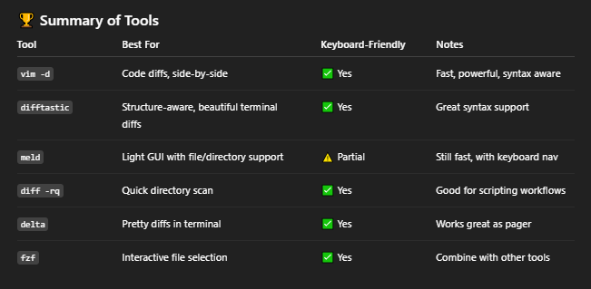

# Strategies

- DevOps related strategies notes

## Index

- [Index](#index)
- [A/B Testing](#ab-testing)
- [Black/White-Box Testing](#blackwhite-box-testing)
- [Blitz](#blitz)
- [Code Review Guidelines](#code-review-guidelines)
- [Deployment Pipeline Requirements](#deployment-pipeline-requirements)
- [Filepath Character Limit](#filepath-character-limit)
- [Keyboard-Centric Diff](#keyboard-centric-diff)
- [Time Boxing](#time-boxing)
- [Unit Testing](#unit-testing)

## A/B Testing

- Comparing two versions of something, and providing each to a split environment to observe differences in performance

## Black/White-Box Testing

- Black-box testing
  - Observing IO without looking at implementation
- White-box testing
  - Debugging w/ internals exposed and controlled

## Blitz

- Informal lingo for “a short, intense burst of work (coding, hackathon, or feature push) typically outside of normal process or cadence”
- …last minute push to meet a deadline
- デスマーチ

## Code Review Guidelines

- Everyone must have someone review changes before committing to trunk
- Everyone should monitor commit stream of fellow team members to potential conflicts can be identified and reviewed
- Changes identified as high risk should be designated review from a subject matter expert
- If someone submits a change that’s too large to reason easily (ie, if you need to ask for clarification), then it needs to be split up into multiple smaller changes to be understood at a glance

## Deployment Pipeline Requirements

- Deploying the same way to every environment
  - Will be much more successful when the same deployment process is executed at the development, test, and production level
- Smoke testing deployments
  - There must be tests to verify connection to all supporting systems (databases, message buses, external services)
- Ensure consistent environments are maintained
  - Ensure that all environments (development, test, and production) are synchronized

## Filepath Character Limit

- ...Windows historically enforces a filepath character limit of 260 characters
  - This means Git, IDEs, etc will complain when you try to commit or build files that have path lengths past 260 characters when working on Windows
- Sucks to adhere to Windows, but doesn't hurt to try and keep filepath as short as possible

## Keyboard-Centric Diff

- 
- Vim is just the best

## Time Boxing

- Forcing iterations to be a fixed period
- If functionalities can’t meet the deadline, decide on what functionalities to slip- don’t slip the date
- Allows a team to review project priorities

## Unit Testing

- Unit testing for C
  - Unity
    - Lightweight, portable unit testing framework for C
    - Good for embedded systems development
    - Used to write and manage test cases for verifying functions/modules in C
  - CMock
    - Tool to generate mock functions and header files
- Unit testing for C++
  - GTest + gMock
    - By Google
    - GMock is a library to create mock objects in C++
    - GTest is a framework for writing/running unit tests
- Both C/C++
  - CppUTest
    - Lightweight C++ unit testing framework for embedded systems
  - CppUMock
    - Mocking extension for CppUTest for simulating behavior for dependencies during tests
- Bazel
  - Open source build/test tool developed by Google
  - To be used w/ Java, C++, Python projects
- STL
  - “standard template library”
  - Fundamental C++ library
  - Provides data structures like vectors, maps, sorting algos, iterators for containers, etc
- Boost
  - Collection of C++ libraries extending functionality of STL
  - Includes ASIO library for low level embedded network/serial interfacing
  - Includes a unit testing framework to perform regression tests
    - Regression testing
- Process of re-running existing tests to ensure new changes haven’t broken existing functionality
