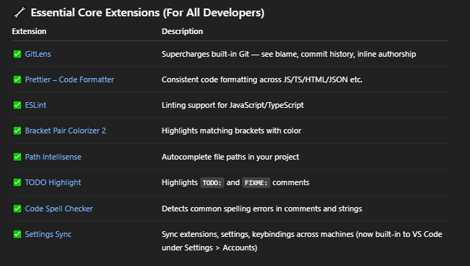
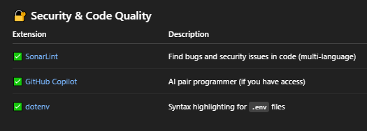
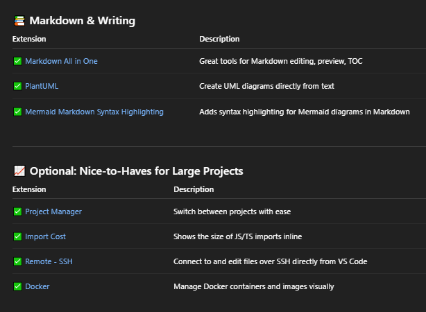

# DevOps Tools

## Index

- [Index](#index)
- [Ansible](#ansible)
- [Azure](#azure)
- [Conan](#conan)
- [DevOps Hierarchy](#devops-hierarchy)
- [Gradle](#gradle)
- [Groovy](#groovy)
- [Jenkins](#jenkins)
- [Nexus](#nexus)
- [Profiling Tools](#profiling-tools)
- [Terraform](#terraform)
- [VS Code Extensions](#vs-code-extensions)
- [YAML](#yaml)

## Ansible

- Automation tool for configuration management, application deployment, and task automation
- Used to manage servers / deploy applications via YAML scripts and “playbooks”
- “agentless”
  - No software installation needed
  - Uses SSH for Linux / Windows PowerShell to execute tasks
- This is the tool that allows servers to automatically run various tools to build, test, and deploy projects via servers

## Azure

- Cloud computing platform by Microsoft
- Allows deployment of VMs, w/ support for SQL and other services

## Conan

- No, not detective conan
- Package manager used to manage C/C++ project dependencies and libraries
- Automates finding, building, installing libraries
- Allows easy sharing/reusing of code, version management, and configuration management
- Integrates well w/ CMake
- Can be used as a high level tool to invoke other tools, as opposed to CMake w/ limited set of tool invoking capabilities

## DevOps Hierarchy

- An example chain of tools:
  - Jenkins hosts a server to run CI/CI pipelines
  - Terraform used to configure and set up the server
  - Projects on GitLab are built to generate build artifacts
  - Build artifacts are stored on Nexus
  - Binaries are loaded from Nexus to hardware and tested via Ansible scripts that run batch scripts

## Gradle

- Build automation tool for Java and Android projects
- Used to compile code, run tests, package applications, resolve dependencies, etc

## Groovy

- Language used by Gradle to write build scripts
- “Optionally typed” programming language
  - You can be either explicit or omit data types when declaring new variables and functions
- Also used by Jenkins for build automation to customize pipeline configuration and workflow

## Jenkins

- Open-source automation server to facilitate CI/CD
- Automates software development cycle including building, testing, deploying applications
- Allows developers to integrate code frequently and detect issues early
- Increases development speed and fortifies software releases
- Features
  - Build automation
  - Test automation
    - Unit testing
      - Individual components (code)
    - Integration testing
      - Testing interactions between components
    - System testing
      - Testing system as a whole
    - Acceptance testing
      - Testing that software meets user requirements
  - Deployment automation
    - Delivering and installing software to a production environment for end-users to use
    - Configuration
      - Setting up environment including server connections and database connections for software to run on
    - Installation
      - Deploying software artifacts to target environment; copying files and running installation scripts
    - Verification
      - Checking that software functions properly in production environment
    - Monitoring
      - Tracking performance and behavior of software in production
  - Pipeline support (steps to building/testing complex software)
  - Easy config
  - Implements monitoring (dashboards, reports, logs)
- .jelly files
  - Used to define UI for Jenkins web interface
- Groovy and Jenkinsfiles
  - Groovy
    - Dynamic, JVM-based scripting language used in Jenkins pipeline scripts
  - Jenkinsfile
    - What define Jenkins pipelines
    - Written in a DSL (“domain-specific language”) built on top of Groovy
    - It’s a sandboxed language for security-
      - Only whitelisted methods and classes can be used
      - Arbitrary Groovy code execution is restricted unless explicitly approved by an administrator
- Agents
  - Node that Jenkins uses to execute jobs- runs and builds tasks under the control of the Jenkins controller
    - Used to be called slave and master respectively
  - Jenkins can spin up agents on demand w/ Kubernetes, AWS, or Docker
  - Types of agents
    - Static agent
      - Manually configured
      - Always available
  - Dynamic agent
    - Created on-demand (cloud-based)
  - Cloud agent
    - Runs in cloud environments like AWS, Kubernetes, Docker
  - Container agent
    - Runs inside a Docker container for isolation

## Nexus

- Repository manager to centralize repositories across different platforms and environments
- Allows artifact versioning
- Integrates well w/ CI/CD tools like Jenkins and GitLab CI
- Supports managing Docker images as well

## Profiling Tools

- Tools that analyze program performance as it runs
- May measure:
  - Execution time
  - CPU usage
  - Memory usage/leaks
  - Cache misses / branch prediction metrics
- Examples:
  - Sampling profiles
    - Tool that periodically checks behavior
    - `gprof` for GNU based projects
    - `perf` for Linux
  - Instrumentation profilers
    - Tool that adds extra code in project source code to take measurements
    - `Valgrind Callgrind` for Linux
    - `gcov`/`lcov` for coverage profiling
  - Memory profilers
    - Tracking memory allocation/leaks/usage
    - `Valgrind Massif`
    - `Heaptrack`
  - Hardware / low-level profilers
    - Tracking CPU performance counters for cache misses, branch predictions, cycles, etc
    - `perf` for Linux
- Valgrind
  - As mentioned above, Valgrind is a framework of dynamic analysis tools to check for various issues
  - Primarily for Linux / other Unix-like systems
  - Great for C/C++ development

## Terraform

- Similar to Ansible, alleviates user management of build servers by taking config files to define the infrastructure of servers
- Mainly used to configure / set up servers as opposed to Ansible which deploys build artifacts and runs applications on servers
- By Hashicorp- same company that created Packer

## VS Code Extensions

- 
- 
- 
- GitHub Copilot is definitely worth looking into
  - ... That's provided we can follow best practices on our own to begin w/ ofc as heavily emphasized

## YAML

- “YAML ain’t markup language”
- Goodness stop GNU already did that it’s too late
- Human-readable serialization format
- Used for config files and data exchange between languages that may not share same data structures or types
