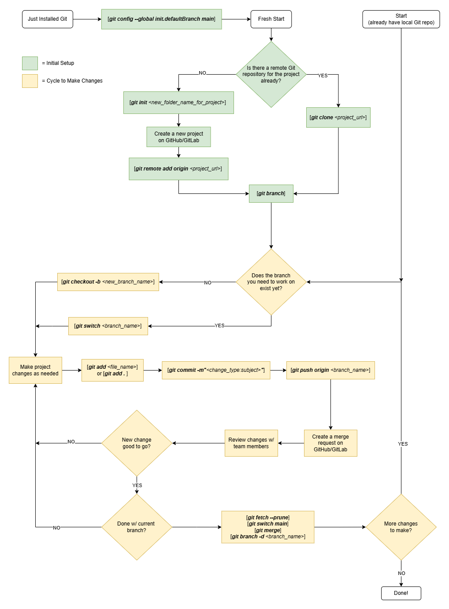

# Using Git

- Minimum guide to use Git for your development, + some extra good-to-know notes
- All you need to know to use Git is under **Essentials**
  - Overwhelming at first, but there's **very little you need to know** to use Git for its basic purpose
- All good-to-know notes are under the other index categories
- This guide:
  - Assumes Git Bash command line
  - Uses merge requests & conventional commit messages for good practice

## Index

- [Index](#index)
- [Essentials](#essentials)
  - [What's Git?](#whats-git)
  - [Initialization](#initialization)
  - [Work Cycle](#work-cycle)
  - [Using Git Flowchart](#using-git-flowchart)
  - [Conventional Git Commit Messages](#conventional-git-commit-messages)
- [Supplementary](#supplementary)
  - [Git Jargon](#git-jargon)
  - [Fixing Mistakes](#fixing-mistakes)
  - [Useful Commands](#useful-commands)
  - [Patch Mode](#patch-mode)
  - [Git Submodules](#git-submodules)

## Essentials

### What's Git?

- Git is a version control tool to maintain project history and efficiently collaborate w/ others
- Objectives:
  - Maintain a single working copy of our project online on GitHub/GitLab
  - Let everyone work on different parts of the project at the same time
  - Track every change that's made on the project

### Initialization

- Install Git Bash (and log into GitHub/GitLab account)
- Navigate Git Bash to the directory where you want your project to be (`cd your/project/path`)
- If you're contributing to an existing GitHub/GitLab remote repo
  - Clone the remote repo using `git clone your-project-url-here.git` ->
- If you're making a completely new project
  - Switch local git configuration to use `main` instead of `master` as the main branch name
    - `main` is conventional over `master`
    - New GitHub/GitLab initializes your repo w/ a `main` branch, but local git may assume a `master` branch
    - Call `git config --global init.defaultBranch main` to switch to `main` convention
    - `git branch -M main` can also be used to rename `master` to `main`
  - Start a new repo via `git init new-project-directory-name` ->
  - Create a new project on GitHub/GitLab and get the project URL
    - Make sure to uncheck "Initialize repository with a README" (having this checked will force you to use `git push -f origin main` to forcefully push your new commit over the initial commit w/ the dummy README)
  - Link the local repo and remote repo w/ `git remote add origin your-project-url-here.git`

### Work Cycle

- Create a new branch or switch branches to start making project changes:
  - `git checkout -b your-new-branch-name` to make a new branch to start making changes
    - Branch names should be descriptive, and be in kebab case (all lowercase, separated by hyphens)
  - `git checkout some-branch-name` or `git switch some-branch-name` if there's already a branch for you to make changes on
- Make changes on the new branch as needed ->
- `git add` files to the staging area ->
- `git commit -m“type: subject”` to bundle related changes together: refer to [Conventional Git Commit Messages](#conventional-git-commit-messages) for commit message convention ->
- `git push origin branch-name-with-changes` to push new branch and associated changes to remote repo
  - If you're pushing an initial commit, then add the `-u` flag (`git push -u origin main`)- refer to notes on "upstream" jargon for more details
- Repeat above until all changes are done
  - Group relevant changes together into commits
  - Don't stockpile too many unrelated commits into a single merge request
  - Renaming/moving files can be tracked as well- it can be its own commit
- **Create a Merge Request**:
  - Go to the remote repo on GitHub/GitLab and navigate to the new branch- you'll see your commit and push
  - Click on "create merge request"
  - Customize the merge request if needed, and create the merge request
  - Review the merge request w/ your team members
  - If the merge request was accepted and the branch was deleted
    - `git fetch --prune` to update local repo w/ the branch deletion
    - `git branch -d branch-to-delete` to delete the branch locally
    - Confirm that branches were deleted:
      - `git branch`
      - `git branch -r`
- After you're done w/ your changes, make sure to update your local repo w/ both your and your team members' changes:
  - Calling `git fetch --prune` already fetches the merge you made- if you didn't do that yet, then call `git fetch`
  - Switch to the main branch w/ `git switch main` if not already on main branch
  - Call`git merge` to update local repository w/ fetched changes

### Using Git Flowchart

- Below is a visual for using Git.
- You do the green stuff once, and continuously repeat the yellow stuff as you work. It's just a handful of commands you need to know on the regular.
  

### Conventional Git Commit Messages

- To commit w/ a header, body, and footer the command is:
  - `git commit -m “<header>” -m “<body>” -m “<footer>`
- **Header**
  - `<type>(<scope>): <subject>`
  - Ex: `git commit -m“docs(changelog): update changelog to beta.5”`
  - `type`:
    - Must follow below convention to tie w/ _Semantic Versioning_:
      - Fix
        - A commit of the type fix patches a bug in your codebase (this correlates with PATCH in Semantic Versioning).
      - Feat
        - A commit of the type feat introduces a new feature to the codebase (this correlates with MINOR in Semantic Versioning).
      - BREAKING CHANGE
        - A commit that has a footer BREAKING CHANGE:, or appends a ! after the type/scope, introduces a breaking API change (correlating with MAJOR in Semantic Versioning). A BREAKING CHANGE can be part of commits of any type.
    - **Semantic Versioning**
      - There’s a standard for versioning software (Minecraft’s 1.7.2 wasn’t just some random numbers)
      - The format is Major.Minor.Patch
        - Major
          - Change require user to modify their code/configurations to work w/ new version
          - Fundamentally changes how software works
        - Minor
          - Backward compatible update that adds new features, enhancements, improvements without breaking existing functionality
          - Deprecate a feature but leave it available
          - Minor improvements that don’t require changes from user
        - Patch
          - Backward compatible bug fixes and small improvements that don’t add any new features
    - Possible types include:
      - **fix**
        - Bug fix
      - **feat**
        - New feature
      - **build**
        - Changes that affect the build system or external dependencies (example scopes: gulp, broccoli, npm)
      - **ci**
        - Changes to our CI configuration files and scripts (example scopes: Travis, Circle, BrowserStack, SauceLabs)
      - **docs**
        - Documentation only changes
      - **perf**
        - Code change that improves performance
      - **refactor**
        - Code change that neither fixes a bug nor adds a feature
      - **style**
        - Changes that do not affect the meaning of the code (white-space, formatting, missing semi-colons, etc)
      - **test**
        - Adding missing tests or correcting existing tests
  - `scope`
    - Optional
    - Affected “packages” if there’s a clear scope affected by changes in commit
  - `subject`
    - Short description of the change
    - Use the imperative, present tense: "change" not "changed" nor "changes"
    - Don't capitalize the first letter
    - No dot (.) at the end
- **Body**
  - Just as in the subject, use the imperative, present tense: "change" not "changed" nor "changes". The body should include the motivation for the change and contrast this with previous behavior.
- **Footer**
  - The footer should contain any information about Breaking Changes and is also the place to reference GitHub issues that this commit Closes.
  - Breaking Changes should start with the word “BREAKING CHANGE”: with a space or two newlines. The rest of the commit message is then used for this.

## Supplementary

### Git Jargon

- **Remote repo**
  - Online repository where working project files are stored and version controlled
- **Working directory / working tree / local repo**
  - Local directory / repository where project files are being modified on your laptop/PC
- **Staging area**
  - Where files are stored when you use `git add <files>`
  - Space to indicate the modified files that should be packaged into a commit to eventually update the project on the remote repository
  - Allows preparation for a commit and eventual push to avoid constantly committing / uncommitting and fighting version history
- **Branching**
  - Method to create a new line of development on a project
  - Essential to keep the central repository clean and isolated from each development effort
- **Main vs master**
  - Confusing- it's just the name of the main branch of central repository
  - GitHub/GitLab now goes w/ “main” by default, but old repos and local git may still go by “master”
- **Head**
  - Reference to a commit object- the commit in a branch that’s being worked on or viewed in particular
  - When head isn’t pointing to the latest commit (via “git checkout”), the head is “detached”
- **Merge request**
  - After committing changes to the central repo, you can make a “merge request” before changes are reflected on central repo
  - Good to enforce code reviews and record all branch history
- **Conventional commits**
  - A "commit" is a snapshot of a project's files at a specific point in time
  - When you update the remote repo, you add new commits w/ a short message about the set of changes
  - There’s a standard for how to make commit/revision messages
    - Link: https://www.conventionalcommits.org/en/v1.0.0/
    - W/ conventional commits we are barbarians no more
    - Allows for easy navigation through Git commit history
- **.gitignore**
  - Ignore file to specify files that shouldn’t be version controlled
- **Upstream**
  - Refers to the remote branch that your local branch is tracking
  - ...so where your work is "flowing from" w/ `pull` and "flowing to" w/ `push`
  - Specifying the "upstream branch" tells git which remote branch to pull/push from/to
    - Allows for short `git push`/`git pull`/`git merge` commands
  - `git fetch`
    - Fetching isn't affected by the upstream branch specified
    - Calling `git fetch` downloads the entire remote repo to your local directory
  - `git merge`
    - After fetching, you need to merge the fetched changes to your local working tree to update your local files
    - The specified upstream branch determines what remote branch to merge into your working tree
  - So what branch should be the upstream branch?
    - If you have a branch you'll be working on for a while, set the upstream branch to that branch for easy merging
      - `git push -u origin some-branch-name`
      - ...and then going forward: `git push`, `git merge`
    - If you're creating short lived branches that are constantly being merged in, you could just keep `main` as the upstream branch until one day you're on a long-term branch
      - `git push -u origin main` on initial commit, or `git branch -u origin/main`
      - ...then going forward: `git push origin short-lived-branch-name`, `git merge` to update your local main branch w/ remote repo's main
- **Merge conflict**
  - When calling `git merge` or the merge integrated into `git pull`, git can alert a merge conflict when:
    - A file has overlapping changes
    - A branch deletes a file, while another modifies it
    - There are conflicting file mode changes or a rename
    - Changes are being made to binary files or submodules
  - Best practice is to let the merge conflict occur, and to then create a commit that resolves the merge conflict
    - `git add .`
    - `git commit`
- **Fork**
  - Forking allows you to copy a repo from one Git account to another
- **Rebasing**
  - `git rebase`
  - Method to combine commit history of one branch w/ another branch
  - Rule of thumb: use it as much as you want on local commits, but don't bother if the changes are already shared w/ another developer
- **PAT**
  - “personalized access token”
  - Used to allow users access to API’s, command-line tools, and other automated systems on a version control system

### Fixing Mistakes

- **Remove file from staging area**
  - `git reset HEAD <filename>`
  - Two different scenarios:
    - 1- removing files from staging area
      - Use `git reset HEAD <filename>`
    - 2- preventing files from being tracked (prevents git from checking whether the file's been changed/deleted/etc)
      - Use `git rm --cached <filename>`
      - This isn't for unstaging changes
- **Restore a file back to most latest commit**
  - Changes that weren’t committed CAN’T be recovered
  - `git restore <filename>`
  - `git restore –source HEAD~<N> <filename>`
  - N is number of commits behind latest commit if we want to go back further
- **Switch working tree to an old commit for viewing**
  - `git checkout`
  - Switching to old revision of a branch
    - `git checkout <7 digit rev # found w/ git log>`
    - Commits can’t be made while head is “detached”, but you can make a new branch while the head is detached to then make changes and eventually merge to central repo
  - Switching branches
    - `git checkout -b <branchname>`
    - Used to switch branches
    - The “-b” flag indicates that a new branch should be created if it doesn’t exist
    - Later comes along `git switch <branchname>` and `git switch -c <branchname>` to switch branches and create new branches, but `git checkout` can do this too
- **Revert and start editing from an old commit**
  - To revert entire working tree to an old commit:
    - `git restore --source=commitHashHere -- .`, or `git checkout commitHashHere -- .`
    - Then just add and commit
    - This doesn't detach the HEAD pointer- just modifies files in working tree
  - To revert particular files
    - `git restore --source=commitHashHere someFile.c`, or `git checkout <commit-hash> -- someFile.c`
    - This doesn't detach the HEAD pointer either
- **Temporarily save files on working tree**
  - You can temporarily save changes in your working directory w/ `git stash`
  - `git stash push -m"some message here"` or `git stash push <filepath>`
  - `git stash list` to get your list of stashes
  - `git stash apply stash@{1}` to merge stashed changes to working directory w/o clearing stash
  - `git stash pop stash@{1}` to merge and clear the stash
  - `git stash drop stash@{2}` to delete a specific stash
  - `git stash clear` to delete all stashes
  - `git stash push --p -m"some message here"` to pick and choose what changes to save to stash from current working tree
- **Fix a Commit**
  - After git commits are made but before they're pushed to remote and merged, they can be modified:
  - If it's the most recent commit:
    - Make the file changes, add them w/ `git add`, and then call:
    - `git commit --amend -m"new commit message here"`
    - To overwrite the most recent commit
  - If it's not the most recent commit:
    - Pain
    - First find the commit w/ `git log`
    - If you want to modify `f4e5d6e` (2 commits behind HEAD), then start an interactive rebase w/ `git rebase -i HEAD~2`
    - That then opens an editor in the console to show:
    - Modify `pick` to `edit` for the first line
      - `pick`- keep as is
      - `edit`- change files/message for the commit
      - `drop`- delete commit
    - Git then starts replaying each commit, and stops at the commit you marked for editing
    - You can then make your changes, stage them w/ `git add`, and commit w/ `git commit --amend -m"new commit message here"`
    - Then call `git rebase --continue` to finish the job

```
a1b2c3d Fix typo in config
f4e5d6e Add logging
123abcd Initial commit
```

```
pick f4e5d6e Add logging
pick a1b2c3d Fix typo in config
```

- **Delete commits/revisions**
  - To delete the most recent commit:
    - `git reset --soft HEAD~1`
      - Keeps changes staged
    - `git reset --mixed HEAD~1`
      - Removes changes from staging area, but keeps working tree as is
    - `git reset --hard HEAD~1`
      - Deletes changes from both staging area and working tree
  - ...if further back:
    - `git reset <7 digit rev #>`
      - Moves head pointer to specific rev #
      - Doesn’t change local directory files or staging area
    - `git reset <7 digit rev #> --hard`
      - Moves head pointer to specific rev #, and modifies local directory to match rev # and clears out staging area
- **Undo work from a commit/rev w/o deleting the commit/rev from history**
- `git revert`
  - Preferred over `git reset` to preserve history

### Useful Commands

- `git --version`
  - Check if git installed
- `git init <new_project_directory_name>`
  - **don’t use this command inside of a repo**- that's what submodules are for
  - Initializes git repo on local machine
  - Creates .git file to manage versioning and history
  - Creates a new directory in the directory wherever the cmd /Git Bash currently is w/ the provided directory name
- `git remote add origin <repo-url>`
  - Used to manage how a repository interacts w/ other repositories
  - Not often used, but confused w/ `git clone`
  - If local repo created first before remote repo: after creating a remote repo on GitHub/GitLab you can link a local repo to the remote repo w/ this command
- `git clone <project url>`
  - Used to copy a remote repository to your local machine if there’s a remote repo for a project already
- `git status`
  - Reports status of Git repo
  - Essential- use it often to check Git status (status of commits, staged files, etc)
- `git log`
  - Shows list of commits made to repository
  - Includes hash, message, metadata
  - `git log` to show everything
  - `git log --oneline` to show each commit in one line
  - `git log -1 -p HEAD` to show changes made in the latest commit
- `git branch`
  - Displays branches being worked on
  - `git branch <branch name>` creates a new branch
  - `git switch `switches branches
  - Rename a branch
    - `git switch <branch to rename>`, and then `git branch -m <new branch name>`
  - Delete branch
    - `git branch -d <branch to delete>`
    - Branch currently being viewed (where head is pointing) can’t be deleted
    - You’ll get warned if your branch hasn’t merged w/ central repo yet
  - Set upstream branch
    - `git branch -u origin/<branch name>`
- `git switch <branchname>`
  - Switches to new branch
  - `git switch -c <branchname>` creates a new branch if there isn’t a branch named <branchname>
- `git fetch`
  - Grabs changes in .git directory in remote central repository to prepare to update local repository
  - Doesn’t update local repository yet
- `git merge`
  - Used to update local repository when central repo is ahead
  - Also used to update central repo if local repo is ahead and no changes were made to central repo otherwise- **use merge requests instead** if you're trying to update the central repo
  - Called “fast forward merge”
  - `git switch main`, and then `git merge <branch w/ changes>`
- `git pull`
  - Bad practice- don’t use unless you know it's a fetch & merge
  - Updates local repository w/ files fetched w/ `git fetch`
  - Same as running `git fetch` and then `git merge`
  - `git fetch` and then `git merge` gives you better control of the process by showing you what's being fetched from the remote repository before you update your local repository
- `git diff`
  - Displays differences between file and branch versions
  - `git diff` to show differences between working tree and staging area
  - `git diff --staged` to diff the repo and staging area (so minus any changes that aren't staged yet)
  - `git diff <branch1> <branch2>` to diff two different branches
  - `git diff HEAD`, `git diff commitHashHere` to diff the working tree and a commit in repo
  - `git diff firstHash secondHash` to diff two git commits
- `git add <filename>` or `git add . `
  - Add new or changed files to the staging area to prepare for a commit
- `git commit`
  - Wrap together all desired changes on the staging area to be pushed to the remote repository w/ a commit message
  - Refer to [Conventional Git Commit Messages](#conventional-git-commit-messages) to follow best commit practices
- `git push -xx origin <branch name>`
  - Push all commits prepared to central (master/main) repository
  - `git push -u origin <main/master>`
    - Pushes commits to main/master branch called “origin”
    - The -u flag “sets the upstream branch”, meaning that local main branch is tied to remote origin/main branch so that future `git push` and `git pull` will default to this branch specified going forward
    - The -f flag forces the push to overwrite the remote branch w/ local branch ignoring conflicts and changes on remote branch that aren’t on local branch (overwrites remote history w/ local history)
- `git bisect`
  - You can use `git bisect` to pin point a bug that you don't know was introduced when:
  - First call `git bisect start`
  - Mark the bad commit (current commit): `git bisect bad`
  - Mark the good commit (some commit that has a working state): `git bisect good commitHashHere`
  - Git will check out each commit so you can test, and after each you can indicate `git bisect bad` or `git bisect bad`
  - After finishing, you can revert the working tree back to its original state w/ `git bisect reset`
- `git cherry-pick`
  - When a commit needs to be picked from another branch and merged into a local branch (critical bug fix, etc), you can "cherry-pick" it
  - While in the branch you want to add the commit to:
    - Get the commit hash for the commit in another branch
    - Call `git cherry-pick commitHashHere` to create a new commit w/ the same changes
    - If there are conflicts, git will prompt it
- `git tag`
  - Tags are used to label specific commits
  - There are light-weight tags and annotated tags
    - Light-weight tags
      - Just a name pointing to a commit
      - `git tag v1.0.0`
    - Annotated tags
      - Includes tagger name, email, data, and a message
      - `git tag -a v1.0.0 -m"Release version 1.0.0"`
  - Other commands
    - `git tag` list all tags
    - `git show v1.0.0` show details for a tag
    - `git push origin v1.0.0` push a specific tag

### Patch Mode

- Powerful parameter to stage, restore, and stash parts of files
- Allows us to continue working over command line instead of having to modify files manually to have nice commits or when debugging
- Staging/Unstaging
  - `git add -p someFile.c` or `git add --patch someFile.c`
  - `git reset -p`
- Stashing
  - `git stash -p`
- Discarding
  - `git restore -p`
- Interactive checkout
  - `git checkout -p <branch> <file>`

### Git Submodules

- Alternative for when you have multiple git repos that are dependent on one another, and projects haven't migrated to CMake
- The command is:
  - `git submodule add <repository-url> <path-to-submodule>`
- ...and then just commit the change as an independent change that adds the submodule
- Then when someone clones the repo w/ the submodule in it, they need to initialize the submodule:
  - `git clone --recurse-submodules <your-repo-url>`, or:

```
git clone <your-repo-url>
cd <your-repo>
git submodule update --init --recursive
```
