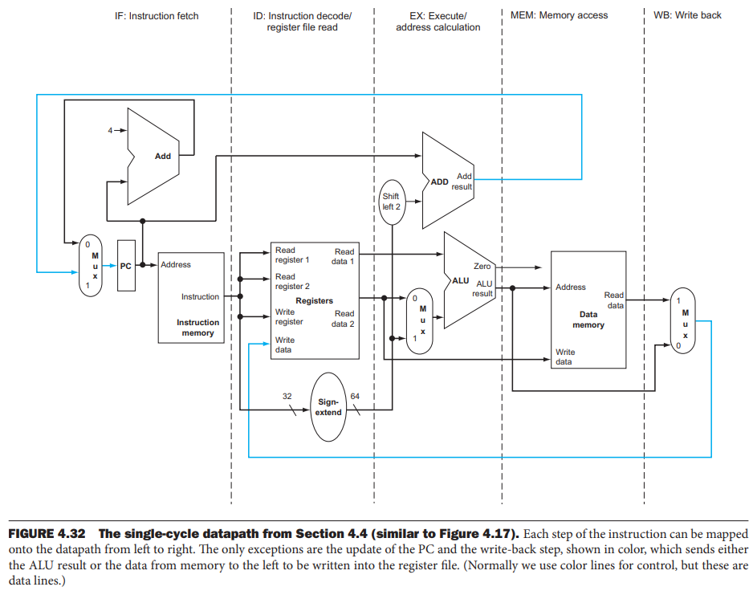
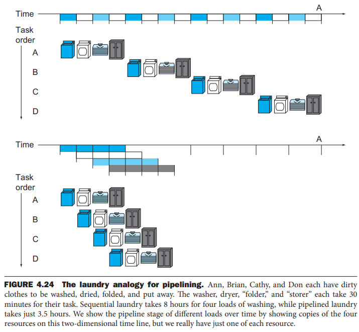
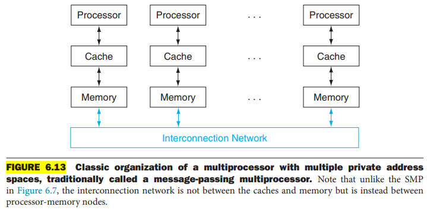
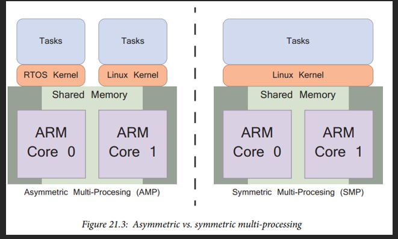

# Architecture

- Computer architecture related embedded notes

## Index

- [Index](#index)
- [Asymmetric Processing](#asymmetric-processing)
- [Basic Processor Pipeline Stages](#basic-processor-pipeline-stages)
- [Computer Engineering](#computer-engineering)
- [CPU vs IO Bound](#cpu-vs-io-bound)
- [Data Level Parallelism](#data-level-parallelism)
- [Datapath Element](#datapath-element)
- [Harvard Architecture](#harvard-architecture)
- [Heterogenous Computing](#heterogenous-computing)
- [HPS](#hps)
- [Instruction-Level Parallelism](#instruction-level-parallelism)
- [Multiple Issue](#multiple-issue)
- [Northbridge, Southbridge Chip](#northbridge-southbridge-chip)
- [Pipeline Hazards](#pipeline-hazards)
- [Pipelining](#pipelining)
- [RISC Design Principles](#risc-design-principles)
- [RISC vs CISC](#risc-vs-cisc)
- [Shared Memory Processors](#shared-memory-processors)
- [SIMD](#simd)
- [Strong/Weak Scaling](#strongweak-scaling)
- [Symmetric Multi-Processing](#symmetric-multi-processing)
- [Tightly/Loosely Coupled CPUs](#tightlyloosely-coupled-cpus)
- [VLIW](#vliw)
- [Von Neumann Architecture](#von-neumann-architecture)
- [“Architecture” Definition](#architecture-definition)
- [“Micro-architecture” Definition](#micro-architecture-definition)

## Asymmetric Processing

- Processing where cores in a system have different roles and capabilities
- Like in ARM where you can assign individual cores to an RTOS and others to bare metal

## Basic Processor Pipeline Stages

- 
- Classic 5 Stage Pipeline:
- Instruction Fetch
  - Fetch instruction from memory
  - Increment program counter
  - Output instruction bits
- Instruction Decode
  - Decode opcode to figure out what operations to perform
  - Read source registers from register file
  - Sign extend immediates if needed
  - Output operands + control signals
- Execute / Effective Address
  - Perform ALU operation (add, subtract, AND, shift, etc)
  - If it's a memory access, compute effective address
  - If it's a branch, evaluate the condition and possibly compute new PC
- Memory Access
  - Load -> read data memory/cache
  - Store -> write to data memory/cache
  - If not memory related, just pass through ALU
- Write-Back
  - Write back result to register file

## Computer Engineering

- The study of building contraptions to automate processing and computation using software and hardware

## CPU vs IO Bound

- CPU bound
  - When IO is faster than software, and the CPU becomes the bottleneck
- IO bound
  - When CPU is faster than inputs, and inputs become bottleneck

## Data Level Parallelism

- Parallelism where the same operation is applied simultaneously to multiple pieces of data
- SIMD
- When parallelism is implemented w/in a wide word, it's called "subword parallelism"

## Datapath Element

- A unit used to operate on / hold data w/in a processor
- Ex: instruction/data memories, register file, ALU, adders, etc

## Harvard Architecture

- Implemented simultaneous read and write
- Von Neumann architecture is still abundant for its simplicity- but together w/ Harvard

## Heterogenous Computing

- Computing architecture that integrates a bunch of different types of processors (CPU, GPU, FPGA, specialized accelerators (AI accelerator, etc)) to optimize performance and efficiency

## HPS

- “hard processing system”
- Refers to a processor fabricated in an SoC w/ silicon as opposed to generated w/ PL
- Acronym that shows up in Intel/Altera SoCs- Xilinx documentation refers to their hard processor as PS, and programmable logic as PL

## Instruction-Level Parallelism

- Having a processor execute multiple instructions in parallel without waiting for each instruction to finish
- Aka, pipelining
- Modern processors execute multiple instructions per clock cycle
- These processors are called "superscalar processors"

## Multiple Issue

- A scheme to run multiple instructions in one clock cycle
- Static multiple issue
  - Multiple issue by having the compiler interpret/modify logic for some target hardware
- Dynamic multiple issue
  - Multiple issue by having the processor make decisions during execution

## Northbridge, Southbridge Chip

- Refers to division of labor between different chips in a system
- Northbridge
  - Handles high-speed communication w/ CPU, RAM, graphics
- Southbridge
  - Handles lower speed IO and peripheral connections

## Pipeline Hazards

- Items that prevent the next instruction from being executed in the following clock cycle
- Pipeline stall
  - Aka, "bubble"
  - A stall initiated to resolve a hazard
- Structural hazard
  - When a particular architecture doesn't have modular blocks/stages to allow a combination of instructions to be executed one after another
- Data hazard
  - Aka, "pipeline data hazard"
  - When an instruction can't execute due to data needed not being available yet
  - Forwarding/bypassing
    - When internal buffers are used to prevent data hazards
  - Load-use data hazard
    - When a load instruction is executed, and the next instruction can't execute due to needing the newly loaded data that isn't available yet
- Control hazard
  - Aka, "branch hazard"
  - A stall from when a processor is executing unrelated instructions when there's an instruction that needs the result of a particular instruction to execute
- Interrupts are considered pipeline hazards too
  - Imprecise interrupt
    - Aka, "imprecise exception"
    - Interrupts/exceptions in a pipeline that aren't associated w/ the exact instruction that caused the interrupt/exception
  - Precise interrupt
    - Aka, "precise exception"
    - Interrupts/exceptions that are always associated w/ the instruction that caused the interrupt/exception
- Dynamic pipeline scheduling
  - Hardware support to reorder instructions to avoid stalls

## Pipelining

- 
- Breaking down instruction execution into multiple stages to efficiently overlap instruction execution to minimize overall application execution time and maximize throughput
  - Utilizes hardware resources efficiently- fetch the next instruction, decode, and execute all at the same time
- Easier to manage with modular instruction handling and execution
  - Efficient juggling of instructions that take different times to execute
  - Easy to scale for improvements
- Modern processors have deep pipelines (15 stages+) to try and maximize processor clock rate, but there are diminishing returns due to time taken to get data between pipeline registers

## RISC Design Principles

- All instructions directly executed by hardware
  - So no interpretation- all of that is done by the compiler or interpreter
- Maximize instruction issue rate
- Instructions should be easy to decode
- Only loads/stores should reference memory
- Provide plenty of registers

## RISC vs CISC

- One instruction per cycle vs multiple
- RISC machines require more memory due to needing more instructions per task, but CISC machines take longer to execute in exchange for using less memory
- CISC came first, and then came RISC
- In the 1980s RISC vs CISC was a battle, and by 1990s it was clear that neither in their purest forms were optimal, so designs that merged the two were developed

## Shared Memory Processors

- A parallel processor w/ a single physical address space
- Multicore processors are almost always SMPs
- "Multicomputers"
  - 
  - You can provide each processor w/ private memory, and implement a method for the processors to communicate w/ each other too

## SIMD

- “single instruction, multiple data”
- Parallel processing technique used to perform an operation on multiple pieces of data at the same time
- Often used for video and image processing, audio encoding/decoding, 3D graphics rendering, etc
- CPUs and GPUs can have dedicated SIMD units for efficient SIMD execution
- SIMD extensions are made for modern CPUs and GPUs like SSE (“steaming SIMD extensions”) for x86 architecture, NEON for ARM architecture, and AVX (“advanced vector extensions”) for both
- Related concepts:
  - SISD
    - "single instruction stream, single data stream"
    - So a uniprocessor
  - MIMD
    - "multiple instruction streams, multiple data streams"
    - So a multiprocessor
  - SPMD
    - "single program, multiple data streams"
    - The conventional MIMD programming model where you have a single program run across multiple processors
- Vectorization
  - Process of converting "scalar" operations (one element operated on at a time) into SIMD operations

## Strong/Weak Scaling

- Strong
  - Speed-up achieved on a multiprocessor without increasing the size of the problem
- Weak
  - Speed-up on a multiprocessor that increases the size of the problem proportionally to the increase in the number of processors

## Symmetric Multi-Processing

- When a collection of CPUs in a system w/ matching architectures are used to run a single OS instance, dividing work across each core
- 
- No defined number of bits

## Tightly/Loosely Coupled CPUs

- Tightly coupled refers to two CPUs/processing elements that are close together, have high-bandwidth, and have low delay between them
- Loosely coupled means there's high delay, and are computationally remote

## VLIW

- "very long instruction word"
- When a processor architecture is made to take wide instruction words generated by a compiler by bundling multiple instructions together

## Von Neumann Architecture

- By John von Neumann in 1945
  - Was a genius- could recite textbooks verbatim hot damn
- Main components
  - CPU- ALU and control unit
  - Memory- program and data
  - IO devices
  - Bus system- data, address, and control buses
- Stored program concept
  - Both program instructions and data stored in the same memory, and CPU fetches instructions/data from memory
- Single memory and bus system
  - As above, one memory for both code and data
  - A single data bus connects CPU, memory, and IO
  - So instructions and data can't be fetched at the same time- Von Neumann bottleneck
- Sequential instruction execution
  - CPU executes instructions one after another in a cycle
  - Fetch, decode, execute

## “Architecture” Definition

- A contract between hardware and software
- Defines how a processor will behave- includes
  - Instruction set
    - Instruction functions
    - How instructions are represented in memory
  - Register set
    - Size of registers, initial values, number of registers
  - Exception model
    - Exception types, levels of privilege
  - Memory model
    - How memory accesses are requested
  - Debug, trace, and profiling
    - How breakpoints are set and triggered
- ARM provides a “base system architecture”, which is used to build higher level architectures on top
- The “architecture” level doesn’t explain how a processor works (it’s just what’s required to write software using the processor)

## “Micro-architecture” Definition

- The design of a processor including how it works in detail- includes
  - Pipeline length and layout
  - Number of and size of caches
  - Cycle counts for instructions
  - Optional features implemented
- Processors can use the same architecture, and implement different micro architectures around a particular main ARM CPU
