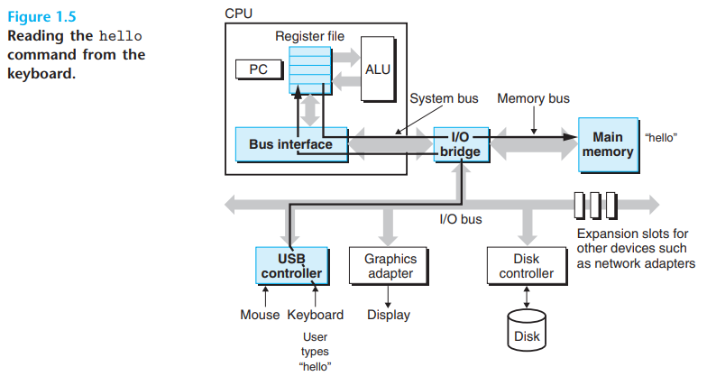
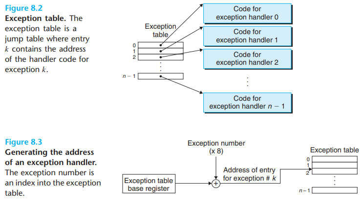
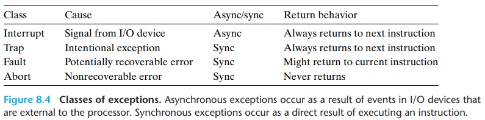
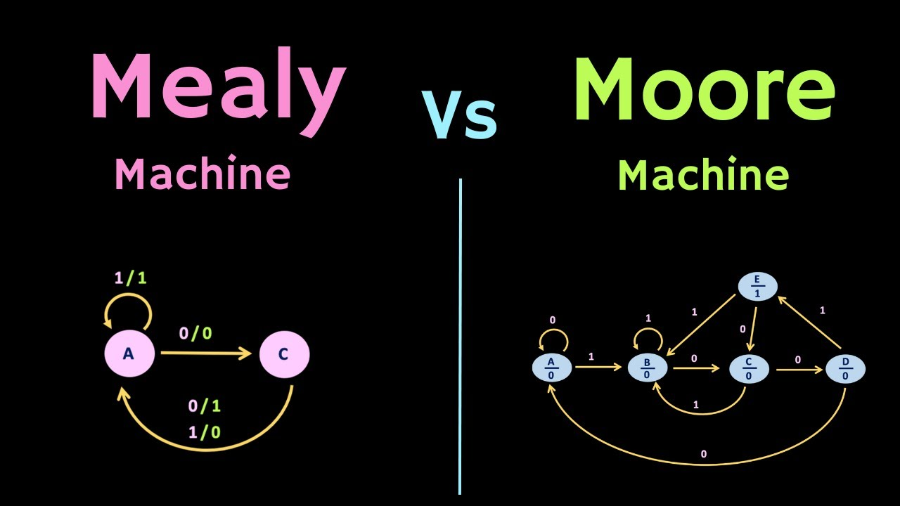

# Fundamentals

- Fundamental embedded notes
- List of fundamental and frequently encountered embedded systems concepts

## Index

- [Index](#index)
- [Overview](#overview)
- [Bare-Metal](#bare-metal)
- [Bit vs Base-10](#bit-vs-base-10)
- [BOD](#bod)
- [BSP](#bsp)
- [Bus Definition](#bus-definition)
- [Clock Cycle](#clock-cycle)
- [Clocking](#clocking)
- [CMSIS](#cmsis)
- [Core Dump](#core-dump)
- [Design Nuances](#design-nuances)
- [DO-178 & DO-254](#do-178--do-254)
- [Driver Definition](#driver-definition)
- [Embedded System Definition](#embedded-system-definition)
- [Endianness](#endianness)
- [Event vs Data Driven Systems](#event-vs-data-driven-systems)
- [Everything About `printf()`](#everything-about-printf)
- [Everything Before `main()`](#everything-before-main)
- [Exceptions](#exceptions)
- [Feedforward vs Feedback Control](#feedforward-vs-feedback-control)
- [FPU](#fpu)
- [FSM](#fsm)
- [HAL](#hal)
- [Handshaking](#handshaking)
- [HIL](#hil)
- [Hook vs Callback](#hook-vs-callback)
- [IO Definition](#io-definition)
- [Middleware](#middleware)
- [Module Definition](#module-definition)
- [Moore's Law](#moores-law)
- [Nibble](#nibble)
- [OEM](#oem)
- [Port vs Register](#port-vs-register)
- [Position Dependent/Independent Code](#position-dependentindependent-code)
- [Reset Vector](#reset-vector)
- [Serial Bootloaders](#serial-bootloaders)
- [Software vs Hardware Breakpoint](#software-vs-hardware-breakpoint)
- [Software vs Hardware vs PL](#software-vs-hardware-vs-pl)
- [Spectrum Analyzer, Logic Analyzer](#spectrum-analyzer-logic-analyzer)
- [SWaP-C](#swap-c)
- [System Programming Interface](#system-programming-interface)
- [Transformative vs Reactive Systems](#transformative-vs-reactive-systems)
- [TTL](#ttl)
- [Vector Table](#vector-table)
- [Watchdog Timer](#watchdog-timer)
- [Word Definition](#word-definition)

## Overview

> Hardware and software are logically equivalent.
>
> Any operation performed by software can also be built directly into the hardware, preferably after it is sufficiently well understood. As Karen Panetta put it: "Hardware is just petrified software." Of course, the reverse is also true: any instruction executed by the hardware can also be simulated in software. The decision to put certain functions in hardware and others in software is based on such factors as cost, speed, reliability, and frequency of expected changes."

- _Structured Computer Organization_

## Bare-Metal

- Refers to a system that lacks an extensive OS- no virtualization or hypervisor
- A system can include a “standalone OS” like FreeRTOS, Zephyr, etc to provide a lightweight OS to abstract hardware interfacing and provide multithreading, while still keeping the system “bare-metal”

## Bit vs Base-10

- "Binary Digit"
  - Binary is great for computers to store information
- Base-10
  - Developed in India by Arab mathematicians in the 12th century, brought to the West in 13th century by Italian mathematician Fibonacci (Leonardo Pisano)
  - Great for 10 fingered creatures

## BOD

- “Brown-out detection”
- Feature on MCUs and MPUs to detect when supply voltage drops too low to trigger a hardware reset

## BSP

- “board support package”
- Software used to perform basic operations to interface w/ hardware (processor, mcu, etc)
- Software that contains boot firmware (permanent software that runs on ROM) and device drivers for the specific hardware and an embedded OS needs to run on
- As defined by AMD:
  - Support code for a given hardware platform or board that helps in basic initialization at power up and helps software applications to be run on top of it.
  - It can be specific to some operating systems with bootloader and device drivers

## Bus Definition

- An electrical conduit that carries bytes of information back and forth between components
- 
- IO bus
  - Unlike system/memory buses that are CPU-specific, IO buses are designed to be independent of the underlying CPU
  - IO buses are slower than memory/system buses, but can accommodate a wide variety of third-party IO devices
  - USB, graphics card, host bus adapter
- Host bus adapter
  - Bus to connect one or more disks to IO bus using a communication protocol defined by a "host bus interface"
  - SCSI and SATA are "host bus interfaces"

## Clock Cycle

- Aka, tick, clock tick, clock period, clock, cycle, etc
- Time for one clock period- usually one processor clock if not specified
- CPI
  - "clock cycles per instruction"

## Clocking

- Method where clock is used to determine when data is valid/stable
- A clocked system is called a "synchronous system"
- Edge-triggered clocking
  - Scheme where all state changes happen on clock edges
- Synchronization failure
  - When hardware enters a metastable state due to failure to adhere to clocking

## CMSIS

- “common microcontroller software interface standard”
- Defines macros to reduce software reuse across developers
- Made by ARM

## Core Dump

- Aka "memory dump" or "core file"
- A snapshot of a program's memory and execution state at a particular time
- ...This means reverse-engineering machine language to assembly language and cross-referencing w/ memory to understand what a program was doing
- "Core" comes from "magnetic core memory" of older computers
- W/ no core dump implementation or OS, a user can write contents of RAM to flash or something external upon encountering crashes
- Things that are needed:
  - Line of code that caused the crash
  - Variables held in RAM at the time
  - Stack trace of function calls

## Design Nuances

- Nuances for designing embedded systems:
- Cost sensitivity
  - Shaving a penny off of a design is critical for a company making millions of something
- Real-time
  - Take input, and respond predictably and promptly
- Physical constraints
  - Size, weight, battery consumption, and other electrical/mechanical limits

## DO-178 & DO-254

- DO-178
  - Document used to certify commercial software-based aerospace systems
  - Software Considerations in Airborne Systems and Equipment Certification
  - Managed by RTCA SC-180 and EUROCAE WG-46
  - Used by authorities like FAA, EASA, and Transport Canada
- DO-178A and DO-178B
  - A came first, and then came B to emphasize a verification process and structure on top of testing requirements
- DO-254
  - Document used to certify airborne electronic hardware
  - Design Assurance Guidance for Airborne Electronic Hardware
  - Managed by RTCA SC-180 and EUROCAE WG-46

## Driver Definition

- Tossed around just like "server" is used to refer to any computer that manages resources
  - ...well that is what server means
  - It's just as useful of a word as "dumpling" when you look at its formal definition (bro no empanadas are not dumplings)
- Driver refers to the layer of software that interfaces w/ hardware
- Types of drivers include:
  - Low-level drivers
    - Direct register access, so vendor HAL, CMSIS, etc
  - High-level drivers
    - Device or protocol specific drivers, so temp sensor driver that uses I2C internally, etc
  - Peripheral drivers
    - GPIO driver, UART driver, timer driver, etc
  - Device drivers
    - Accelerometer driver over rSPI, LCD display over some bus, motor controller over PWM, etc

## Embedded System Definition

- "An embedded system is a computerized system that is purpose-built for its application"
  - Elicia White in _Making Embedded Systems_
- ...Need to revisit Prof. Short's definition too, but if memory serves he described it as a system that doesn't require the user to know its inner workings
- Because the system is made for a particular application, resources that aren't needed are cut out
- Resource constraints include:
  - Memory (RAM)
  - Code Space (ROM or flash)
  - Processor cycles or speed
  - Power consumption (battery life)
  - Processor peripherals
- Another newer term from 2006 by Helen Gill is "cyber physical system", where the "intelligence of a computer is combined w/ physical objects of the world"

## Endianness

- Originates from _Gulliver Travels_ by Jonathan Swift, where people were arguing over which side of the egg to crack first and calling each other "big" and "small" endians
- Little endian refers to LSB in lower addresses
  - X86 and ARM are little endian
- High endian is the opposite- MSB in lower addresses
  - IBM, Motorola, etc are big endian
- The issue is that big endian came first, and then engineers realized that little endian is more efficient
  - ...but as Jonathan Swift illustrates- it's meaningless
- Modern processors (after 1970's) and IC's assume little endian, but older
- Endianness causes issues when:
  - 1: binary data is communicated over a network
    - When a little-endian machines communicates w/ big-endian machine, one needs to account for the other
  - 2: when underlying byte sequence representations of objects are uncovered
    - If you `memcpy()`, endianness isn't taken into consideration- bytes on memory are copied as they are
    - Ie, the result of a `memcpy()` of all elements on a 32-bit array to an 8-bit array will vary according to the target architecture
  - 3: when programs are written to circumvent the normal type system
    - ...if you do something weird w/ Union/casing to allow an object to be referenced according to a different data type from which it was created, results will vary by target architecture

## Event vs Data Driven Systems

- Event-driven systems
  - Systems that update state and respond to events (periodic sensors, human interfacing, etc)
- Data-driven systems
  - No events, and constant data processing instead
  - Examples
    - Airplane's black box recording audio and telemetry
    - Gunshot location sensor
    - Satellite recording image data
    - MP3 player translating digital data to analog output
    - Auto-positioning system

## Everything About `printf()`

- `printf()` as a function available in the C standard library is standardized
- The lower I/O layer is all that varies across each hardware platform:
  - Linux: output goes to stdout FILE buffer
  - Windows: output goes to console via Windows `WriteFile()` function, or redirected to stdout (pipe/file)
  - Embedded applications (MCU, SoC, etc): output can be implemented to go to UART, SWO/ITM, Semihosting, USB CDC, etc

```
printf()
   └─> vfprintf(stdout, ...)
          └─> parse format string
              └─> convert arguments to text
                  └─> fwrite()
                       └─> stdout->write function
                            ├─ Linux → write()
                            ├─ Windows → WriteFile()
                            ├─ MCU → UART_putc()
                            └─ Custom → anything
```

## Everything Before `main()`

- There's a lot done before program execution (so before main()):
- Reset / power-on
  - CPU has an interrupt to get out reset/power-up
  - Program counter is loaded from a special location (often address 0x00 or BootROM vector table)
  - CPU begins execution from the reset vector
- Startup / reset handler
  - Reset vector points to a startup routine (often in assembly, part of the C runtime / "CRT0")
  - Where all pre-main initialization happens
- Stack & vector table initialization
  - Initial stack pointer is set (from a value stored in vector table)
  - Interrupt vector table initialized (sometimes remapped if not fixed in ROM)
- Memory initialization
  - Copy initialized data (.data section) from flash/ROM to RAM
  - Zero-initialize uninitialized data (.bss section)
- Hardware-specific init
  - Sometimes there can be low-level hardware init that happens before C code runs including:
    - Clock system setup
    - Watchdog disabling to avoid resets during startup
    - Memory controller setup if using external RAM/flash
  - Division of labor between:
    - ROM bootloader (done by silicon vendor)
    - Startup code (linked w/ your program)
- Call global constructors
  - If working in C++, constructors for global/static objects are executed before main()
- Branch to main()
  - After all that, runtime jumps to main() function w/ initialized runtime environment

## Exceptions

- An event that disrupts normal execution of a program and causes CPU to transfer control to a special piece of code (exception handler)
- When a processor detects an event, an indirect procedure call ia made through a jump table called an "exception table" to an OS subroutine ("exception handler") designed to process the kind of event
- ...sometimes "interrupts" are isolated from "exceptions", where "exceptions" refer to just the asynchronous interruptions in control flow
- After an exception handler runs, the outcome can be:
  - Handler returns control to the instruction that was executing when the event occurred
  - Handler returns control to the instruction that would have executed next had the exception not occurred
  - Handler aborts the interrupted program
- 
  - Each possible type of exception has an associated "exception number"
  - The OS allocates and initializes a jump table called an "exception table" that has all of the handler addresses to jump to for each exception
- 
  - Synchronous vs Asynchronous
    - Synchronous exceptions occur as a result of running an instruction
      - The problematic instruction is called "faulting instruction"
    - Asynchronous exceptions occur from external factors
  - Types of exceptions:
    - Interrupts
      - Asynchronous
      - External hardware interrupts like timer, keyboard, uart, etc
      - Exception handlers for interrupts are called "interrupt handlers"
    - Traps
      - Event detected immediately after instruction completes
      - Intentional exceptions that return control to the next instruction
      - Provides a procedure-like interface between user programs and kernel known as a "system call"
      - Breakpoint instruction
      - Syscall instruction
    - Faults
      - Error detected before instruction completes
      - If the exception handler is able to correct the error condition, control is returned to the faulting instruction
        - If not, the handler returns to an abort routine that terminates the application program that caused the fault
      - Page fault, divide-by-zero, general protection fault
    - Aborts
      - Errors that CPU can't recover from
      - Bus error (invalid physical memory access)
      - Double fault (exception while handling another exception)
      - Machine check (fatal hardware error detected during execution of a faulting instruction)

## Feedforward vs Feedback Control

- "Feedforward" is when you drive something based on how you think a device will behave
  - Aka, "open-loop control"
  - A stepper motor behaves predictably and reliably, so there's no need for feedback control
- Feedback control
  - Aka, "closed-loop control"
  - When information about how a system is behaving is used to determine how to drive the system
  - PID (proportional, integral, derivative) is a feedback control method

## FPU

- “Floating point unit” (like CPU)
- 345 flashbacks…

## FSM

- "finite state machine"
- Firmware implementation
  - > In coding a state machine, try to preserve its greatest strength, namely, the eloquently visible match between the user's requirements and the code.
    - Jack Ganssle in _The Firmware Handbook_
- Moore machine
  - Output depends only on current state
  - May be simpler to implement at the cost of more states
- Mealy machine
  - Output is a function of both input and current state (outputs provided on each transition)
  - Less states at the cost of higher complexity
- 

## HAL

- “hardware abstract layer”
- Abstracts basic peripheral operations to avoid directly modifying registers, etc

## Handshaking

- Formally refers to a defined protocol of exchanging signals/messages to ensure that both sides of communication are ready to send/receive data
- Aka, the negotiation/acknowledgement phase

## HIL

- “hardware-in-the-loop”
- Validating embedded systems by integrating real hardware into the simulation loop
- There can first be a software model simulating the hardware, and the software model can send the respective signals to the hardware for the hardware to produce outputs

## Hook vs Callback

- Callback
  - A function that's called in response to an event or task
- Hook
  - ...Thrown around a lot
  - Refers to a seam available for a user to "hook in" their user code
  - Could be in the form of a user callback function, a function/method override, etc

## IO Definition

- Process of copying data between main memory and external devices like disk drives, terminals, networks, etc
- Input operation copies to main memory, output operation copies data from memory to a device
- IO Multiplexing
  - Solution to need for a system to respond to numerous IO events
  - When a kernel suspends the IO handling process and returns control to the process only after one or more IO events have occurred
  - Pros and cons
    - Pros:
      - Event-driven systems allow for easier control of systems as opposed to process-based systems
      - Event-driven system running on a single process means every logical flow has access to the entire address space
    - Cons:
      - When everything is in a single process, it becomes difficult to manage- more logic and code is inevitable

## Middleware

- Refers to software that bridges between different software applications, components, or systems
  - Allows for communication / interaction between software applications running on different devices and platforms
  - Provides a level of abstraction and hides any underlying complexities of hardware or network protocols
  - Includes services like messaging, RPCs (“remote procedure calls”), data management, authentication, etc
  - Manages communication and coordination between “distributed systems” where components are on different machines/locations
- Examples
  - USB drivers
  - SDMMC (“secure digital multi-media card”) drivers
    - So SD card drivers

## Module Definition

- Self-contained component of a larger system
- Made to encapsulate functionality w/ a clear/defined interface to other components
- Applies for hardware/software/embedded context

## Moore's Law

- Gordon Moore from Intel predicted that the number of transistors per chip would double every year for the next 10 years
- Turned out that the number of transistors doubled for 50+ years around every 18 months
- ...Currently declining as physical limitations are hit

## Nibble

- No ambiguity- refers to 4 bits
- "high nibble" = most significant 4 bits, "low nibble" = least significant 4 bits

## OEM

- “original equipment manufacturer”
- Company that makes products for another company to then sell under their own name

## Port vs Register

- Port
  - Refers to the physical external interface in an IC that a processor accesses for IO
- Register
  - Refers to a memory location in an MCU or processor used to store data
  - > Accumulator: Archaic term for register. On-line use of it as a synonym for "register" is a fairly reliable indication that the user has been around quite a while.
    - Eric Raymond, _The New Hacker's Dictionary_ from 1991, as per _Computer Organization and Design_

## Position Dependent/Independent Code

- Position Dependent Code
  - Code that assumes it will run from fixed/known addresses in memory
  - Moving such code around in memory will break the program
  - Caused by absolute addresses in assembled assembly code
- Position Independent Code
  - Code that uses relative-addressing only so that it can run from anywhere in memory
  - This is the case for bootloaders, plugins, OTA banks, etc

## Reset Vector

- Refers to an address stored in a fixed location that's loaded when the processor first powers on or resets
- Call stack doesn't "include the reset vector"- the reset vector is what tells the CPU where to start execution and what the initial stack pointer is
- Progression at start is:
  - Load reset vector
    - Stack pointer is pointing to top of RAM, and reset handler address is loaded
  - Run reset handler
  - Run startup code
  - Run main

## Serial Bootloaders

- Some processors have firmware to wake up in response to certain serial commands
- May be over UART, SPI, JTAG, some proprietary serial bootloader, USB, etc

## Software vs Hardware Breakpoint

- Hardware Breakpoint
  - Breakpoint we're familiar w/ when working w/ hardware
  - If the processor doesn't support software breakpoints via injecting an explicit breakpoint instruction in a binary, then a "breakpoint" will be triggered by polling
  - CPU's debug register and dedicated debug hardware breakpoint comparators watch for instruction fetches at certain addresses
  - The debugger checks if you're accessing memory on every clock cycle
  - Very slow, making debugging difficult to debug
  - There's usually a limitation on the number of breakpoints that can be placed as well
- Software Breakpoint
  - Instruction associated w/ a line of code is replaced w/ a trap instruction that triggers an interrupt
  - Doesn't work w/ read-only memory (flash needs to be reprogrammed- this is why a project is rebuilt when debugging)

## Software vs Hardware vs PL

- Logic can be implemented w/ hardware or software, but there are trade-offs
- Hardware
  - As in, a custom circuit design
  - Good for glue logic or simple work, but not scalable for maintainable otherwise
- PL
  - Scalable/maintainable/updatable compared to a bare bones circuit
  - Software tools have a learning curve, and tools may be proprietary and costly
- Software
  - Best option for maintainability
  - May be slower than tailored hardware or PL (varies case-by-case)

## Spectrum Analyzer, Logic Analyzer

- A logic analyzer is for analyzing/deciphering digital signals (SPI, I2C, etc)
- Spectrum analyzer
  - Tool that measures input signal vs frequency in some frequency range
  - Allows analysis of a signal’s frequency changes, as well as amplitude, etc
  - Essential for development of RF circuits and devices

## SWaP-C

- “size, weight, power, cost”
- Fantastic, now we have acronyms that are missing words associated with the letters in the acronyms

## System Programming Interface

- Set of low-level interfaces that a software system (OS, kernel, or some other runtime environment) provides to system-level programs
- Boundary between user-space programs and system services
- Parallels w/ "APIs", which are by application developers over system developers
- Includes:
  - File I/O
  - Creating processes
  - Running programs
  - Setting timers
  - Communicating between processes and threads on the same/different machine(s)

## Transformative vs Reactive Systems

- Transformative system
  - Collects data from inputs, makes decisions, and affects environment
- Reactive system
  - Collects data and produces outputs continuously
- ...These two concepts emphasize input to output, as opposed to data/event driven systems as concepts which emphasize the kind of processing that's done

## TTL

- Either
  - “transistor-transistor logic” (transistor logic family of BJTs)
  - “terse RDF triple language”
    - File format to express RDF data
    - “general-purpose language for representing information in the web”
  - “time to live”
    - In the context of networking

## Vector Table

- As in reset vector table or interrupt vector table
- A lookup table of addresses for a CPU to determine where to jump on reset, interrupt, exceptions
  - Table contains absolute address of the handler function, or an offset to it
  - Usually stored in the beginning of flash memory, where order might be:
    - Initial stack pointer
    - Reset handler
    - Exception/interrupt handler address (NMI handler, hard fault handler, IRQ handler, etc)
- Taking a look at the startup code will reveal a particular application's interrupt vector table
- The Linker script then assigns the vector table an address in memory

## Watchdog Timer

- Failsafe mechanism to ensure that an application doesn’t get stuck in an infinite loop or become unresponsive because of a software or hardware fault
- The timer counts down, and the microcontroller periodically resets the timer so that the timer never reaches zero
- If the timer does reach zero because the microcontroller is stuck, the microcontroller resets
- A watchdog timer should provide information about how the watchdog was triggered to address the design flaw
- Terminology
  - Kick the watchdog (1970s/80s) ->
  - Pet the watchdog / feed the watchdog (1990s) ->
  - Service the watchdog / refresh the watchdog (now)
- Determining what value to count down to
  - To avoid an arbitrary value, you should experimentally determine the max and min time taken for the task you want to count down for
  - After seeing how long something takes on a scope, use an RTOS or a timer driver to count down
- Overarching system watchdog
  - A true watchdog timer that checks an entire system's behavior should be an isolated processor that operates on an independent clock
  - That processor should then have power to restart all processors in the event of a fault
- Great watchdog timers
  - Make no assumptions about the state of the system after a WDT reset- hardware and software mab be confused
  - Have hardware put the system into a safe state
  - Issue a hardware reset on timeout
  - Reset peripherals as well
  - Ensure a rogue program can't reprogram WDT control registers
  - Leave debugging breadcrumbs behind
  - Insert a jumper to disable WDT for debugging, and remove for production units
- Bad watchdog timers
  - Hardware timer interrupt
    - The watchdog will always be serviced
  - Delay function calls everywhere to let the watchdog be serviced
    - Program can still get stuck in code w/ delay
  - Watchdog servicing in long functions
    - Watchdog servicing frequency should be consistent and high

## Word Definition

- A chunk of bytes
- Usually refers to the natural unit of data for a particular processor
- Have frequently encountered 32-bit chunks called "words", and 64-bit chunks called "double-words"
- ...but for a 64-bit processor, a "word" is 64-bits
- Could also be 16-bit, 32-bit, 64-bit as word, double word, quad word respectively
