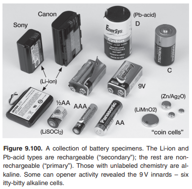
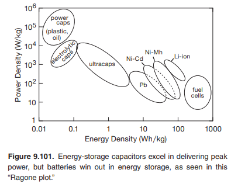
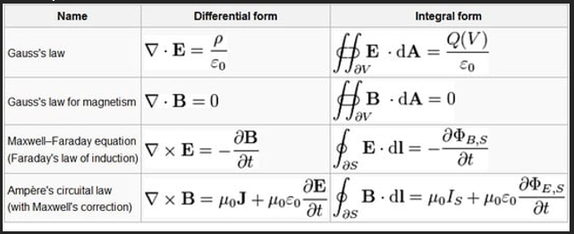
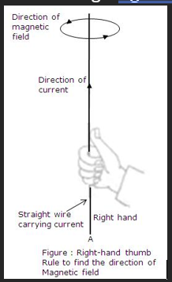
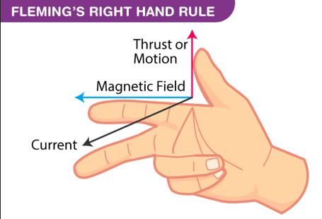
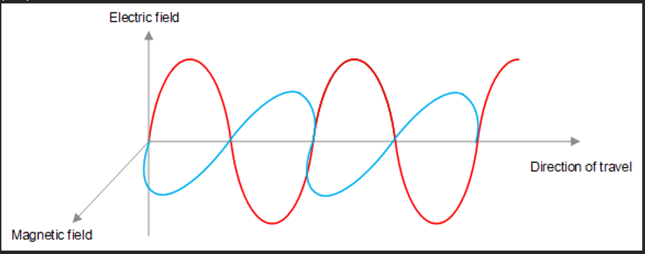
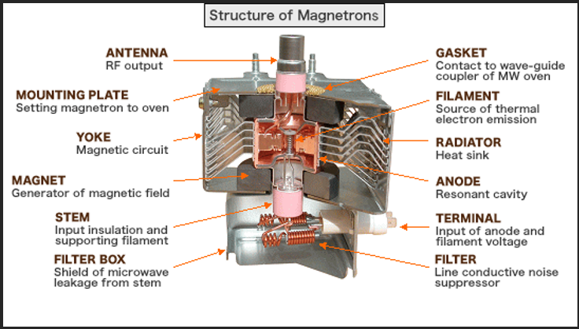
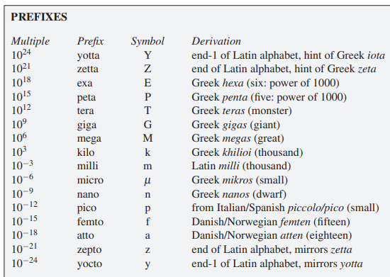

# Misc Chemistry/Physics

- Physics and chemistry notes

## Index

- [Index](#index)
- [Anechoic Chamber](#anechoic-chamber)
- [Batteries](#batteries)
- [Electric and Magnetic Fields](#electric-and-magnetic-fields)
- [EM Waves](#em-waves)
- [EMC Testing](#emc-testing)
- [Platinum](#platinum)
- [Prefixes](#prefixes)
- [Quantum Physics](#quantum-physics)
- [REDOX Reactions](#redox-reactions)

## Anechoic Chamber

- Specially designed room that absorbs reflections of sound or electromagnetic waves to simulate "free space"
- Applications
  - Microphone/speaker testing
  - Noise measurement of machines/electronics
  - Psychoacoustic experiments (human perception of sound)
- Electromagnetic / RF Anechoic chamber
  - Walls absorb RF signals w/ pyramidal foam coated w/ carbon/ferrite
  - Prevents electromagnetic reflections that may interfere w/ measurements
  - Applications:
    - Antenna pattern measurements
    - EMI testing
    - Radar, wireless, and satellite equipment testing

## Batteries

- 
- "Primary" batteries are once-use, and "secondary" batteries are rechargeable
- There are catalogues full of different batteries- just don't choose anything that's hard to get
- Primary
  - Alkaline (Zn/MnO2)
    - Cheap, abundant
  - Lithium (Li/MnO2, LiFeS2, Li/SOCl2)
    - Higher density, flatter discharge curves, better performance for lower temperature
  - Silver (Zn/Ag2O)
    - Button cells- flat discharge
  - Zinc-air (ZnO2)
    - High energy-density, flat discharge, short life after a seal is removed
- Secondary
  - Lithium-ion (Li-ion)
    - Lightweight, highest energy density and charge retention
    - Safety issues w/ lithium chemistries
    - ...Usually not from off-the-shelf- usually from smartphone/tablet/laptop manufacturers
  - Nickel Metal-hydride (NiMH)
    - Common "consumer" rechargeables
  - Lead-acid (Pb-acid)
    - Heavy lifters w/ low internal resistance
    - Dominant in UPSs ("uninterruptible power supplies"), boats, automobiles, and other power hungry devices
    - Large
- Capacitors
  - 
  - Batteries outclass super capacitors, etc, but some caps reach the tail end of batteries in performance

## Electric and Magnetic Fields

- Electric field
  - E-field
  - Region where charged particles experience an electrostatic force
  - Units of V/m (Volt/meter)
- Magnetic field
  - B-field
  - Region around a moving charge or magnet where objects experience a magnetic force
  - Units of T (tesla)
- Maxwell’s equations
  - 
  - A changing magnetic field creates an electric field
    - This is Faraday’s law (and the Maxwell-Faraday equation in particular)
    - Faraday’s law states that:
      - Electromotive force = -(rate of change of magnetic flux through the loop)
      - (magnetic flux = # of magnetic field lines passing through a closed surface)
      - (electromotive force = energy per charge provided by a battery or generator driving current through a circuit)
    - Maxwell-Faraday equation describes how:
      - A changing magnetic field creates an e-field E as well as an EMF
  - A changing electric field creates a magnetic field
    - This is Ampere’s law w/ Maxwell’s addition
    - Magnetic field = (moving charges, aka current) + (changing electric field)
- Maxwell & Fleming’s right hand rules
  - 
    - Indicates magnetic field induced in a straight wire
    - Electromotive force is exerted out from the palm
  - 
    - Indicates current induced in a conductor when a conductor moves through a magnetic field
    - Thumb indicates movement of the conductor, middle finger indicates current induced, and pointer finger indicate direction of magnetic field that the conductor is moving through

## EM Waves

- “electromagnetic waves”
  - We hear “electromagnetism” / “electromagnetic” all the time
  - But what the heck does that mean again
  - It just means it has to do w/ the way electric current/fields and magnetic fields are interrelated
- EM waves are made of oscillating e / b fields that are perpendicular to each other and to the direction of wave propagation
- E field is represented as a vertical plane, b field as a horizontal plane, and EM wave propagates perpendicular to both
- 
  - Ye like this
  - Yessir looks familiar when it’s like this right? Physics II
- Microwave ovens
  - Microwaves work by generating oscillating e and b fields via a “magnetron” to create EM waves that heat up your food
  - Microwaves generate EM waves of 2.45 GHz frequency
  - 
    - Magnetron
    - These things have antennas on them to output the EM waves

## EMC Testing

- "electromagnetic compatibility testing"
- Test to evaluate whether an electronic device:
  - Emits electromagnetic energy w/ acceptable limits (emission testing)
  - Immune to external electromagnetic disturbances (immunity/susceptibility testing)

## Platinum

- Valuable metal used as material for precise resistors, some LEDs, thermocouple temperature sensors; a chemical catalyst; hard disks; etc

## Prefixes

- 
  - Prefixes and their derivations from _Art of Electronics_ (derivations not concrete due to multiple theories on origins...)

## Quantum Physics

- Key idea is that particles behave like waves, probabilities, and quantized energy levels at tiny scales
- Studied since the 1920s, and serves as the foundation of modern electronics- it's been thrown around so much in sci-fi that it feels surreal
- Quantum mechanics is the set of rules that explain how:
  - Electrons behave
  - Atoms bond
  - Light interacts w/ matter
  - Energy is absorbed, emitted, or tunneled
- **Quantized energy levels**
  - Electrons in atoms/semiconductors can only occupy certain energy states (not any random value)
  - LEDs, lasers, solar cells, transistors, atomic clocks, semiconductors are all dependent on this study
  - LEDs emit certain colors, semiconductors conduct under certain conditions, and lasers work thanks to this study
- **Band theory of solids**
  - Quantum mechanics govern the way electrons populate discrete bands (valence band, conduction band, bandgap)- this is the heart of semiconductor design
  - CPUs, RAM, flash, MOSFETs, diodes, photodiodes, GPUs, SoCs, MCUs all work thanks to this
- **Wave-particle duality**
  - Electrons/photons behave like waves and particles
  - Electron microscopes, photonics, semiconductor behavior, interference-based devices all work thanks to this
- **Quantum tunneling**
  - A particle can pass through a barrier it classically shouldn't overcome
  - Fowler–Nordheim tunneling, or direct tunneling
  - Flash/EEPROM programming, tunnel diodes, FinFET leakage modeling, scanning tunneling microscopes all work thanks to this
  - Flash memory is written to using quantum tunneling
- **Spin & magnetism**
  - Magnetism, spin alignment and exchange forces are under quantum physics
  - Hard drives, MRAM, hall effect sensors, spintronic devices all work thanks to this
- **Stimulated emission**
  - When an excited atom encounters a photon of the right energy, it emits another identical photon
  - Lasers, fiber optics, barcode scanners, LiDARs are all dependent on this
- **Discrete photon interactions**
  - Photon energy is quantized
  - Solar panels, cameras (CMOS/CCD sensors), photomultipliers, quantum-limited photodetectors are all dependent on this
- **...In the works**
  - Quantum computing
    - Using superposition and entanglement directly
  - Quantum communication
    - Quantum-secure key distribution
  - Quantum sensors
    - Atomic interferometers, etc

## REDOX Reactions

- Reduction
  - When a substance gains electrons
  - Refers to gaining hydrogen or losing oxygen in a broader sense
- Oxidation
  - When a substance loses electrons
  - Refers to losing hydrogen or gaining oxygen in a broader sense
  - Oxidation of a metal creates a metal oxide layer which is usually porous and flaky, causing corrosion
