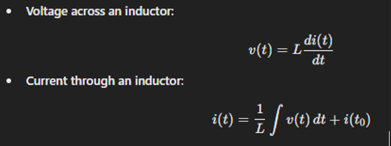
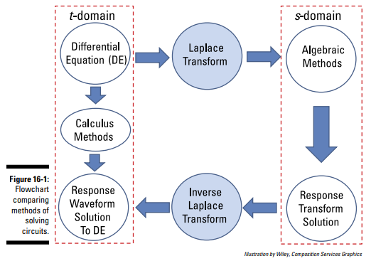
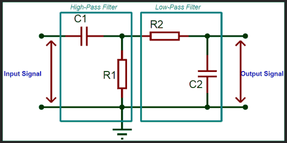
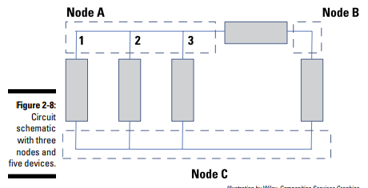
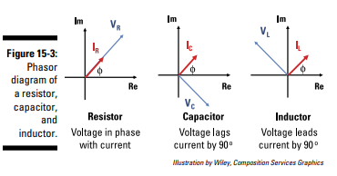
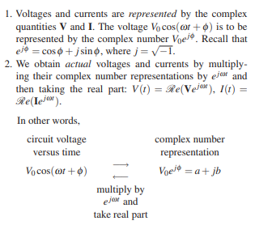
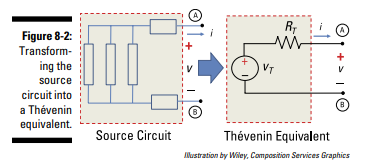
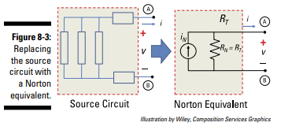

# Circuit Analysis

- Circuit analysis notes

## Index

- [Index](#index)
- [Overview](#overview)
- [Capacitors and Inductors](#capacitors-and-inductors)
- [FFT](#fft)
- [First/Second-Order Circuits](#firstsecond-order-circuits)
- [Fourier vs Laplace Transform](#fourier-vs-laplace-transform)
- [Frequency vs Time Domain](#frequency-vs-time-domain)
- [High/Low/Band-Pass Filters](#highlowband-pass-filters)
- [Ideal Voltage/Current Source](#ideal-voltagecurrent-source)
- [Independent vs Dependent Power Sources](#independent-vs-dependent-power-sources)
- [KVL, KCL](#kvl-kcl)
- [Linear Systems](#linear-systems)
- [Mesh-Current Analysis](#mesh-current-analysis)
- [Node](#node)
- [Node-Voltage Analysis](#node-voltage-analysis)
- [Ohm's Law and Power](#ohms-law-and-power)
- [Passive Sign Convention](#passive-sign-convention)
- [Phasors](#phasors)
- [Resonance](#resonance)
- [Saturation](#saturation)
- [Sine Waves](#sine-waves)
- [Source, Load Circuit](#source-load-circuit)
- [Thevenin/Norton Theorem](#theveninnorton-theorem)
- [Voltage Rise vs Drop](#voltage-rise-vs-drop)
- [Voltage, Current Divider](#voltage-current-divider)
- [Voltage, Current Transfer Function](#voltage-current-transfer-function)

## Overview

- > A circuit’s output is either a voltage or a current. You have to analyze the voltages and currents traveling through each element or component in the circuit in order to determine the output, although many times you don’t have to find every voltage and every current within the circuit.
  - _Circuit Analysis For Dummies_
- Math
  - When you're working w/ DC supplies and passive components that don't change behavior w/ respect to changes in voltage/current (caps and inductors), you can work free of calculus
  - ...When you have AC supplies and caps/inductors, we need calculus to take into account varied behavior w/ change in time, and all those techniques learned in our circuit analysis courses to characterize the behavior of the circuit w/ respect to input/output
- To analyze a circuit, you just need:
  - Device equations that describe the behavior between voltage and current for the component in question
  - Connection equations derived from KVL/KCL for any circuit
- Two approaches
  - Solving w/ respect to voltage, current, and time (time domain)
  - Solving w/ respect to amplitude and signal frequency (frequency domain)

## Capacitors and Inductors

- Capacitor
  - Aka, condenser (older term- still used in Japan lol)
  - Capacitors store energy in electric fields (conductors separated by an insulator, aka dielectric)
  - Capacitance = ability to store charges per voltage across it
  - `C = Q / V`
    - Q = charges stored, V = voltage across cap, C = capacitance
  - Reactance
    - `X = 1 / (2pifC)`, f = frequency, C = capacitance
    - Higher capacitance means lower reactance
  - 
- Inductor
  - Inductors store energy in magnetic fields
  - Inductance = ability to store magnetic fields per change in current
  - `L = V / (di/dt)`
    - L = inductance, V= voltage across inductor, di/dt = change in current through the conductor
  - Reactance
    - `X = 2pifL`, f = frequency, L = inductance
    - Higher inductance means higher reactance
  - 
- Reactance
  - Reactance is resistance against AC current
  - Inductors/capacitors store energy in magnetic/electric fields as opposed to resistors that store energy as heat
  - Phase shift
    - Provided an AC signal is described w/ a sine wave (and phasors- vectors on a complex plane when doing AC analysis), we say that voltage/current vectors lead/lag behind one another by some phase angle
    - Inductor
      - Voltage leads current by 90 degrees
      - `V(t) = Vmax * sin(wt + phi)`, phi = 90, w = 2pif
      - `I(t) = Imax * sin(wt)`
    - Capacitor
      - Current leads voltage by 90 degrees
      - `V(t) = Vmax * sin(wt)`
      - `I(t) = Imax * sin(wt + phi)`, phi = 90, w = 2pif

## FFT

- "Fast-fourier transform"
- The "discrete fourier transform" formula to convert between time and frequency domain is slow
- FFT refers to algorithms that efficiently compute Fourier transforms
- "Cooley-Turkey algorithm"
  - Divide and conquer method of breaking down signals and transforming
  - Reuses calculations
- Relevant for
  - Audio processing
  - Image processing
  - Communication systems
  - Vibration analysis, radar, seismology

## First/Second-Order Circuits

- First-order circuits
  - When you have resistors and either just inductors or just capacitors
  - These circuits can be solved w/ first-order differential equations
- Second-order circuits
  - When you have resistors, caps, and inductors
  - These circuits can be solved w/ second-order differential equations

## Fourier vs Laplace Transform

- Fourier Transform
  - Conversion between time domain and frequency domain
  - Used for audio spectrum analysis, filter design, communications, etc
- Laplace Transform
  - A general transform used to describe differential equations in algebraic form
  - Describes exponential decay/growth and oscillation as two separate constants
  - Used for analyzing transient and steady-state behavior in control systems, circuit analysis, stability analysis, etc
  - ...A Fourier transform is a special case of Laplace transform- algebra is performed in a generic s-domain as opposed to time/frequency domain
  - 

## Frequency vs Time Domain

- Time Domain
  - Signals are a function of time
  - Intuitive
- Frequency Domain
  - Signals are a function of frequency (a sine wave signal may behave differently at different frequencies)
  - Good for analyzing harmonics, filtering, bandwidth

## High/Low/Band-Pass Filters

- 
  - Above together is a band-pass filter
- Voltage across a capacitor is capacitance \* dv/dt
- High-pass
  - Fast switching allows high dv/dt -> voltage across capacitor and to load
  - Slow DC signals won’t be able to get through capacitor
- Low-pass
  - Slow switching allows capacitor to charge in typical RC circuit w/ `Vend = Vstart * (1 - e^-t/rc)`, where RC is the "time constant"
  - Fast switching wouldn’t get the capacitor anywhere
- Band-pass
  - You can combine a high-pass and low-pass filter to get a band-pass filter
  - You can also design a band-reject filter- the opposite of a band-pass filter
- Good-ol cutoff frequency formula
  - `Fc = 1/(2pi RC)`

## Ideal Voltage/Current Source

- Ideal voltage source
  - Provides some fixed voltage regardless of load resistance (so a source that keeps feeding current as resistance increases)
  - Uncapped current isn't possible- usually there's a minimal resistor in series
  - Voltage sources "like" open circuits, and "hates" short-circuit loads
- Ideal current source
  - Provides some fixed current regardless of applied voltage or load resistance (so a source that keeps feeding current as resistance decreases)
  - As above, uncapped current isn't possible
  - Current sources "like" short-circuit loads, and "hates" open circuits

## Independent vs Dependent Power Sources

- Independent
  - Batteries, power supply inputs, etc are all independent power sources
  - Their outputs don't change w/ respect to the voltage/current of something else on the circuit schematic
- Dependent
  - Output of power sources can be dependent on the voltage/current across some other device
  - We see these primarily when an op-amp is taken apart and needs to be characterized together w/ the rest of the circuit

## KVL, KCL

- "Kirchoff's voltage law"
  - Sum of the voltage drops and rises around a loop of a circuit is zero
  - Describes conservation of energy
- "Kirchoff's current law"
  - Sum of incoming/outgoing currents at a node is equal to zero
  - Describes conservation of charge

## Linear Systems

- A system is linear if it's both additive and homogenous:
- Homogeneity
  - A system is homogeneous if scaling the input by a constant scales the output by the same constant
- Superposition
  - Aka, additivity
  - A system is additive when the output of a system after taking the sum a bunch of inputs is the same as the sum of the individual outputs produced when you feed each input to the system one by one
  - Breaking down a circuit w/ multiple power sources into circuits each w/ a single independent source for easier analysis
  - The original circuit is characterized by the sum of the smaller circuits

## Mesh-Current Analysis

- Aka, "loop-current analysis"
- When you characterize a circuit w/ numerous loops, and write out an equation for each loop to create a system to solve
- Applies KVL, in contrast to node-voltage analysis where you apply KCL
- Each windowpane/loop is called a "planar circuit", the boundary of each windowpane is called a "mesh", and each loop has a "mesh current"

## Node

- 
- A node is the intersection(s) of wires connecting devices together

## Node-Voltage Analysis

- When you have two nodes surrounding a some load, the voltage drop across the load is the first node - second node
- "node-voltage analysis" is when you compute the voltage at all nodes in a circuit- then getting the voltage across any device is easy
- Applies KCL, in contrast to mesh-current analysis where you apply KVL

## Ohm's Law and Power

- `V = energy / charge`
  - Voltage is present "between"/"across" two points
  - Cost in energy (work done) required to move a positive charge from a more negative point to a more positive point (lower -> higher potential)
  - Also the energy released when a charge moves "downhill" from higher -> lower potential
  - Also called "potential difference" or "electromotive force" (EMF)
- `I = charge / time`
  - Current is present "through" devices
- `P = energy / time`
- Resistor
  - `V = IR`
  - `P = VI`, so `P = I^2R`, `P = V^2/R`
  - `1/Req = 1/R1 + 1/R2` for parallel
  - `Req = R1 + R2` for series
  - Opposite for capacitors, identical for inductors
  - The reciprocal of resistance is conductance, in units Siemens/Mho
  - Shortcuts
    - You can bump up/down resistance by adding small resistors in series/parallel respectively
    - If you have a bunch of resistors in series, know that the equivalent resistance of n identical resistors in parallel is the resistance/n- rethink the circuit in terms of identical resistances

## Passive Sign Convention

- Takes us back to high-school physics
- When performing circuit analysis w/ various passive components, we start by arbitrarily assigning a positive/negative lead provided some assumed direction of current
- After performing the analysis, you'll know the true direction of current from the sign of the voltage drops across each passive component
- Power
  - When power is positive, that means that current and voltage have the same sign across a device, and thus consumes power
  - If power is negative, that means that the device is delivering power

## Phasors

- 
- 
- Rotating vectors used to describe behavior of circuits, including capacitors and inductors
- Phasor analysis is what's used to express circuits w/ complex numbers for simplification- allows you to circumvent differential equations
- Applicable if the input is a sine wave or sinusoidal signal
- In a phasor:
  - Real portion is the resistance from resistors
  - Imaginary portion is reactance from caps/inductors

## Resonance

- In an RLC circuit, reactances can cancel each other out
- Resonant frequency
  - When inductor and capacitor reactance are equal (1/wC = wL)
  - `F0 = 1 / (2pi * sqrt(LC))`
- Series RLC
  - Total impedance = R
  - Minimum impedance
  - Maximum current for series RLC configuration
- Parallel RLC
  - Total impedance = R
  - Maximum impedance
  - Minimum current for parallel RLC configuration
- Applications
  - Radio tuning
    - LC tanks that resonate at a station's frequency filters out all other stations
  - Oscillators
    - LC circuits set a stable oscillation frequency (e.g., in RF transmitters)
  - Filters
    - Select or reject specific frequency bands (band-pass, band-stop)
  - Impedance matching
    - Match source and load impedances at a given frequency to maximize power transfer
  - Inductive heating
    - Operate at resonant frequency for maximum energy transfer
  - Wireless power transfer
    - Resonant coupling improves efficiency of inductive chargers

## Saturation

- This word gives us the shivers- reminds us of doing circuit analysis homework
- ...It comes up repeatedly in different contexts:
- BJT
  - A BJT is in the saturation region when it's "fully-on" (driven completely by the current-controlled base pin) such that the base-emitter and base-collector junctions are forward-biased
  - Transistor can't increase collector current even if base increases
  - Transistor won't behave linearly in the saturation region, gain collapses, and distortion increases
- MOSFET
  - Long-channel MOSFETs (most cases)
    - When the MOSFET is in the constant-current region, and drain current is mostly independent of Vds
  - Power MOSFETs
    - When a MOSFET is used as a switch, it refers to when the MOSFET is "fully-on", and when the MOSFET is in the linear conduction region
- Op-Amp
  - Aka, "clipping"
  - Refers to when the op-amp output hits one of its supply rails (positive or negative) and can't increase further
  - Leads to severe distortion, feedback breaks, and signals clip hard
- Inductors/transformers
  - When magnetic flux density in a ferrite/iron core reaches the material saturation level, increasing current doesn't increase flux
  - Leads to inductance collapsing, current spikes, etc

## Sine Waves

- Sine waves are popular bc they're the:
  - Sine waves are the only "linear" (homogeneity and superposition apply) periodic signal
  - Solutions to linear differential equations that describe many phenomena in nature and properties of linear circuits
- Characterizing sine waves
  - Amplitude
  - Root-mean-squared amplitude
    - `Vrms = 1/sqrt(2) * A`

## Source, Load Circuit

- [source-and-load-circuit](_images/circuit-analysis/source-and-load-circuit.png)
- The "source circuit" is the part that delivers signals and interacts w/ the "load circuit"

## Thevenin/Norton Theorem

- Thevenin theorem
  - 
  - When you replace a complicated source circuit w/ a voltage source and a resistor in series
- Norton theorem
  - 
  - When you replace a complicated source circuit w/ a current source and a resistor in parallel
- Maximum power theorem
  - Max power delivered to a load occurs when Rload is matched/equal to Rthevenin
- Circuit loading
  - An undesirable reduction in the open-circuit voltage/signal by the load is called "circuit loading"
  - Attaching a load that has less or comparable resistance to the equivalent internal resistance of a device/circuit causes circuit loading

## Voltage Rise vs Drop

- Voltage drop
  - When a component consumes power and voltage is used by a device
  - Passive sign convention indicates + -> - as you follow the direction of current through the device
- Voltage rise
  - When a device supplies voltage
  - Passive sign convention indicates - -> + as you follow the direction of current through the device

## Voltage, Current Divider

- Voltage divider
  - If you have 2 resistors, and you're looking for drop on R2: `Vr2 = Vin ((r2) / (r2 + r1))`
    - It's just the source voltage multiplied by the ratio of the resistor in question to all the other resistors
- Current divider
  - Same idea as voltage divider, but applies when you have a constant current source and a set of parallel resistors

## Voltage, Current Transfer Function

- Refers to ratio of output to input of either voltage or current
- Voltage/current divider equations are referred to as voltage/current transfer functions, but we hear "transfer function" as a term more w/ other complex analysis
