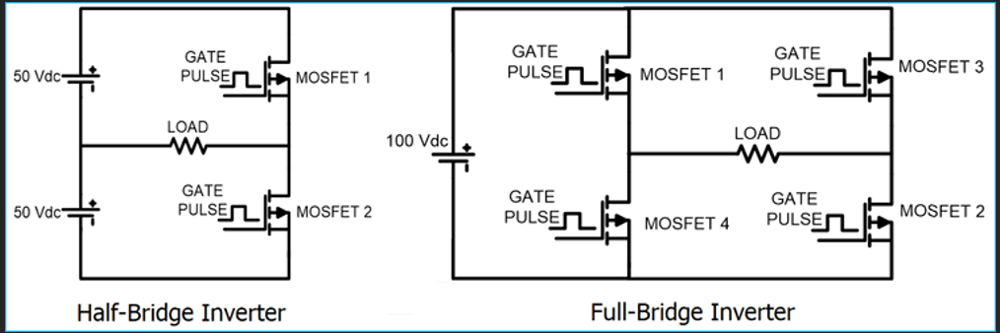
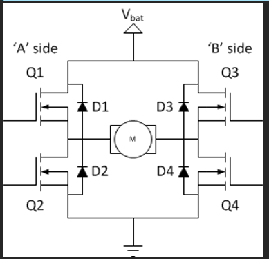
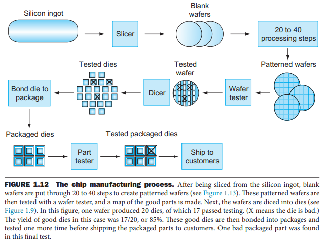
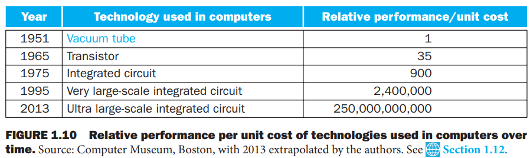
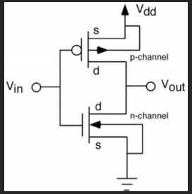
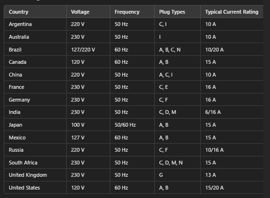
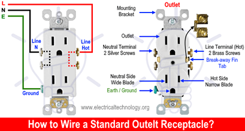
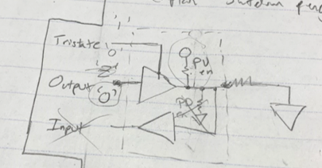
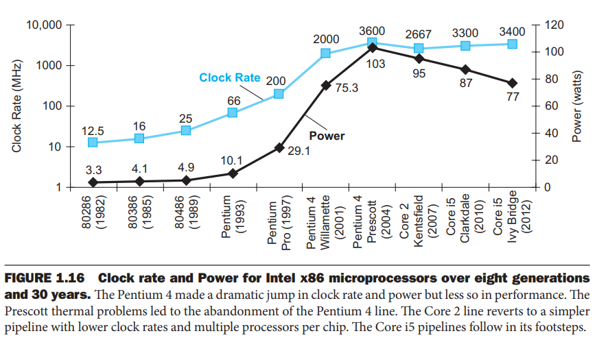
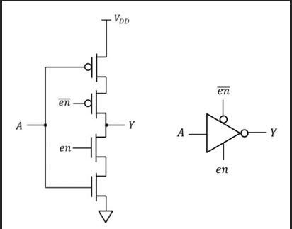

# Hardware Concepts

- Miscellaneous hardware facts and convention notes
- List of fundamental and frequently encountered hardware concepts

## Index

- [Index](#index)
- [3.3V vs 3V3](#33v-vs-3v3)
- [32768 Hz Crystals](#32768-hz-crystals)
- [Active Low vs Active High](#active-low-vs-active-high)
- [AWG](#awg)
- [Capacitive/Inductive Coupling](#capacitiveinductive-coupling)
- [Capacitor vs Inductor](#capacitor-vs-inductor)
- [Common Mode vs Differential Mode](#common-mode-vs-differential-mode)
- [Digital Logic Circuit Families](#digital-logic-circuit-families)
- [Discrete vs IC](#discrete-vs-ic)
- [DSP](#dsp)
- [Earth vs Ground](#earth-vs-ground)
- [End Of Life](#end-of-life)
- [Faraday Cage](#faraday-cage)
- [Guided vs Unguided Medium](#guided-vs-unguided-medium)
- [Half/Full Bridge](#halffull-bridge)
- [Hardware Design Principles](#hardware-design-principles)
- [Hold-Up](#hold-up)
- [IC Fabrication Process](#ic-fabrication-process)
- [Impedance](#impedance)
- [Input/Output Impedance](#inputoutput-impedance)
- [Integrated Logic Evolution](#integrated-logic-evolution)
- [Integrator, Differentiator](#integrator-differentiator)
- [Inverter CMOS](#inverter-cmos)
- [Leakage Current](#leakage-current)
- [Metastability](#metastability)
- [Mixed-Signal Systems](#mixed-signal-systems)
- [N-MOSFETs, P-MOSFETs, 1 <-> 0 Transitions](#n-mosfets-p-mosfets-1---0-transitions)
- [Nanotechnology](#nanotechnology)
- [Noise](#noise)
- [Open Drain vs Open Collector Pins](#open-drain-vs-open-collector-pins)
- [Outlet Output](#outlet-output)
- [Passive vs Active](#passive-vs-active)
- [Peripheral Pin](#peripheral-pin)
- [Pi Pad](#pi-pad)
- [Power Supplies](#power-supplies)
- [Power Wall](#power-wall)
- [Push-Pull Design](#push-pull-design)
- [RoHS](#rohs)
- [RTL](#rtl)
- [Semiconductor Doping](#semiconductor-doping)
- [SEU Tolerance](#seu-tolerance)
- [Skin Effect](#skin-effect)
- [Soft IP vs Hard/Firm IP](#soft-ip-vs-hardfirm-ip)
- [Solenoid vs Toroid](#solenoid-vs-toroid)
- [Static Electricity](#static-electricity)
- [Tri-State Buffers](#tri-state-buffers)
- [X Ohm Differential Pair](#x-ohm-differential-pair)
- [“Bias”](#bias)
- [“Decoupling”](#decoupling)
- [“High-Side” vs “Low-Side”](#high-side-vs-low-side)
- [“Strong” vs “Weak” Resistor](#strong-vs-weak-resistor)

## 3.3V vs 3V3

- Avoiding the decimal point on schematics is preferred to avoid misreading text
- Other parts can use this same convention:
  - 1.0k Ohms -> 1k0, 4.7M Ohms -> 4M7

## 32768 Hz Crystals

- When a 32.768k Hz crystal goes through a frequency divider, you can get down to 1Hz thanks to how 32768 is a power of 2
- Quartz crystals are irreplaceable
- Material
  - Silicon dioxide- primary ingredient of glass
  - Are piezo-electric (strain generates a voltage, and vice versa)
  - An electric field can apply acoustic waves in the crystal, for the crystal to then generate voltages at the surface
- W/ a crystal as a stable reference, you could synthesize (PLL or "direct digital synthesis") any required clock

## Active Low vs Active High

- Signals are active LOW sometimes because of
  - Timing constraints required for different hardware to go HIGH (as opposed to going LOW)
  - The lack of a consistent HIGH across different parts of hardware (as opposed to ground which is always ground)

## AWG

- "american wire gauge"
- Measure of wire thickness

## Capacitive/Inductive Coupling

- Observed between traces on circuit boards or between line pairs in cables/ribbons
- Capacitive coupling
  - When electric fields generated by signals disturb other signals
  - Resolved by spreading apart signals, or adding shielding w/ metallic enclosures
- Magnetic coupling
  - Aka, inductive coupling
  - Low-freq magnetic fields can't be reduced by magnetic enclosures
  - Resolved by:
    - Avoiding large enclosed areas w/in circuit paths
    - Creating twisted pairs if applicable
    - Magnetic shielding

## Capacitor vs Inductor

- Capacitance = charge / voltage
  - Ability to store charge in electric field
  - When you have two conductors sandwiching an insulator and you apply voltage to one side of a capacitor, electrons form an electric field and repel the electrons on the other plate
  - Capacitors resist change in voltage
  - Capacitors have capacitance which is a measure of how well its electric field can store energy
  - Dielectric absorption
    - Aka, the "memory" effect
    - If you charge a cap to Vi, hold it there for a while, discharge it to 0V, and then remove the short, the cap will tend to drift back towards Vi
- Inductance = voltage / [change in current]
  - Ability to store voltage in a coil as there’s a rate of change in current
  - When current flows through a wire, a magnetic field is created encircling the wire
  - Inductors resist change in current
  - Inductors have inductance which is a measure of how well its magnetic field can store energy

## Common Mode vs Differential Mode

- Common mode
  - “common mode signals” refer to a pair of signals that carry the same data in-phase and w/ the same amplitude
  - There’s “common mode noise” when an electric field induces a voltage on both signals at the same time (hall effect)
- Differential mode
  - “differential mode signal” refers to a pair of signals that carry the same data but in opposite phase of one another
  - Ethernet is an example of a differential signal pair
  - By subtracting one signal from another, “common mode noise” is suppressed
  - “differential mode noise” can only occur from mismatches in data and unbalances in the circuit
  - Differential capacitors and inductors can be used to filter out differential noise

## Digital Logic Circuit Families

- CMOS
  - “complementary metal-oxide semiconductor”
  - Most widely used in modern electronic devices
  - Used in MPUs, MCUs, FPGAs, ASICs, memory chips, etc
  - Very low static power consumption, ideal for high-density circuits
  - "Immune to noise"
  - 0V for LOW, supply (3.3V, 5V, etc) for HIGH
  - Means that ICs are composed of MOSFETs (tailored for speed)
  - Weird issues
    - Open inputs
      - A floating input will have undefined behavior, until you put a scope on the pin and read 0- the scope discharged the pin
    - SCR latchup
      - Momentarily forcing an input/output beyond the supply rails shorts Vdd to ground
      - Keeping it this way for more than a few seconds will fry the IC
    - Open Vdd pin
      - Not wiring Vdd gets a pass if an ICs inputs supply power to the IC unintentionally
      - This works until the IC gets all low on inputs and the IC loses its state
- TTL
  - “transistor-transistor logic”
  - Some devices use TTL… primarily replaced by CMOS
  - 0V-0.8V for LOW, typically 2.4V-5V for HIGH
  - Robust, low cost, but high power consumption
  - Means that ICs are composed of BJTs (tailored for high power)

## Discrete vs IC

- Indivisible/classic electronic building blocks are referred to as "discrete components"
  - Resistors, caps, inductors, transformers, crystals, fuses, switches, diodes, transistors, etc
- The opposite are ICs
  - Processors, regulators, OpAmps, etc

## DSP

- “digital signal processing” architecture
- Architecture tailored for fast mathematical computations

## Earth vs Ground

- "Earth" is used in the UK, "ground" in the US
- ...Japan also uses "earth"

## End Of Life

- Causes of component end of life:
  - Obsolescence
  - Lack of sales
  - Lost schematics
  - "Upgraded" production line
    - Parts can be made, but there's no method of testing the parts due to changes in production lines
  - Manufacturing out of business

## Faraday Cage

- A container made of conducting material to protect material from electric fields
- Prevents EMI
- Smocks are Faraday cages

## Guided vs Unguided Medium

- Guided refers to a medium that defines a path of data transmission well- wires, PCB traces, etc
- Air, water, etc are unguided mediums

## Half/Full Bridge

- 
- 
- Half bridge
  - A half of an H-bridge
  - Also called a “half channel” when an H-bridge is called a “channel”
  - Able to pull load to 2 different references
- Full bridge
  - An entire H-bridge
  - Able to pull load +reference regardless of direction of current

## Hardware Design Principles

- 1: Simplicity favors regularity
  - As in, consistency is a result of an effort to keep things simple
  - If there's an effort put in to make sure a processor can operate w/ instructions w/ 2 operands across various designs, there can be consistency/regularity
- 2: Smaller is faster
  - Not always absolute, but time taken for electrical signals to reach hardware registers is a factor from a low-level hardware design perspective
- 3: Good design demands good compromises
  - There are always trade-offs, so you have to choose what you need for a particular implementation

## Hold-Up

- Component to maintain voltage in a system for a short period of time
- Dedicated bulk capacitor or battery to maintain power

## IC Fabrication Process

- 
- Rod of silicon -> sliced into wafers -> [many processing steps] -> chemical patterns placed on wafers to create transistors/conductors/insulators -> diced into pieces (thus called "dies"/chips) -> placed into a package and IOs hooked to package pins (called "bonding")
- Chips can be defected, so those are tossed out
- Good dies to bad dies is called "yield"

## Impedance

- Impedance is "generalized resistance"
- It's an umbrella referring to "reactance" of inductors/caps, and resistance of resistors

## Input/Output Impedance

- Roughly refers to how stages of a circuit are affected/dependent on one another, and whether a circuit demands current from the previous stage or is able to provide current to the next stage (input/output impedance respectively)
- You want high input impedance so that a circuit demands minimal current from the previous stage
- You want low output impedance to provide as much current to the next stage as possible
- This is why op-amps configured as voltage followers are useful- voltage followers have high input impedance and low output impedance

## Integrated Logic Evolution

- 
- We've come a long way

## Integrator, Differentiator

- You can build integrator and differentiator circuits w/ op-amps:
- Integrator
  - Generates the integral of a signal- so accumulates inputs
    - Feed a constant -> output ramps
    - Feed a pulse -> output steps
    - Feed noise -> output smooths input
  - Use-cases:
    - Low-pass filtering
    - Generating ramps from steps
    - Analog control systems (I in PID)
    - Converting pulses to position
- Differentiator
  - Generates the derivative of a signal- takes the difference provided past inputs
    - Feed sharp edges -> large output spikes
    - Feed constant value -> no output
    - Slow varying signals -> small output
  - Use-cases:
    - Edge detection
    - High-pass filtering
    - Generating spikes from steps
    - Analog control systems (D in PID)
    - Analog feature extraction

## Inverter CMOS

- While we’re at it here’s CMOS inverter
- 

## Leakage Current

- There's energy consumption even when transistors are off due to leakage current
- 40% of energy consumption on a machine hosting a server can be due to leakage current
- ...Increasing number of transistors causes more leakage current, which also fights against keeping Moore's law true

## Metastability

- Flip-flops are metastable during set-up time and hold time- the state of the output is unpredictable
- Firmware is responsible for interfacing w/ hardware that can be metastable in a safe way to avoid reading random values

## Mixed-Signal Systems

- Refers to mix of analog/digital components to process real-world signals
- ADC/DAC, OP-amps, etc

## N-MOSFETs, P-MOSFETs, 1 <-> 0 Transitions

- N-MOSFETs tend to be faster than P-MOSFETs
  - …And because the series portion that makes up a NAND gate is made of N-channel transistors as opposed to a NOR gate that has its series portion made up of P-channel transistors, NAND gates (tend to be) faster than NOR gates
    - Thus NAND flash comes up a lot more than NOR flash
- 0 -> 1 transition is faster for N-MOSFETs than 1 -> 0
  - Discharge time is longer than charge time (Doboli flashbacks)

## Nanotechnology

- It's confusing when we hear this in engineering, and then watch Disney/Marvel movies that throw around "nanotech"
- Refers to materials/devices/structures between 1-100 nm in size
- Applicable for ICs that are fabricated w/ tiny transistors (3nm by TSMC)

## Noise

- SNR stands for "signal-to-noise ratio"
- Types of noise:
  - Johnson noise
    - Random-noise voltage created by thermal fluctuations in a resistor
    - Gaussian noise
      - "band-limited white Gaussian noise" is a signal w/ equal power per Hz in some band of frequencies that exhibits a Gaussian (bell-shaped) distribution of amplitudes
      - Generated by Johnson/Nyquist noise
  - Shot noise
    - Random statistical fluctuations in a flowing current caused by the discrete nature of electrical noise
  - Flicker noise
    - Additional random noise, rising typically as 1/f in power at low frequencies, w/ a multitude of causes
  - Burst noise
    - Low-freq noise typically seen as random jumps between a pair of levels, caused by material device defects

## Open Drain vs Open Collector Pins

- Open drain
  - Implemented via MOSFET’s as the name implies
  - Digital pin that can pull a line low, but not high
  - When pin isn’t driven low it’s high impedance
  - This type of output applies for I2C lines where lines can be pulled low
- Open collector
  - Implemented via BJT’s as the name implies
  - Digital pin that can pull a line low, but not high
  - When the pin isn’t driven low it’s high impedance
  - TTL logic circuit
- “Open drain” and “open collector” phrases are used interchangeably, but not the same

## Outlet Output

- 
- 
- US’s typical AC outlet output is 120Vrms at 60Hz, 15A
- Japan’s typical AC outlet output is 100Vrms at 50/60Hz (depending on region in Japan), 15A
- Type A is the plug w/ just Neutral and Hot pins, Type B is the plug w/ the additional ground pin
  - High-power appliances get away w/ Type A for as long as they're double-insulated (users can't touch conductive parts)
  - High-power appliances in the US are Type B because they have metal chassis that are grounded w/ the extra prong
  - ...Yes, that means it's very dangerous to rip out the ground prong from a connector
- Higher voltages are more efficient for power transmission, since power loss in wires is proportional to the current through the wires (P = I^2R, no there isn’t a set voltage across all wires, it’s current that’s constant), so you can deliver the same amount of power w/ less current if you have higher voltage- it’s the same logic for power supplies that deliver high voltage vs low voltage depending on whether there will be higher/lower gauge wires respectively

## Passive vs Active

- Electrical hardware components are either passive or active
  - Filter circuits are either active/passive too depending on the components they're made of
- Passive
  - Basic building blocks- resistors, inductors, capacitors, diodes
  - Most of the time have two leads of connection
- Active
  - Aka, integrated circuits- ICs
  - Require a voltage-in and signal pins to function
  - Includes transistors, regulators, processors, etc

## Peripheral Pin

- A pin on a microcontroller looks like this
- 
- Output configuration
  - An output pin shouldn’t have pull-up or down resistors configured on it
  - A pin configured as output needs to have load on the line to ground, or else the pin would drop all that voltage across the internals of the mcu pin, run as much current as it wants provided the resistance of the pin internals, and burn the mcu
    - The workaround to this issue is open-drain configuration
- Open-drain configuration
  - A pin can come equipped w/ open-drain configuration option
  - This means that the pin can either
    - Ground the line w/ output LOW
    - Let go of the line w/ tristate buffer and make the pin HIGH IMPEDANCE
- Input configuration
  - An IO pin can come equipped w/ pull-up and/or pull-down resistor options or not
- Slew rate
  - MCU pin slew rate is the rate at which voltage on a pin changes
  - Faster changes are useful for faster communication
  - Can cause increased power consumption, signal integrity issues, and EMI

## Pi Pad

- A fixed attenuator network used in analog/RF circuits
- It's when a circuit makes a greek letter "pi" configuration w/:
  - Input on the left connected to a resistor
  - Output on the right connected to the other end of the resistor
  - Two shunt resistors connected on each end of the resistor, each going to ground

## Power Supplies

- ATX power supplies don’t have an involved method of stepping up/down source input voltage, but a VPX power supply does…
- Possible reasons for why this could be:
  - Transformer size
    - Transformer is the biggest bottleneck on a single board power supply
    - Stepping down higher voltages allows the transformer to be smaller

## Power Wall

- 
- ...the bane of mechanical engineering- heat removal
- Engineers are running into power limits for cooling processors

## Push-Pull Design

- Design where a transistor is used to control the flow of current in both directions (push and pull)- gate at both entry and exit
- Example would be N-channel FET to sink to ground, P-channel FET to provide 3V3

## RoHS

- “restriction of hazardous substances”
- Adopted by EU
- Standard to prevent contributing hazardous substances like lead from circulating in EEE (“electrical and electronic equipment”)
- Includes lead, mercury, cadmium, etc

## RTL

- “register transfer level”
- Language used to describe behavior and structure of digital circuits
- Includes VHDL, System Verilog, etc

## Semiconductor Doping

- A pure semiconductor (silicon) has purities mixed into it to change its electrical characteristics depending on the device being manufactured- this is called “doping”

## SEU Tolerance

- “single event upset tolerance”
- SEU is radiation-induced error causing non-permanent damage to semiconductor-like devices like MCU’s and FPGA’s- causes bit flipping
- Resistance to SEU means being able to recover from bit flipping or being resistant to SEU

## Skin Effect

- Phenomenon in AC where current tends to flow near the surface (so the "skin") of a conductor rather than uniformly throughout its entire cross-section
- The effect is dilated as frequency increases

## Soft IP vs Hard/Firm IP

- Soft IP refers to PL blocks that are still modifiable (either not synthesized at all, or just partially synthesized at the netlist level)
- Hard/firm IP refer to fully synthesized PL blocks (synthesized, placed, and routed) w/ no room for modification

## Solenoid vs Toroid

- “Solenoid” refers to a straight coil
- “toroid” refers to a shape that resembles a torus (donut)
- There are both solenoid and toroidal inductors

## Static Electricity

- IC design
  - ICs are usually tested and rated for survival from ESD
  - The EE/CE equivalent of the "spherical cow" in physics is people being reduced to a 100pF cap w/ 1.5k Ohm resistor in series
  - People may charge up to 1-2.5kV, where ICs are (hopefully) rated higher
- During the winter we’re always zapping things, so good to know below:
- Humidity
  - High humidity allows for good conductivity, and less accumulation of static electricity
- Surface area
  - Low surface area means less area for static electricity to accumulate
- Material properties
  - Materials have innate conductivity
  - Insulators can better accumulate static electricity

## Tri-State Buffers

- Not magic, can be implemented via CMOS transistors
- It’s just like we’ve seen in Doboli’s VLSI class
- 

## X Ohm Differential Pair

- “100/80 Ohm differential pair” refers to the target impedance of each of the traces of a differential pair
- Important to maintain signal integrity and minimize differential mode noise

## “Bias”

- We hear 5V bias or 3.3V bias often
- This means that it’s a controlled/regulated 5V or 3.3V output as opposed to a pin that needs 5V or 3.3V or anything else
- Eh it’s just another extension to naming power lines

## “Decoupling”

- This is misleading because to “couple” means to transfer a signal from one circuit to another
- “decoupling” in “decoupling capacitor” refers to decoupling from noise including
  - EMI (“electromagnetic interference)
  - Power supply noise
  - Switching transients
    - Fluctuations in voltage/currents caused by circuit switching from one state to another (seen in digital circuits, power supplies, switching regulators)

## “High-Side” vs “Low-Side”

- Refers to position relative to the load, power, and ground
- High-side refers to between power and load
  - Requires gate driver to provide gate voltage higher than drain? (ds needs to be lower than gs for n-channel MOSFET to turn on)
- Low-side refers to between load and ground
  - Easier to do w/ standard logic levels (5V, 3.3V, etc)
- EX
  - Low-side load switching is when a switch (MOSFET, load switch, etc) is between load and ground
  - High-side current sense chip needs to be placed between power and load

## “Strong” vs “Weak” Resistor

- Informal lingo for describing resistor resistance
- “strong” resistor
  - Low resistance, means that current through the resistor is HIGH
- “weak” resistor
  - High resistance, means that current through the resistor is LOW
- If there are two pull-up resistors on the same line (ie, internal pull-up enabled + external pull-up resistor), then the “stronger” resistor will be pulling up the line to whatever voltage
  - This is because higher current means there’s a more direct path to whatever power supply, allowing for a faster and stronger connection to power supply
