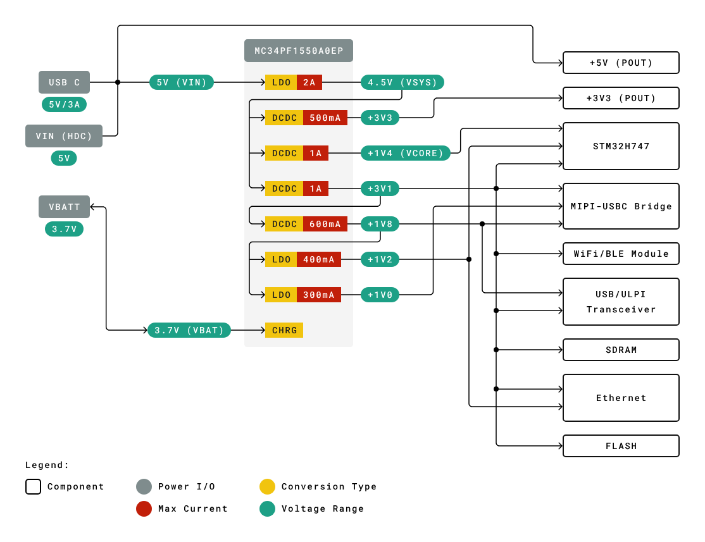

# Fundamentals

- PCB layout notes

## Index

- [Index](#index)
- [Analog Layout](#analog-layout)
- [Bad Practice](#bad-practice)
- [CAM Processor](#cam-processor)
- [Component Placement](#component-placement)
- [Conformal Coating](#conformal-coating)
- [Copper Pours/Floods](#copper-poursfloods)
- [Copper Weight](#copper-weight)
- [Crosstalk](#crosstalk)
- [Designing for Test](#designing-for-test)
- [Flex Circuits](#flex-circuits)
- [Footprint Sizes](#footprint-sizes)
- [Gerber Files](#gerber-files)
- [Ground](#ground)
- [IPC](#ipc)
- [Noisy vs Quiet](#noisy-vs-quiet)
- [Part Designations](#part-designations)
- [PCB Layering Rule of Thumb](#pcb-layering-rule-of-thumb)
- [Power Tree](#power-tree)
- [Silkscreen](#silkscreen)
- [Special Buses](#special-buses)
- [Stitching Via Rule of Thumb](#stitching-via-rule-of-thumb)
- [What's A PCB Made Of?](#whats-a-pcb-made-of)

## Analog Layout

- Oh man
- TLDR (to avoid going into details):
  - The name of the game is to consider the impedance of everything
  - Transmission lines have impedance
  - Placement is built around the traces instead of the other way around

## Bad Practice

- Don't:
  - Put high-speed signals on layers w/o a ground reference
  - Cross power plane splits w/ signal traces
    - Return currents spray EMI if you do that
    - Signals return to their source w/ the path of least impedance, but a signal that crosses a power plane split causes the signal to make a long way back and cause problems
  - Cut up the ground plane too much
    - It doesn't matter if your power plane is split up- don't split the ground plane into digital/analog, etc
    - Splits create antennas and EMI
  - Route differential pairs on different layers
  - Give every power rail its own plane
  - Share vias to ground- make independent vias to ground whenever possible
  - Route signals under noisy components like inductors (this means vias too)
    - Vias and the conductive loops created by the vias cause parasitic inductance, unwanted by switching regulators
    - Vias can lead to inductive coupling on the inductor, making the switching noisy
    - Inductors generate magnetic fields, and nearby vias can act as antennas

## CAM Processor

- ...We know CAD stands for "computer-aided design" since it's been thrown around every minute or two in Log Horizon
- CAM stands for "computer-aided manufacturing"
- A CAM processor is just software used to prepare/check/output PCB manufacturing data

## Component Placement

- Keep decoupling capacitors close to their ICs
- Keep crystals near their pins
- Keep sensors and antennas away from all other components
- Group quiet parts away from noisy parts
- First find a place to put your main processor -> roughly group components based on physical constraints, noisy/quiet qualities -> organize w/in quiet/noisy groups -> divide power plane
- If heat dissipation is a concern, spread out components that get hot

## Conformal Coating

- Protective chemical coating applied to PCB’s
- Protects against moisture, dust, chemicals, and temperature extremes
- Also provides electrical insulation preventing short circuits
- Materials include:
  - Acrylics (AR) – recommended for home projects
  - Urethanes (UR)
  - Silicones (SR) – high temperature resistant
  - Parylene (XY)
  - Epoxies, polyurethanes (ER- resins)

## Copper Pours/Floods

- It's called a copper pour/flood when you fill an entire plane w/ copper (usually ground)
- Large ground pours help w/:
  - Low impedance return paths whenever you need access to ground
  - Better EMC/EMI performance
  - Reduced ground noise between components
  - Support for controlled impedance
    - High-speed microstrip/striplines need stable reference planes, so today we see ground copper pours on almost all boards
  - Heat dissipation
  - Manufacturability
    - "Board warping" is when there's thermal/mechanical imbalance across a board caused by uneven copper on different layers, and causes the board to bend/deform during product assembly
    - For the PCB itself, it also helps when machines have to etch out less copper
- Caution:
  - "Floating" copper islands not connected to any net act as antennas and cause EMI
  - Ground pours near antennas detune them, reduce radiation efficiency, and change polarization
  - Pouring power nets everywhere is dangerous when things accidentally connect, and can increase noise
  - ...Otherwise, a ground pour on all planes w/ stitching vias to connect them all together is best practice

## Copper Weight

- Refers to how thick the copper layer is on a PCB
- In units of ounces per square foot
- More copper means more current carrying capacity, less voltage drop, better heat dissipation, durable

## Crosstalk

- When a signal in one trace corrupts the signal in another trace
- Caused by electromagnetic coupling (includes capacitive and inductive coupling)
- Can lead to signal degradation
- Long traces next to each other cause electromagnetic fields that induce voltages/currents in adjacent traces
- High speed traces cause crosstalk due to fast changes in voltages

## Designing for Test

- Adding probe space/capability is expensive space-wise
- Realistically, test points for power and ground nets is usually all you have room for

## Flex Circuits

- ...Usually just a substitute for a ribbon cable to get a bus from one board to another

## Footprint Sizes

- Component footprints are either minimum, nominal, or maximum
  - ...We see this components imported from UltraLibrarian- small, medium, and large footprints

## Gerber Files

- "Gerber" comes from "Gerber Systems Corp" in the 1960s
  - They made the standardized photoplotter format to create PCBs
- ...Now all PCB layer output files are called "gerber files" regardless of what software generated it

## Ground

- There's a lack of consistency in how ground wires should be connected together
- If you're working w/ digital circuity:
  - Keep noisy stuff close to the component/lead/connection that all current is trying to flow back to
  - Keep the quiet stuff away from the noisy stuff
  - If above is met, you can just wire directly down to the ground plane- don't wire grounds separately, split ground planes, etc
- Mecca
  - Refers to a method of connecting all ground wires at a common point
  - It's a crutch- think about how noisy circuit stages/parts can be, and organize accordingly

## IPC

- In a PCB context, it used to stand for "institute of printed circuits", but now they've broadened and the letters don't mean anything
- IPC is a trade group that sets and documents PCB related industry standards

## Noisy vs Quiet

- Noisy:
  - Keep noisy switching regulators, inductors, high-speed nets at the edge of the board
  - Keep regulator/switching loops as tight as possible
- Quiet:
  - Put analog ADCs, precision refs, etc far away from noisy components
  - Keep sensitive analog traces away from clock traces too

## Part Designations

- Part reference designators seen on schematics and PCB silkscreen:
- A
  - Assembly/mechanical items
  - A, AE ("antenna element"), AT ("attenuator")
- B
  - Batteries, beads
  - B/BT ("battery"), BR ("bridge rectifier"), BE ("ferrite bead", but FB is more common)
- C
  - Capacitor
- D
  - Diode
  - DL (for LEDs, but outdated now), DS/DZ (zener diode, less common now)
- F
  - Fuses, ferrite beads
  - F ("fuse"), FB ("ferrite bead")
- H
  - Hardware/heatsinks
- J
  - Connectors (headers, plugs, sockets, etc)
  - J (misc connector), JP (jumper)
- K
  - Relays (mechanical/solid-state relays)
- L
  - Inductors
- M
  - Motors/mechanical
- N
  - Network
- P
  - Plug/test point/connector
  - P ("plug", PCB connector), TP ("test point"), PL (plug/connector variant)
- Q
  - Transistors (BJT, MOSFET, FET, JFET, IGBT)
- R
  - Resistors
  - RV (potentiometer, variable resistor), RT (thermistor)
- S
  - Switches
  - S or SW ("switch"- pushbutton, DIP switch, slide, rocker)
- T
  - Transformer
- U
  - Integrated circuit
  - IC/SoC/MCU/regulator/op-amp/etc
- W
  - Cables/wires
- X/Y
  - Crystals/oscillators
  - Y is old/outdated (still used in Japanese schematics lol)
- Z
  - Impedance element (filters, chokes)

## PCB Layering Rule of Thumb

- The order of priority (high to low) to delegate to entire planes is:
  - Ground plane
  - Power planes
  - High-speed / sensitive signals
  - Regular digital/analog signals
  - Low-priority power routing / secondary rails
  - Low-speed signals and miscellaneous routing
- 4-layer rule of thumb:
  - L1: High-speed + general signals
  - L2: Continuous ground plane
  - L3: Power + low speed signals
  - L4: Signals
  - ^It's beneficial for L1 and L4 to be adjacent to ground
- 6-layer rule of thumb:
  - L1: High-speed routing
  - L2: Ground plane
  - L3: Power distribution / secondary high-speed
  - L4: High-speed routing
  - L5: Ground plane
  - L6: Low-speed + IO signals
  - ^Two ground planes is great for return paths and EMC

## Power Tree

- A hierarchical diagram showing how all power rails/voltages on a PCB are derived/distributed/connected
- Helps to note:
  - Nominal voltage, tolerance, max currents
  - Sensitive rails that need isolation
- 

## Silkscreen

- Component part numbers, company logos, board description, etc
- If you don't have space and you're removing items:
  - Polarity markings can't go- you need them
  - Part outline is the first to be removed
  - Then reference designators if you must
- If component placement is organized enough, you can surround related components w/ silkscreen and label the functionality
  - ...Though it'd cost a lot of space for not too much gain
- 3.3V vs 3V3
  - This goes for schematics too, but don't use 3.3V- it's asking for someone to eventually misread it
  - Place the V instead of the decimal point

## Special Buses

- Low speed buses (I2C, I2S, JTAG, SPI, CANBUS, UART, GPIO, etc) are are pretty tolerant, and usually don't need special attention
- Below buses are common and need to be handled w/ care:
  - PCIe
  - MIPI
    - Usually seen w/ SoCs and camera modules
  - USB 3.0
  - Ethernet
  - SATA
  - HDMI
  - SDIO
    - "secure digital input output"
    - It's how Qualcomm's Snapdragon ICs do IO
  - LVDS
    - "low voltage differential signaling"

## Stitching Via Rule of Thumb

- Whether it's for heat dissipation or routing polygons/pours together, we're faced w/ the freedom to spam stitching vias everywhere
- For thermal vias:
  - 0.2-0.3mm drill, 0.6-1mm pad, 0.8-1.5mm pitch
  - Fill the whole pad in a grid style
- For ground stitching vias:
  - 0.3mm drill, 0.6mm pad vias
  - ~5-15mm spacing
  - No need to fill entire pours/polygons w/ vias
  - ...You can create fences along the edges, gridded and spaced out stitching across parts of the plane
- Excessive vias make the boards expensive to build too

## What's A PCB Made Of?

- Primarily of copper and dielectric material
  - The dielectric material is fiberglass cloth and epoxy resin binder- serves as nice insulation
  - "FR4" is the most common PCB substrate material
- ...Flex boards are involved, and materials vary case by case
