# Fundamentals

- Fundamental memory notes

## Index

- [Index](#index)
- [Address Space](#address-space)
- [Addressing Modes](#addressing-modes)
- [Bank-Switched Memory](#bank-switched-memory)
- [Cache](#cache)
- [Consistency Models](#consistency-models)
- [CPU Registers, Register File, Cache 0](#cpu-registers-register-file-cache-0)
- [DMA](#dma)
- [Dynamic Memory Allocation](#dynamic-memory-allocation)
- [EMC](#emc)
- [FAT](#fat)
- [Flashing vs Programming](#flashing-vs-programming)
- [Fragmentation](#fragmentation)
- [Journaling](#journaling)
- [JTAG](#jtag)
- [Locality](#locality)
- [Main Memory](#main-memory)
- [Memory Aliasing](#memory-aliasing)
- [Memory Hierarchy](#memory-hierarchy)
- [Memory Layout](#memory-layout)
- [Memory Management](#memory-management)
- [Memory Mapping](#memory-mapping)
- [MPU](#mpu)
- [NVM](#nvm)
- [Paging](#paging)
- [Processor Memory Gap](#processor-memory-gap)
- [Programming MCU](#programming-mcu)
- [Programming/Configuring FPGAs](#programmingconfiguring-fpgas)
- [SATA](#sata)
- [SCSI](#scsi)
- [Segmentation](#segmentation)
- [Sequential vs Random Access](#sequential-vs-random-access)
- [Thrashing](#thrashing)
- [Uniform/Non-Uniform Memory Access](#uniformnon-uniform-memory-access)
- [Verifying Memory](#verifying-memory)

## Address Space

- An ordered set of nonnegative integer addresses
- Linear address space
  - An address space w/ addresses that are consecutive
- Virtual address space
  - A set of addresses generated to map to physical addresses
- Physical address space
  - Addresses that correspond to locations in physical memory

## Addressing Modes

- An "addressing mode" refers to how a CPU finds the operand it's supposed to perform an operation on
- Immediate addressing
  - Operand is directly given in the instruction
  - Fast, no memory access
- Direct addressing
  - Instruction specifies memory address of the operand
  - Simple, but not flexible- needs absolute address
- Register addressing
  - Operand is located in register specified in the instruction
  - Very fast, common for temporary variables
- Register indirect addressing
  - Instruction specifies register that holds a memory address, and the operand is fetched w/ that memory address from main memory
- Indexed addressing
  - Effective address = base address in the instruction + index (provided in some register)
  - This is what array accesses compile down to
- Base-indexed addressing
  - Effective address = base register + index register + optional displacement
  - A bit more flexible, used for complex data structures

## Bank-Switched Memory

- Scheme for earlier systems to allow access to a lot of memory regardless of memory address bus width
- Just refers to switching between different memory "banks" (whether it's different chips or a large memory device) to recycle physical address lines

## Cache

- 345 and 333 flashbacks…
- Often implemented using SRAM, DRAM, eDRAM, and rarely flash (since its slow)
- Placed close to the CPU or processing unit in question for data that is frequently accessed
- Data is copied to and from cache in block-size "transfer units"
  - Block size is fixed between two levels
  - A "line" is a container in a cache w/ a block and other info like valid/tag bits
  - A "set" is a collection of one or more lines
- Instruction vs data cache
  - Modern caches separate i-cache and d-cache as opposed to implementing a "unified cache"
  - Separation allows reading instruction/word cache both at the same time
  - There are different ways to optimize the two (block sizes, associativities, capacities, etc)
- Snooping cache
  - Cache that snoops the medium of shared communication (bus or interconnect) to keep track of memory operations by other processors
  - Allows for memory consistency to avoid unupdated caches- bad data in a cache is invalidated
- Cache friendly programs:
  - Make the common case go fast
    - Most time is spent in a few core functions, which have a few loops
    - Focus on those core function loops, and ignore the rest
  - Minimize the number of cache misses in each inner loop
    - If all other things are equal, then loops w/ better miss rates will run faster
- Cache levels
  - 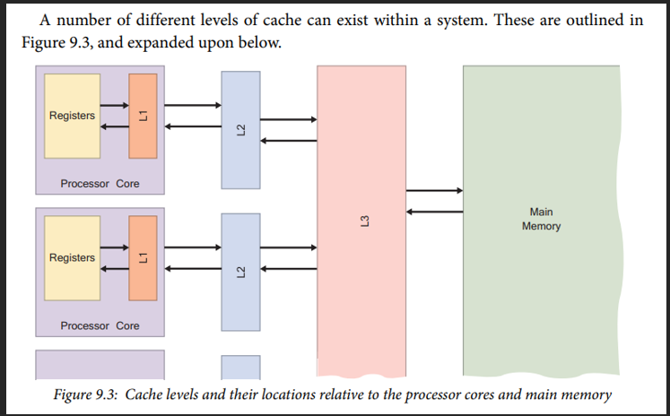
  - L0
    - CPU register file is referred to as L0 cache sometimes
    - It's as fast as you can get
  - L1 cache
    - Fastest and closest cache to CPU cores
    - Typical cache- used to access frequently accessed data and instructions to reduce wait time
    - Split into sections to juggle data and instructions in cache
    - Implemented in SRAM in Zynq
  - L2 cache
    - Larger and slightly slower than L1 cache
    - Serves as a buffer between L1 cache and main RAM memory
    - Holds additional data and instructions that aren’t actively used but are still good to have closer to CPU
    - Implemented in DRAM in Zynq
  - L3 cache
    - Larger than both L1 and L2 caches
    - Serves as a shared cache between all CPU cores
    - A platform for cores to share data efficiently
    - Implemented in DRAM in Zynq
- Three Cs model
  - Model where cache misses are classified into:
  - Compulsory miss
    - Aka, "cold-start miss"
    - Access to a block that's never been in the cache
  - Capacity miss
    - When a cache can't contain all blocks needed to satisfy a request and misses
  - Conflict miss
    - Aka, "collision miss"
    - When multiple blocks compete for the same set in a set-associative or direct-mapped cache
- Global vs local miss rate
  - Global
    - Miss rate in all levels of a multilevel cache
  - Local
    - Miss rate w/ respect to a particular cache level
- Prefetching
  - When a block of data is brought into cache before it's referenced
  - A method to predict access and try to save time
- Cache coherence
  - When it's ensured that multiple caches in a multi-processor system have a consistent view of memory
  - ...so if one core updates a memory location in its cache, other caches that store the same location need to be updated or invalidated
- 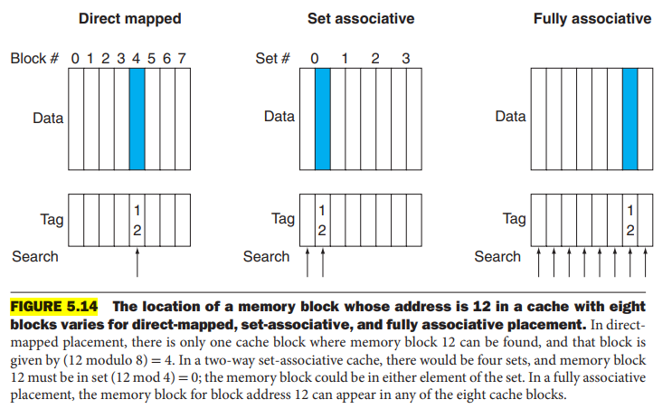
  - Direct mapped
    - Every line in cache is associated w/ a line in main memory
  - Fully associative
    - A cache structure in which a block can be placed in any location in cache
    - Maximizes flexibility for replacement, but hardware is expensive (parallel tag comparators) and difficult to scale
  - Set associative
    - A cache that has a fixed number of locations where blocks can be placed
    - Compromise between direct mapped and fully associative
    - Balances hit-rate and hardware cost
    - Widely used for L1-L3 caches
- Cache statistics
  - 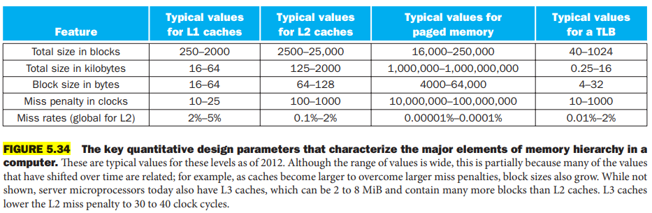

## Consistency Models

- There needs to be a scheme in which memory is updated and operated on in a multiprocessor system w/ multiple threads/processes
- Strict consistency
  - A read returns value of most recent write
  - Intuitive, but impractical- can't instantly propagate across a system
- Sequential consistency
  - All CPUs see the same sequence of operations on memory, regardless of the way hardware reorganizes operations
- Processor consistency
  - Choosing a single processor to establish global consistency in operations for, and leaving other processors' operations in undefined order
- Weak consistency
  - Memory updates don't become visible immediately
  - Synchronization techniques need to be implemented for each memory operation
- Release consistency
  - Weak consistency, but w/ enforcement of "releasing" a lock and "acquiring" a lock to memory

## CPU Registers, Register File, Cache 0

- CPU registers
  - Fastest storage locations in the CPU built directly into the processor core
  - Local variables may be optimized into CPU registers for faster operations
  - ...When there are too many variables to fit into CPU registers, stuff is stored in main memory instead (process is called "spilling registers")
- Register file
  - A collection of all registers available to a CPU core
  - May be implemented as small SRAM inside the CPU
- Cache 0
  - May refer to a register file, or could actually be a cache sitting between register file and main memory

## DMA

- “Direct memory access”
- Allows hardware subsystems (hard disks, graphics cards, etc) to directly access main system memory instead of relying on the CPU to do so
- Allows CPU to execute other tasks while data is being transferred to/from main memory
- Ex:
  - If an I2C peripheral on a chip has DMA support, then that means data can move directly between the peripheral's registers and some buffer on RAM as specified by software
  - Interrupts are triggered when you have a read/write request for you to respond accordingly w/ software
  - All made possible w/ a "DMA controller"
- DMA work can be initiated w/ software (writing to DMA controller) or hardware (DMA controller is receiving external input)

## Dynamic Memory Allocation

- If RAM (virtual or not) needs to be acquired at runtime, a "dynamic memory allocator" is used
  - A dynamic memory allocator maintains an area of a process's virtual memory as "heap"
  - The kernel maintains a variable `brk` that points to the top of the heap
  - An allocator maintains the heap as a collection of various-size "blocks"
    - Blocks are either "allocated" or "free"
- To be used when you don't know the size of data structures until the program actually runs
- "explicit allocators" require that an application explicitly frees any allocated blocks
  - C standard library provides an explicit allocator- the `malloc` package
- "implicit allocators" require the allocator to detect when an allocated block is no longer being used by the program and then free the block
  - Aka, "garbage collectors" that perform "garbage collection"
  - Garbage collection originates to Lisp systems in the 1960s... Now present in Java, ML, Perl, etc
- Buddy allocation
  - Fast/structured method of dynamic memory allocation
  - Efficiently merges/splits memory in powers of 2
- First fit
  - Prioritizing speed and using the first block that satisfies the request for allocation regardless of fragmentation
- Best fit, worst fit
  - Best fit is taking the time to find the smallest free block that satisfies the request, and worst fit is the opposite
- Linked allocation
  - File storage and memory management technique
  - Scheme where files are stored in memory as linked lists, to best make use of free space as opposed to allocating contiguously causing internal fragmentation
- Indexed allocation
  - Using an index table to associate memory sectors to files

## EMC

- “external memory controller”
- NXP link here
  - [MCUXpresso SDK API Reference Manual: EMC: External Memory Controller Driver (nxp.com)](https://mcuxpresso.nxp.com/api_doc/dev/329/group__emc.html)
- Stop thinking about emp grenades that’s anime
- Stop thinking about ecm that’s also anime
- NXP’s EMC driver let’s the MCU control external memory like RAM, ROM, flash, SDRAM, etc

## FAT

- "file allocation table"
- Data structure used by an OS to keep track of which disk blocks belong to which file
- ...So a form of indexed memory allocation
- FAT32
  - Common for SD cards, etc
  - 32 refers to bits per FAT entry, which determines the number of memory clusters/blocks
  - FAT32 allows for up to 2TB or so

## Flashing vs Programming

- “flashing” refers to non-volatile memory
  - Writing to memory cells
- “programming” can refer to both volatile and non-volatile memory, as well as FPGAs
  - Non-volatile: write to non-volatile memory cells
  - Volatile: loading data for temporary use in memory cells
  - FPGAs: load/configure a synthesized design to FPGA hardware
- “memory cells” refer to units of storage that can store either a 1/0 to store instructions/data
  - FPGAs have volatile memory cells that make up configurable logic blocks (unless it has non-volatile configuration memory to load a preloaded bitstream)
  - FPGA’s are often made of SRAM, but sometimes made of non-volatile memory like flash to make low power consumption FPGA’s at the cost of memory density

## Fragmentation

- When unused memory is not available to satisfy allocate requests
- Internal fragmentation
  - When allocated block is larger than the payload
  - Aka, "file slack", or "slack space"
- External fragmentation
  - When there is enough aggregate free memory to satisfy an allocate request, but no single free block is large enough to handle the request
  - Aka, "false fragmentation"

## Journaling

- When writing non-volatile memory, there’s a need for a scheme to avoid corrupted memory in case power goes out
- A journaling file system implements a “journal” for changes to be made to memory instead of directly changing memory
- Developed by IPMB for AIX (a series of UNIX operating systems)
- How it works
  - Write changes to be made to journal
  - Commit changes to memory
- A journaling file system makes write operations “atomic” (changes are either all done or not at all)
- A crash during write to memory just triggers a replay of the journal to finish the write
- A corrupt journal just means the changes won’t be made

## JTAG

- “joint test action group”
- Came about in 1980s together w/ new SMD/multilayer PCB technology as a way to troubleshoot/look at registers/data in chips w/o desoldering ICs
- Industry standard for PCB testing and verification after manufacture
- Provides a system for digital simulation and on-chip design automation and instrumentation

## Locality

- Tendency for programs to access data and code in localized regions
  - So the tendency to reference data items that are near other recently referenced data items, or that were recently referenced themselves
- Good programs will access more data items from the upper levels of the memory hierarchy than programs w/ poor locality, and run faster
- Temporal locality
  - Reuse of same memory
  - Programs can keep recently used items to maximize temporal locality
- Spacial locality
  - Access nearby memory
  - Programs can prefetch contiguous blocks to maximize spacial locality
  - ...This means DON'T access elements by iterating across rows at the deepest nest- iterate across items in the same row that the deepest nest

## Main Memory

- Often refers to main RAM that is used by CPU to execute applications (so DRAM)
- Aka, "primary memory"
- ...Other storage devices like flash and hard disks can be called "secondary memory"

## Memory Aliasing

- When two pointers may designate the same memory location is called "memory aliasing"
- ...so when a function takes two pointers and performs logic w/ the pointers, the way the two pointers could point to the same object inhibits operation optimization
- General definition is when "two addresses access the same object"- so can refer to two virtual addresses referring to the same physical address too

## Memory Hierarchy

- 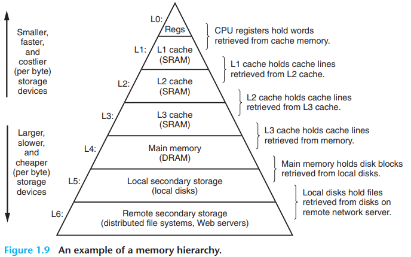
- 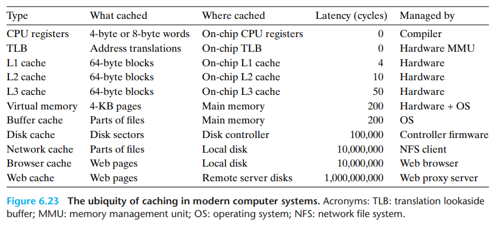
- A pyramid of storage devices, from fast/small/cheap accesses per byte to slow/large/expensive accesses per byte

## Memory Layout

- 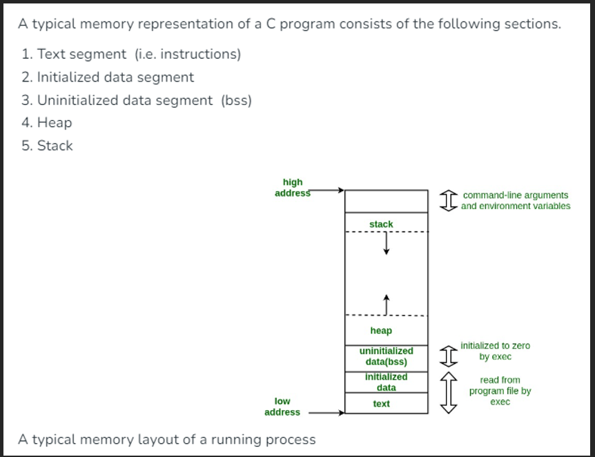
- 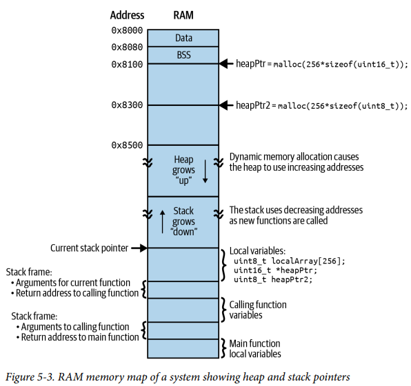
- 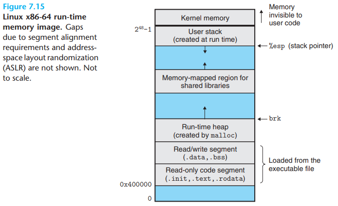
- Text segment
  - Aka “code segment” or “text”
  - Where executable instructions are stored in a complex system- a system could load instructions to run from flash to RAM here as needed during boot-up
  - Stored on FLASH
- Initialized data segment
  - Aka “data segment”
  - Used to store initialized global vars and static variables in a program
  - Stored on FLASH, and copied to RAM
  - All variables in data segment are initialized to 0
- Uninitialized data segment
  - Aka “BSS segment” (named after old assembler operator called “block started by symbol”)
  - Used to store uninitialized global and static variables
  - Stored on RAM
  - All variables in the BSS segment are initialized to 0
- Stacks, heaps
  - Stack
    - Includes call stack and all new variables required by a function call
  - Heap
    - Used for user dynamic memory allocation
    - Malloc and free required to manage heap
  - Both stored on RAM
  - All stack and heap variables are initialized to garbage
- Read-only
  - Contains string literals, constant arrays, and other immutable data
  - Stored on FLASH
- Memory layout summary
  - FLASH
    - .text
    - .rodata
    - .data
  - RAM
    - .bss
    - Stack/heap

## Memory Management

- Allows for OS’s and applications to access memory that is dynamically allocated
- Allows software to see fragmented physical regions in memory as contiguous virtual address space
- Avoids the need to access specific hardware addresses by using virtual addresses instead
- 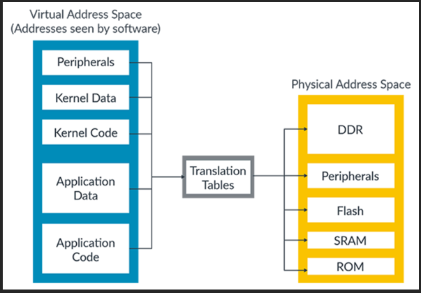
- ARM context example
  - 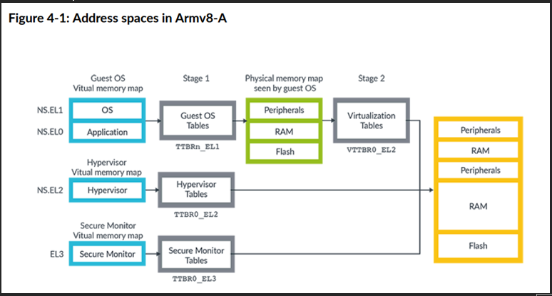
    - After a virtual address is used, the application is redirected to an IAP (“intermediate physical address space”) located in DDR, peripherals, or flash to then be redirected to actual physical addresses
  - 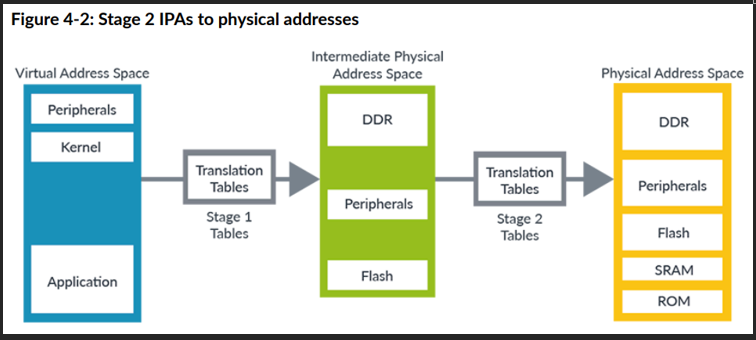

## Memory Mapping

- When contents of a virtual memory area is associated w/ an "object" on disk
- An object can be:
  - A regular file
    - A contiguous section of a regular disk file (executable object file, etc)
  - Anonymous file
    - Created by the kernel, containing all zeros

## MPU

- “Microprocessor unit” (like MCU) or
- “memory protection unit”
  - Used to protect critical memory partitions
  - FreeRTOS has functions that utilize an MPU to avoid using critical memory

## NVM

- “non-volatile memory”
- As in “QSPI flash as NVM”

## Paging

- Paging is when chunks of data from memory is saved to some faster memory for when the same data is requested access
- Main memory can be used as an abstraction layer between a program and disk, where virtual addresses map to physical disk addresses
  - This is then called "memory mapping"
- An MMU has a "page table" that maps virtual pages to physical pages
  - A page table is an array of "page table entries"
- Page Replacement Algorithms
  - FIFO
    - “first in first out”
    - Oldest page in RAM is replaced
  - LRU
    - “least recently used”
    - Least accessed page on RAM is replaced
  - Optimal
    - Page that will be least used going forward is replaced
    - Requires future information about page use
  - Clock algorithm
    - Slightly optimized LRU algorithm
    - Iterates through all pages on RAM, w/ an access bit on each page
    - Pages are replaced w/ a check on access bit

## Processor Memory Gap

- A processor and its register files are getter a lot faster than a processor and main memory...
- Main memory accesses (and all memory elements below it on the hierarchy) are becoming the bottlenecks of processing speed

## Programming MCU

- MCUs are programmed by flashing machine code to MCU’s flash memory once it is generated by a compiler (c/c++ -> assembly code -> machine code)
  - Compiler translates c/c++ to assembly
  - Assembler translates assembly code to machine code
- ISP (“In system programming”)
  - Programmable in the circuit w/ utility like UNLINK DEBUG adapter
  - Program entirety of memory w/o MCU help
    - UPDI
      - “unified program and debug interface”
      - Used to program AVR MCUs
    - JTAG, etc
- IAP (“In application programming”)
  - Application itself can re-program the on-chip flash ROM
  - Can update small sections of memory, good for firmware updates
  - Firmware update done using MCU
  - In our LPC54628 USB project
    - MCU will boot off of RAM instead of flash to execute IAP
      - Bootloader application will be on standby to receive commands from host over USB
      - When MCU receives the command to start receiving binary data to be stored on RAM, MCU will confirm it’s ready and start storing data into RAM
      - MCU will then use the RAM code to replace the entirety of the firmware image stored in MCU flash memory
    - An alternative approach would be to copy code from flash to RAM after receiving commands over USB, but this would rely on flash memory (can’t dynamically update firmware over host PC without reprogramming MCU flash)

## Programming/Configuring FPGAs

- FPGAs are programmed by loading a configuration bitstream to configure the programmable logic to execute whatever logic
- JTAG
  - Pass as bitstream of programming/configuration info to FPGA via JTAG
- Configuration memory
  - If available- use FPGA’s non-volatile memory to load preloaded bitstream to program/configure logic
- On-the-fly programming
  - If available- use dynamic reconfiguration to reconfigure FPGAs while they’re still operating
- Bitstream formats
  - Hex, bin, etc
  - Machine code is also stored in binary/hex format, but that’s because binary format is compact and good for both configuring FPGAs and flashing memory with code
    - Binary is as low as you can go w/ 0s and 1s

## SATA

- “serial AT attachment” (“advanced technology”)
- Protocol used to transfer data from motherboard to mass storage device like hard drives, optical drives, and solid state drives
- A "host bus interface" to allow for communication w/ storage devices
- Introduced in early 2000s
- Used for consumer devices- cheap, and 1 device per channel
- SATA memory
  - Refers to SSDs made of NAND memory cells
  - Can also refer to anything else that uses the SATA protocol like HDDs, optical drives, etc
  - Can read/write, but have limited lifespan
  - Have built-in controllers to manage reading/writing/erasing, wear leveling to use all cells evenly, and bad block management
  - Uses SATA interface/protocol for computer to interface w/ the memory
  - TRIM support
    - Command for OS to tell SSD that blocks of memory aren’t used and can be deleted
  - Garbage collection
    - SSD’s controller’s taking back blocks of data that aren’t used
  - Using SATA memory
    - “graceful shutdown”
      - Shutdown sequence needed to let interactions w/ persistent memory (hard drives, SSD, and flash drives) terminate gracefully
      - Avoids abruptly removing power and corrupting data
      - SATA memory can have “write caches” that temporarily store data before writing to NAND memory cells

## SCSI

- "small computer system interface"
- A "host bus interface" just like SATA, introduced in 1980s
- Used for servers, storage arrays, enterprise gear for the protocol's reliability, scalability, and advanced command sets

## Segmentation

- A variable-size address mapping scheme where an address consists of a segment number (which maps to physical memory) and a segment offset
- "seg fault"
  - A program trying to access a segment it wasn't supposed to was a "seg fault"
  - Runtime error raised when a program tries to access memory it's not allowed to

## Sequential vs Random Access

- "random access" refers to access that's unpredictable in read/write order- editors and running programs need RAM
- ...As opposed to if you were to load an image or play a video / audio clip, which is done w/ sequential access

## Thrashing

- When CPU spends too much time managing memory instead of performing actual tasks
- Ie, managing pages, memory/hardware accesses, etc

## Uniform/Non-Uniform Memory Access

- UMA
  - Multiprocessor where latency to all words in main memory is the same regardless of what processor requests access
- NUMA
  - A type of single address space multiprocessor where memory accesses are faster for some processors

## Verifying Memory

- A truly robust system would have its memory elements (both volatile and non-volatile) verified too
- All addresses should be readable and writable
- Power Outage
  - The bane of working w/ memory
  - Non-volatile memory
    - All systems need to have a mechanism to handle corrupted non-volatile memory if it's being interfaced w/ at runtime
    - Journaling, atomic writes, checksum and restoration, etc
  - Volatile memory
    - Even volatile memory is at risk
    - If power is in the right range above the reset or brown-out detection threshold but below a processor's normal operating range, then RAM can be corrupted while that power is in the corrupted range
    - This is especially the case when systems have hold-up or backup power that extend power down time, and if that slowly depleting power source is directly fed to processors
      the solution is to have external hardware that monitors power for instability, and have it reset processors and memory when power is being lost
