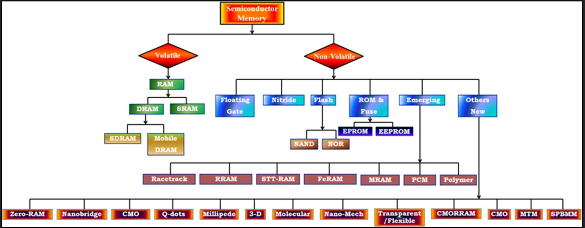

# Variants

- Variants (different implementations of) memory notes

## Index

- [Index](#index)
- [Disk vs Disc](#disk-vs-disc)
- [IDE Drive](#ide-drive)
- [Programmable Logic Memory](#programmable-logic-memory)
- [RAM](#ram)
- [ROM](#rom)
- [SD Card](#sd-card)
- [Semiconductor Memory Family Tree](#semiconductor-memory-family-tree)
- [SSD](#ssd)

## Disk vs Disc

- Disk refers to large storage device (disk drive, etc)
  - Aka, large magnetic disks before SSDs came around
  - RAID
    - "redundant arrays of inexpensive disks"
    - An organization of disks consisting of small cheaper disks to improve performance and reliability
- Disc refers to optical storage (happens to also be common in British English)

## IDE Drive

- "integrated drive electronics"
- Aka, ATA
- Appears in older PC contexts w/ HDDs and CD-ROMs

## Programmable Logic Memory

- Mentioned in docs for Zynq SoCs
- Requires less power, and accessible faster than external memory
- **BRAM**
  - “Block RAM”
  - Memory available for PL to use
- **UltraRAM**
  - FPGA RAM for Zynq UltraScale+ MPSoC’s
  - More dense than BRAM, and less power than BRAM
- **LUTRAM**
  - Aka “distributed RAM”, or “lookup table” RAM
  - Intended for when small memory blocks are sufficient
  - Used when BRAM’s latency isn’t desired
- **Tightly coupled memory**
  - Attached to RPU of Cortex R5 processor cores
  - Allows RPU to have priority access to memory that has deterministic performance and low-latency access

## RAM

- “random access memory”
- Volatile memory (w/ "FRAM" exception)
- **SRAM**
  - “static RAM”
  - Memory cells are flip-flops (6-transistor circuit), so memory can be sustained as long as power is supplied
  - These cells are "bistable" memory cells
  - Typically used as cache memory where speed and low latency are critical
    - CPU caches, graphics memory, etc
    - 10 times faster than DRAM
  - A partition in DRAM is called a "supercell"- this is just to avoid overusing the word "cell" and "word"
- **DRAM**
  - “dynamic RAM”
  - Memory cells are made of transistors and capacitors, where binary data is stored as voltage across capacitors
    - Makes DRAM slower than SRAM due to need to refresh
    - Less transistors required, so less physical space required than SRAM
    - Consumes less power than SRAM
    - Less expensive than SRAM
  - Cells need to be refreshed regularly to tackle leakage current
  - Typically used as system memory (what we all toss around as RAM) in computers for data to be stored temporarily
  - **DDR ECC**
    - “error correction code” type of DDR
    - No, unfortunately not dance dance revolution
    - Supports an extra memory chip to correct errors in memory
  - **DDR SDRAM**
    - “double data rate synchronous dynamic random-access memory”
    - No, not dance dance revolution
    - Transfers data to processor on every clock edge (twice per cycle, on both rising and falling edge of clock)
  - **DIMM**
    - "dual inline memory module"
    - A module w/ 4-16 DRAMs- aka RAM sticks
    - Rotating access between the different RAM banks is called "address interleaving"
    - When there are separate electrical contacts (via separate RAM chips) on each side of the module connector for double number of memory interface pins
- **SDRAM**
  - “synchronous dynamic RAM”
  - No, it’s not SRAM DRAM fusion
    - It’s basically fast DRAM
  - DDRx (x = 2, 3, 4) SDRAM is the RAM that’s usually on PC RAM sticks
  - DRAM that synchronizes w/ system clock for faster transfers
  - Uses pipelining to overlap memory access operations to minimize delay
  - Has “bank architecture” to allow for multiple memory operations in parallel
- **eDRAM**
  - “embedded DRAM”
  - DRAM integrated within CPU die or GPU
  - Has specs between SRAM and DRAM in terms of speed and density
  - Often used to implement high-speed caches
- **FRAM**
  - “ferroelectric RAM”
  - Better than regular DRAM for features including:
    - Non-volatile
    - Lower power consumption
    - Faster writes than flash
  - Applications include
    - Quick data storage, security applications
  - Cons include
    - Higher costs, lower memory density
- **PSRAM**
  - “pseudo static RAM”
  - Combines aspects of SRAM and DRAM to try and make inexpensive SRAM, aka dense DRAM
  - Made w/ DRAM cells, but it manages refresh cycles internally so it behaves like SRAM when you interface w/ it
- **MRAM**
  - "magnetoresistance RAM"
  - ..."magnetoresistance" is the change in electrical conductivity of a material when a magnetic field is applied
- **PRAM**
  - "phase-change RAM"
  - Metallic alloys vary in electrical resistance between crystalline and amorphous states, which can be exploited to make memory cells

## ROM

- Non-volatile memory
- Old PROM's used to be programmable just once- there was a fuse on each memory cell that can be blown once by zapping w/ a high current
- Some chips today implement OTP flash/EEPROM w/ security fuses, lock bits, unique IDs, etc
- **Floating-gate transistor**
  - An FGT is a type of MOSFET w/ an extra electrically isolated gate added to store charge long-term
  - There's a "control gate" which you drive externally, and a "floating gate" surrounded by oxide (no DC connection)
  - Once a charge is placed in a floating gate w/ quantum tunneling, it stays there for years
  - Non-volatile in exchange for larger size, slower write time, limited endurance
  - It's what make up MCU/SoC on-chip flash, EEPROM, etc
- **Charge-trap memory**
  - Modern NAND flash, SSDs, SD, eMMCs are implemented w/ "charge-trap memory"
  - It's another variant of MOSFET
  - Stores electrons in the defects in an insulating layer instead of a single floating conductive gate
  - More reliable, can be vertically stacked to create 3D NAND devices, higher density than floating-gate transistors
- **EPROM**
  - "erasable ROM"
  - Cleared to 0s by shining UV light through a window on the IC
- **EEPROM**
  - “electrically erasable programmable read only memory”
  - Consists of floating gate transistors
  - Byte-addressable erase/program
  - **SEEPROM**
    - “serial EEPROM”
    - EEPROM that’s written/read one bit at a time serially via serial protocol like I2C
  - Used for configuration settings, data logging, firmware storage for updates, security information, etc
  - Allows byte level read/writes
- **Flash**
  - A type of EEPROM memory designed for high speed and density
  - Memory cells are made of floating gate transistors either NOR or NAND logic gates
    - This is where “NOR” or “NAND” flash comes from
    - Floating gate transistors are able to trap electrons inside of them to retain logic level
  - Erasing data from the chip resembles the “flash of a camera”
  - Erases are in blocks/pages
  - Having a controller spread the writes performed on blocks is called "wear leveling"
  - **NAND vs NOR**
    - **NAND**
      - Organized into blocks
      - Read/write happens by iterating blocks
      - Dense and compact memory in exchange for access by pages
    - **NOR**
      - Organized into sectors/pages
      - Read/write happens by iterating sectors/pages
      - Faster reads and accesses in access for more space required
    - NAND flash has faster write speeds (good for data storage)
    - NAND has faster erase speed by erasing blocks at a time
    - NOR flash has faster read speeds (access available to individual memory locations)
    - NOR has lower access latency due to access at sector level

## SD Card

- "secure digital memory card"

## Semiconductor Memory Family Tree

- 

## SSD

- "solid state drive"
- Sometimes incorrectly referred to as "solid state disk"... SSDs don't have spinning magnetic platters which "disks" are associated w/
- Storage technology based on flash memory
- Faster than HDDs w/ rotating disks thanks to a "flash translation layer" implemented in place of a disk controller
- Trade-offs
  - Can wear out just like regular flash memory
  - Usually more expensive than HDDs per byte
