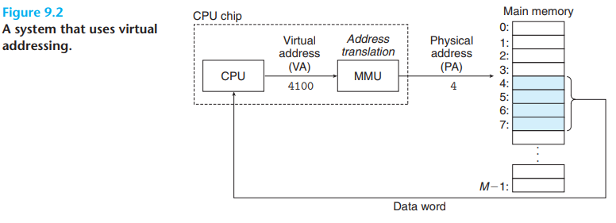
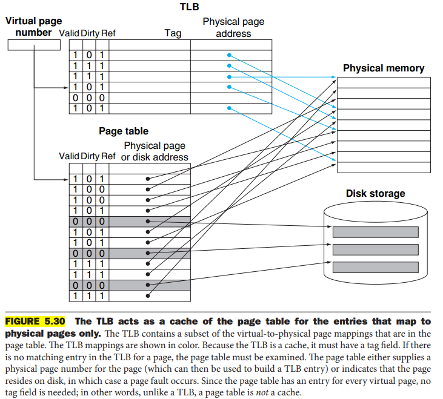
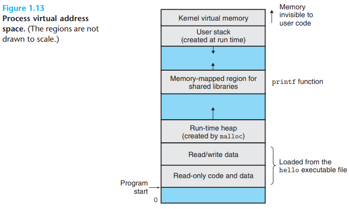

# Virtual Memory

- Virtual memory notes

## Index

- [Index](#index)
- [Memory Mapping, Virtual Addressing](#memory-mapping-virtual-addressing)
- [MMU](#mmu)
- [MMU vs VMMU](#mmu-vs-vmmu)
- [Swap Area](#swap-area)
- [Virtual Addressing](#virtual-addressing)

## Memory Mapping, Virtual Addressing

- These two are not the same thing
- Memory mapping
  - Reserving addresses on physical memory as addresses that interface w/ registers of separate hardware (external SPI flash, UART peripheral, etc)
- Virtual addressing
  - A method of adding an additional abstraction layer between physical registers and registers that a user interfaces w/
  - Allows for memory protection and prevents user from directly using hardware addresses
  - Can expand a limited set of physical addresses by implementing schemes to juggle the physical memory (page replacement algorithms, mapping extra virtual addresses to hardware that’s not RAM, etc)

## MMU

- “memory management unit”
  - Unit used by a CPU to access main memory
  - This unit maps virtual memory addresses to physical addresses if applicable
- IOMMU- input/output MMU connects IO bus to main memory
- TLB
  - “translation lookaside buffer”
  - A cache of addresses to quickly translate frequently requested addresses
- Translation table
  - The full table w/ virtual to physical address mapping

## MMU vs VMMU

- MMU
  - Hardware component inside CPU to handle virtual address translation to physical addresses
  - Supports protection, paging, segmentation, etc
- “virtual MMU”
  - Less commonly implemented
  - Software component responsible for managing virtual memory in a virtualized environment
    - Virtualized environment
      - A space where multiple guest OS’s are running on a single physical machine
      - Each guest OS has its own virtual memory space
  - Manages and translates virtual addresses to physical addresses

## Swap Area

- Aka, "swap space"
- Space on some storage (disk, SSD, dedicated partition, etc) that an OS uses as an extension of RAM
- Stores pages that aren't currently active to free physical RAM for other running processes
- Under the virtual memory umbrella as the specific case where virtual addresses map to external memory

## Virtual Addressing

- When there isn’t enough RAM (there's never enough RAM), virtual addressing is used to store data on physical memory like hard drives, SSDs, or not at all (just share physical RAM space)
- Accessing memory w/ physical addresses is called "physical addressing"
- Oftentimes OS’s map additional addresses that can’t fit to RAM on to RAM, and swapping/page replacement algorithms come in to play to juggle available memory
  - Virtual address space is divided into pages
    - It’s larger than actual RAM available
  - Page tables map virtual addresses to physical addresses on RAM
  - CPU’s MMU (memory management unit) translates virtual addresses to physical addresses
    - Page swapping/replacement algorithms used here by MMU
    - If there isn’t enough memory on RAM, then secondary memory like SSD’s and hard disks are used to store data
- 
  - Converting a virtual address to a physical address is called "address translation"
  - MMUs ("memory management units") are dedicated hardware that translates virtual addresses
  - MMUs can implement a TLB
    - 
    - A TLB ("translation lookaside buffer") is a small virtually addressed cache full of lines that hold a block consisting of a "page table entry"
- 
- Virtual memory allows:
  - Main memory to be shared efficiently by treating it as a cache for an address space stored on disk
    - Keeps only active areas in main memory and transfers data back and forth between disk and memory as needed w/ page replacement algos
  - Simplifies memory management by providing each process w/ a uniform address space
  - Protects address space of each process from corruption by other processes
  - Sharing of memory between processes if they need to run the same program, etc
