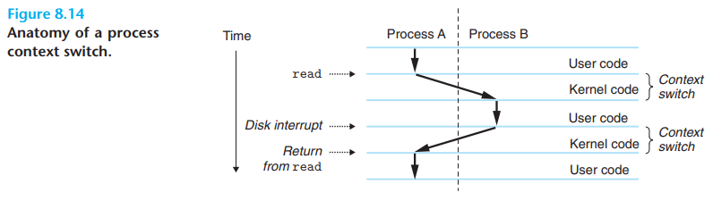
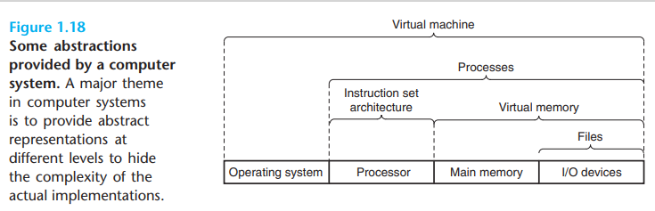
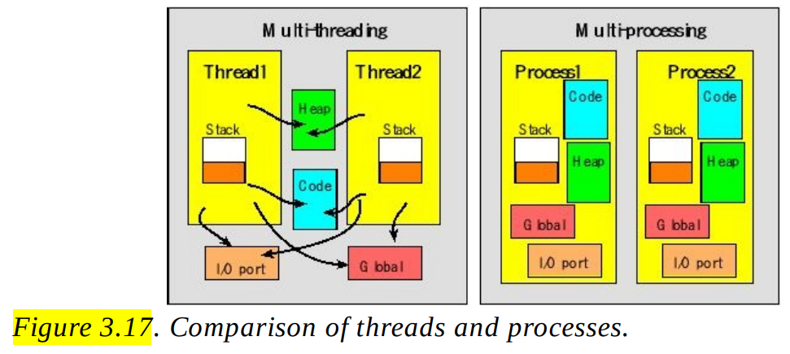

# Fundamentals

- Fundamental OS notes

## Index

- [Index](#index)
- [ABI](#abi)
- [Asynchronous Programming vs Multithreading](#asynchronous-programming-vs-multithreading)
- [Concurrency](#concurrency)
- [Context Switch](#context-switch)
- [Contexts](#contexts)
- [Deadline](#deadline)
- [Disabling Interrupts](#disabling-interrupts)
- [Environment List](#environment-list)
- [EOL Indicators](#eol-indicators)
- [Execution Time](#execution-time)
- [Fundamental Abstractions](#fundamental-abstractions)
- [Hardware to OS Interfaces](#hardware-to-os-interfaces)
- [Hyper-Parallelism](#hyper-parallelism)
- [Interrupt vs Determinism](#interrupt-vs-determinism)
- [Kernel](#kernel)
- [Kernel vs User Mode](#kernel-vs-user-mode)
- [Logical Flow](#logical-flow)
- [OS Definition](#os-definition)
- [OSA](#osa)
- [Parallel-Processing Program](#parallel-processing-program)
- [Partitioned/Full Resource Sharing](#partitionedfull-resource-sharing)
- [Producer-Consumer Model](#producer-consumer-model)
- [Protect Virtual Memory](#protect-virtual-memory)
- [Reentrancy](#reentrancy)
- [RTOS](#rtos)
- [Serialization](#serialization)
- [Soft Real-time, Hard Real-Time, Firm Real-Time](#soft-real-time-hard-real-time-firm-real-time)
- [System Call](#system-call)
- [Thread vs Process](#thread-vs-process)
- [Timing Constraint Types](#timing-constraint-types)
- [Top-Half, Bottom-Half](#top-half-bottom-half)
- [User Space, Virtual IO Space](#user-space-virtual-io-space)
- [User, Superuser, Group](#user-superuser-group)
- [WCET](#wcet)
- [Work Queues](#work-queues)

## ABI

- "application binary interface"
- Everything relevant to a user in a system w/ an OS, including:
  - User instruction set
  - OS system interfaces for application programmers
  - Aka, a set of rules for how executables should exchange info w/ services (kernel, library, etc) at runtime
- When a project is built for an ABI, that executable should run on any machine that presents the same ABI
- Standard for binary portability across computers
- Allows application programmers to not worry about portability of low-level system functions like IO, allocating memory, etc

## Asynchronous Programming vs Multithreading

- Multithreading
  - Having an OS or API manage multiple lines of execution at the same time via synchronization techniques (methods that lock shared resources)
- Asynchronous programming
  - Managing multiple tasks with/without locking resources
  - Could utilize multithreading

## Concurrency

- "logical flow" whose execution overlaps in time w/ another flow is called "concurrent flow"
- "concurrency" is the general phenomenon of multiple flows executing concurrently
- Processes taking turns in execution is called "multitasking" (not multi-threading- that's w/in a particular process)
- When two flows are running concurrently on different processor cores or computers, it's called "parallel flows"/"parallel execution"

## Context Switch

- 
- An OS kernel implements multi-tasking/threading w/ a form of exceptional control flow called "context switching"
- The process of a kernel deciding to start/stop various processes/threads from continuing execution is called "scheduling"

## Contexts

- Refers to execution state / environment where tasks and programs are able to run in
- **User context**
  - For user-level applications to run safely isolated from kernel resources
  - Limited privileges to protect hardware and kernel memory
  - Needs kernel system calls to access privileged resources like files and device IO
- **Kernel context**
  - For managing hardware resources, memory, and other critical components
  - Can make system calls and execute kernel modules and drivers
  - Full privilege- access to all hardware and memory
- **Interrupt context**
  - Mode of execution triggered by an interrupt where CPU stops current task to handle the interrupt
  - For handling time-critical events- IO operations, hardware notifications
- **Process context**
  - Environment in which a process runs including its registers, memory space, and execution stack
  - Allows for multitasking by encapsulating tasks w/ their own isolated states
- Other jargon you might encounter:
  - **Idle context**
    - State of CPU when there are no processes or tasks ready to run
    - For saving power- may be in low-power state
  - **Real-time context**
    - Environment where there are strict timing constraints
    - For execution of time sensitive operations that need guaranteed response times
  - **DMA context**
    - Specialized context where peripherals access memory without CPU intervention
  - **Scheduler context**
    - Environment where OS scheduler decides which tasks or processes to execute
    - A context where the kernel uses context switching and multitasking to multiplex CPU time
  - **System context**
    - Broad context referring to kernel-level execution and resource management of the entire system
    - Includes kernel threads, interrupt handlers, system daemons, etc
  - **Virtual context**
    - Context simulated by software like VMs or containers for isolated execution environments
    - For running multiple OS instances/apps on the same hardware

## Deadline

- When a task should complete relative to when it's ready to run
- "time to deadline" is time between now and deadline
- "slack time" is time-to-deadline - time it takes to complete the task

## Disabling Interrupts

- Interrupts should be minimally disabled
  - ... or better yet never disabled at all
  - A project w/ a generic function that turns on/off interrupts w/ an RTOS running is horrible- program execution is not deterministic, and interrupts can unexpectedly be on/off
  - Interrupts can be disabled as long as you're not running an RTOS- and when they are the block should be minimal and short
- In ISR's, interrupts should be disabled just around the non-reentrant hardware accesses

## Environment List

- Each process has an "environment list"- it's just the set of environment variables maintained in the user space of the process
- Environment variables are strings that define name to values

## EOL Indicators

- Linux
  - LF only
- MS Windows
  - CR and LF
- ...this is why when you develop on Windows and push stuff to a remote git repository, Linux standards kick in and prompt that all CR LF will be translated to LF

## Execution Time

- CPU execution time
  - Aka, CPU time
  - Time CPU spends computing something
- User CPU time
  - CPU time spent in a particular user program
- System CPU time
  - CPU time spent in OS to perform tasks as requested by a user application program

## Fundamental Abstractions

- 
- Fundamental abstractions provided by an OS:
  - Files
    - Abstractions of IO devices
  - Virtual memory
    - Abstractions of program memory
  - Processes
    - Abstractions of running programs
  - Virtual machine
    - An abstraction of the entire computer, including the OS
    - Introduced by IBM in 1960s

## Hardware to OS Interfaces

- BIOS
  - “Basic Input/Output System”
  - Traditional and old firmware interface used to initialize and control hardware during computer boot-up
  - Helps the OS bootloader, not a bootloader itself
- EFI
  - “Extensible firmware interface”
  - Firmware made in early 2000s replacing traditional BIOS
  - Provides more flexibility, faster boot time, supports larger disk size, etc
  - Helps the OS bootloader, not a bootloader itself
- UEFI
  - “Unified extensible firmware interface”
  - Upgrade to EFI
  - Adds enhancements to support 64-bit architectures, secure boot, ability to interface w/ system over network interface
  - Helps the OS bootloader, not a bootloader itself

## Hyper-Parallelism

- "extreme levels of parallel execution" beyond conventional processing
- Massive concurrency at instruction-level, data-level, task-level, across distributed systems, etc

## Interrupt vs Determinism

- Interrupts are non-deterministic- we can’t predict the behavior of software when there are interrupts

## Kernel

- Main component inside of an OS- responsible for:
  - Process scheduling
  - Memory management
    - Virtual memory management between processes and kernel
  - Provision of file system
    - Interfacing w/ files
  - Creation/termination of processes
  - Access to devices
    - All IO
  - Networking
    - Transmit/receive messages for processes
  - Provision of a system call API
    - Handling all system calls made by APIs
- Both “FreeRTOS” and “VxWorks” use “microkernels”
  - Minimum software needed to implement an OS
- Enforces access rights to each range in system memory that are allocated to each process/task

## Kernel vs User Mode

- Kernel mode
  - Aka, "supervisor mode"
  - Mode that indicates that a running process is an OS process w/ access to privileged instructions and system calls
    - Ex: running a halting instruction to stop a system, accessing memory-management hardware, interfacing w/ IO devices
  - Allows access to both user and kernel space
  - "system time" refers to time spent in kernel mode
  - Processes each have a "kernel stack" where kernel mode stack frames are stored
- User mode
  - Indicates that a process can access virtual memory marked as "user space"
  - Limited set of capabilities
  - "user CPU time" refers to the time spent in user mode
  - Processes each have "user stacks" in user space where stack frames created by the running program are stored

## Logical Flow

- Aka, "logical control flow"
- Sequence of PC ("program counter") values exclusive to the instructions contained in a program's executable object c file or shared objects

## OS Definition

- An OS is the glue and layer of abstraction between hardware resources and software to allow for software to safely and predictably interface w/ hardware

## OSA

- “operating system abstraction”
- Provides a standard interface to abstract out an OS’s low-level operations

## Parallel-Processing Program

- A program that runs on multiple processors simultaneously

## Partitioned/Full Resource Sharing

- The method for processes/threads to share resources like cores, caches, memory banks, buses, etc
- Partitioned resource sharing
  - Resources are divided up among processes/threads
  - Each processes/threads gets a portion of resources
- Full resource sharing
  - Resources are placed in a common pool, and processes/threads use them dynamically

## Producer-Consumer Model

- Model to manage synchronization between two types of processes called producer and consumer
  - Producer
    - Produces data and places it into shared resource (buffer, queue, message, etc)
  - Consumer
    - Processes data in shared resource

## Protect Virtual Memory

- 3 requirements to have an OS protect virtual memory:
- Support two modes
  - Kernel/supervisor/executive mode and user mode
- Reserve a part of processor state to be read-only for users
  - Provide/hide page table pointer and TLB write access for supervisor/user processes
- Mechanism for processes to switch between user and supervisor mode
  - Implemented via system call

## Reentrancy

- Feature for functions to behave exactly the same regardless of multiple overlapping calls or number of calls
- Functions without any state
- ...Just like how not all systems can be implemented in VHDL as a combinational system, not all functions can be reentrant
- Reentrant rules:
  - Uses all shared variables in an atomic way, unless each is allocated to a specific instance of a function
  - Does not call non-reentrant functions
  - Does not use hardware in a non-atomic way
- Hardware accesses/operations tend to not be reentrant, so firmware should be careful and mindful
- Explicitly reentrant
  - All function arguments are passed by value
  - All data references are local automatic stack variables
- Implicitly reentrant
  - There are arguments passed by reference, but carefully handled

## RTOS

- “real-time operating system”
- Allocates resources to tasks and places emphasis on task order and priority to execute critical tasks first
- NASA uses Linux as their RTOS, but VxWorks is used widely for aerospace and defense
  - VxWorks doesn’t require a MMU (memory management unit) like Linux does

## Serialization

- Converting data structures or objects into formats for easy storage and transmission for later reconstruction
- Serialization formats include JSON, XML, protocol buffers, binary formats
- Used for data storage, IPC, message queues, networking & web API’s, etc

## Soft Real-time, Hard Real-Time, Firm Real-Time

- Soft real-time
  - Emphasizes quality of results (GPOS, “general purpose OS”)
  - Comes at the cost of occasionally failing to meet deadlines
  - Value of tasks slowly diminishes as the deadline goes by
  - Ex: FreeRTOS, RT Linux, embedded Windows
- Hard real-time
  - Emphasizes spread & delegation w/ priority
  - Always meets deadlines- failure to do so leads to catastrophic failure
  - Must provide max response time for external inputs, which should be small
  - High priority process in a hard real-time system should be able to keep CPU until it completes or relinquishes CPU
  - Should control the order in which its component processes are scheduled
  - Ex: VxWorks, LynxOS
- Firm real-time
  - A middle ground between soft and hard real-time
  - When completing a task past its deadline is considered to have no value, but not harmful

## System Call

- Instruction that transfers control from user mode to a location in supervisor code space
- Invokes an exception mechanism in the process

## Thread vs Process

- 
- Threads
  - Pros:
    - It's easier for threads to share information
    - Creating a bunch of processes off of a parent process works, but child process creation can be expensive
  - Cons:
    - Function calls and code needs to be thread-safe
    - A bug in one thread can corrupt all other threads due to shared memory
    - Threads are competing against each other for limited shared virtual memory
- Processes
  - Pros
    - No need to worry about asynchronous safe functions/code w/in each process / logical flow
    - Each process has their own independent memory space
  - Cons
    - IPC needed for communication between processes

## Timing Constraint Types

- There are 2 types of timing constraints:
- Event-response
  - As in, the latency between receiving an event (software/hardware trigger) and responding to the event
- Prescheduled
  - As in, the "jitter" in the amount of time that we actually perform some prescheduled processing (some periodic task) vs the desired time to spend processing
  - You can either do too much processing (causing other tasks to starve) or do too little

## Top-Half, Bottom-Half

- Top-half
  - Aka, the "background", or "handler mode" as per ARM
  - Refers to interrupt handling and the ISR’s that execute critical tasks (reading hardware registers, etc)
  - Interrupt context
- Bottom-half
  - Aka, the "foreground", or "thread mode" as per ARM
  - Refers to the rest of the program that processes data retrieved from an interrupt
  - Normal kernel context

## User Space, Virtual IO Space

- User space
  - Refers to space for software to be written built on top of software (could include OS) for a user to write abstract applications and processes without having to worry about invading system hardware or privileged instructions that shouldn’t be accessed (and should only be accessed by OS kernel if applicable)
- Virtual IO space
  - Another space for software to be written where user programs can reference virtual IO addresses given that they’re mapped to physical addresses
  - Often used to access hardware peripheral devices (anything using IO)

## User, Superuser, Group

- An OS has a superuser, users, and groups
- Exist to limit capabilities of programs that interface w/ the kernel
- A user is an account (w/ ID and password), groups are collections of users
- An OS has a single "superuser" (root) w/ all privileges

## WCET

- “worst case execution time”

## Work Queues

- Mechanisms to organize non-urgent tasks to separate context to prioritize critical tasks
- Ex:
  - ISR’s can add work to a work queue upon receiving data to have the processing handled later
  - In FreeRTOS, work queues are used to schedule periodic tasks without blocking real-time threads
