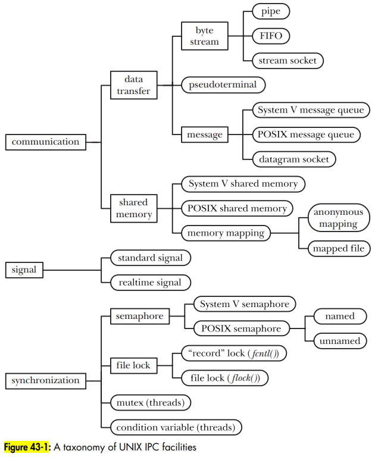

# IPC

- IPC ("interprocess communication") notes

## Index

- [Index](#index)
- [Overview](#overview)
- [Categories](#categories)
- [Critical Section](#critical-section)
- [Deadlock](#deadlock)
- [IPC for Communication](#ipc-for-communication)
- [IPC for Synchronization](#ipc-for-synchronization)
- [Mailboxes](#mailboxes)
- [Monitors and Condition Variables](#monitors-and-condition-variables)
- [Named vs Unnamed](#named-vs-unnamed)
- [Persistence](#persistence)
- [Race Conditions](#race-conditions)
- [Socket](#socket)

## Overview

- "inter-process communication"
- Set of techniques and mechanisms used by OS's for processes to communicate, share data, and synchronize execution safely/efficiently
- For threads, "inter-thread communication" or "intra-process communication" exist, but less commonly encountered

## Categories

- UNIX IPC is categorized into:
  - Communication
    - Exchanging data between processes
  - Signal
    - Rarely used as IPC, but used for synchronization if used
  - Synchronization
    - Exchanging data between processes
  - 
- Ex:
  - Same machine:
    - Pipes
      - Aka "unnamed pipes"
      - One-way communication between child/parent process
      - Exists in some shared memory location
    - Named pipes
      - Accessible by unrelated processes
    - Message queues
      - Kernel-managed queues for sending discrete messages
    - Shared memory
      - Multiple processes map the same physical region
      - Needs synchronization primitives (semaphores, mutexes, etc)
    - Semaphores, mutexes, condition variables
      - Used for synchronization
    - Signals
      - Lightweight notifications (`SIGKILL`, `SIGINT`)
      - ...Not the best for IPC- more for high level communication between process and kernel
    - File locking
      - Locking files to prevent other processes from reading/writing to particular files
  - Across machines:
    - Sockets
      - General-purpose bidirectional communication
      - A socket is the only IPC facility that allows for communication over the network
      - Can also be used for communication on the same machine
    - Remote procedure calls
      - Call functions on remote machines as if local
      - RPC, gRPC, COBRA, etc
    - Message brokers / middleware
      - MQTT, RabbitMQ, etc

## Critical Section

- Aka, the "vulnerable window"
- A section of code where a thread/process is dependent on some global data shared between other threads/processes

## Deadlock

- When a collection of threads is blocked waiting for a condition that will never be true
- Happens when below 4 conditions are met:
  - Mutual exclusion is implemented
  - Hold and wait is implemented
    - As in, being allowed to hold resources while waiting for others
  - No preemption of resources
    - So no letting other threads/processes access resources preemptively (round-robin or by priority)
  - Circular waiting
    - When threads/processes are waiting for each other forever
- To solve a deadlock, just remove one of the 4 conditions above
  - Enforce an order in which resources can be requested by threads/processes, so that you'll never have circular waiting
  - Force threads/processes to request all resources at once whenever resources are needed at all
  - W/ an accurate understanding of resources that each thread/process will need, just deny access to resources if it looks like there'll be circular waiting
  - Or just implement round-robin resource preemption

## IPC for Communication

- Processes can either use IPC as data-transfer facilities, or share memory to communicate information
- Data-transfer facilities
  - All data transfer via IPC falls under data-transfer facilities
  - Data is transferred from user memory under one process to kernel memory, and then to user memory under another process
  - Data access synchronization of data-transfer IPCs is built-in
  - Data-transfer facilities then fall under:
    - Byte stream
      - When read operations return an arbitrary number of bytes from the IPC facility regardless of how much the writer wrote
      - FIFOs, pipes, stream sockets fall here, and are implemented w/ file descriptors
      - Pipes
        - A buffer maintained by the kernel w/ a limited capacity for communication between related processes (parent-grandchild, parent-child, siblings, etc)
        - Unidirectional- one process reads and the other process writes
        - Bidirectional pipes do exist, but they're not defined by UNIX
          - You can use socket pairs instead
      - FIFOs
        - Similar to a pipe, but has a name in the file system and opened just like a regular file
        - Allows for communication between unrelated processes (client server, etc)
    - Message
      - When each read operation returns the whole message written by the writer
      - Datagram sockets and message queues fall here
      - Message queues
        - Similar to pipes, but data transmitted have boundaries to indicate when all bytes of a message is ready, and data transmitted has an associated "message type"
    - Pseudoterminals
      - For communication between two virtual devices
- Shared memory
  - If two processes share virtual memory, then there's no need for a middle man
  - There is need for synchronization to avoid race conditions- semaphore is the go-to

## IPC for Synchronization

- Semaphores, mutexes (w/ or w/o condition variables), spin locks, and file locks are all IPC facilities for synchronization
- Semaphore
  - A semaphore is a signal used to "communicate" between tasks/threads
    - Comes from a relay system of people standing on hills waving flags in coded patterns that were called "semaphores"
    - Coined by Dijkstra
  - This can be to allow tasks access to a resource, to initiate some processing, etc
  - A semaphore alone doesn't have any meaning- the user defines what each semaphore means whether it's for signaling or synchronization
  - Semaphores can be "named" or "unnamed" just like pipes
  - Binary Semaphore
    - A binary semaphore is a type of semaphore that can only have two states
    - Great for locking/unlocking tasks from a common resource
  - Counting semaphore
    - A counting semaphore can count the number of tasks that have access to a resource up to some limit
    - Allows multiple tasks to access some resource at a time
    - Ex: 4 threads accessing a set of identical printers managed by a counting semaphore
- Mutex
  - "mutual exclusion"
  - Similar to a binary semaphore, but includes integrated logic to allow just the task that locked a particular resource to unlock it
  - Only one task can access a resource at a time
- Spin lock
  - A synchronization primitive that holds a task in an empty loop while its waiting for another task to unlock access to a resource
  - Prevents context switching provided a short expected wait time
  - ...But doesn't allow for:
    - Efficient use of processing time- waiting is a waste
    - Clear order of task precedence upon resource unlocking
    - Any priority-based scheduling implementation
- File locks
  - A mechanism to prevent multiple processes from operating on the same file at the same time

## Mailboxes

- IPC mechanism to pass messages and/or data between threads/processes in a system
- One thread/process can add data to a mailbox for another thread/process to take it later
- Could also be used for a heterogenous system’s processors to communicate
  - ARM Cortex-A core communicating w/ Cortex-M core over mailbox
- Two global variables:
  - Data
  - Status- the semaphore flag indicating whether the mailbox is full or empty

## Monitors and Condition Variables

- Monitors and condition variables are used together sometimes in place of our usual kernel + synchronization primitives
- Coined back in 1970s together in concurrent programming theory
- Seen w/ Java, C#, C++
- Monitor
  - A high-level synchronization construct
  - Encapsulates both shared data and functions to access/modify the data
  - Ensures only one thread executes in a monitor at a time
- Condition variables
  - Mechanism in a monitor to allow threads to wait for resources to be free
  - Include: `wait()`, `signal()`, `broadcast()` to put threads to sleep and wake them up
  - Now condition variables are seen standalone w/o monitors in Linux/POSIX
    - Can be used w/ mutexes to communicate state changes across threads to aid synchronization

## Named vs Unnamed

- Semaphores and pipes can be "named" or "unnamed"
- Unnamed
  - Fast and local to a particular process
  - Saved in some shared memory location, primarily for threads to access rather than between processes
  - Has process persistence
- Named
  - "Kernel-named" / "file-system named"
  - Has file-system persistence, and is good for between processes
  - Useful for Daemons and unrelated processes

## Persistence

- IPC's have a lifetime called "persistence":
- Process persistence
  - Aka, an "ephemeral" IPC
  - Stays alive as long as it's opened by at least one process
  - Kernel frees IPC resources if the IPC isn't opened by anything
  - Pipes, FIFOs, sockets are process persistent
- Kernel persistence
  - Stays alive until explicitly deleted or the system is shut down
  - Includes all POSIX and System V IPCs (message queues, semaphores, shared memories, etc)
- File-system persistence
  - Retains information even after system is rebooted
  - Shared memory based on a memory-mapped file is the only IPC that falls here

## Race Conditions

- Race conditions occur when it's not deterministic whether one task or another will have access to a resource
- Synchronization techniques need to be used in a controlled way such that all scenarios are accounted for
- When two threads access global memory and one of the threads performs a write, it's called a "causal dependency"

## Socket

- Refers to endpoint for communication between two machines over a network
- Originated from University of California, Berkeley in 1980s
- Allows server and client to send/receive data over a network via IP address and port number
- “socket programming” is when applications communicate w/ each other over a network using sockets
- A "file" used to communicate w/ another process across a network
- Can either be used in:
  - UNIX domain
    - Communication between processes in the same machine
    - Faster than internet domain sometimes
  - Internet domain
    - Communication between processes on different machines
- Types
  - Stream sockets
    - Provides a reliable, bidirectional, byte-stream communication channel
    - Operate in connected pairs, where the opposing socket from one socket's perspective is the "peer"/"remote" socket
    - Uses TCP
  - Datagram sockets
    - Allow for communication in message form called "datagrams"
    - In exchange for having data boundaries, transmission isn't reliable
    - Uses UDP
- Can be used to create network servers in a design that's:
  - Iterative
    - Server handles one client at a time
    - Each client's request is handled completely before moving on
  - Concurrent
    - Server handles multiple clients simultaneously
    - Good for when each request is time consuming
