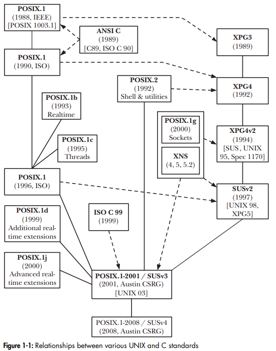

# POSIX

- POSIX notes

## Index

- [Index](#index)
- [Overview](#overview)
- [`_t` Types](#t-types)
- [Driver Interface](#driver-interface)
- [Merged Standards](#merged-standards)
- [Portable Filename Character Set](#portable-filename-character-set)
- [Pthread](#pthread)
- [Realtime](#realtime)
- [Shared Memory](#shared-memory)
- [Signal Handling](#signal-handling)

## Overview

- “Portable Operating System Interface”
  - “X” is for eXtended- refers to expansion of unix interfaces to be portable for other unix based systems
- A group of standards for OS’s for devices to establish portability and compatibility w/ one another
- “a set of formal descriptions that provide a standard for the design of operating systems, especially ones which are compatible with Unix”
- > A family of standards specified by the IEEE Computer Society for maintaining compatibility between operating systems
  - Oxford dictionary
- POSIX was established by IEEE In 1980 to have UNIX interfaces compatible w/ one another

## `_t` Types

- SUSv3, so POSIX, is what defines the types postfixed w/ `_t`
- This means we shouldn't be making our own types that have `_t`- it's confusing and overlaps w/ well defined POSIX types

## Driver Interface

- Many embedded systems drivers are based on POSIX API used to call devices in UNIX systems
- Unix driver interface is in the format:
  - `open`
    - Opens driver for use
    - Similar/synonymous to init
  - `close`
    - Cleans up driver after use
  - `read`
    - Reads data from the device
  - `write`
    - Sends data to the device
  - `ioctl`
    - "IO control"
    - Handles all features not covered by above
    - ...Discouraged by kernel programmers due to its lack of structure
- Universality of IO
  - Concept that abstracts all devices as "files" that are interfaced w/ the same set of functions
  - Anything else that's exceptional is abstracted to `ioctl()`
- Examples:
  - `spi.open()`
  - `spi_open()`
  - `SpiOpen(WITH_LOCK)`
  - `spi.ioctl_changeFrequency(THIRTY_MHz)`
  - `SpiIoctl(kChangeFrequency, THIRTY_MHz)`

## Merged Standards

- POSIX is a collection of standards merged together by IEEE
- When we hear "POSIX", it encapsulates below:
- POSIX
  - Standalone POSIX defines the way an OS should behave, including system calls, utilities, shell behavior, threads, etc
- SUS
  - Refers to "single UNIX specification" by The Open Group
  - A standard that defines what it means for an OS to be UNIX
  - Also defines a certification process to be "UNIX certified" (which Linux isn't)
  - XPG
    - "X/Open Portability Guide"
    - Portability guidelines that led to SUS
    - "X/Open" was a consortium of UNIX vendors in the 1980s (HP, IBM, DEC, etc)
- XNS
  - "X/Open Networking Services"
  - A standard for networking APIs and protocols for UNIX systems
- ISO C
  - Standard for C programming language by ISO ("international organization for standardization")
  - UNIX and POSIX are built on top of ISO C
- 

## Portable Filename Character Set

- 65 character set of letters, digits, period, underscore, and hyphen
- The set of characters to use when naming files to avoid colliding w/ special characters used by shells
- ...Note how spaces aren't included
- We shouldn't be making abominations of filenames, and should avoid spaces whenever possible

## Pthread

- "POSIX thread"
- Adopted in 1995, and available on all Linux systems
- API to provide multithreading and synchronization for a project- good for portability between different OS’s

## Realtime

- POSIX provides standards to ensure OS's are soft real-time, not hard real-time

## Shared Memory

- POSIX doesn't define the way shared memory is to be implemented (whether processes share virtual or real memory is implementation dependent)

## Signal Handling

- POSIX defines that a process's behavior be undefined when a signal handler for `SIGBUS`, `SIGFPE`, `SIGILL`, `SIGSEGV` are generated in response to a hardware exception or by being sent by `kill()`
- ...makes sense- you can't proceed to run a program after a hardware fault
