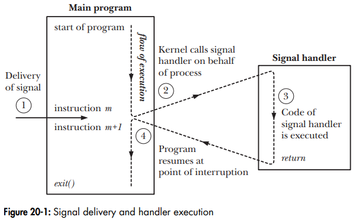

# OS Signal

- OS signal notes

## Index

- [Index](#index)
- [Overview](#overview)
- [Asynchronous vs Synchronous](#asynchronous-vs-synchronous)
- [I/O Indication](#io-indication)
- [Not For IPC](#not-for-ipc)
- [Safe Signal Handling](#safe-signal-handling)
- [Sending/Receiving Signals](#sendingreceiving-signals)

## Overview

- A "signal" is a small message that notifies a process that an event of some type has occurred in the system
- Aka, "software interrupts"
- Signals are "generated" by an event, and then "delivered" to a process
  - Time between the signal's generation and the delivery is called "pending" time
- Notifying the kernel that a handler should be invoked is called "installing"/"establishing" a signal handler
- Not buffered
  - Just like hardware interrupts, if a signal is received while its signal handler is running, then the handler'll run just once more to handle the pending signal
  - If the signal occurs multiple times while its signal handler is running, then those extra signals will be missed
- Ex:
  - Interrupt character on keyboard (ctrl+c)
  - Process's child terminated
  - A process's timer expired
  - Process attempted to access invalid memory address

## Asynchronous vs Synchronous

- A signal is asynchronous to a process if either the kernel or another process generated it independent of the observing process
  - Keyboard interrupt character, child process terminates, etc
  - There's inevitably a small pending delay before kernel delivers the signal
- A signal is synchronous if it was generated while the process itself was running
  - Hardware signal from a particular instruction's execution
  - System call associated w/ a signal generation
  - These are immediately handled by the kernel

## I/O Indication

- The kernel can send signals to processes to indicate that I/O is available
- Terminals/pseudoterminals
  - Kernel can send a signal if there's input available
  - Output possible isn't possible to signal
- Pipes/FIFOs
  - Signaling is possible for:
  - Read end
    - Data is written to the pipe/FIFO
    - Write end closed the pipe/FIFO
  - Write end
    - Writes can be made without blocking the writer due to max capacity
    - Read end closed the pipe/FIFO
- Sockets
  - Signaling is possible for:
  - Datagram sockets
    - Input arrives on a socket
    - Asynchronous error on the socket
  - Stream sockets
    - New connection on a listening socket
    - `connect()` request completes
    - New input received on socket
    - Peer closes the socket
    - Output possible on the socket
    - Asynchronous error on the socket

## Not For IPC

- Not the best for IPC, due to need for synchronization and lack of queuing of signals

## Safe Signal Handling

- Troublesome because:
  - Handlers can run concurrently w/ main program and share the same globals
  - ...rules for how/when signals are received are often counterintuitive
  - Different systems can have different signal-handling semantics
- Usually the way to go is to either:
  - Set a global flag and exit
  - Perform some kind of cleanup to then terminate the process, and return control to somewhere in the main program
- A function that's safe to call in a signal handler is called "async-signal-safe" function
  - This could be bc the function is either reentrant, or not interruptible by a signal handler
- Safe (Linux) signal handling
  - Keep handlers as simple as possible
  - Call only async-signal-safe functions in handlers
  - Save and store `errno`
  - Protect accesses to shared global data structures by blocking all signals
  - Declare global variables w/ `volatile`
  - Declare flags w/ `sig_atomic_t`
- 

## Sending/Receiving Signals

- Sending signals
  - Kernels send signals to a destination process by updating some state in the context of the destination process
  - This is either because:
    - Kernel detected a system event like divide-by-zero or terminated child process
    - A process invoked the `kill` function to explicitly request the kernel to send a signal to the destination process
- Receiving signals
  - A destination process receives a signal when it's forced by the kernel to react in some way to the delivery of the signal
  - Processes can either:
    - Ignore signals
    - Terminate
    - "catch" the signal by executing a user-level function called a "signal handler"
  - A signal that's sent but not yet received is a "pending signal"
