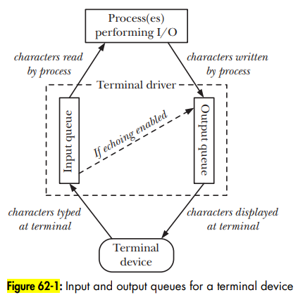

# Terminal

- Terminal notes

## Index

- [Index](#index)
- [Baud Rate](#baud-rate)
- [Canonical vs Noncanonical Mode](#canonical-vs-noncanonical-mode)
- [CLI and GUI](#cli-and-gui)
- [IO Diagram](#io-diagram)
- [Shell](#shell)
- [Terminal vs Shell](#terminal-vs-shell)

## Baud Rate

- ...Technically, baud rate refers to the rate of signal change on the line
- It's instead used to refer to the number of bits transmitted per second, since we don't usually care about "signal changes" and how they implement the bits transmitted

## Canonical vs Noncanonical Mode

- A terminal driver can operate in either canonical or noncononical mode
- Canonical mode
  - Terminal input is processed line by line, where a newline character generated from "enter" key indicates that a line is complete
- Noncanonical mode
  - Terminal input is not gathered into lines
  - `vi`, `more`, `less` programs operate in noncanonical mode

## CLI and GUI

- No not “clear global interrupt flag” or “clear interrupt flag”
- An OS can run with just a “command line interface” or w/ a “general user interface”

## IO Diagram

- 

## Shell

- Aka, "command interpreter"
- A "shell" is an interactive application-level program that runs other programs on the behalf of the user
- Designed to read commands typed by a user in response to commands
- `sh` was the original shell program- `csh`, `tcsh`, `ksh`, `bash` are variants
- Job control
  - When a shell manages multiple commands or processes in a pipeline, it's called "job control"
  - All processes in a pipeline are placed in a "process group" or "job" by the shell
- Session
  - A collection of process groups (jobs)
  - Thus we sometimes hear a shell instance being called a "session"
  - The "session leader" is the process that created the session
- Controlling terminal
  - Sessions usually have a "controlling terminal", which is the terminal device opened by the session leader
  - The process that opens the controlling terminal is then the "controlling process"
  - At any point in time, there's always a process group in a session that's called the "foreground process group" / "foreground job"
  - The others are called "background process groups" / "background jobs"

## Terminal vs Shell

- Terminal
  - A user interface for interacting w/ a system
- Shell
  - A command-line interpreter
  - Program that runs inside the terminal
  - `bash` ("Bourne Again Shell")
