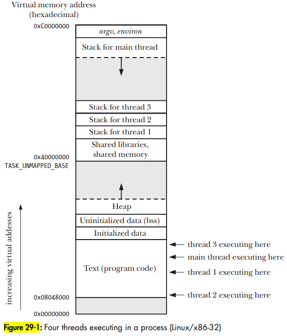
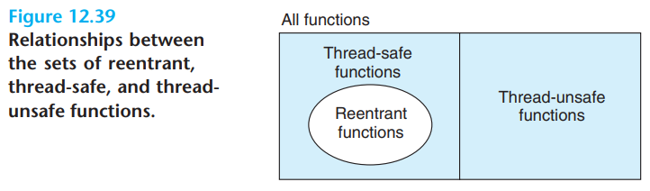

# OS Thread

- OS thread notes

## Index

- [Index](#index)
- [Overview](#overview)
- [Fine/Coarse-Grained Multithreading](#finecoarse-grained-multithreading)
- [Hardware Multithreading](#hardware-multithreading)
- [Memory Layout](#memory-layout)
- [Priority Ceiling](#priority-ceiling)
- [Priority Inheritance](#priority-inheritance)
- [Priority Inversion](#priority-inversion)
- [Simultaneous Multithreading](#simultaneous-multithreading)
- [States](#states)
- [Thread Scheduling Techniques](#thread-scheduling-techniques)
- [Thread Unsafe Functions](#thread-unsafe-functions)
- [Thread-Local Storage](#thread-local-storage)
- [Thread-Specific Data](#thread-specific-data)
- [Threads and Signals](#threads-and-signals)
- [Types](#types)

## Overview

- A logical flow that runs in the context of a process
- Aka, a "light-weight process"
- All threads start from a "main thread", and share the rest of the process context
  - Virtual user address space, read-only text(code), read/write data, heap, shared library code and data areas, open files
- Each thread has their own "thread context"
  - Thread ID, stack, stack pointer, program counter, condition codes, general purpose register values
  - Threads can't invade other thread registers
  - ...stack space isn't as safe, because pointers on virtual memory may be passed around allowing a thread to read/write to other threads' stacks

## Fine/Coarse-Grained Multithreading

- Fine-grained multithreading
  - Where threads are switched after every instruction
- Coarse-grained multithreading
  - Where threads are switched only after events (last-level cache miss, etc)

## Hardware Multithreading

- Increasing utilization of a processor by switching to another thread when one thread is stalled

## Memory Layout

- 

## Priority Ceiling

- A mechanism to prevent priority inversion
- Two implementations:
  - Original priority ceiling protocol (PCP)
    - When shared resources are assigned the highest priority of any task that can access it
    - Rules:
      - A task can lock a resource only when the task's priority is higher than the ceilings of all currently locked resources
        - Prevents deadlocks that would be caused by a circular wait- no more dual paths of resource acquirement
      - After locking the resource, the task's priority is raised to the priority ceiling
      - After unlocking the resource, the task's original priority is restored
  - Immediate priority ceiling protocol (IPCP)
    - When a task that has a resource has its priority raised to the highest priority that the resource can ever encounter
    - This way the task w/ the resource will always run first before tasks that demand the resource
- Assigning a priority level to all shared resources, and preventing threads below that priority level from locking higher priority tasks from taking those shared resources

## Priority Inheritance

- Allows lower priority tasks finish what they need to do by having the OS assign them higher priority (equal to the priority of the thread demanding the locked resource)

## Priority Inversion

- When lower priority tasks won’t release resources to higher priority tasks
- If the low priority task that has some resource can't finish its job (blocked by some medium priority tasks), then a high priority task that needs the resource can't ever run

## Simultaneous Multithreading

- Multithreading that lowers the cost of multithreading by using a multiple-issue dynamically scheduled pipelined processor to make use of both thread-level parallelism and instruction-level parallelism at the same time

## States

- Run state
- Active state
  - Ready to run, but waiting its turn
- Sleep state
- Blocked state

## Thread Scheduling Techniques

- Preemptive scheduling
  - OS can interrupt threads to provide CPU time to other threads
  - Could be time-slicing / round robin, or priority-based
- Non-preemptive scheduling
  - Aka, "cooperative scheduler"
  - Threads are provided w/ CPU time until their task is complete before moving on to next tasks
  - So the threads themselves decide when to stop running and to forfeit processing time to other threads
- Priority-based scheduling
  - Can be either preemptive or non-preemptive
  - Tasks are provided CPU time based on their priority level
- Round robin scheduling
  - All threads are provided equal CPU time, and threads are iterated in order one by one
  - "weighted round robin" is when each thread has unequal weighting so that some threads have more time than others overall, but sequentially given the same CPU time one by one
- Aging
  - When threads are assigned a "temporary" priority for working, and a "permanent" priority to reset back to
  - As threads get "older" (aren't serviced for a while), their temporary priority goes up
  - After each task is serviced, their priority goes back to their permanent priority
  - Solves starvation issues
- Exponential queue
  - Aging, but threads age exponentially

## Thread Unsafe Functions

- Functions that don't protect global variables
- Functions that keep state across multiple invocations (not reentrant)
- Functions that return a pointer to a static variable
- Functions that call thread-unsafe functions
- 
  - Functions can be reentrant and not thread-safe
  - If a function takes pointers and performs pure computation (no system state or global variables changes), then it's reentrant in the way that the function behaves exactly the same regardless of number of function calls or overlapping calls, but it's not thread-safe due to potential state changes from the pointers potentially being globals
  - Solutions:
    - Protect the entire function w/ synchronization- the function is then "serialized" at the cost of losing concurrency
    - Protect just global variable accesses and critical sections w/ synchronization

## Thread-Local Storage

- Refers to a language/compiler-level mechanism to give each thread their own instances of a variable
- C11 provides `__thread` and `_Thread_local`

## Thread-Specific Data

- Refers to a library/runtime-level mechanism for associating data pointers w/ specific threads
- Pthreads has functions to support this

## Threads and Signals

- A process that's multithreading is bad at receiving signals targeting the process as a whole
- The kernel decides which thread receives the signal, but all threads share the same signal handlers and it's counterintuitive
- Best is to block all signals in all threads except one

## Types

- Overarching thread types
  - Main thread
    - Just like `main()`, but in an OS context
    - Always running to do some processing
  - Event thread
    - Triggered by external event like hardware timer, input/output device, etc
    - Includes aperiodic, periodic, and sporadic threads
    - Need to return/exit, or somehow yield to avoid constantly running like a main thread
- Smaller subtypes
  - ...These thread names are redundant when you then throw in scheduling algorithm names in the same context, but alas
  - Periodic thread
    - Runs at a fixed time interval
  - Aperiodic thread
    - Runs frequently and unpredictably (according to input, etc)
  - Sporadic thread
    - Runs infrequently or not at all
    - For failures, warnings, faults, etc
