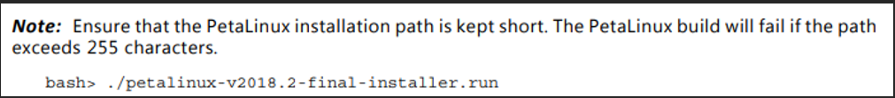
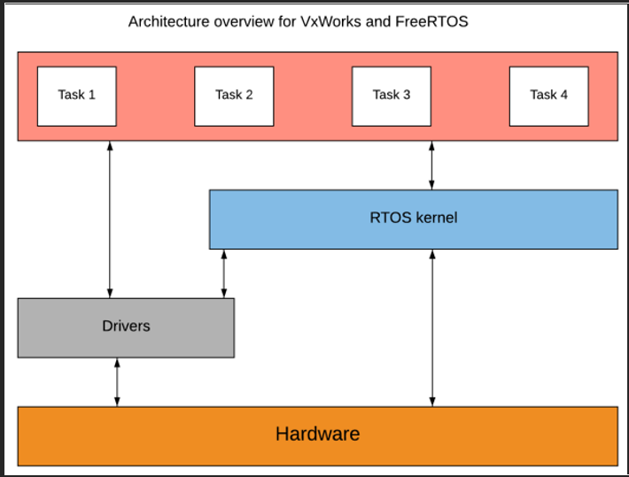

# OS variants

- Specific OS examples and notes

## Index

- [Index](#index)
- [DDCI-Deos](#ddci-deos)
- [FreeRTOS](#freertos)
- [LynxOS](#lynxos)
- [PetaLinux](#petalinux)
- [RHEL](#rhel)
- [RTLinux](#rtlinux)
- [SafeRTOS](#safertos)
- [uC/OS](#ucos)
- [UNIX](#unix)
- [VxWorks](#vxworks)
- [WSL](#wsl)
- [Zephyr](#zephyr)

## DDCI-Deos

- “Time & Space Partitioned, Multi-core Enabled, RTOS Verified to DO-178C/ED-12C DAL A”
- RTOS that’s verified for DO-178 and ED-12C meant for avionics applications
- Can manage resources of x86, PowerPC, ARM, and MIPS processors

## FreeRTOS

- Everything about FreeRTOS
  - [FreeRTOS_Reference_Manual_V10.0.0.pdf](https://www.freertos.org/fr-content-src/uploads/2018/07/FreeRTOS_Reference_Manual_V10.0.0.pdf)
  - [Free RTOS Book and Reference Manual](https://www.freertos.org/Documentation/RTOS_book.html)
- Free, distributed via MIT open source license
- Uses dynamic preemptive priority-based scheduling
  - Higher priority tasks executed first if preemption is enabled, and low priority tasks put on hold (just like round robin scheduling)
  - Same priority tasks share CPU time if "time slicing" is enabled
- Clearing preemption, time-slicing, and default behavior confusion
  - Default
    - `configUSE_PREEMPTION = 1`, and `configUSE_TIME_SLICING = 0`
    - FreeRTOS kernel will allow higher priority tasks to run preemptively
    - Tasks must `taskYIELD()` to allow other tasks of equal priority to run
  - `configUSE_PREEMPTION`
    - This macro just tells the kernel to force low priority tasks to yield to higher priority tasks
    - Doesn't mean enforce round-robin scheduling w/ preemption
  - `configUSE_TIME_SLICING`
    - This macro enforces round-robin scheduling whenever there are a set of tasks of equal priority each w/ work to do
    - No need for `taskYIELD()` calls
- Dynamic and static memory allocation
  - This naming is misleading, since the memory that’s physically used is data/bss memory on RAM, not heap
  - Dynamic
    - “dynamically” allocates memory for FreeRTOS data structures (semaphores, mutexes, thread stacks, etc) from a global array on data/bss memory
  - Static
    - “statically” allocates memory for FreeRTOS data structures from global array
- Priority inversion
  - FreeRTOS Mutexes implement priority inheritance, but semaphores don't
  - No solution to priority inversion unless you're using mutexes

## LynxOS

- RTOS by Lynx Software Technologies
- Proprietary
- Hard real-time performance
- POSIX compatibility
- Security / safety certifiable

## PetaLinux

- A tool used to automate creating embedded Linux subsystems based on a specific FPGA and SoCs (it’s not an OS- it’s what’s used to integrate Linux OS on an AMD processor)
- “petalinux” often used to call the embedded OS’s that PetaLinux generates too
- Includes U-Boot, Linux kernel, Device Tree, and Root Filesystem components
- Offered by Xilinx
- Overview page here
  - PetaLinux Tools for Embedded Linux Development (xilinx.com)
- Requires a host system that’s running either
  - RHEL 7.2/7.3 (64bit)
  - CentOS 7.2/7.3 (64-bit)
  - Ubuntu 16.04.1/2 (64-bit)
  - …So this is why people need either VMs or PCs that are running Linux OS’s
    - They could be developing for Zynq SoC
  - Lol
    - 
- Update: there’s a plan to cease support for PetaLinux
  - Bare embedded Linux images generated by the Yocto project is a lot lighter to work w/
  - PetaLinux is just a wrapper on top of the embedded Linux images created by Yocto, so getting rid of it helps w/ project size and maintenance
    Yocto
  - Linux Foundation collaborative open-source project
  - Allows creation of Linux distributions for embedded software independent of underlying architecture of embedded hardware
  - Can be used to make a custom Linux image for embedded systems
    - This includes RTLinux and other custom Linux images optimized for embedded applications

## RHEL

- “red hat enterprise linux”
- Red Hat
  - Global provider for open-software solutions
  - Known for Linux distribution
  - Now a part of IBM
- A Linux distribution from Red Hat w/ emphasis on stability and security
- Not open source, in contrast to Red Hat’s other distro CentOS
  - …but CentOS has less support now bc they shifted support from their “CentOS Linux” to “CentOS Stream” (which isn’t open source?)

## RTLinux

- Made for real-time unlike Linux
- Has a hybrid kernel architecture where a real-time kernel coexists with a low priority Linux kernel
- Original Linux is apparently notorious for high interrupt latency

## SafeRTOS

- RTOS for safety-critical applications
  - Follows IEC 61508, ISO 26262, EN 50128
- Requires licensing fee- it’s not open source
- Has undergone testing to ensure safety
- Written by WITTENSTEIN high integrity systems
- Inherits features and ease of use from FreeRTOS, but requires safety features that need additional configuration?

## uC/OS

- RTOS by Micrium for embedded systems
- Proprietary
- Relatively lightweight

## UNIX

- An OS built a long time ago by Bell Labs
  - Bell Labs helped create C programming language
  - Lol B programming language came before C
- Served as a foundation for Linux
- "Unix" is a pun on the complexity of "Multics", an OS developed by Honeywell at the time
- Unix based systems
  - System V (SysV)
    - Branch of UNIX intended to be commercial and standardized
    - Variants of SysV include Solaris (Sun Microsystems), AIX (IBM), HP-UX, etc
  - BSD
    - "Berkeley Software Distribution"
    - A branch of UNIX focused on research, networking, and performance
    - Variants include FreeBSD, NetBSD, OpenBSD, macOS, iOS
  - Linux, Mac OS, Solaris, , etc

## VxWorks

- Owned by “Wind River Systems”- very expensive
- Uses priority-based preemptive with optional round-robin scheduling
  - Higher tasks executed first, low priority tasks put on hold
  - Same priority tasks executed “round robin” style
- Supports various languages and libraries
  - Rust, Python, C11, C++17,
  - Pandas, NumPy, TensorFlow
- Supports various processors and boards
  - Arm, x86, RISC-V, PowerPC, AMD, Intel, NXP, RPI, TI
- VxWorks and RTLinux analysis by Columbia
  - Http://www.cs.columbia.edu/~sedwards/classes/2001/w4995-02/reports/ip.pdf
  - TLDR- “VxWorks is more predictable and deterministic, thereby making it more suitable as an operating system platform for developing and running soft and hard real-time applications”
  - Frequent use of “latency” an “throughput” is very CS yeet
  - Software and hardware logic analyzers were used to compare application overhead times
    - Software logic analyzer
- Software used to analyze behavior/performance of software systems
- LTTng (“Linux trace toolkit next generation”) and Percepio tracelyzer both use OS tracing capabilities for analysis
  - In most of the overhead contexts mentioned below, VxWorks seems to be faster and have their latency relatively constrained
  - Context switching
    - Both OS’s support multithreading
    - Less latency during context switching is good
  - Interrupt latency
    - Time spent for kernel to service and interrupt
      - Saving task context, determining interrupt source, invoking interrupt handler
    - Could also include time servicing nested interrupt handlers
    - Less interrupt latency is good
  - Synchronization
    - Sharing resources among tasks using semaphores
    - Acquiring/releasing semaphores spends time
    - Less semaphore acquire/release time is important
  - Inter-process communication
    - Message queues are used at a high level for communication between tasks on top of using semaphores
    - Less time spent executing complicated message mechanisms is good
  - IEEE article comparing RTOS:
    - [LU-CSE-19-003.pdf (lehigh.edu)](https://engineering.lehigh.edu/sites/engineering.lehigh.edu/files/_DEPARTMENTS/cse/research/tech-reports/2019/LU-CSE-19-003.pdf)
- 

## WSL

- “windows subsystem (for) Linux”
- Compatibility layer that allows Linux binaries to run on Windows
- Allows user to run full Linux distro w/ command-line interface without a VM or dual-boot setup
- Lighter than a VM
- Quick and dirtier than Docker containers- not for flushed out development

## Zephyr

- Open-source RTOS for embedded systems
- Offers features including:
  - Support for various hardware architectures (ARM, x86, RISC-V, etc)
  - Drivers, middleware, security, etc
- Supported by Linux foundation
- POSIX compatibility
- More complex than FreeRTOS, suitable for complex systems like IoT systems w/ security, networking, and HAL layers
