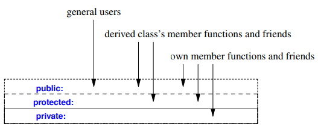
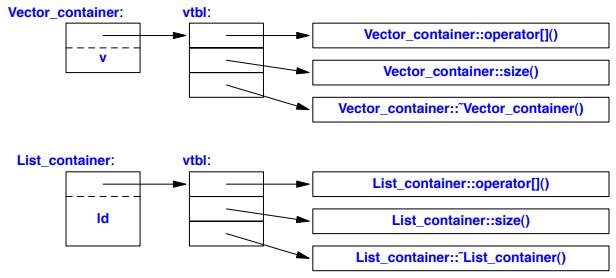

# C++ Classes

- Classes in C++ notes

## Index

- [Index](#index)
- [Overview](#overview)
- [`this` Pointer Parameter](#this-pointer-parameter)
- [Abstract Class](#abstract-class)
- [Access Specifiers](#access-specifiers)
- [Class Defaults](#class-defaults)
- [Class Hierarchy](#class-hierarchy)
- [Components](#components)
- [Constructor, Destructor](#constructor-destructor)
- [Constructor, Destructor Call Order](#constructor-destructor-call-order)
- [Covariant Return Rule](#covariant-return-rule)
- [Inheritance](#inheritance)
- [Method Modifiers](#method-modifiers)
- [Overloading](#overloading)
- [Polymorphism](#polymorphism)
- [Slicing](#slicing)
- [Static](#static)
- [Virtual](#virtual)

## Overview

- Class is just a user-defined type w/ associated operations and data elements
- Classes allow user-defined types to:
  - Be grouped together w/ their associated operations and attributes
  - Have the same privileges and appearance as built-in types
  - Build up sophisticated types out of basic types
- Methods can define the meaning of initialization, copy, move, and cleanup

## `this` Pointer Parameter

- All methods have the `this` pointer parameter passed to it to allow the instance of the object to refer to itself inside a method
- Needed when:
  - There's a distinction needed between a method parameter and an instance's data member
  - Returning the instance itself
  - Passing the instance to another method or function
  - Template / dependent member lookup

```
template <typename T>
class Base {
    int value;
public:
    void f() { this->value = 0; } // sometimes required in templates
};
```

## Abstract Class

- A class w/ one or more pure virtual functions is called an "abstract class"
- You can't instantiate abstract classes

## Access Specifiers

- Keywords indicating who can access the declarations that follow (methods and data members)
- 
- Types include:
  - `public:`
    - Visible outside the class and can be set, called, and manipulated as needed
    - ...Breaks the idea of encapsulation, and creates a data structure/object mix
  - `protected:`
    - Visible to functions in the class, and to functions in classes derived from the class
  - `private:`
    - Can only be used by functions of the class or friends
    - Visible outside the class (names are known), but not accessible
    - By default, methods and data members are private if not specified
  - `friend:`
    - Indicates that a function isn't a member of the class, but can access private and protected data just as though it were
    - Can be another function or class
    - ...Good for helper functions, but sounds like an invitation for spaghetti code
  - `virtual:`
    - Allows for runtime polymorphism
    - Indicator for derived classes to override the base class function's definition
    - ...It's not the default when you define a method that the parent class has, because it avoids the need for all methods to need an extra indirection at runtime
      - `p->ParentClass::someMethod()` is always legal

```
class Point {
private:
    int x, y;
public:
    Point(int x, int y): x(x), y(y) {}
    friend double distance(const Point&, const Point&);
};

double distance(const Point& a, const Point& b) {
    // Can access a.x, b.y because it's a friend
    return sqrt((a.x - b.x)*(a.x - b.x) + (a.y - b.y)*(a.y - b.y));
}
```

```
class Shape {
public:
    virtual void draw() { cout << "Drawing shape\n"; }
};

class Circle : public Shape {
public:
    void draw() override { cout << "Drawing circle\n"; }
};
```

## Class Defaults

- A class has below by default:
  - Default constructor: `X()`
  - Copy constructor: `X(const X&)`
  - Copy assignment: `X& operator=(const X&)`
  - Move constructor: `X(X&&)`
  - Move assignment: `X& operator=(X&&)`
  - Destructor: `˜X()`
- If any of the items are explicitly defined by the user, they won't be generated by the compiler
- The `default` keyword is used to generate the default implementation of the particular special member function
- You can also `delete` default functions

```
class Foo {
public:
    Foo() = default;                       // default constructor
    Foo(const Foo&) = default;             // copy constructor
    Foo& operator=(const Foo&) = default;  // copy assignment
    ~Foo() = default;                      // destructor
};

// delete example
class Baz {
public:
    Baz(int x) : x(x) {}
    Baz(const Baz&) = delete;  // disable copying
    Baz(Baz&&) = default;      // but allow moving
private:
    int x;
};
```

## Class Hierarchy

- A class hierarchy created by a lattice of classes and subclasses allows for:
  - Interface inheritance
  - Implementation inheritance

## Components

- Class components include:
  - Data members
  - Member functions (methods)
  - Nested types (other classes, enums, typedefs, etc)
  - Access specifiers
  - Constructors, destructors, operators, etc

## Constructor, Destructor

- Constructor
  - Function that's implicitly called whenever an object of that class is created
- Destructor
  - Clean-up function for when an instance is destroyed (goes out of scope or is returned to the heap)
  - ...Usually no need to ever explicitly call a destructor
- These two go against the way there's no way to hide any runtime routines in C, but provide nice ways to initialize and clean up

```
#include <iostream>
#include <string>

class Person {
private:
    std::string name;
    int age;

public:
    // 1. Default constructor
    Person() : name("Unknown"), age(0) {
        std::cout << "Default constructor called\n";
    }

    // 2. Parameterized constructor
    Person(const std::string& n, int a) : name(n), age(a) {
        std::cout << "Parameterized constructor called\n";
    }

    // 3. Copy constructor
    Person(const Person& other) : name(other.name), age(other.age) {
        std::cout << "Copy constructor called\n";
    }

    // 4. Move constructor (C++11+)
    Person(Person&& other) noexcept : name(std::move(other.name)), age(other.age) {
        std::cout << "Move constructor called\n";
        other.age = 0;
    }

    // 5. Copy assignment operator
    Person& operator=(const Person& other) {
        std::cout << "Copy assignment called\n";
        if (this != &other) {
            name = other.name;
            age = other.age;
        }
        return *this;
    }

    // 6. Move assignment operator (C++11+)
    Person& operator=(Person&& other) noexcept {
        std::cout << "Move assignment called\n";
        if (this != &other) {
            name = std::move(other.name);
            age = other.age;
            other.age = 0;
        }
        return *this;
    }

    // 7. Destructor
    ~Person() {
        std::cout << "Destructor called for " << name << "\n";
    }

    void print() const {
        std::cout << "Name: " << name << ", Age: " << age << "\n";
    }
};

int main() {
    Person p1;                   // default constructor
    Person p2("Alice", 30);      // parameterized constructor
    Person p3 = p2;              // copy constructor
    Person p4 = std::move(p2);   // move constructor

    p1 = p3;                     // copy assignment
    p3 = std::move(p4);           // move assignment

    p1.print();
    p2.print();                   // moved-from state
    p3.print();
    p4.print();                   // moved-from state
}
```

## Constructor, Destructor Call Order

- When you're working w/ derived classes, constructors are called bottom-up and vice-versa for destructors
- Constructors
  - Base class constructor called
  - Member constructors called
  - Own body called
- Destructors
  - Destructor for own body called
  - Member destructors called
  - Base class destructor called

## Covariant Return Rule

- A virtual function may return a more specific (derived) pointer or reference type than the one returned by the base class version

## Inheritance

- When a class specializes/refines the data structures and methods of a single base class
- Multiple inheritance allows two classes to be combined into one
- Inheritance is great for inheriting:
  - Implementations
    - Sharing facilities provided by a base class
  - Interfaces
    - Allow different derived classes to be used interchangeably through the interface provided by a base class

```
#include <iostream>
#include <string>

// 1. Base class
class Animal {
protected:
    std::string name;

public:
    Animal(const std::string& n) : name(n) {
        std::cout << "Animal constructor\n";
    }

    virtual ~Animal() { // virtual destructor for polymorphism
        std::cout << "Animal destructor\n";
    }

    // 2. Virtual function (runtime polymorphism)
    virtual void speak() const {
        std::cout << name << " makes a sound\n";
    }

    // 3. Non-virtual function
    void info() const {
        std::cout << "Animal: " << name << "\n";
    }
};

// 4. Derived class (single inheritance)
class Dog : public Animal {
private:
    std::string breed;

public:
    Dog(const std::string& n, const std::string& b) : Animal(n), breed(b) {
        std::cout << "Dog constructor\n";
    }

    ~Dog() override { // override destructor
        std::cout << "Dog destructor\n";
    }

    // 5. Override virtual function
    void speak() const override {
        std::cout << name << " barks\n";
    }

    // 6. Access base class method
    void info() const {
        Animal::info(); // call base class version
        std::cout << "Breed: " << breed << "\n";
    }
};

// 7. Multiple inheritance example
class Pet {
public:
    void play() const {
        std::cout << "Playing with pet\n";
    }
};

class PetDog : public Dog, public Pet {
public:
    PetDog(const std::string& n, const std::string& b) : Dog(n, b) {}
};

int main() {
    Animal* a = new Dog("Rex", "Labrador"); // polymorphic pointer
    a->speak();                              // virtual dispatch
    a->info();                               // non-virtual call

    Dog d("Buddy", "Beagle");
    d.info();                                // calls derived info

    PetDog pd("Max", "Golden Retriever");
    pd.play();                               // multiple inheritance

    delete a; // proper destructor chain called
}
```

## Method Modifiers

- Keywords that change method behavior include:
  - `virtual`
    - Indicates that the method can be overridden in a derived class
    - For run time polymorphism
  - `override`
    - Indicates that the method has to be overriding a virtual function from a base class
  - `final`
    - Indicates that it can't be overridden in a derived class
  - `static`
    - Indicates that the method isn't associated w/ a particular object instance
  - `const`
    - Indicates that the method can't modify its object

## Overloading

- When an existing name (function or operator symbol) is used to operate on different types
- Resolved at compile time

```
#include <iostream>

class Number {
private:
    int value;

public:
    // Constructor
    Number(int v = 0) : value(v) {}

    // 1. Arithmetic operator overloading
    Number operator+(const Number& other) const {
        return Number(value + other.value);
    }

    Number operator-(const Number& other) const {
        return Number(value - other.value);
    }

    // 2. Unary operator overloading
    Number operator-() const {
        return Number(-value);
    }

    // 3. Comparison operator overloading
    bool operator==(const Number& other) const {
        return value == other.value;
    }

    bool operator!=(const Number& other) const {
        return !(*this == other);
    }

    // 4. Increment / Decrement
    Number& operator++() { // prefix
        ++value;
        return *this;
    }

    Number operator++(int) { // postfix
        Number temp = *this;
        ++value;
        return temp;
    }

    // 5. Stream insertion (friend function)
    friend std::ostream& operator<<(std::ostream& os, const Number& n) {
        os << n.value;
        return os;
    }

    // 6. Assignment operator (optional if deep copy needed)
    Number& operator=(const Number& other) {
        value = other.value;
        return *this;
    }
};

int main() {
    Number a(10), b(5);

    Number c = a + b;        // + operator
    Number d = a - b;        // - operator
    Number e = -a;           // unary -

    ++a;                     // prefix increment
    b++;                     // postfix increment

    std::cout << "c: " << c << ", d: " << d << ", e: " << e << "\n";

    if (a != b) {
        std::cout << "a and b are different\n";
    }

    return 0;
}
```

## Polymorphism

- Means "many shapes" in Greek
- Refers to the ability to have one name for a function or operator and use it for a bunch of different derived class types
- Allows for supporting different methods for related objects, and for runtime binding to the appropriate one
- Done in C++ w/ templates and overloading via `virtual` keyword

## Slicing

- When a derived-class object is copied into a base-class object and the "derived portion" of the object is discarded

## Static

- ...adding on to the already confusing `static` keyword, `static` in a class definition means:
  - Just like C:
    - That the data member is shared across all instances of the class
    - That the variable defined in the method will retain it's value
  - New to C++:
    - That the method can be called without an object (`ClassName::function()`)
      - A `static` method can't access non-static members, since there's no object

## Virtual

- Indicates that a member function of a class is to be overridden by subclasses, and that call to the function should be resolved at runtime (dynamic dispatch) instead of compile time (static dispatch)
- It's C++'s implementation of polymorphism
- Vtable
  - Dynamic dispatch is implemented w/ a virtual function table (aka, vtbl or vtable)
  - Each class w/ virtual functions have a vtable- an array of pointers to virtual functions of that class
  - Each object of the class has a hidden pointer called `vptr` pointing to the vtable of its class
- Dynamic resolution steps
  - Compiler generates code that fetches the `vptr` from the object
  - Looks up the correct function pointer in the vtable
  - Calls the right function via the pointer depending on the dynamic type of the object
- Virtual destructor
  - Vtable ensures that the derived destructor is called when deleting a derived object through a base pointer
- Multiple / virtual inheritance
  - ...Complicates that vtable hierarchy, but multiple inheritance just means multiple `vptr`s
- 

```
class Base {
public:
    virtual void speak() { std::cout << "Base speaking\n"; }
    virtual ~Base() {} // virtual destructor
};

class Derived : public Base {
public:
    void speak() override { std::cout << "Derived speaking\n"; }
};

int main () {
  Base* b = new Derived();
  b->speak(); // Which speak() is called? (derived- thanks to dynamic dispatch)
}
```
