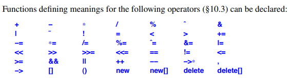

# C++ Overloading

- Overloading in C++ notes

## Index

- [Index](#index)
- [Overview](#overview)
- [`<<` and `>>` For Standard IO](#and--for-standard-io)
- [Concepts](#concepts)
- [Constructor](#constructor)
- [Method: Reference Qualifier](#method-reference-qualifier)
- [Method: Type Qualifier](#method-type-qualifier)
- [Outside of Classes](#outside-of-classes)
- [Overload Matching Rules](#overload-matching-rules)
- [Template](#template)

## Overview

- Overloading is providing multiple functions or operators w/ the same name but different parameter lists in the same scope
- Allows for "run-time polymorphism", as opposed to templates that provide "compile-time polymorphism"
- Return type alone can't differentiate function overloads
- Best practices include:
  - Use when the same function is being repeated across different types
  - Use `const &`, `&`, `&&` overloads for performance and correctness
  - Use SFINAE / concepts to constrain template overloads
  - Prefer overload sets over default parameters
    - Default parameters are subtle and implicit
  - Avoid excessive overloads
  - Avoid mixing overloads w/ default parameters
    - ...causes ambiguity
- You can't overload `::`, `.`, `.*`, and `?:` operators
- Overloadable operators:
  - 

## `<<` and `>>` For Standard IO

- `<<` and `>>` are overloaded in C++ for standard input/output
- Using an overloaded operator instead of a dedicated function is nice bc:
  - Operators can be defined for every type (no need for a function or string format specifier for each type)
  - Outputting multiple messages made easier
    - `cout << "some value: " << i << endl;`
  - Simplifies format control in contrast to complicated functions like `scanf()`
  - Allows for entire objects to be read/written in a single operation

## Concepts

```
#include <concepts>
#include <iostream>

void process(std::integral auto x) {
    std::cout << "integral\n";
}

void process(std::floating_point auto x) {
    std::cout << "floating\n";
}

process(10);    // integral
process(3.14);  // floating
```

## Constructor

- Constructor overloading

```
struct Vec {
    Vec() {}                // default
    Vec(int) {}             // scalar init
    Vec(int,int) {}         // pair init
};

Vec a;        // Vec()
Vec b(5);     // Vec(int)
Vec c(3,4);   // Vec(int,int)
```

## Method: Reference Qualifier

- Overloading from reference qualifiers:

```
struct X {
    void get() &  { std::cout << "lvalue\n"; }
    void get() && { std::cout << "rvalue\n"; }
};

X x;
x.get();     // lvalue version
X{}.get();   // rvalue version
```

- Overloading from reference qualifer on parameters:

```
struct W {
    void set(int&)  { std::cout << "lvalue ref\n"; }
    void set(int&&) { std::cout << "rvalue ref\n"; }
};

int x = 5;
W w;
w.set(x);     // lvalue overload
w.set(10);    // rvalue overload
```

## Method: Type Qualifier

- Overloading by const/volatile qualifiers:

```
struct Foo {
    void work()       { std::cout << "non-const\n"; }
    void work() const { std::cout << "const\n"; }
};

const Foo a;
Foo b;

a.work();  // const version
b.work();  // non-const version
```

## Outside of Classes

- Function overload outside of class definitions:

```
void print(int x)          { std::cout << "int: " << x << "\n"; }
void print(double x)       { std::cout << "double: " << x << "\n"; }
void print(const std::string& s) { std::cout << "string: " << s << "\n"; }

print(10);       // calls print(int)
print(3.14);     // calls print(double)
print("hello");  // converts to std::string → print(std::string)
```

## Overload Matching Rules

- When finding a function definition that matches the way the function is called, criteria are checked in below order:
  - Exact match
    - No (or just trivial) conversions
    - Array name to pointer, function name to pointer
  - Match using promotions
    - Integral promotions, float to double
  - Match using standard conversions
    - `int` to `double`, `char` to `int`, etc
    - Derived* to Base*, T* to `void*`
  - Match using user-defined conversions
    - `double` to `complex<double>`
  - Match using ellipsis

## Template

- Template overloading

```
void f(int) { std::cout << "non-template int\n"; }

template<typename T>
void f(T)   { std::cout << "generic template\n"; }

f(10);      // non-template wins (better match)
f(3.14);    // template version
```
