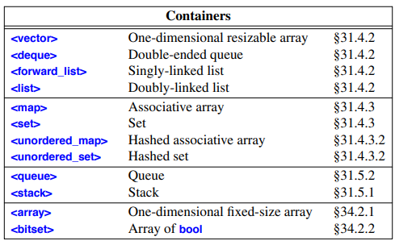
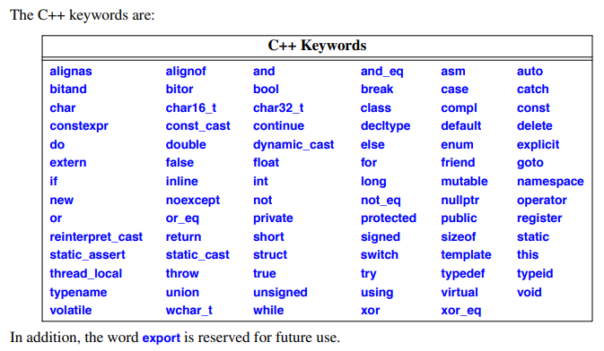
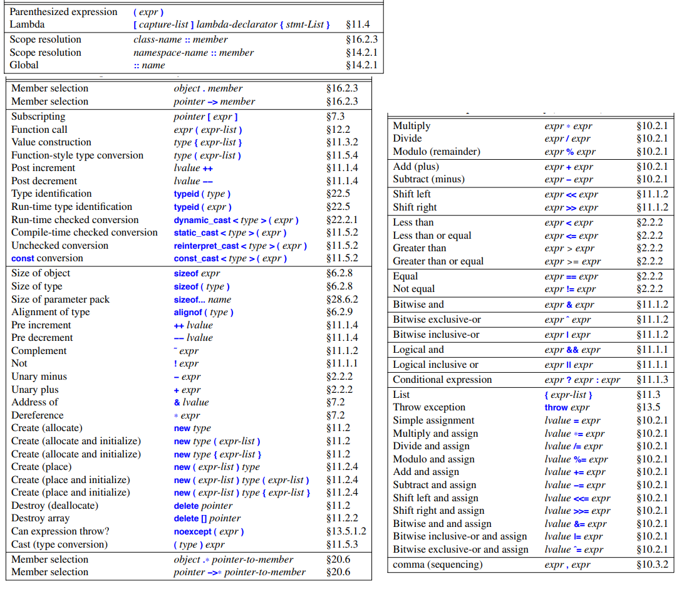
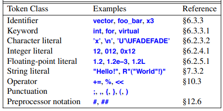
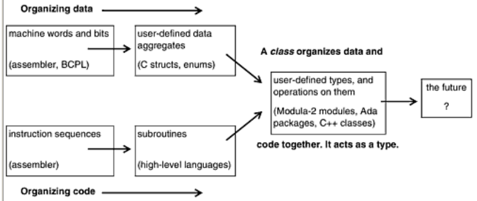

# C++ Fundamentals

- C++ fundamentals

## Index

- [Index](#index)
- [Overview](#overview)
- [A Simple Subset](#a-simple-subset)
- [ADL](#adl)
- [Arrays](#arrays)
- [Built-in Namespaces](#built-in-namespaces)
- [Container](#container)
- [Declarator Operator](#declarator-operator)
- [Deep vs Shallow Copies](#deep-vs-shallow-copies)
- [Generic Programming](#generic-programming)
- [Implementation vs Interface](#implementation-vs-interface)
- [Keywords](#keywords)
- [Macros](#macros)
- [Metaprogramming](#metaprogramming)
- [Moving, Copying](#moving-copying)
- [Mutable, Immutable](#mutable-immutable)
- [Operators](#operators)
- [Perfect Forwarding](#perfect-forwarding)
- [POD](#pod)
- [RAII](#raii)
- [Recommendations](#recommendations)
- [RTTI](#rtti)
- [Scopes](#scopes)
- [Structs and Unions](#structs-and-unions)
- [Tokens](#tokens)
- [Types](#types)
- [Value-Oriented Programming](#value-oriented-programming)
- [Why C++ Over C?](#why-c-over-c)

## Overview

- > Reviewing areas for improvement is one of the factors that gradually improves the science of software engineering and the art of programming language design. That's why C++ is so disappointing: it does nothing to address some of the most fundamental problems in C, and its most important addition (classes) builds on the deficient C type model.
  - _Deep C Secrets_
- > If you think C++ is not overly complicated, just what is a protected abstract virtual base pure virtual private destructor, and when was the last time you needed one?
  - Tom Cargill, _C++ Journal_, Fall 1990 in _Deep C Secrets_
- For the most part, C code can be compiled as C++ code- C++ is a superset of C
- C++ introduces new features and semantics to provide alternatives to unsafe/incomplete features provided by C
- Provides a facet for:
  - Procedural programming
  - OOP
  - Data abstraction, generic programming
- On the surface it's C w/ classes (or Algo68 w/ classes according to Bjarne Stroustrup)
- ...If you dig deeper, you'll see that C++ overloads many standard tokens like `()`, `[]`, `{}`, etc for new features
  - This prevents intuition from serving as a guide for someone that knows C when looking at a C++ codebase that utilizes new language features to their fullest

## A Simple Subset

- C++ introduces a whole lot of new semantics that opens doors for abominations if you make arbitrary design decisions left and right
- As per _Deep C Secrets_, a simple subset of C++ to use can be:
  - Classes
  - Constructor/destructors
  - Overloading
  - Single inheritance and polymorphic functions
- ...Although the language supports it, involved use of below complicates a project:
  - Templates
  - Exceptions
  - Virtual base classes
  - Multiple inheritance

## ADL

- "argument-dependent lookup"
- Aka, "Koenig lookup"
- When function arguments are used to determine the right function to call, when the name of the function alone isn't sufficient to determine the function to call
- Usually the compiler looks in:
  - The current scope
  - Namespaces in which the function is defined
  - Namespaces brought in w/ the `using` directive
- W/ ADL, associated namespaces are searched too:
  - If argument is a class member, then looks in class and base classes and class's enclosing namespaces
  - If an argument is a member of a namespace, then enclosing namespaces in that namespace are searched too

```
#include <algorithm>
#include <vector>

std::vector<int> v1, v2;
swap(v1, v2);   // ADL finds std::swap because v1/v2 are in std::vector
```

## Arrays

- Don't use arrays in C++- vectors and C++ strings are safer and provide more facilities

## Built-in Namespaces

- Built-in namespaces (as in, compiler level unnamed namespaces) in C++ include:
  - Ordinary identifiers
    - Variables
    - Functions
    - Typedef names
    - Named namespaces
    - Using-declarations
    - Enumerators (unscoped enums)
    - Class names
    - Struct names
    - Union names
    - Template names
    - Concept names
  - Labels
    - Ugly `goto` labels
  - Class member names
    - Each class has a namespace for member data, functions, nested types, nested classes
  - Struct/Union/Class/Enum tags
    - ...This is why it's confusing when you define a function that has the same name as a class
  - Enumeration
    - Unscoped enum
      - Regular C enumerations are grouped w/ ordinary identifiers, just like in C
    - Scoped enum (`enum class`)
      - Scoped enums each have their own private namespaces
  - Template parameters
    - Template parameters each have their own namespaces
  - Function overload sets
    - Names of overloaded functions share an internal namespace
  - Operators
    - Overloaded operators form a namespace inside the enclosing scope/class
  - Local scopes, function parameters, macro names
    - Just like C

## Container

- A type that holds objects, provides access to them, and optionally offers algorithms for insertion, deletion, and traversal
- 
- Types include:
  - Sequence containers
    - Store elements in linear order
    - Allow direct/sequential access
    - `vector`, `deque`, `list`, `forward_list`
  - Associative containers
    - Store elements as key-value pairs, or unique keys
    - Provide fast lookup by key
    - `set`, `multiset`, `map`, `multimap`
  - Unordered containers (hash-based)
    - Store elements without specific order, also optimized for fast lookup by key
    - `unordered_set`, `unordered_multiset`, `unordered_map`, `unordered_multimap`
  - Container adapters
    - Provide restricted interfaces on top of sequence containers
    - `stack`, `queue`, `priority_queue`

## Declarator Operator

- Tokens like `&`, `*`, `[]` are called "declarator operators" when used in a declaration

## Deep vs Shallow Copies

- Shallow copy
  - Copies just the pointer values, not the object that's pointed to
  - Same underlying resource
- Deep copy
  - Duplicate of the resource itself, not just the pointer
  - The standard libarary implements `std::move` to create deep copies of complicated objects

## Generic Programming

- Refers to programming focused on design/implementation/use of general algorithms
- As in, algorithms that can take a wide variety of types as long as they meet the algorithm's requirements on the arguments
- C++ implements this via templates

## Implementation vs Interface

- Just like C, C++ has source files (`.cpp`, `.C`, `.cxx`, `.cc`) and header files (`.hpp`, `.h`, `.hh`, `.H`)
  - This way because different platforms were developed assuming different file extensions...
  - `.cc` common for BSD/Linux, `.cxx` for old compilers
- Best practice:
- Implementation (`.cpp`)
  - Class definitions (you can define class methods w/ the scope resolution operator)
  - Static data member definitions
  - Private helper functions
  - Internal helper classes/structs
  - Header includes
  - Filescope globals for states (if absolutely necessary)

```
#include "Person.hpp"
#include <iostream>

// Constructor
Person::Person(const std::string& first, const std::string& last, int age)
    : firstName(first), lastName(last), age_(age) {}

// Public method: greet
void Person::greet() const {
    std::cout << "Hello, " << formatName() << "!\n";
}

// Public getter for private member
int Person::getAge() const {
    return age_;
}

// Public setter for private member
void Person::setAge(int age) {
    if (age >= 0) { // basic validation
        age_ = age;
    }
}

// Private helper
std::string Person::formatName() const {
    return firstName + " " + lastName;
}
```

- Interface (`.hpp`)
  - Class declarations
  - Struct/union declarations
  - Function declarations
  - Templates
  - Inline functions
  - Constants (if needed to use the interface)
  - Enum and enum class definitions (if needed to use the interface)
  - Type aliases
  - Concept (C++20) definitions
  - Traits, policy classes, CRTP patterns

```
#ifndef PERSON_HPP
#define PERSON_HPP

#include <string>

class Person {
public:
    // Public data
    std::string firstName;
    std::string lastName;

    // Constructor
    Person(const std::string& first, const std::string& last, int age);

    // Public interface
    void greet() const;
    int getAge() const;

    // Public setter
    void setAge(int age);

private:
    int age_;  // Private member

    // Helper function, private implementation detail
    std::string formatName() const;
};

#endif // PERSON_HPP
```

## Keywords

- List of C++ keywords:
- 

## Macros

> The first rule about macros is: don't use them unless you have to. Almost every macro demonstrates a flaw in the programming language, in the program, or in the programmer. Because they rearrange the program text befor the compiler sees it, macros are also a major problem for many programming support tools. So when you use it, you should expect inferior service from tools such as debuggers, cross-reference tools, and profilers.
>
> Using macros, you can design your own private language. Even if you prefer this "enhanced language" to plain C++, it will be incomprehensible to most C++ programmers. (...) The auto, constexpr, const, decltype, enum, inline, lambda expressions, namespace, and template mechanisms can be used as better-behaved alternatives to many traditional uses of preprocessor constructs.

- Bjarne Stroustrup in _The C++ Programming Language_

## Metaprogramming

- Refers to writing programs that operate on other programs (or themselves), treating code as data
- In C++, this refers to:
  - Template usage, `constexpr`, type traits, etc computation done before program runs
- Use cases include:
  - Static dispatch, compile-time polymorphism
  - Type-safe libraries
  - Performance critical code
  - Checking type correctness at compile time
  - Generating efficient specialized code

## Moving, Copying

- Moving
  - Refers to efficiently transferring ownership of resources from one object to another without copying the resource's contents
  - Introduced in C++11
  - Avoids expensive deep copies

```
std::vector<int> a = {1,2,3,4,5};
std::vector<int> b = std::move(a);

// Now:
// a is empty (or unspecified but valid)
// b owns the buffer formerly owned by a
```

- Copying
  - Refers to taking the time to create either a shallow or deep copy of an object
  - Value-oriented programming says that a copy implementation should:
    - Mean that two objects are equivalent after the copy
    - Keep two objects independent of one another (deep copy)

## Mutable, Immutable

- Objects that are `const` are immutable- others are mutable

## Operators

- Full list of operators in C++:
- 

## Perfect Forwarding

- Refers to when a function template passes its arguments to another function preserving original:
  - Value category (lvalue / rvalue)
  - `const`-ness
  - `reference`-ness
- No unnecessary copies or incorrect overload selection

## POD

- "plain old data"
- Aka, a data structure
- Refers to a block of public data for information keeping
- ...there are rules associated w/ what qualifies as a POD, but the point is that you shouldn't have to worry about OOP bells and whistles when interfacing w/ a POD

## RAII

- Stands for "resource acquisition is initialization"
- In other words, a resource (something acquired and later released) is tied to the lifetime of an object
  - Acquire w/ constructor, and release w/ destructor
  - Automatically released when object goes out of scope
  - No manual free's
- Following RAII when you write classes w/ constructors/destructors is best practice
- Resources include
  - Memory (via `new` and `delete`)
  - Files
  - Mutex locks
  - Network sockets
  - Database connections
  - Temporary state
  - Logging start/stop operations
- This eliminates errors from:
  - Forgetting to free
  - Cleanup on exceptions
  - Cleanup not called on early return
  - Cleanup skipped in nested branches

## Recommendations

- C++ dilates the number of ways you can solve the same problem
- Heuristics for design decisions on top of _Clean Code_ as per _The C++ Programming Language_:
  - Don't write C in C++
    - You need a minimal grasp of what C++ provides to make use of safer ways to implement objects and data structures
  - Don't use macros
    - C++ eliminates any need for them
  - Don't use `malloc()`
    - `new` does it better
  - Avoid `void*`, `union`s, and casts except deep down in implementations
  - Minimize use of C-style strings and arrays
    - Use C++ standard library's `string` and `vector` libraries instead
  - Avoid pointer arithmetic unless you're working w/ specialized code like memory managers, or simple array traversal
  - Prefer statically type-checked solutions (type checking done at compile-time)
  - Don't overabstract (don't generalize, introduce class hierarchies, or parameterize beyond obvious needs and experience)

## RTTI

- "run-time type information"
- Mechanism to allow a program to discover type of an object at runtime
- What's used when determining the right function to call when a method is declared `virtual`

## Scopes

- In C++, scopes include global scope, function scope, block scope, and:
- Local scope
  - Name declared in a function or lambda
- Class scope
  - A name is a "member name" if it's in a function definition, and outside nested classes, functions, enum classes, or other namespace
- Namespace scope
  - A name is a "namespace member name" if it's in a namespace, outside functions, lambdas, classes, enum classes, or other namespaces
- Statement scope
  - A name is in a statement scope if it's defined in the parens of a `for`, `while`, `if`, or `switch`
  - Scope extends from its point of declaration to the end of the statement

## Structs and Unions

- Structs and unions in C++ are implemented as classes that have elements/fields that are public by default
- You can still add private elements, constructor definitions, member functions, etc (w/ some limitations), but at that point you'd rather just write a class

## Tokens

- 

## Types

- Built-in types
  - Fundamental types in C++ are together
- Integral types
  - Boolean, character, integer types
- Arithmetic types
  - Floating-point types + integral types
- User-defined types
  - Enumerations and classes

## Value-Oriented Programming

- When preference is made for immutable values, pure functions, and value semantics over identity/reference/pointer-based programming
- Everything is treated as a value rather than as a long-lived, identity-bearing object managed through references or pointers

## Why C++ Over C?

- C++
  - Object oriented concepts allow for better reusability and maintainability
  - Adds overhead at runtime and on memory
- C
  - Minimal overhead, supported for all embedded systems
  - Harder to maintain w/ limited abstraction
- What C can't do:
  - Allow predefined operators to be redefined for user-defined types
  - Provide automatic and controlled initialization
  - Cleanup at the end of data's lifetime
  - Implicit type conversion (with less holes)
  - Associating functions to be used just for a particular type, and restricting a user to use just those functions
- Improvements from C
  - Safer semantics that emphasize risk of casting
  - Macro substitution almost never needed (`const`, `constexpr`, `enum`, `enum class`, `inline`, `template`s, and `namespace`s do it better)
  - Initializing a char array w/o space for the trailing nul is an error
  - Typecast can be done as if the type was a function (`int(thing)`, etc)
  - Allows a `const` integer to define the size of an array
  - Declarations can be mixed w/ statements
- Restrictions in C++
  - `main()` can't be called by user code
  - Function prototypes are mandatory
  - Typedef names can't clash w/ struct tags
  - Cast required to assign `void *` to another pointer type
  - Character literals have type `char` instead of `int`
- 
