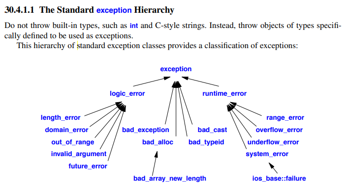

# Exception

- Exceptions in C++ notes

## Index

- [Index](#index)
- [Overview](#overview)
- [Example Usage](#example-usage)
- [Exception Types](#exception-types)

## Overview

- C++ has more awareness of the need to isolate error handling as a concept, and introduces exceptions
- Exceptions are used to change the flow of control for error handling
- Simplifies error handling by dedicating a part of a program to error handling
- Not to be used in embedded systems where there are time-critical components
- Great for:
  - Truly exceptional / unexpected conditions
  - Recoverable errors
  - Library code
  - Constructor failures
- Best practice rules:
  - Don't throw an exception while handling an exception
  - Don't throw an exception that can't be caught

## Example Usage

```
#include <iostream>
#include <stdexcept>
#include <string>

// Custom exception type
class ParseError : public std::runtime_error {
public:
    using std::runtime_error::runtime_error;
};

int parseInt(const std::string& s) {
    if (s.empty()) {
        throw ParseError("Empty string cannot be parsed");
    }

    for (char c : s) {
        if (!isdigit(c)) {
            throw std::invalid_argument("Non-digit character encountered");
        }
    }

    return std::stoi(s);
}

void doWork(const std::string& input) {
    try {
        int value = parseInt(input);
        std::cout << "Parsed value = " << value << "\n";
    }
    catch (const ParseError& e) {
        std::cerr << "ParseError: " << e.what() << "\n";
        throw;   // rethrow to caller
    }
    catch (const std::invalid_argument& e) {
        std::cerr << "Invalid argument: " << e.what() << "\n";
    }
    catch (...) {
        std::cerr << "Unknown exception\n";
    }
}

int main() {
    try {
        doWork("123");      // OK
        doWork("");         // throws ParseError
    }
    catch (const std::exception& e) {
        std::cerr << "Unhandled in main: " << e.what() << "\n";
    }
}
```

## Exception Types

- 
