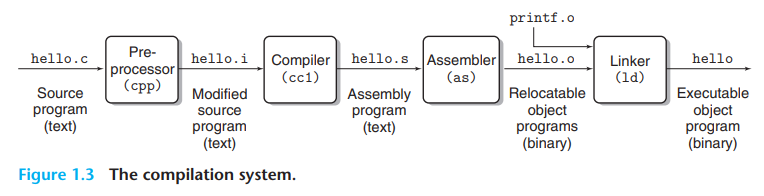
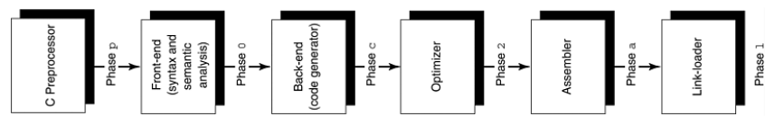
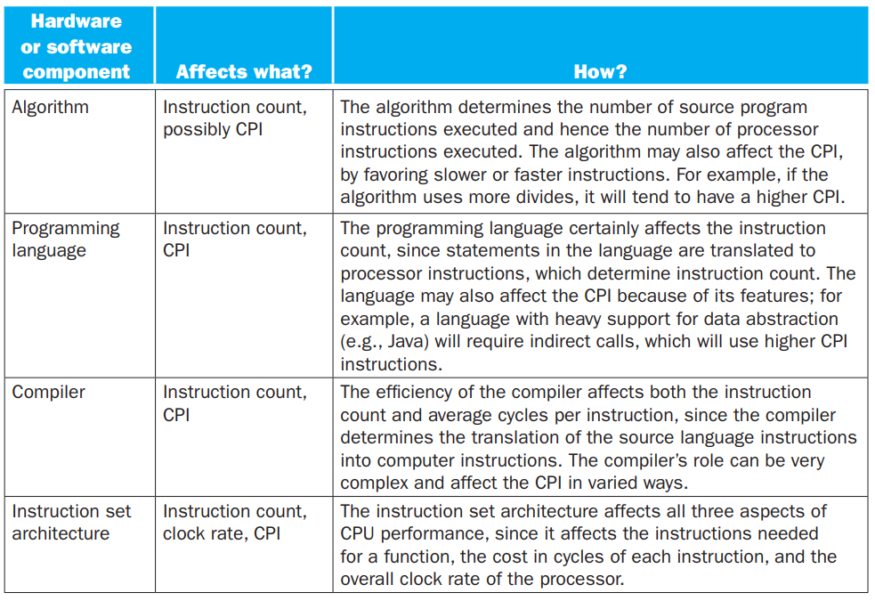
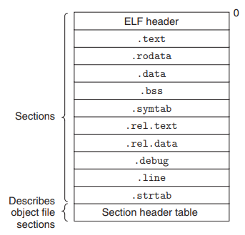
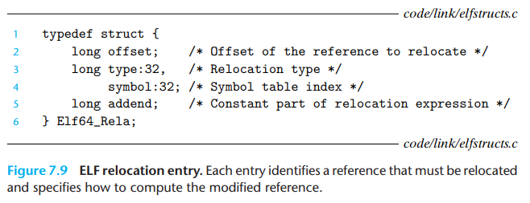
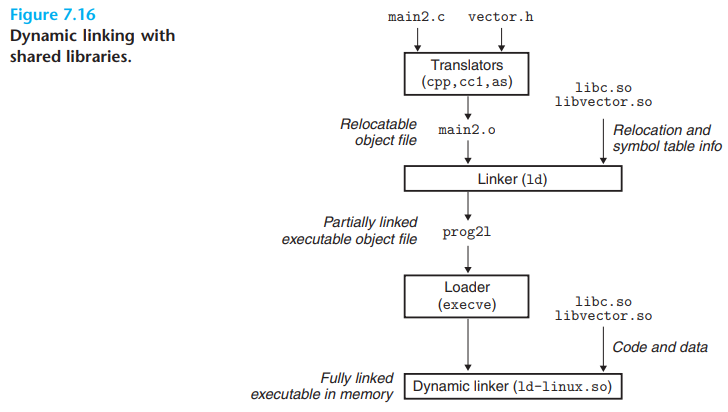
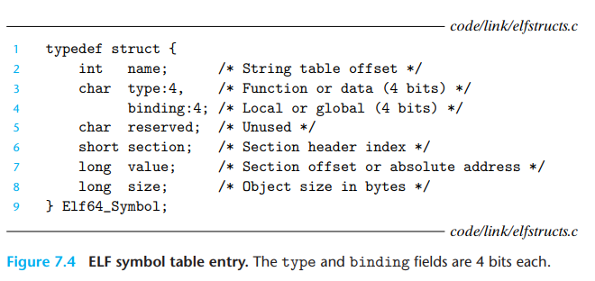

# C Build

- C build notes

## Index

- [Index](#index)
- [ASLR](#aslr)
- [Basic Block](#basic-block)
- [Build Process](#build-process)
- [Clang](#clang)
- [Contributing Factors of Performance](#contributing-factors-of-performance)
- [Cross-Compile vs Native Compile](#cross-compile-vs-native-compile)
- [Dynamic Binding](#dynamic-binding)
- [Executable File](#executable-file)
- [External vs Internal Linkage](#external-vs-internal-linkage)
- [File Build Decisions](#file-build-decisions)
- [File Extensions](#file-extensions)
- [GCC](#gcc)
- [GDB](#gdb)
- [GNU](#gnu)
- [GNU Binutils](#gnu-binutils)
- [Library Filename Convention](#library-filename-convention)
- [Library Interpositioning](#library-interpositioning)
- [Listing vs Object Dump File](#listing-vs-object-dump-file)
- [Map File](#map-file)
- [MINGW](#mingw)
- [Object Dump](#object-dump)
- [Object File](#object-file)
- [Object Module vs File](#object-module-vs-file)
- [Position-Independent Code](#position-independent-code)
- [Static vs Dynamic Linking](#static-vs-dynamic-linking)
- [Symbol Resolution](#symbol-resolution)
- [Symbols and Symbol Table](#symbols-and-symbol-table)
- [Translation Unit](#translation-unit)

## ASLR

- "address space layout randomization"
- When a linker randomizes memory addresses of key process regions (stack, heap, shared libraries, executable base) to make memory corruption exploits harder
- This is implemented across various OS's, but not for simple microkernel OS's

## Basic Block

- A block of instructions that don't have branch targets or labels w/in it

## Build Process

- 
- 
- Building C/C++ projects consist of 4 steps:
- Preprocessing
  - Modifies the original C program according to directives (all lines that start w/ `#`)
  - Generates new C programs which often have the `.i` suffix
- Compilation
  - Compiler translates `.i` (for "intermediate" or "input" to compiler) text files into assembly language programs w/ the `.s` suffix
- Assembly
  - Assembler translates assembly language files into machine language instructions packaged into "relocatable object programs", or "object-code"
  - Relocatable object programs have the `.o` extension
  - Object-code is a form of machine code w/ binary representations of all instructions, but minus global values to be filled in
  - ...In the process of assembling, Assembler may group common variations of machine language as if they were instructions- these groups are called "pseudoinstructions"
- Linking
  - The linker `ld` merges the assembled relocatable object files and preassembled object files (libraries) together into an executable object file
  - When `gcc` is invoked, `ld` is invoked behind the scenes
- Loading
  - Machine code is then loaded to some memory and executed by the "loader" at "load-time" or run time
  - ...on Unix:
    - Read executable file header to determine size of text/data segments
    - Create address space for given text/data
    - Copy instructions/data from executable file to memory
    - Copy any parameters to main program onto stack
    - Initialize processor registers and set stack pointer to first free location
    - Branch to start-up routine that copies parameters into argument registers and call main routine of program

## Clang

- Modern C/C++ compiler, alternative to GCC
- Fast compilation, nice error messages

## Contributing Factors of Performance

- 
  - From a programmer's perspective, we worry about:
    - Algorithm
    - Programming language
    - Compiler
    - ISA
  - When trying to make sense of application speed/size

## Cross-Compile vs Native Compile

- Cross-compilation
  - When you're developing/compiling on a platform that's different from the target platform
- Native compilation
  - When you're developing/compiling on your target platform

## Dynamic Binding

- When an object's request is associated w/ a particular operation at run-time instead of compile-time

## Executable File

- An executable, or "program" consists of:
  - Binary format identification
  - Machine-language instructions
  - Program entry-point address
  - Data
  - Symbol and relocation tables
  - Shared-library and dynamic linking information
  - Other misc info
  - ...details below
- Linux/Unix
  - `.elf` ("executable and linkable format)
  - 
    - `ELF header`
      - 16-byte sequence
      - Info for:
        - Word size, byte ordering
      - Info to allow linker to parse and interpret the object file:
        - Size of ELF header, object file type (relocatable, executable, shared), machine type, file offset of the section header table, size/number of entries in the section header table
      - Also includes the program's entry point
    - `Section header table`
      - Locations and sizes of various sections- fixed size entry for each section in the object file
    - `.text`
      - Machine code of compiled program
    - `.rodata`
      - Read-only data- format strings in print statements, jump tables for switch statements, etc
    - `.data`
      - Initialized global/static variables
    - `.bss`
      - Aka, "ZI" ("zero-initialized") segment
      - Stands for "block started by symbol" directive from IBM 704 assembly language
      - Could remember as "better save space!"
      - Uninitialized global/static variables, and global/static variables that are initialized to 0
      - Doesn't actually occupy any space in the object file- just a placeholder
      - .data and .bss are distinguished for space efficiency- everything here is just 0
    - `.symtab`
      - Symbol table w/ info about functions/global variables (nothing about local variables- just what could be potentially referenced in other translation units)
      - All relocatable object files have this section, unless explicitly removed w/ a `strip` command
    - `.rel.text`
      - A list of locations in the .text section that needs to be modified when the linker combines this object w/ others
      - Any instruction that calls an external function or references a global variable needs to be modified
      - Omitted in executable object files
    - `.rel.data`
      - Relocation information for any global variables that are referenced or defined by the module
      - Any initialized global variable whose initial value is the address of another global variable or external function needs to be modified
    - `.debug`
      - A debugging symbol table w/ entries for local variables and typedefs defined in the program
      - Global variables defined and referenced in the program
      - Original c source file
      - Only included if built w/ the -g option
    - `.line`
      - Mapping between line numbers in the original c source program and machine code instructions in the .text section
      - Only included if built w/ the -g option
    - `.strtab`
      - String table for symbol tables in the .symtab and .debug sections and for the section names in the section headers
      - Sequence of null-terminated character strings
  - Program header table
    - Describes how the .elf file should be loaded to memory segments
  - Object dump sections
    - If you run the GCC object dump tool, you'll see that an ELF consists of:
    - Code segment
      - Includes ELF header, program header table, .int, .text, .rodata sections
    - Data segment
      - .data and .bss sections
- Windows
  - .exe (portable executable format)
- Mac OS
  - Mach-o format

## External vs Internal Linkage

- A name that's exclusive to a single translation unit has "internal linkage"
- A name that's shared across multiple translation units have "extrenal linkage"

## File Build Decisions

- The build system (whether it's CMake, Make via IDE, or manual Make) determines what files are built
- ... It sucks when you're using an IDE, since it might or might not update its Make files
- CMake is great- you know exactly what's being built, and have control over what's built for what...

## File Extensions

- `.d` files
  - "dependency" files
  - Tells the build system what needs to be rebuilt when header files change
  - Generated when you pass the `-MMD -MP` options to the compiler during build

## GCC

- “GNU compiler collection”
- GNU itself is a UNIX-like OS made to be open source unlike Unix, but the project came w/ development tools like GCC and GDB (“GNU debugger”)
- Linus Torvald then invented the Linux kernel to replace the GNU kernel, and the package w/ the Linux Kernel using GNU tools is together called Linux

## GDB

- (just plain) GDB
  - "GNU debugger"
  - A symbolic debugger for user-space debugging, and for limited parts of the kernel
  - Allows for breakpoints, watch windows, single stepping, etc
- GDB remote serial protocol
  - Protocol used by GDB to communicate w/ remote targets/stubs
  - Runs over serial, TCP, or JTAG interfaces
  - GDB host on a PC can communicate w/:
    - Gdbserver (a remote stub process running on Linux system) on an embedded board
    - KGDB running on kernel
    - JTAG probe that speaks RSP
- GDB Client and Server
  - When a JTAG probe or software layer hosts a GDB remote server, an IDE can talk to it via GDB through GDB remote serial protocol
  - GDB client
    - `arm-none-eabi-gdb`, or `gdb` inside an IDE
    - Can issue commands for debugging
  - GDB server
    - OpenOCD, pyOCD, J-Link GDB Server, LinkServer, etc
      Translates RSP commands to hardware-level JTAG/SWD commands

## GNU

- “GNU’s not unix” 💀
  - Thank you someone understands the pain of all of these acronyms
  - Lmao it’s a recursive acronym
- Unix-like OS made completely of free software
- Emphasizes free software

## GNU Binutils

- Objdump, objcopy, etc all under GCC are referred to as GNU Binutils
- Tools that help convert software to machine code and manage memory layout and symbol resolution
- Common tools:
  - `gcc`
    - Compiler for C/C++ `code
  - `as`
    - Assembler to convert assembly code to machine code
  - `ld`
    - Linker
    - Resolves references to symbols in object files and generates a final executable
  - `objcopy`
    - Tool to convert between object file formats
    - Used to generate binaries / HEX files to flash MCU’s
  - `objdump`
    - Mother of all binary tools
    - Can display all information in an object file, and disassemble binary instructions in the .text section
  - `gdb`
    - “GNU debugger”
    - GNU debugger to debug programs on ARM devices
  - `size`
    - Displays size of each section on flash
    - Text for machine code, bss for uninitialized variables, data for initialized vars
- Object File Manipulation
  - `ar`
    - Creates static libraries
    - Inserts, deletes, lists, and extracts members
  - `strings`
    - Lists all of the printable strings contained in an object file
  - `strip`
    - Deletes symbol table information from an object file
  - `nm`
    - Lists the symbols defined in the symbol table of an object file
  - `size`
    - Lists the names and sizes of sections in an object file
  - `readelf`
    - Displays the complete structure of an object file- all information encoded in the ELF header
    - Works provided `size` and `nm` functionality
  - Linux exclusive:
    - `ldd`
      - Lists shared libraries that an executable needs at run time

## Library Filename Convention

- Dynamic libraries are called `lib`something`.so`
- Static libraries are called `lib`something`.a`

## Library Interpositioning

- A feature in Linux linkers to allow a user to intercept calls to shared library functions and execute your own code instead

## Listing vs Object Dump File

- Listing file
  - Generated during compilation/build for info about source code to assembly code translation
  - Contains source code mixed w/ assembly, addresses, and opcodes
  - Takes .c, .s, .asm files
- Object dump file
  - Generated after a build by invoking the object dump tool on an object file
  - Contains disassembled machine code, symbol tables, section headers
  - Takes .o, .elf, .exe files

## Map File

- Detailed report generated by linker during build process that shows how linker placed code and data into memory
- Contains a "map" of:
  - Symbols (functions, variables) and their addresses in memory
  - Memory regions (ROM, RAM, stack heap)
  - Sizes of sections
- Useful for memory debugging, placement verification, and optimization

## MINGW

- “minimalist GNU for Windows”
- It’s a native Windows port of GCC
- Allows compilation of C/C++ programs natively for Windows w/ GCC
- Utilizes Windows headers & runtime
  Gcc cross-compilers also run on Windows, but they don’t necessarily use Windows headers and runtime, so they’re not necessarily variations of MINGW

## Object Dump

- `arm-none-eabi-objdump` is useful in figuring out what an object file consists of
- Header
  - Segment attributes/properties
- Each segment has attributes/properties, including:
  - `CONTENTS`
    - Contains actual program data/code
    - Section is relevant to program’s execution (code, initialized vars, constants, etc)
  - `ALLOC`
    - Section is allocated memory (RAM/FLASH)
  - `LOAD`
    - Section needs to be loaded to memory when program starts (RAM/FLASH)
  - `DATA`
    - Section has data (initialized vars or constant values)
  - `READONLY`
    - Readonly data
    - Applies to both .rodata and .text sections
  - `EXEC`
    - Section contains executable code (.text section)
  - `WRITE`
    - Section that can be written during execution (.data and .bss sections)
  - `HEAP`
    - Not too common
    - Means that section has space reserved for heap memory
  - `BSS`
    - Section contains uninitialized data
    - Global/static vars not initialized
  - `UNINITIALIZED`
    - Also refers to .bss section
  - `ABS`
    - Section contains absolute values (code is meant to be placed at specific absolute addresses)
    - Appears in .text / .data sections
  - Attributes/properties common to all sections:
    - `VMA`
      - “virtual memory address”
      - Address in virtual address space where section will be loaded into memory
    - `LMA`
      - “load memory address”
      - Address in physical memory where section will be in the binary/object file
    - `File off`
      - “file offset”
      - Offset w/in the binary file where the section starts
    - `Algn`
      - “alignment”
      - How section is aligned in memory
      - Ensures that the section starts at an address of the multiple of the alignment indicated

## Object File

- Includes:
- Relocatable object file
  - Post compilation/assembly- a translation unit
- Executable object file
  - Binary code and data that can be copied directly into memory to be executed
- Shared object file
  - Special type of relocatable object file that can be loaded into memory and linked dynamically (either load/run time)

## Object Module vs File

- ...technically different, but often used interchangeably to refer to a compiled/assembled translation unit
- Object Module
  - Sequence of bytes
- Object File
  - Object module stored on disk in a file

## Position-Independent Code

- Code that can be loaded w/o needing any relocations is called PIC
- The `-fpic` option can be passed to GCC to generate PIC- shared libraries have to be compiled w/ this option
- A dynamic linker fills in a GOT ("global offset table") w/ absolute addresses for references to be resolved relative to the absolute addresses

## Static vs Dynamic Linking

- To factor out shared code, source files can be compiled down to "object libraries", which are either "static" or "shared"
- Static Linkers
  - Linkers that take a collection of relocatable object files and command-line arguments as inputs to generate a fully linked executable object file to be loaded and run
  - Only copies object modules that are referenced by a program- reduces size of executable on disk
  - Static libraries also avoid some errors at runtime that could be caught during static linking, unlike shared libraries
  - Avoids repetitive source files across different projects, but each executable running the same library have copies of the library...
  - "archive" static library format is just a collection of concatenated relocatable object files w/ header that describes the size and location of each member object file
  - All relocatable object files share a single copy of a static library that's included in a build
  - Involves two tasks:
    - 1: Symbol resolution
      - Object files define and reference symbols (which correspond to functions, global variables, static variables)
      - Symbol resolution is where all symbol references are associated w/ just one symbol definition
    - 2: Relocation
      - Compilers/assemblers generate code and data sections that start at address 0
      - Linker relocates these sections by associating a memory location w/ each symbol definition, and then modifying all references to those symbols so that they point to each assigned memory location
      - Linker blindly performs these relocations from instructions provided by the assembler called "relocation entries"
      - Steps include:
        - Relocating sections and symbol definitions
          - Linker merges all sections of the same type into a new aggregate section of the same type
            - Ie, all .data sections are merged into a single .data section, etc
          - Linker then assigns run-time memory addresses to new aggregate sections, to each section defined by input modules, and to each symbol defined by the input modules
        - Relocating symbol references w/in sections
          - Linker modifies every symbol reference in the bodies of code and data sections so that they point to the correct run-time addresses
            - Linker relies on data structures in the relocatable object modules known as "relocation entries"
  - Relocation entries
    - 
      - Offset: section offset of the reference that will need to be modified
      - Symbol: the symbol that the modified reference should point to
      - Type: tells the linker how to modify the new reference
      - Addend: signed constant used by some types of relocations to bias the value of the modified reference
    - Assemblers don't know where code or data will eventually be stored in memory, including locations of externally defined functions/global variables
    - When an assembler encounters a reference to an object whose ultimate location is unknown, a relocation entry is created to tell the linker how to modify the reference when the object file is merged into an executable
    - Relocation entries for code are under `.rel.text`, and `.rel.data` for data
  - Fully linked
    - A program that's fully linked (and relocated) has no .rel sections
- Dynamic Linkers
  - 
  - Addresses awkward need to know that a static library needs to be updated, and duplication between libraries and other programs that include the libraries
  - Swapping to an updated shared library is faster than relinking to a new static library- relinking may sometimes not even be needed
  - Shared library
    - An object module that can be loaded at an arbitrary memory address and linked w/ a program in memory during run/load time
    - Aka "shared objects"
    - `.so` ("shared object") suffix in Linux
    - Referred to as DLLs ("dynamic link libraries") by Microsoft OS's
    - Shared contents
      - Code/data in a shared library are shared by all executables that reference the library
        - Contents of static libraries are copied and embedded in executables that reference them
      - A single copy of the `.text` section of the shared library in memory can be shared by different running processes
      - Variables defined in the shared library are not shared- each program has their own instances of global and static variables defined in the shared library
  - Linking a shared library is done by dynamic linkers, and is called "dynamic linking"
    - Executables need to have a "dynamic dependency list" to identify the shared library needed at runtime
    - After dynamic linking, the dynamic linker passes control back to the application and locations of shared libraries are fixed and don't change during execution of the program
  - Lazy binding
    - When a dynamic linker defers binding of each procedure address until the first time the procedure is called

## Symbol Resolution

- Local symbols
  - Straight forward- compiler only allows one definition of each local symbol per module
  - Ensures that static local variables (which get local linker symbols) have unique names
- Global symbols
  - Trickier
  - When the compiler encounters a symbol not defined in the current module, assumes that it's defined in some other module
  - A linker symbol table entry is created, and leaves it for the linker to handle
  - If the linker is unable to find a definition for the referenced symbol in any of its input modules, a linker error message is printed and build terminates
  - Duplicate symbols
    - Compiler exports each global symbol to the assembler as either "strong" or "weak"- assembler encodes this info in the symbol table of the relocatable object file
    - **functions and initialized global variables get strong symbols**
    - **uninitialized global variables get weak symbols**
    - Given the above, Linux linkers follow below:
      - Rule 1: multiple strong symbols w/ the same name are not allowed
      - Rule 2: given a strong symbol and multiple weak symbols w/ the same name, choose any of the weak symbols
      - Rule 3: given multiple weak symbols w/ the same name, choose any of the weak symbols

## Symbols and Symbol Table

- Each relocatable object module has a symbol table w/ info about symbols defined and referenced by the module
- Global symbols
  - 2 types:
  - Defined by the module that can be referenced by other modules
    - Global linker symbols correspond to nonstatic C functions/global variables
  - Referenced by the module defined by some other module
    - Called "externals" and correspond to nonstatic C functions/global variables in other translation units
- Local symbols
  - Defined and referenced exclusively by the module
  - Correspond to static C functions and global variables that are defined w/ the `static` attribute
  - Cannot be referenced by other modules
- 
  - Each symbol is assigned to some section of the object file, denoted by the "section" field (an index into the section header table)
  - 3 special pseudosections that don't have entries in the section header table:
    - ABS
      - Symbols that shouldn't be relocated
    - UNDEF
      - Undefined symbols (symbols that are referenced in this object module but defined elsewhere)
    - COMMON
      - Uninitialized data objects that are not yet allocated
      - "value" field gives the alignment requirement, and "size" gives the minimum size
    - These sections only exist in relocatable object files- executables don't have them

## Translation Unit

- Source code (including .c file, header files, and macro expansions) compiled down to a single unit by the compiler
