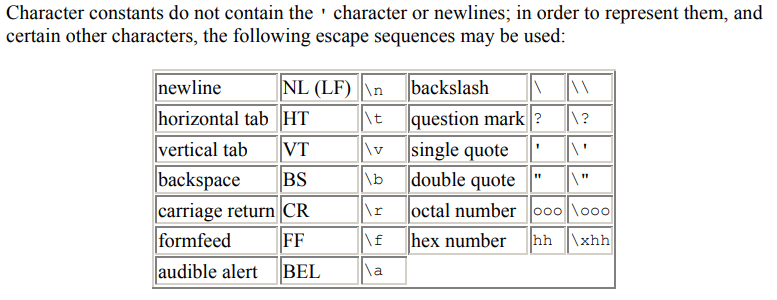
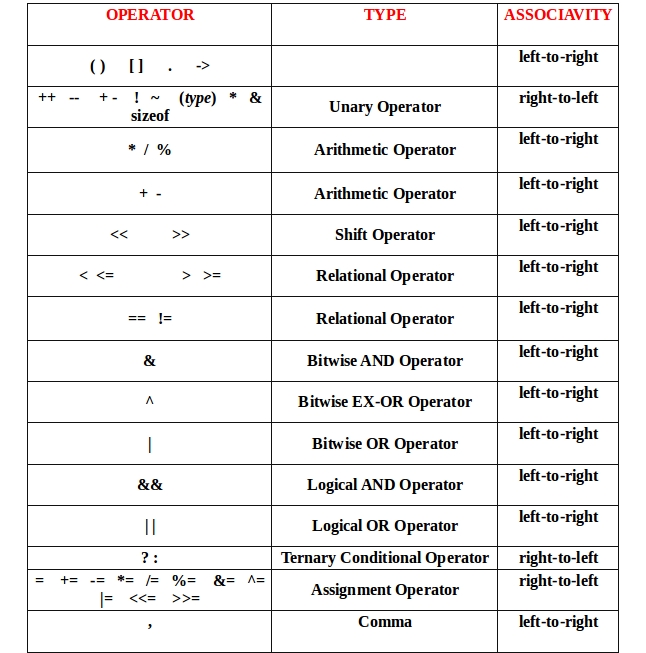
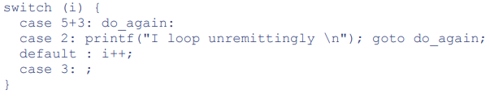
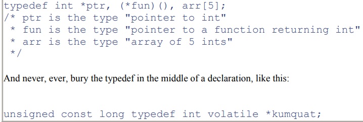

# C Defined Behavior

- Defined behavior in C notes

## Index

- [Index](#index)
- [`argc` and `argv`](#argc-and-argv)
- [Array Size Constant](#array-size-constant)
- [Array Size Declaration](#array-size-declaration)
- [Assignment Operator](#assignment-operator)
- [Breaking long lines](#breaking-long-lines)
- [C++ vs C Style Comments](#c-vs-c-style-comments)
- [Characters w/ Escape Sequences](#characters-w-escape-sequences)
- [Compiler Defined Constants](#compiler-defined-constants)
- [Const](#const)
- [Ellipsis](#ellipsis)
- [Enums](#enums)
- [Explicit Format Specifiers](#explicit-format-specifiers)
- [extern](#extern)
- [Floating Point Associativity](#floating-point-associativity)
- [Function Pointer](#function-pointer)
- [Function/Variable/Typedef Declarations](#functionvariabletypedef-declarations)
- [IEEE 754 FLoating-Point Format](#ieee-754-floating-point-format)
- [Macros & Directives](#macros--directives)
- [Maximal Munch Strategy](#maximal-munch-strategy)
- [Null Terminator](#null-terminator)
- [Number Prefix/Suffix](#number-prefixsuffix)
- [Omitting Parameter Names in Prototypes](#omitting-parameter-names-in-prototypes)
- [Operator Precedence](#operator-precedence)
- [Overloaded Symbols](#overloaded-symbols)
- [Pointer](#pointer)
- [Rounding](#rounding)
- [sizeof](#sizeof)
- [Strings](#strings)
- [Struct](#struct)
- [Switch Case Statements](#switch-case-statements)
- [Ternary Operator](#ternary-operator)
- [Trailing Commas](#trailing-commas)
- [Typedef](#typedef)
- [Ugly ANSI C Limits For Legacy Code](#ugly-ansi-c-limits-for-legacy-code)
- [Union](#union)
- [Variable Name Scopes](#variable-name-scopes)
- [Void Pointer](#void-pointer)
- [Volatile](#volatile)
- [Whitespaces](#whitespaces)

## `argc` and `argv`

- A C program can receive command-line arguments through the main function:
- `int main(int argc, char *argv[])` or `int main(int argc, char **argv)`
- `argc`
  - Total number of arguments passed to the program
  - No need for the user to explicitly pass a number over command line- this value is filled w/ the right value upon passing arguments
- `argv`
  - Array of pointers to C strings representing each argument
  - `argv[0]` is the program name
  - Each string is `/0` terminated
  - Modifying the command line arguments is legal, but behavior of modifying past `argc` is undefined
- Dashes
  - Unix-like OS's and ANSI C does horribly w/ filenames that start w/ a `-` bc they look like runtime option flags
  - Avoid them if possible
- Ex:

```
./myprog hello world

->

argc = 3
argv[0] = "./myprog"
argv[1] = "hello"
argv[2] = "world"
argv[3] = NULL   // argv[argc] is guaranteed to be NULL or 0

```

## Array Size Constant

- Array sizes have to be a constant expression at compile time
- What's allowed:
  - `enum` constant
    - Always allowed, good practice
  - Integer literal
    - Always allowed, but magic numbers are bad practice
  - `#define` macro
    - Always allowed, but also bad practice
  - `const int`
    - Only allowed in C99+
  - `static const int`
    - Only allowed in C11+
  - Function parameter
    - Only allowed in C99+ (after variable length arrays were introduced)
  - `sizeof(expression)`
    - Always allowed... use `sizeof()` w/ caution

## Array Size Declaration

- The confusion is when we need to declare array size and when we don’t
- Provided we’re working w/ ANSI C for good practice and compatibility:
  - Not needed
    - Declaration w/ a string literal or initializer list
      - If a size is provided but the initializer list is shorter, then the remaining elements are NULL for pointers, 0.0 for floating point, and 0 for everything else
    - First size of multidimensional array when initialized w/ an initializer list
      - You still need the size if there’s no init value for the compiler to use to infer size
  - Needed
    - Declaring arrays without init value
- Function arguments
  - Arrays passed to functions decay to pointers
  - An array size specified in a function signature doesn’t do anything… it’s just there for documentation purposes
  - A multidimensional array passed to a function requires the second dimension and on to be specified in the function signature
    - On the contrary, there’s also no way to force a user to pass a multidimensional array of a specific 1st dimension
  - A function that takes a pointer can take an array and vice versa
    - The only exception is multidimensional arrays- if a function’s signature demands a multidimensional array, then items passed to the function must have that demanded fixed second and on dimensions
- Pointer to a multidimensional array
  - This is the same as void function(int arr[][5])
  - You can keep stacking numbers in the signature in both the pointer and non-pointer versions
  - The pointer version is powerful since it can point to whatever it wants, and you can have each pointer point to arrays of varying sizes
- Negative indices
  - Mm no you can’t array index like Python
  - But the issue is that if the negative index (space in memory before the 0th element in an array) happens to be valid, you won’t see the issue

## Assignment Operator

- Assignment statement is an expression too- it evaluates to the value assigned
- That’s why this is legal: int x = y = z = 6; (but bad practice)## Compiler Defined Constants / Functions

## Breaking long lines

- Confusion lies when you do/don’t need the escape slash
  - Do need slash:
    - Multi-line macros
    - Breaking other preprocessor definitions and expressions
    - Statements that don’t end w/ an operator at the end
      - …if possible break down long statements, but otherwise use escape characters over putting operators at the end of lines
  - Don’t need slash:
    - Adjacent string
      - Again, compiler automatically concatenates strings
    - List of arguments in a function definition or call
      - Usually, things enclosed in parentheses and braces don’t need escapes
    - Statements when they end w/ an operator
      - This doesn’t work w/o the operator at the end of the line to signal to the compiler that there are more operands on the next line
      - This makes the next line difficult to read, so USE ESCAPE
    - Array, struct, union initializer list
    - Statements surrounded w/ parenthesis
      - Awkward to add extra parenthesis if they’re not needed other than to break down the long line, so either break down the statement or use escape character

## C++ vs C Style Comments

- Both are standard/safe/portable now, it's just that C++ introduced single-line comments to address how C style comments fail sometimes when nesting blocks of code that happen to have `*/` or `/*` in strings
- ...C++ style `//` isn't portable for old C89 compilers... ig for true compatibility C style comments is the way to go

## Characters w/ Escape Sequences

- 
  - As per ANSI C book
- These characters need escape backslash
- Note: `\0`isn't one of the items- that's because the null terminator `\0` is just 0

## Compiler Defined Constants

- Standardized by the language, so safe to use
- General macros
  - `__TIME__`
    - Time of compilation
  - `__DATE__`
    - Date of compilation
  - `__FILE__`
    - Name of current source file
  - `__LINE__`
    - Current line number in source file
  - `__STDC__`
    - 1 if the compiler conforms to ANSI C standard
- Preprocessor conditionals and versioning
  - `__cplusplus`
    - Defined if code is being compiled as C++ code
  - `__STDC_VERSION__`

## Const

- Prevents use of assignment operator when used as an lvalue
  - Doesn't prevent the value from being changed by other means
- Good for read-only parameters, avoiding `#define`s if a constant is only needed in a particular scope, etc
- Const w/ pointer
  - `const int* thing;`
    - Prevents you from changing the value stored in the memory address
    - Makes intuitive sense that `const` comes first- that's how you define regular `const` variables
    - It's a const pointer
  - `int* const thing;`
    - Prevents you from changing the address that the pointer points to
    - It's a pointer const
- Loophole is created if you copy a pointer of a const variable to a pointer without the qualifier via casting and then try to modify the const value- undefined behavior

## Ellipsis

- The "…" param allows print to take as many variables as needed to fill in the string
- Wrapping Printf requires a dependency to va_list class- don't wrap printf it's a standard library function

## Enums

- `enum`s are "compile-time integer constants"...
- `enum`s should replace your `#define`'s:
  - Scope awareness
    - `#define`s are resolved by preprocessors, which aren't standardized
    - `enum`s are defined by the C language, and have defined scoping rules
      - ...indeed enums will spread like a virus if you define constants in header files just like `#define`s
      - But if you define an `enum` in a `.c` file or a particular function, they'll stay within the file/function
  - Type safety
    - `#define`s are just text replacement, but `enum`s are defined as integers by the C language
  - Debugging & symbol visibility
    - A debugger lacks the association between macros and their values, since the preprocessor just runs global text replacement
    - `enum`s exist in symbol tables
- No you can't `extern` an `enum`
- Static on an `enum`
  - Indicates to the compiler that every translation unit should have a private copy of the enum type and constants
  - ...useless- you either have private or public constants
- Constants defined w/ `enum`s can't overlap names
- `const` values can't be used to define `enum`s
- `enum`s can be forward declared
- Format is:
  - `enum` keyword
  - Optional tag to name the enumeration type
  - Enumerator list- a list of named constants

```
enum tag {
    enumerator1,
    enumerator2 = value,
    ...
};
```

## Explicit Format Specifiers

- When printing explicit data type objects, explicit format specifiers should be paired w/ each object
- `printf("x = %" PRId32 "\n", x)`, etc
- ...An alternative seen is the `%jd` specifier + an `intmax_t` cast, but this isn't portable everywhere
- Best to use explicit format specifiers

## extern

- Don't use it
  - Helpful for debugging, but otherwise creates spaghetti code
- Tells the compiler the type/signature for a variable/function defined in a different translation unit (changes linkage to link outside of the file)
- There must be one and only one strong definition of the variable/function across all translation units
- Function prototypes
  - Functions are implicitly `extern`
  - You can inject a function prototype in any file to access a function defined elsewhere w/o using the `extern` keyword
- Arrays and pointers
  - If you declare a pointer var (`int *arr_ptr`) then it’s valid to extern it in another file IF AND ONLY IF the pointer is initialized in the same statement properly
  - If the pointer isn’t initialized, then the array that’s externed will have undefined behavior (like pointing to some random place in memory)
- Array size
  - Array size can be omitted when you `extern` an array, because the declaration doesn't need to reserve memory again
  - Just need to know the address where the array is stored

## Floating Point Associativity

- Because computers are limited when representing floating point numbers, floating point math isn't associative
- `(3.14+1e20)-1e20` = 0.0 on most computers, but `3.14+(1e20-1e20)` = 3.14

## Function Pointer

- A function pointer is a pointer to the address of a function in memory
- Used purely to abstract functions to then call them as needed
- It's just like a regular function, but w/ an asterisk and some parenthesis:
  - `ret (*ptrname)(argtypes);`
- A typedef for a function pointer could look like:
  - `typedef int (*callback_t)(void);`
  - It's confusing because we're not completely reading from left to right
  - The parameter list has to come after the alias for the "function pointer to a function that returns int and takes nothing" type
- Function names decay automatically- there's no need use address-of operator when making assignments
- There's no need to dereference function pointers when calling the function w/ a pointer either

```
int add(int a, int b) { return a + b; }

int (*fp)(int, int) = add;   // or = &add;
int result = fp(2, 3);       // call via pointer
```

```
/* array of function pointers */

int add(int a, int b) { return a + b; }
int sub(int a, int b) { return a - b; }

int (*ops[])(int, int) = { add, sub };

int result = ops[0](5, 3);  // calls add(5, 3)
```

```
/* function pointer parameter */

void apply(int (*f)(int), int x) {
    printf("%d\n", f(x));
}

int square(int n) { return n * n; }

apply(square, 4);  // prints 16
```

```
/* function pointer return type */

int add(int, int);
int (*get_operation(void))(int, int) {
    return add;
}
```

## Function/Variable/Typedef Declarations

- The order of components of a function/variable declaration doesn't matter
- What's important is staying consistent
- The list is:
  - Storage class specifiers
  - Type specifiers
  - Type qualifiers
  - Function specifiers (`inline`, `_Noreturn`, etc)
  - Alignment specifiers
- Variables ex:
  - `[storage] [qualifiers] [type] name`
- Functions ex:
  - `[storage] [inline/_Noreturn] [return type] name(...)`
- Typedefs ex:
  - `typedef [qualifiers] [type] name`
- Lord Linus Torvald has a section on function prototypes in his [Linux Kernel styling guide](https://www.kernel.org/doc/html/next/process/coding-style.html)

## IEEE 754 FLoating-Point Format

- "floating point" is a representation of numbers where the binary point (the dot, but in binary context) isn't fixed
- `(-1)^sign × (1.fraction or 0.fraction) × 2^(exponent - bias)`
  - Sign bit: 0 for positive, 1 for negative
  - Exponent field: encodes the scale w/ bias
  - Fraction/mantissa: encodes the precision bits
- Normal numbers
  - Exponent != all 0s or 1s
- Subnormal (denormalized) numbers
  - Exponent = 0, and fraction != 0
  - Allows for gradual underflow to prevent increments around 0 from being too small
- Zero
  - Exponent = 0, fraction = 0
  - Can be signed, causing behavior differences...
- Infinity
  - Exponent = all 1s, fraction = 0
  - Results from overflow, division by zero, etc
- NaN
  - Exponent = all 1s, fraction = 0
  - "quiet NaN": propagates across operations
  - "signaling NaN": raises an exception if used
  - Used for undefined results like 0/0, sqrt(-1)

## Macros & Directives

- Don’t use them
- Slowly builds to spaghetti code
- ... If a codebase already has macros:
  - Try to avoid defining new macros if there are macros that exist to do the same thing
  - No need to cast constants (macros) when using them if you’re careful w/ how you use them- but the issue is that there’s inherent room for misuse
  - If possible
    - Cast the constant in the macro definition directly if the constant’s use is constrained
      - `#define MAX_SQUARE_WIDTH_CM (uint32_t)(18u)`
    - Avoid parameterized macro functions
      - Funky w/ the way compilers deal w/ them
      - Use “inline” functions instead
        - Better yet just declare private static functions
  - `#` symbol in the definition of a macro swaps out the #xx w/ a quoted string “xx”
    - `#define print(thing) printf(#thing “ is a thing”)`
    - `print(hi);` -> `printf(“hi” “ is a thing”);`
  - `##` symbol in macro definition allows for argument concatenation
    - `#define combine(x, y) x ## y`
    - `combine(1, 23)` -> `123`
  - `#if defined()` vs `#ifdef`
    - `#if defined()` supports logical operators
    - `#ifdef` is for when you’re checking for a single macro presence
  - `#pragma`
    - Provides compiler specific instructions to modify compiler behavior when compiling source code
    - _#pragma GCC diagnostic ignored “-Wpacked”_
      - Suppresses packed related warnings (misaligned memory accesses, etc)
    - _#pragma GCC diagnostic ignored “-Wattributes”_
      - Suppresses attributes related warnings (unknown, ignored, misused attributes)

## Maximal Munch Strategy

- When the compiler's lexer is scanning through source code, it will always form the longest possible valid token from left to right
- Ex: `x+++++y` turns into `x++ ++ +y`

## Null Terminator

- `/0` is treated as the null terminator in C
- `/0` has ascii value 0, so integer 0 is equivalent to null terminator
- You can assign the null terminator to char variables and elements in char arrays
- You can use memset w/ null terminator, but when initializing a string you might as well initialize to `{ 0 }`
- Ex: `memset(myArray, '/0', myArraySizeBytes)`

## Number Prefix/Suffix

- Lowercase prefix/suffix are easier to read
- Integer suffixes:
  - `u`/`U` = unsigned int
  - `l`/`L` = long int
  - `ll`/`LL` = long long int
  - `ul`/`UL` = unsigned long int
  - `ull`/`ULL` = unsigned long long int
  - `unsigned int thing = 3u;`
- Floating point suffixes:
  - `f`/`F` = float
  - `l`/`L` = long double
  - Ex:
    - `float floatThing = 3.14f;`
    - `#define FLOAT_THING 3.14F`
- Hexadecimal and Octal prefixes:
  - `0x`/`0X` = hexadecimal literal
  - `0` = octal literal
  - `int octalThing = 035; //aka 29 in decimal`
- Complex suffixes (C99... usually not relevant):
  - I/I = imaginary part of complex number
  - `double complex thing = 1.0 + 2.0*I;`
- Doubles
  - Regular doubles are specified w/ no suffix- the `d` suffix doesn't exist in C
  - `d` suffix isn't a standard in C++ either- if a compiler build w/ `d` suffixes, that's unconventional behavior specific to the compiler
  - Extra note: floating point suffix `f` is invalid for regular integers- there will be a compiler error

## Omitting Parameter Names in Prototypes

- Parameter names can safely be omitted in function prototypes
- Parameter names can even conflict w/ the definitions without causing compiler warnings or errors
- ...But this is horrible- don't do it
- You're on your way to write illegible code

## Operator Precedence

- Don't memorize it and write tricky code
- ... If you're looking at code that's dependent on precedence:
  - Unary, ternary, and assignments are evaluated right to left, but everything else is left to right
  - Order in which arguments of a function are evaluated isn’t defined by C
  - Comma operator
    - Evaluates from left to right, where the final value is the value of the rightmost expression
    - Comma used to declare multiple variables in a single line is not a comma operator (order of evaluation isn’t defined)
- K & R admitted that some operator precedence is "wrong" and unintuitive:
  - `.` is higher than `*`
    - That's why the `->` operator was created
  - `[]` is higher than `*`
  - Function `()` is higher than the `*` to dereference a function pointer
  - `==` and `!=` higher precedence than assignment
  - Arithmetic higher precedence than shift
  - `,` has lowest precedence of all operators
    - ...comma operator isn't intuitive anyway, but if it's used it has lowest precedence
- 
  - ...Again, don't memorize it

## Overloaded Symbols

- Some keywords/tokens mean different things in different contexts... confusing
- The list of overloaded keywords/tokens:
  - `static`
    - File scope visibility for a function
    - Storage class for a variable to be stored on data/bss segment on RAM instead of stack
  - `extern`
    - Global scope for a function (redundant and unnecessary)
    - Indicates that a variable is defined elsewhere
  - `void`
    - Indicates that a function doesn't return anything
    - A generic pointer
    - A function that doesn't take any parameters
  - `*`
    - Multiplication operator
    - Indirection if applied to a pointer
    - Indicates that a variable is a pointer in a declaration
  - `&`
    - Bitwise AND operator
    - Address-of operator
  - `=`
    - Assignment operator
    - Comparison operator
  - `<=`
    - Less-than-or-equal-to operator
    - Compound shift-left assignment operator if used in `<<=`
  - `<`
    - Less-than operator
    - Left deliminator in `#include` directive
  - `()`
    - Enclose parameters in a function definition
    - Make a function call
    - Provide expression precedence
    - Cast a value to a different type
    - Define a macro w/ arguments
    - Make a macro call w/ arguments
    - Enclose operands of `sizeof` when it's a typename

## Pointer

- A variable that stores the memory address of another object
- As Chris L puts it: an abstraction of an address in memory
- `&` is used to get the address of data
- `*` is used to dereference data (to get the raw data from an address or pointer)
- Compiler
  - C compiler also associates type information w/ each pointer to generate machine-level code to access the value stored at the location designated by each pointer depending on the type of that value
  - The resulting machine-level code has no information about data types- each program object is treated as a sequence of bytes
- Size of a pointer
  - Doesn't depend on what it points to- just on the processor architecture
  - 32-bit processor means the pointer is 4 bytes
- Pointer arithmetic
  - When doing pointer arithmetic, the offset (increments/decrements) is dependent on the size of the data that the pointer points to
  - ...that's why you can increment a pointer to access each element on a byte array while on a 32-bit processor
  - Valid pointer arithmetic:
    - Addition/subtraction w/ integers, assignment to pointers of the same type, assigning comparing to zero (NULL)
  - Invalid:
    - Adding multiple pointers, multiplying/dividing/shifting/masking, adding double/float, assigning to pointers of a different type without a cast (void\* is exception)
  - Comparisons
    - To compare pointer addresses using <, >, ==, etc the data types for each pointer must match
      - There’ll be a warning otherwise
- Casting
  - You can cast between pointers of different types, but you shouldn't access a memory address such that memory alignment disagree
  - So a pointer for a 4-byte object shouldn't point to a random 3rd byte in memory- it should access addresses aligned on 4-byte boundaries
  - What's unfortunate is that:
    - The code might still work if the compiler translates your code to more instructions to translate the 4-byte access into a byte access
    - Or it might fail w/ a hard fault
- Arrays
  - &arrayName[0], arrayName, &arrayName are all the same- they’re both addresses to the first element in an array
- Pointer declaration asterisk `*`
  - Putting it on the datatype is nice to clarify that a variable is a pointer
  - Putting it on the variable name is nice when in need of multiple pointer declarations per line
  - `int *p, *thing, *otherThing;`
  - `int *p, thing;` // "thing" isn’t a pointer
- Dangling pointer
  - A pointer that doesn't point to a valid address in memory

## Rounding

- Rounding types
  - Round-to-even
  - Round-toward-zero
  - Round-down
  - Round-up
- Integers
  - Integer division in C truncates all remainders
  - This means negative numbers drop their fractional parts and round towards 0
  - When you perform integer division between a negative range and a positive range, you need to know that there's a wide range of values between -1 and 1 (both ends exclusive) that round to 0
  - If you need some sort of mathematical rounding instead of truncation, you need to use the standard library
- Floating point numbers
  - ULP
    - "units in the last place"
    - Number of bits in error in the least significant bits of the significand between the actual number and the number representable
  - Floating point numbers round due to lack of infinite fractional resolution in binary form
  - Each time a floating point number goes through an operation, the error is dilated
    - ...calculators avoid this issue by encoding everything in BCD
  - Avoid floating point arithmetic whenever possible, or do it last
  - When interpreting floating point numbers, a tolerance value epsilon is needed based on your particular application
  - Round-to-even is the default mode of rounding
    - This prevents statistical bias by rounding up and down about 50/50
  - Fixed point arithmetic
    - You can substitute floating point values for integers in scientific notation
    - Conditions include:
      - Values operate over a limited range
      - Values near 0 don't need to have higher resolution than high-magnitude values
      - Calculations are linear (multiplication/division/addition/subtraction)
      - There are tight speed/memory requirements
      - Platform provides no hardware support for floating point
  - Floating point approximations
    - Approximations for fractional values that are constantly computed may be justified to improve resolution, increase speed, minimize space utilized

## sizeof

- Using `sizeof` will tell you how many bytes is allocated to a particular piece of reference
- `size_t const TOTAL_ELEMENTS = (sizeof array) / (sizeof array[0])`
  - This is bad practice, since array elements don’t have to be constrained to indices (elements could be less than a byte to have all elements next to each other contiguously)
  - The size of a pointer isn’t the size of an entire array either- it’s just the memory allocated for the pointer to exist
  - Takeaway: `sizeof` provides the number of bytes allocated for a variable (whether it’s number of bytes allocated for a pointer, for a variable pointing to the first element in an array, or the entire array)
- Using macros
  - #define TOTAL_ELEMENTS(a) (sizeof (a) sizeof (a)[0])
  - Bad practice put into macro form
- Allocating memory
  - Struct someStruct *thing = malloc(sizeof *thing)
  - This is useful for struct malloc
  - Note: malloc returns void\* which safely and implicitly casts to pointer of any type, so no need to cast return value of malloc
  - Malloc in a function to initialize a struct can be avoided by demanding a pointer to the struct instead to make the caller responsible for memory allocation
- Replicating `sizeof` behavior
  - A decent copy is:
    - `#define MY_SIZEOF(type) ((size_t)(((char*)(&(type*)0[1])) – (char*)(&(type*)0[0])))`
    - But this still fails if the null pointer indexing and arithmetic results in an invalid memory access
    - Also fails when you pass it a variable instead of a type
  - It’s an irreplaceable compile time macro/operator- can’t implement it
- Struct
  - If you call `sizeof` on a struct (not a pointer to a struct) you get the total number of bytes of the elements in the struct, but the tricky caveat is that:
    - Padding is added after each element in the struct to let the next element be on the right boundary
    - Padding is added after the entire struct to adhere to the boundary required by the largest element in the struct
  - Ex:
    - `struct { uint8_t thing; uint8_t thing2; };`
      - Sizeof returns 2
  - `struct { uint8_t thing; uint32_t thing2; uint8_t thing3; };`
    - 1 byte for thing, + 3 bytes to let thing2 be on 32bit boundaries
    - 4 bytes for thing2
    - 1 byte for thing3, + 3 bytes to pad and adhere to the largest element’s boundaries (thing2’s 32bit boundaries)
    - = 12 bytes
  - To minimize all padding, declare attributes of a struct in descending order by data type width

## Strings

- Compiler concatenation
  - All adjacent strings are automatically concatenated
  - `printf("part of a sentence" "rest of the sentence");`
  - `char string[] = "part of a string" "rest of the string";`
- Another quirk is that string literals (naked strings) are stored in read-only memory, so they act as valid addresses
  - `char *var1 = “some string”` is valid, but only because the string literal is stored in read-only memory and it’s equivalent to an address for `var1` to point to
  - Modifying the string values cause undefined behavior
- Integer arrays, etc aren’t stored in read-only memory, so this is invalid: `int *var2 = { 1, 2, 3 };`

## Struct

- Data is stored into structs for easy manipulation
- Should not include pointers to buffers that are accessible outside of the struct
  - Should instead include copies and other independent data
    - You can initialize structs by using “thing = { 0 }”
    - You can declare structs without tags or typedefs too
- Could do: struct { ... } var1, var2; if a struct isn’t going to be reused
  - Can also initialize just a part of a struct w/ a curly brace enclosed list- the rest of the elements will be initialized to 0
  - Can’t add the struct itself as a member of a struct when defining a struct, but can add pointers to the struct
  - Array members in structs need to have their sizes declared
- Dynamic array members are C99+
- Bit fields
  - You can specify elements in a struct to be allocated a desired number of bits w/ a colon
  - Size of the struct is still determined by the boundary of the largest type in the struct, but the multiple of that largest type is determined by the total number of bits required by adding all elements of the struct
- Format is:
  - `struct` keyword
  - Optional tag to name the struct type
  - Member list- zero or more declarations
  - Declarators to declare variables or typedefs declared w/ the defined type

```
struct tag {
    member_declarations;
} declarators;
```

## Switch Case Statements

- Cases don't break automatically after the actions under each case label- don't forget `break`
- You can't use `const` variables in any case statements- they're not constant literals
- `break` statements get you out of the nearest enclosing iteration or switch statement- it's not meant for conditional statements
- Legal abomination:
  - 

## Ternary Operator

- Aka conditional operator
- The “?” thing we use when condensing down a variable assignment in an “if-else block”
- `some_var = (another_var < 8) ? 0 : 1;`
- Called a ternary operator for having 3 operands (the first expression acting as the condition, the second to serve as the first return option for when the condition is true, the last to serve as the second return option for when the condition is false)
- Type returned by the expression is always the type of the larger of the last two operands
- May sometimes be more optimal than a regular conditional statement
  - Ternary expressions are considered "functional" for describing a value as a result of an expression rather than a sequence of steps
  - Instead of using branch instructions, the compiler is incentivized to use conditional data transfer instructions (aka, "conditional move" instructions)
  - ...the tradeoff is that if the compiler decides to evaluate all operands of the ternary expression in all cases, then it could be inefficient overall
- As usual, prioritize readability- don't worry about whether one is better than the other at this level unless you must

## Trailing Commas

- Commas are used when you have lists of items in C, and trailing commas behavior varies...
  - ANSI C's justification was that it made automated generation of C easier
  - Hasn't been cleaned up since
- Allowed w/ no compiler warning or error:
  - Array initializer
  - Struct initializer
  - Union initializer
  - Enum list
  - Initializer lists in compound literals
  - Designated initializers
  - Struct/array literal w/ braces
- Causes compiler error:
  - Function argument/parameter list
- Depends:
  - Macro argument list- allowed unless you use weird `##__VA_ARGS__` tricks

## Typedef

- Defines a new name (an alias) for an existing type
- Format is:
  - Base type- an existing type to create an alias for
  - Declarator- the new alias for the type
- `typedef` is a "storage-class" specifier (just for the sake of syntax, not because it specifies any storage)
- `typedef existing_type new_type_name;`
- Horrible examples:
  - 

## Ugly ANSI C Limits For Legacy Code

- As per _Deep C Secrets_, ANSI C guarantees:
  - 31 parameters per function definition
  - 31 arguments in a function call
  - 509 characters in a source line
  - 32 levels of nested parenthesis in an expression
  - Max value of `long int` can't be less than 2,147,483,647
- ...You'd have to be down deep in the gutters to reach these limits, but here they are

## Union

- Was meant to have an object take different forms
- Allows declaration of multiple identifiers for the same object in a particular location in memory
- Can only be initialized to an object w/ the union’s first member’s type
- Size of the union is the size of the largest member
- Format is same as struct

## Variable Name Scopes

- Scope of a name starts at the point of declaration, and before the initializer
- Repeating names
  - Valid if you have a nested block (function, compound block, etc)
  - ...If you're in a nested block you can even refer to some global name, declare a new variable w/ an identical name, then start operating on the new variable- horrible convoluted code
- Function arguments
  - Function argument names count as a part of the function block- you can't repeat these names

## Void Pointer

- Very flexible- can be used to point to anything in memory regardless of what the type of the data in the memory is
- Caveat is that you can’t directly dereference a `void*`- you have to cast it first
- Extra note: you can’t dereference a NULL pointer
- So to make a C variable act like a Python variable, you need to cast and allocate the pointer memory
- Causes confusing code if abused

## Volatile

- Tells the compiler that a variable can change unexpectedly
- Prevents optimization (storing values in CPU registers) of variable access to ensure that all read/write is done by directly reading memory where the variable is stored
- Using `volatile` type qualifier on all variables leads to slow and inefficient code
- Used when handling
  - Memory mapped peripheral registers
    - Register values are dependent and change w/ hardware, so variables that reference them should be `volatile`
  - Global variables modified in ISRs
    - Should also be `volatile` for the code to know that variables should be accessed directly from memory in case they’re updated in ISRs
  - Global vars accessed by multiple threads
    - If an OS is used and multiple tasks access particular global vars, they should be declared “volatile” so variable changes are reflected on all threads
- Loophole is created if you copy a pointer to a volatile variable to a pointer without the qualifier via casting- this defeats the purpose of the volatile qualifier and lets the compiler cache the variable to CPU registers preventing up-to-date accesses of the variable in memory
- A user might cast to volatile if they’re dealing w/ pointers that are volatile- assignment to a volatile pointer requires the address being assigned to also be volatile
- A volatile struct variable ensures that all accesses to the struct members are done with individual accesses to memory instead of using CPU registers, but the elements themselves aren’t volatile unless declared so

## Whitespaces

- Whitespaces do matter in C
  - Used when tokens mean something different when compounded w/ other tokens (`+`, `=`, `/*` and `*/` etc)
  - Causes hard to find bugs when injected after a backslash character in an attempt to escape the newline character to create a multi-line macro
