# Fundamentals

- Fundamental C notes

## Index

- [Index](#index)
- [Overview](#overview)
- [`#define`s Make a Mess](#defines-make-a-mess)
- [Argument vs Parameter in C](#argument-vs-parameter-in-c)
- [Branch Table](#branch-table)
- [Comma Operator](#comma-operator)
- [Declaration vs Definition](#declaration-vs-definition)
- [Declarator / Declaration](#declarator--declaration)
- [Free Store](#free-store)
- [Function Call Stack vs Stack Frame](#function-call-stack-vs-stack-frame)
- [Function To-Do List](#function-to-do-list)
- [Header File Inclusion Order](#header-file-inclusion-order)
- [Jump Statements](#jump-statements)
- [K&R Function Prototypes](#kr-function-prototypes)
- [Keywords](#keywords)
- [l-value and r-value](#l-value-and-r-value)
- [Namespace](#namespace)
- [No Nested Function Definitions](#no-nested-function-definitions)
- [NULL vs NUL](#null-vs-nul)
- [Object](#object)
- [Pointers vs Arrays](#pointers-vs-arrays)
- [Preprocessor Macros, Predefined Macros, Directives](#preprocessor-macros-predefined-macros-directives)
- [Ragged Array](#ragged-array)
- [Relational vs Equality Operators](#relational-vs-equality-operators)
- [Reserved Identifiers](#reserved-identifiers)
- [Scope](#scope)
- [Storage Classes](#storage-classes)
- [Stream](#stream)
- [Token](#token)
- [Type Qualifier, Type Specifier](#type-qualifier-type-specifier)
- [Type Variants](#type-variants)

## Overview

- > C is quirky, flawed, and an enormous success.
  - Dennis Ritchie
- Foundational language introduced in 1970s by Dennis Ritchie in Bell Labs
- ANSI (American National Standards Institute) ratified the ANSI C standard in 1989, and became ISO's (International Standards Organization) responsibility
- Originally developed as the system programming language for Unix OS
- Major C-based languages include:
  - C++
    - Extension of C w/ OOP, also by Bell Labs
  - C#
    - OOP language by Microsoft, heavily influenced by C++ and Java
  - Objective-C
    - Extension to C w/ Smalltalk-like OOP features for macOS and iOS development
  - SystemC
    - C++ based hardware modeling language used for PL design
  - Go
    - Syntactically inspired by C
    - Introduces garbage collection and concurrency primitives

## `#define`s Make a Mess

- The text replacement capability is too powerful- it creates illegible spaghetti code sooner or later
- ...Once upon a time Steve Bourne wrote the Bourne shell (what led to `bash`, the "Bourne again shell") wrote the entire shell like this because he was used to Algol:
  - 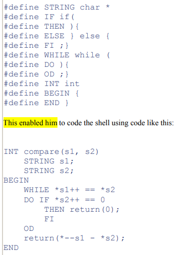
- Use the preprocessor `#define` just when the performance gained from a hardcoded constant is absolutely necessary, or if you're troubleshooting

## Argument vs Parameter in C

- Argument
  - Refers to the object / identifier passed when calling a function
- Parameter
  - Refers to the copy of the object / identifier passed to a function, visible by the function definition
  - All arguments are pass by value in C including pointers- it’s just that you happen to be able to dereference pointers to modify the value that pointers are pointing to

## Branch Table

- Aka, branch address table
- Table of addresses for alternative instruction sequences- generated for `switch` statements

## Comma Operator

- The primary use case for this is in a `for` loop where you want to initialize two variables
- And maybe in a ternary expression, but even that's on the line between acceptable and nasty code
- No legible use otherwise

## Declaration vs Definition

- In C:
- Declaration
  - Can occur multiple times
  - Describes the type of an object, and is used to refer to objects defined
- Definition
  - A special kind of declaration- occurs in only one place
  - Specifies the type of an object, and reserves storage for it
  - Used to create new objects

## Declarator / Declaration

- A declarator consists of:
  - Zero or more pointers
  - Exactly one "direct declarator"
  - Zero or one initializer
  - 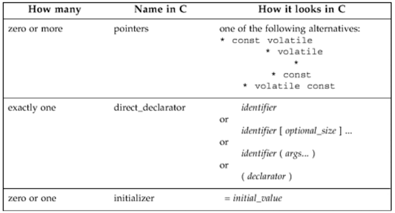
  - ...can get convoluted when you have a whole list of specifiers, so the algorithm is:
    - Start at the name, move right when possible, otherwise move left, and apply operators as you go
    - Need to move clockwise/spiral
- A declaration consists of:
  - A declarator
  - Zero or more additional declarators
  - One semi-colon
  - 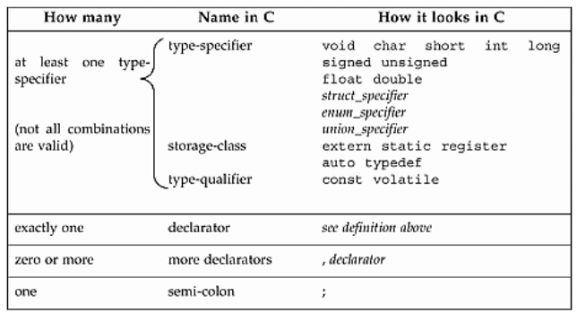
- > The precedence rule for understanding C declarations is the one that the language lawyers like best. It's high on brevity, but very low on intuition
  - _Deep C Secrets_
- 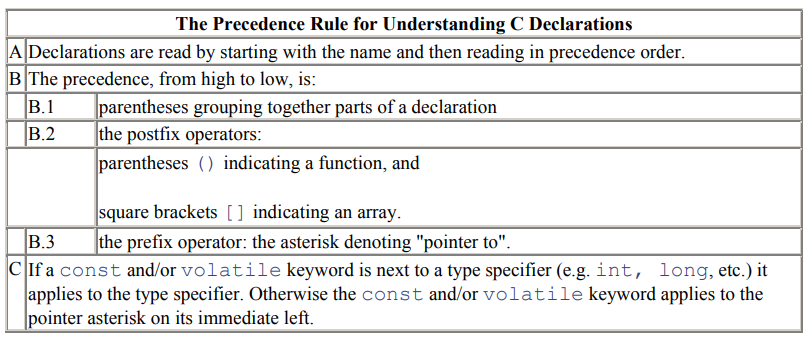
- 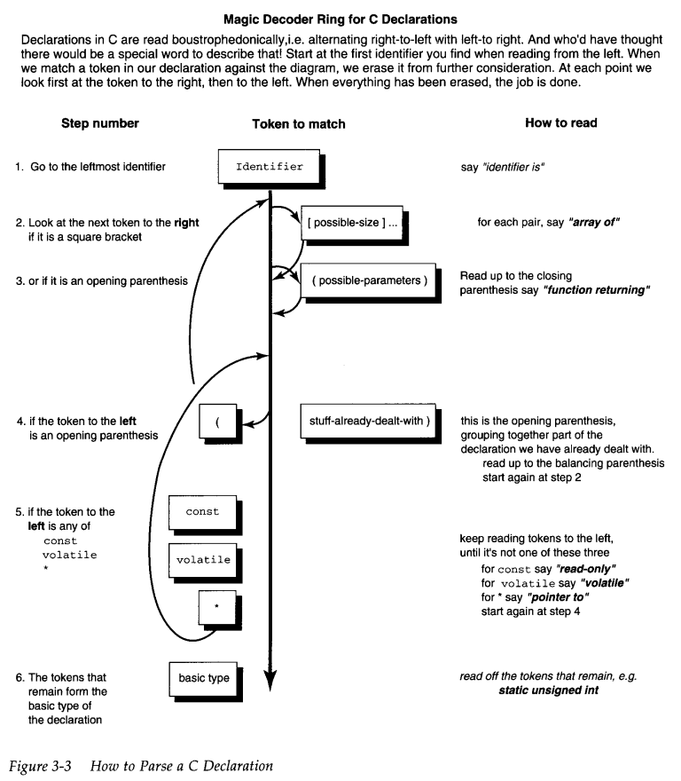

## Free Store

- Variables stored on heap are sometimes referred to be "on the free store"

## Function Call Stack vs Stack Frame

- Function call stack
  - Region in memory that grows/shrinks as functions are called and return
  - Stores stack frames in a stack format
  - There's a stack pointer that keeps track of the top of the stack
- Stack frame
  - Aka, "procedure activation record"
  - Block of memory reserved for a particular function invocation
  - Contains:
    - Return address
    - Saved registers
    - Local variables
    - Function arguments
  - 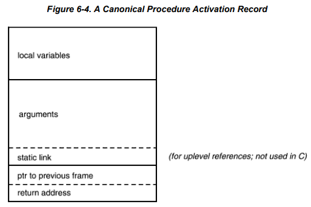

## Function To-Do List

- When a function is called, steps are:
  - Put parameters where procedure can access them
  - Transfer control to procedure
  - Acquire storage resources for procedure
  - Perform procedure operations
  - Put result value in place where the calling program can access it
  - Return control to the point of origin

## Header File Inclusion Order

- The order in which header files are included in C matters:
  - If a macro in a header file masks the name of a function name and there's a header file that defines that function, then the compiler produces and error if the macro comes first before the definition- the compiler can't properly define the function
    - Common issue when using macros to redefine functions defined in standard C libraries...
  - Inclusion guards
    - If source code is guarded by macros defined in header files, then those macro definitions need to come first
  - Composition
    - If structs are composed of user defined types in another header, then those inner types need to be defined
  - 3rd party libraries
    - When libraries are written poorly (macros, overlapping definitions, etc), then there could be a need to include things in a particular order

## Jump Statements

- `break`, `return`, `continue`, `goto`
- Use them sparingly (provided you're writing short functions)
  - `continue`
    - Exclusive to iterator tokens
    - Can’t be used for switch-case, etc
  - `goto`
    - Forbidden
    - Was intended to exit out of loops and return a value when there’s more than one layer of nesting- an alternative to using multiple break statements

## K&R Function Prototypes

- K&R C is legacy, but if a codebase does use K&R function prototypes, then:
- Mixing and matching K&R prototypes w/ ANSI C (modern) function definitions and the other way around causes things to break

```
/* K&R declarations don't need parameters made explicit */
int foo();

/* K&R definitions have a weird way of defining parameters */
int foo(a,b)
  int a;
  int b;
{
  ...
}
```

## Keywords

- 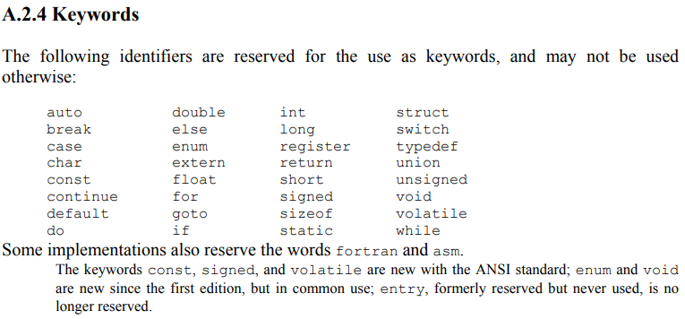
- Keywords in C as per ANSI C book

## l-value and r-value

- `x = y`
- L-value
  - `x` is an l-value- it's on the left side
  - L-values are known at compile-time
  - It's the symbol that provides the address to store the result
  - "modifiable l-values" are symbols that can appear on the left side of an assignment
    - Array names aren't modifiable l-values
- R-value
  - `y` is an r-value- it's on the right side
  - R-values aren't known until runtime
  - It's the symbol that provides the contents to be stored somewhere

## Namespace

- A namespace is a concept in C too
- In C, it's "a set of identifiers that don't conflict with identifiers in other sets"
- There are multiple disjoint identifier namespaces in C, though they're implicit instead of explicit as C++ does it
- 4 main namespaces:
  - Labels
    - ...labels used w/ `goto`
    - Forbidden
  - Tags
    - `struct`, `union`, `enum` tags
  - Members
    - Field names inside each `struct` or `union`
  - Ordinary identifiers
    - Everything else
    - Variables, functions, typedef names, enum constants

## No Nested Function Definitions

- By forbidding nested functions, "closures"/"static links" are avoided
- A simple scoping scheme is kept by avoiding things like:

```
void outer(int x) {
    void inner() { printf("%d\n", x); }
    inner();
}
```

- It also simplifies the layout of stack frames- no need for links to parent frames

## NULL vs NUL

- `NUL` with one L is just the way ASCII would refer to the null character- it's not a keyword in C

## Object

- K&R uses this phrase in ANSI C description to refer to data in memory, or “named regions of storage”
- `int *var = 3;` var points to the object 3, which can be accessed w/ the lvalue `*var`

## Pointers vs Arrays

- Confusing, because pointers can iterate through arrays, and arrays decay to pointers when passed as an argument to a function
- Array
  - Addresses of symbols are known at compiletime
  - No need to retrieve the address and then manipulate like add offsets- can simplify to one access
  - Array names decay to the address of the first element in expressions
    - Not the case for declarations, `sizeof`, or `&` operator (which creates a pointer to a pointer if used on an array name)
  - 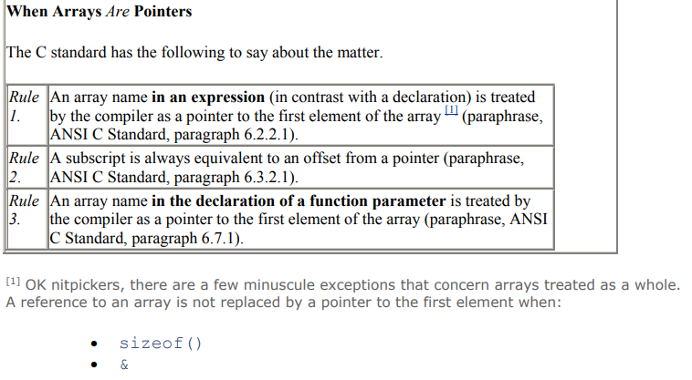
    - ...Also good to note that a pointer access isn't any more efficient than a subscript access w/ an index
    - Rule 3
      - This is why `int * thing`, `int thing[]` and `int thing[200]` as function parameter definitions are all the same
      - Helps w/ time/space efficiency, since passing by value like all other parameters are done would be time and space consuming
      - ...The lack of syntax ruling makes it impossible to distinguish a pointer, multidimentional array, and a regular array
      - Also introduces another level of confusion when the 2 are mixed:
        - 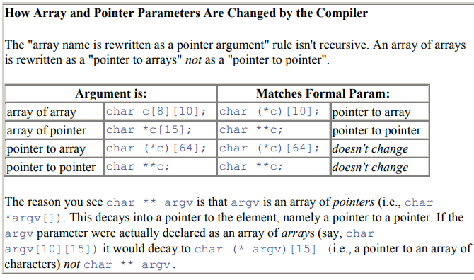
        - This decaying to pointer rule applies just one level deep
        - This is because without it the compiler can't calculate how far to jump from each element to the next at the highest level
- Pointer
  - Value of the pointer has to be retrieved at runtime before it can be dereferenced
- `extern`
  - Define array -> extern as pointer
    - If you dereference the pointer, you'd be treating array element values as addresses to then access some undefined data at those garbage addresses
  - Define pointer -> extern as array
    - Accessing elements in the pointer will get you the bytes of the address, and accessing past the size of the address will get you a fault
  - Errors
    - If you're lucky, you'll get linker errors/warnings due to type mismatch
    - For a simple compiler that resolves just symbol names, you might not get anything
- 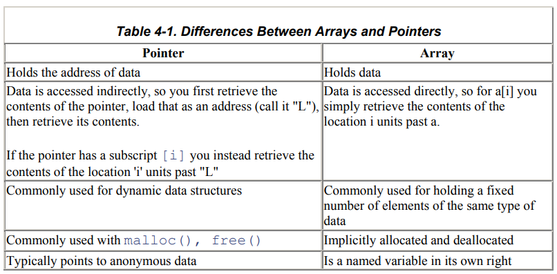
- 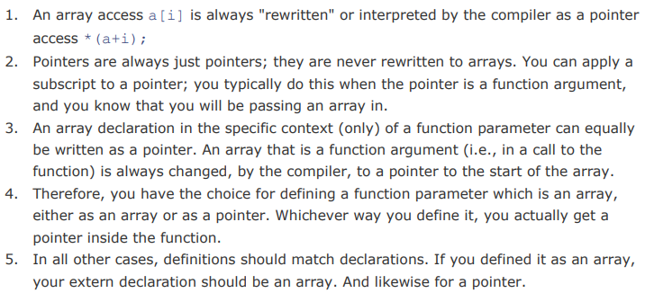

## Preprocessor Macros, Predefined Macros, Directives

- Directive
  - Indicators for the preprocessor to perform tasks before compilation
  - Includes anything that starts w/ “#”
    - #if, #include, #define
- Preprocessor macros
  - Macros are placeholders to be replaced by the preprocessor w/ its definition
  - Defined using preprocessor directives
- Predefined macros
  - These are special macros that are already defined by a compiler
  - 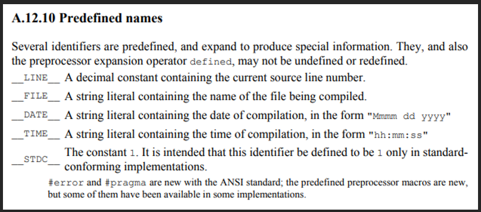
  - Allows injection of debug information into a project’s binary

## Ragged Array

- Aka, "Iliffe vector"
- An array of pointers is powerful
- The tradeoff is that you also need to pass the dimension of each array element to avoid buffer overflow

## Relational vs Equality Operators

- `>`, `<`, `>=`, `<=`, etc are relational operators
- `==`, `!=` are equality operators
  - ...Operators like `!=`, `+=`, `-=` have `=` as the second character to prevent whitespace dependent bugs

## Reserved Identifiers

- Users shouldn't redefine reserved identifiers- that means don't redefine `printf`, etc
- Creates code unportable code w/ undefined behavior when standard libraries that define the reserved identifiers are included
- Compilers aren't required to warn you about it either

## Scope

- Scopes in C include:
  - File scope
  - Block scope
  - Function scope
  - Function prototype scope
    - This is why you can omit/rename parameters in function prototypes
  - Enumeration constant scope
    - ...if working w/ C23

## Storage Classes

- What determines the scope, lifetime, and linkage (whether variable/function can be accessed across translation tables) of variables and functions
- Auto
  - Default for local variables
  - Limited to block it’s declared in, and lifetime ends after block exists
- Register
  - Suggests to compiler to store variable in CPU register for fast access
  - Not guaranteed for new compilers- we're not smarter than compilers
- Static
  - Local variables:
    - Lifetime does not end after exiting the block each time
    - Data stored on data/bss segment instead of stack
  - Global variables / functions
    - Scope is limited to the file
    - Prevents use of extern
    - Loophole is an accessor function that returns a pointer to the static variable casted to remove the static storage class- user can then modify the static variable in another source file via the pointer
    - Make sure to avoid returning pointers to static variables/buffers by returning a copy instead, return by value if possible, or return a const for read-only

## Stream

- An abstraction for IO to avoid directly working w/ hardware devices or low-level system calls
- As in, standard IO library
- A representation by Dennis Ritchie from early Unix/C

## Token

- Refers to the smallest unit of a program that a compiler can comprehend
- Includes:
  - Keywords
  - Identifiers
    - Variable names, function names, typedef names, etc
  - Constants
  - Operators
  - Special symbols
    - `{};,()[]`

## Type Qualifier, Type Specifier

- A type specifier is just your set of primitive and derived type names
- Type qualifier
  - Keyword that modifies the behavior of a variable, function, or type
  - Includes: `volatile`, `const`, `restrict` (C99), `_Atomic` (C11)
- Type qualifiers define the way objects can be accessed- doesn't indicate anything about their representations
  - `const`
    - Object can't be modified through this lvalue
  - `volatile`
    - Object may change unexpectedly
  - `restrict`
    - Pointer is the only means of accessing the object
  - `_Atomic`
    - Atomic access semantics

## Type Variants

- A type refers only to an interface (the set of requests to which an object responds to)
- All types in C are either composite or scalar
  - Composite
    - Arrays or structs composed of smaller elements
  - Scalar
    - Atomic by nature
    - Numerical types inherit all properties of scalar types, + additional quality of recording arithmetic quantities
    - Integer types inherit all properties of numeric types, + additional restriction of operating on just whole numbers
    - Pointers are scalar too
